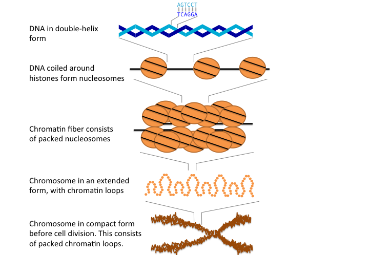
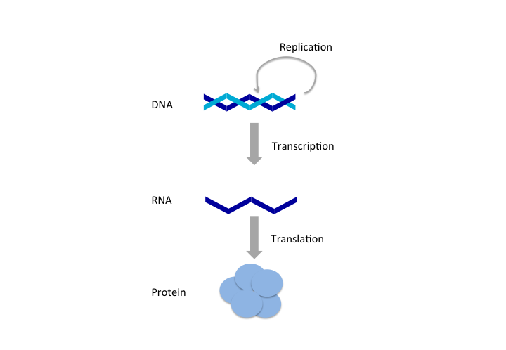
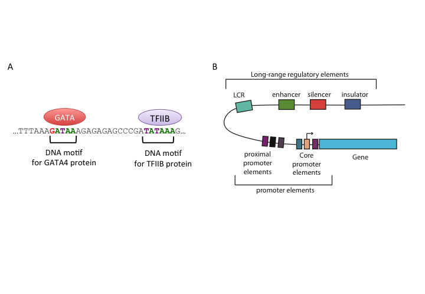
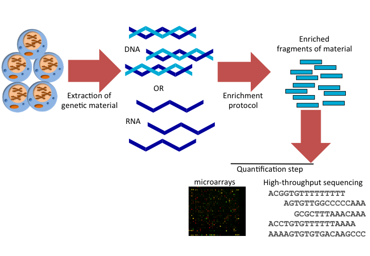
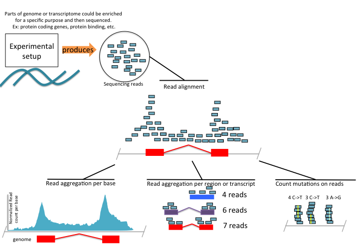

\mainmatter

```{r setupintroGenomics, include=FALSE}
knitr::opts_chunk$set(echo      = TRUE,
                      message   = FALSE, 
                      error     = FALSE,
                      cache     = TRUE,
                      out.width = "55%",
                      fig.width = 5,
                      fig.align = 'center')
```

# Introduction to Genomics {#intro}

The aim of this chapter is to provide the reader with some of the fundamentals
required for
understanding genome biology. By no means, this is a complete overview of the
subject but just a summary that will help the non-biologist reader understand
the recurring biological concepts in computational genomics. Readers that are
well-versed in genome biology and modern genome-wide quantitative assays should
feel
free to skip this chapter or skim it through.

##  	Genes, DNA and central dogma

A central concept that will come up again and again is "the gene".
Before we can explain that we need to
introduce a few other concepts that are important to understand the gene concept.
Human body is made up of billions of cells. These cells specialize in different
tasks. For example, in the liver there are cells that help produce enzymes
to break toxins. In the heart, there are specialized muscle cells that make
the heart beat. Yet, all these different kinds of cells come from a single celled
embryo. All the instructions to make different kinds of cells are contained
within that single cell and with every division of that cell,
those instructions
are transmitted to new cells. These instructions can be coded into a string - a
molecule of DNA, a polymer made of recurring units called nucleotides. The four
nucleotides in DNA molecules, Adenine, Guanine, Cytosine and Thymine (coded as
four letters: A, C, G, and T) in a specific sequence, store the information for
life. DNA is organized in a double-helix form where two complementary polymers
interlace with each other and twist into the familiar helical shape.

### What is a genome?
The full DNA sequence of an organism, which contains all the
hereditary information, is called a genome. The genome contains all the information
to build and maintain an organism. Genomes come in different sizes and structures.
Our genome is not only a naked stretch of DNA.
In eukaryotic cells, DNA is wrapped around proteins (histones) \index{histone} forming higher-order structures like
nucleosomes which make up chromatins \index{chromatin} and chromosomes (see Figure \@ref(fig:chromatinChr)).


```{r,chromatinChr,fig.cap="Chromosome structure in animals",fig.align = 'center',out.width='60%',echo=FALSE}

```


There might be several chromosomes \index{chromosome}
depending on the organism. However, in some species (such as most prokaryotes)
DNA is stored in a circular form. The size of genome between species differs too.
Human genome has 46 chromosomes and over 3 billion base-pairs, whereas wheat genome
has 42 chromosomes and 17 billion base-pairs, both genome size and chromosome numbers
are variable between different organisms. Genome sequences of organisms are
obtained using sequencing technology. With this technology, fragments of the
DNA sequence from the genome, called reads, are obtained.
Larger chunks of the genome sequence
is later obtained by stitching the
initial fragments to larger ones by using the overlapping reads. Latest,
sequencing technologies made genome sequencing cheaper and faster. These
technologies output more reads, longer reads and more accurate reads.

Estimated cost
of the first human genome is $300 million in 1999-2000, today a high-quality human genome
can be obtained for $1500. Since the costs are going down, researchers and clinicians
can generate more data. This drives up to costs for data storage and also drives
up the demand for qualified people to analyze genomic data. This was one of the
motivations behind writing this book.


### What is a gene?
In the genome, there are specific regions containing the precise information that \index{gene}
encodes for physical products of genetic information. A region in the genome
with this information is traditionally called a “gene”. However, the
precise definition of the gene is still developing. According to the classical
textbooks in molecular biology, a gene is a segment of a DNA sequence
corresponding to a single protein or to a single catalytic and structural RNA
molecule  [@Albe_2002_book].  A modern definition is: "A region (or regions) that includes all
of the sequence elements necessary to encode a functional transcript" [@eilbeck2005sequence]. No
matter how variable the definitions are, all agree on the fact that genes are
basic units of heredity in all living organisms.


All cells use their hereditary
information in the same way most of the time; the DNA is replicated to
transfer the information to new cells. If activated, the genes are transcribed into
messenger RNAs (mRNAs) \index{mRNA} in nucleus (in eukaryotes), followed by mRNAs (if the
gene is protein coding) getting translated into proteins in the cytoplasm. This is
essentially a process of information transfer between information carrying
polymers; DNA, RNA and proteins, known as the “central dogma” \index{central dogma} of molecular
biology (see Figure \@ref(fig:CentDog) for a summary).
Proteins are essential elements for life.
The growth and repair, functioning and structure of all living cells depends on them.
This is why the gene is a central
concept in genome biology, because a gene can encode information for proteins and other
functional molecules. How genes are controlled and activated dictates
everything about an organism. From the identity of a cell to response to
an infection, how cells develop and behave against certain stimuli is governed
by activity of the genes and functional molecules they encode. The liver cell becomes a liver cell because certain
genes are activated and their functional products are produced to help liver
cell achieve its tasks.

```{r,CentDog,fig.cap="Central Dogma: replication, transcription, translation",fig.align = 'center',out.width='100%',echo=FALSE}

```


### How genes are controlled? The transcriptional and the post-transcriptional regulation
In order to answer this question, we have to dig a little deeper on the
transcription concept we introduced via the central dogma.
The first step in a process of information transfer - a production of an RNA \index{gene regulation}
copy of a part of the DNA sequence - is called transcription.  This task is
carried out by the RNA polymerase enzyme. RNA polymerase-dependent initiation of
transcription is enabled by the existence of a specific region in the sequence
of DNA - a core promoter. Core promoters are regions of DNA that promote
transcription and are found upstream from the start site of transcription. In
eukaryotes, several proteins, called general transcription factors recognize and
bind to core promoters and form a pre-initiation complex. RNA polymerases
recognize these complexes and initiate synthesis of RNAs, the
polymerase travels along the template DNA and making an RNA
copy[@hager2009transcription]. After mRNA is
produced it is often spliced by spliceosome. The sections called 'introns' are removed and
sections called 'exons' left in. Then, the remaining mRNA translated into proteins. Which exons
will be part of the final mature transcript can also be regulated and creates
diversity in protein structure and function (See Figure \@ref(fig:TransSplice)).


```{r,TransSplice,fig.cap="Transcription could be followed by splicing, which creates different transcript isoforms. This will in return create different protein isoforms since the information required to produce the protein is encoded in the transcripts. Differences in transcript of the same gene can give rise to different protein isoforms",fig.align = 'center',out.width='70%',ref.label='TransSplice',echo=FALSE}
knitr::include_graphics("images/TransSplice.png" )
```

On the contrary to protein coding genes, non-coding RNA (ncRNAs)
genes are processed and assume their functional structures after transcription
and without going into translation, hence the name: non-coding RNAs. Certain
ncRNAs can also be spliced but still not translated. ncRNAs and
other RNAs in general can form complementary base-pairs within the RNA molecule
which gives them additional complexity. This self-complementarity based
structure, termed RNA secondary structure, is often necessary for functions of many
ncRNA species.

In summary, the set of processes, from transcription initiation to production
of the functional product, is referred to as gene expression.
Gene expression quantification and regulation is a fundamental topic in
genome biology.


### What does a gene look like?
Before we move forward, it will be good to discuss how we can visualize genes. \index{gene}
As someone interested in computational genomics, you will frequently encounter
a gene on a computer screen, and how it is represented on the computer will be
equivalent to what you imagine when you hear the word "gene".
In the online databases, the genes will appear as a sequence of letters
or as a series of connected boxes showing exon-intron structure which may
include the direction of transcription as well (see Figure \@ref(fig:RealGene)). You will encounter more with the latter so this is likely what will
pop into your mind when you think of genes.

As we have mentioned DNA has two strands, and a gene can be located
on either of them, and direction of transcription will depend on that. In the
Figure you can see arrows on introns (lines connecting boxes) indicating the
direction of the gene.

```{r,RealGene,fig.cap="A) Representation of a gene at UCSC browser. Boxes indicate exons, and lines indicate introns. B) Partial sequence of FATE1 gene as shown in NCBI GenBank database.",fig.align = 'center',out.width='80%',ref.label='RealGene',echo=FALSE}
 
knitr::include_graphics("images/RealGene.png" )
```


##  Elements of gene regulation
The mechanisms regulating gene expression \index{gene regulation} are essential for
all living organisms as they dictate where and how much of a gene product (may
it be protein or ncRNA) should be manufactured. This regulation could occur
at the pre- and co-transcriptional level by controlling how many transcripts should be produced and/or which version of the transcript should be produced by regulating
splicing. Different versions of the same gene could encode for proteins by
regulating splicing the process can decide which parts will go into the final
mRNA that will code for the protein.
In addition, gene products can be regulated post-transcriptionally where certain
molecules bind to RNA and mark them for degradation even before they can be used
in protein production.

Gene regulation drives cellular differentiation; a
process during which different tissues and cell types are produced. It also
helps cells maintain differentiated states of cells/tissues. As a product of
this process, at the final stage of differentiation, different kinds of cells
maintain different expression profiles although they contain the same genetic
material. As mentioned above there are two main types of regulation and next we
will provide information on those.

### Transcriptional regulation
The rate of transcription initiation is the primary regulatory element in gene
expression regulation. The rate is controlled by core promoter elements as well as
distant-acting regulatory elements such as enhancers. On top of that, processes
like histone modifications and/or DNA methylation have a crucial regulatory
impact on transcription. If a region is not accessible for the transcriptional
machinery, e.g. in the case when chromatin structure is compacted due to the
presence of specific histone modifications, or if the promoter DNA is
methylated, transcription may not start at all. Last but the not least, gene
activity is also controlled post-transcriptionally by ncRNAs such as microRNAs
(miRNAs), as well as by cell signaling resulting in protein modification or
altered protein-protein interactions.


####   Regulation by transcription factors through regulatory regions
 Transcription factors are proteins that \index{transcription factors (TFs)}
recognize a specific DNA motif to bind on a regulatory region and regulate the transcription rate of \index{DNA motif}
the gene associated with that regulatory region (See Figure \@ref(fig:regSummary))
for an illustration). These factors bind to a variety of regulatory regions summarized in
Figure \@ref(fig:regSummary), and their concerted action
controls the transcription rate. Apart from their binding preference, their
concentration, the availability of synergistic or competing transcription
factors will also affect the transcription rate.
 
```{r,regSummary,fig.cap="Representation of regulatory regions in animal genomes",fig.align = 'center',out.width='70%',ref.label='regSummary',echo=FALSE}
 

```


#####  Core and proximal promoters
Core promoters are the immediate neighboring regions around \index{promoter}
the transcription start site (TSS) \index{transcription start site (TSS)} that serves as a docking site for the
transcriptional machinery and pre-initiation complex (PIC) assembly. The
textbook model for transcription initiation is as follows: The core promoter has
a TATA motif (referred as TATA-box) 30 bp upstream of an initiator sequence
(Inr), which also contains TSS. Firstly, transcription factor TFIID binds to the
TATA-box. Next, general transcription factors are recruited and transcription is
initiated on the initiator sequence. Apart from the
TATA-box and Inr, there are a number of sequence elements on the animal core
promoters that are associated with transcription initiation and PIC assembly,
such as downstream promoter elements (DPEs), the BRE elements and CpG islands.
DPEs are found 28-32 bp downstream of the TSS in TATA-less promoters of
Drosophila melanogaster, it generally co-occurs with the Inr element, and is
thought to have a similar function to the TATA-box. The BRE element is
recognized by TFIIB protein and lies upstream of the TATA-box. CpG islands
are CG dinucleotide-enriched segments of vertebrate genomes, despite the general
depletion of CG dinucleotides in those genomes. 50-70% of promoters in
human genome are associated with CpG islands.

Proximal promoter elements are typically right upstream
of the core promoters and usually contain binding sites for activator
transcription factors and they
provide additional control over gene expression.

##### Enhancers:
Proximal regulation is not the only, \index{enhancer} nor the most important mode
of gene regulation. Most of the transcription factor binding sites in
the human genome are found in intergenic regions or in introns .
This indicates the widespread usage of distal regulatory elements in animal
genomes. On a molecular
function level, enhancers are similar to proximal promoters; they contain binding
sites for the same transcriptional activators and they basically enhance the
gene expression. However, they are often highly modular and several of them
can affect the same promoter at the same time or in different time-points or
tissues. In addition, their activity is independent of their
orientation and their distance to the promoter they interact with. A
number of studies showed that enhancers can act upon their target genes over
several kilobases away. According to a popular
model, enhancers achieve this by looping the DNA and coming to contact with
their target genes.


##### Silencers:
Silencers are similar to enhancers; however their effect is
opposite of enhancers on the transcription of the target gene, and results in
decreasing their level of transcription. They contain binding sites for
repressive transcription factors. Repressor transcription factors can either
block the binding of an activator , directly compete for the same binding site,
or induce a repressive chromatin state in which no activator binding is
possible. Silencer effects, similar to those of enhancers, are independent of
orientation and distance to target genes. In contradiction to this general view,
in Drosophila there are two types of silencers, long-range and short-range.
Short-range silencers are close to promoters and long-range silencers can
silence multiple promoters or enhancers over kilobases away. Like
enhancers, silencers bound by repressors may also induce changes in DNA
structure by looping and creating higher order structures. One class of
such repressor proteins, which is thought to initiate higher-order structures by
looping, is Polycomb group proteins (PcGs).

##### Insulators:
Insulator regions limit the effect of other regulatory elements
to certain chromosomal boundaries; in other words, they create regulatory
domains untainted by the regulatory elements in regions outside that domain.
Insulators can block enhancer-promoter communication and/or prevent spreading of
repressive chromatin domains. In vertebrates and insects, some of the
well-studied insulators are bound by CTCF (CCCTC-binding factor).
Genome-wide studies from different mammalian tissues confirm that CTCF binding
is largely invariant of cell type, and CTCF \index{CTCF protein} motif locations are conserved in
vertebrates. At present, there are two models of explaining the insulator
function; the most prevalent model claims insulators create physically separate
domains by modifying chromosome structure. This is thought to be achieved by
CTCF-driven chromatin looping and recent evidence shows that CTCF can induce a
higher-order chromosome structure through creating loops of chromatins.
According to the second model, an insulator-bound activator cannot bind an
enhancer; thus enhancer-blocking activity is achieved and insulators can also
recruit active histone domain, creating an active domain for enhancers to
function.

##### Locus control regions:
Locus control regions (LCRs) are clusters of
different regulatory elements that control entire set of genes on a locus. LCRs
help genes achieve their temporal and/or tissue-specific expression programs.
LCRs may be composed of multiple cis-regulatory elements, such as insulators,
enhancers and they act upon their targets even from long distances. However
LCRs function with an orientation dependent manner, for example the activity of
beta-globin LCR is lost if inverted. The mechanism of LCR function otherwise
seems similar to other long-range regulators described above. The evidence is
mounting in the direction of a model where DNA-looping creates a chromosomal
structure in which target genes are clustered together, which seems to be
essential for maintaining open chromatin domain.


####   Epigenetic regulation
Epigenetics in biology usually refers to \index{gene regulation}
constructions (chromatin structure, DNA methylation etc.) other than DNA \index{epigenetics}
sequence that influence gene regulation. In essence, epigenetic regulation is
the regulation of DNA packing and structure, the consequence of which is gene
expression regulation. A typical example is that DNA packing inside the nucleus can
directly influence gene expression by creating accessible regions for transcription
factors to bind.
  There are two main mechanisms in
epigenetic regulation: i) DNA modifications ii) histone modifications. Below,
we will introduce these two mechanisms.

##### DNA modifications such as methylation:
DNA methylation is usually associated with gene silencing. \index{DNA methylation}
DNA methyltransferase enzyme catalyzes the addition of a methyl group to cytosine of
CpG dinucleotides (while in mammals the addition of methyl group is largely
restricted to CpG dinucleotides, methylation can occur in other bases as well)
. This covalent modification either interferes with transcription factor
binding on the region, or methyl-CpG binding proteins induce the spread of
repressive chromatin domains, thus the gene is silenced if its promoter has
methylated CG dinucleotides.  DNA methylation usually occurs in repeat
sequences to repress transposable elements, these elements when active can
jump around and insert them to random parts of the genome, potentially disrupting
the genomic functions.\index{CpG island}

DNA methylation is also related to a
key core and proximal promoter element: CpG islands. CpG islands are usually
unmethylated, however for some genes CpG island methylation accompanies their
silenced expression. For example, during X-chromosome inactivation many CpG
islands are heavily methylated and the associated genes are silenced. In
addition, in embryonic stem cell differentiation pluripotency-associated genes
are silenced due to DNA methylation. Apart from methylation, there are other 
kinds of DNA modifications present in mamalian genomes, such as hydroxy-methylation and
formylcytosine. These are other modifications under current research that are either 
intermediate or stable modifications with distinct functional associations. There
are at least a dozen distinct DNA modifications observed when we look across 
all studied species [@sood2019dnamod].


##### Histone modifications:
Histones are proteins that constitute \index{histone} nucleosome. In
eukaryotes, eight histones nucleosomes are wrapped around by DNA and build
nucleosome. They help super-coiling of DNA and inducing high-order structure
called chromatin. In chromatin, DNA is either densely packed (called
heterochromatin or closed chromatin), or it is loosely packed (called
euchromatin or open chromatin). Heterochromatin is thought to harbor
inactive genes since DNA is densely packed and transcriptional machinery cannot
access it. On the other hand, euchromatin is more accessible for transcriptional
machinery and might therefore harbor active genes.  Histones have long and
unstructured N-terminal tails which can be covalently modified. The most studied
modifications include acetylation, methylation and phosphorylation [@strahl2000language]. Using
their tails, histones interact with neighboring nucleosomes and the
modifications on the tail affect the nucleosomes affinity to bind DNA and
therefore influence DNA packaging around nucleosomes. Different modifications on
histones are used in different combinations to program the activity of the genes
during differentiation. Histone modifications have a distinct nomenclature, for \index{histone modification}
example: H3K4me3 means the lysine (K) on the 4th position of histone H3 is
tri-methylated.

Modifications                 Effect   
------------                  ------  
    H3K9ac                    Active promoters and enhancers        
    H3K14ac                   Active transcription       
    H3K4me3/me2/me1           Active promoters and enhancers, H3K4me1 and H3K27ac is enhancer-specific
    H3K27ac                   H3K27ac is enhancer-specific          
    H3K36me3                  Active transcribed regions
    H3K27me3/me2/me1          Silent promoters
    H3K9me3/me2/me1           Silent promoters

Table:  Table 1 Histone modifications and their effects. If more than one histone modification has the same effect, they are separated by commas.

Histone modifications are associated with a number of different
transcription-related conditions; some of them are summarized in Table 1.
Histone modifications can indicate where the regulatory regions are and they can
also indicate activity of the genes. From a gene regulatory perspective, maybe
the most important modifications are the ones associated with enhancers and
promoters. 

Furthermore, certain proteins can influence chromatin structure by interacting
with histones. Some of these proteins, like those of the Polycomb Group (PcG)
and CTCF, are discussed above in the insulators and silencer sections. In
vertebrates and insects, PcGs are responsible for maintaining the silent state
of developmental genes, and trithorax group proteins (trxG) for maintaining
their active state [@henikoff2008nucleosome ; @schwartz2007polycomb]. PcGs and trxGs induce repressed or active states by
catalyzing histone modifications or DNA methylation. Both the proteins bind PREs
that can be on promoters or several kilobases away. Another protein
that induces histone modifications is CTCF. CTCF is associated with boundaries between active and repressive histone marks \index{CTCF protein} [@phillips2009ctcf]. This is due to the role of CTCF in regulating the 3D genome structure. Two CTCF binding sites that are far away from each other in linear distance can bound together in 3D space thus forming chromatin loops.

```{block2, transReg, type='rmdtip'}

__Want to know more?__

- Transcriptional regulatory elements in the human genome: http://www.ncbi.nlm.nih.gov/pubmed/16719718

- On metazoan promoters: types and transcriptional properties:
http://www.ncbi.nlm.nih.gov/pubmed/22392219

- General principles of regulatory sequence function
http://www.nature.com/nrg/journal/v15/n7/abs/nrg3684.html

- DNA methylation: roles in mammalian development
http://www.nature.com/doifinder/10.1038/nrg3354


- Histone modifications and organization of the genome
http://www.nature.com/nrg/journal/v12/n1/full/nrg2905.html

- DNA methylation and histone modifications are linked
http://www.nature.com/nrg/journal/v10/n5/abs/nrg2540.html

```

### Post-transcriptional regulation

####   Regulation by non-coding RNAs
Recent years have witnessed an explosion in non-coding \index{gene regulation}
RNA (ncRNA)-related research \index{non-coding RNA (ncRNA)}. Many publications implicated ncRNAs as important
regulatory elements. Plants and animals produce many
different types of ncRNAs such as long non-coding RNAs (lncRNAs),
small-interferring RNAs (siRNAs), microRNAs (miRNAs), promoter-associated RNAs
(PARs) and small nucleolar RNAs (snoRNAs) [@morris2014rise]. lncRNAs are typically >200 bp long,
they are involved in epigenetic regulation by interacting with chromatin
remodeling factors and they function in gene regulation. siRNAs are short
double-stranded RNAs which are involved in gene-regulation and transposon
control, they silence their target genes by cooperating with Argonaute proteins. miRNAs are short single-stranded RNA molecules that interact with their
target genes by using their complementary sequence and mark them for quicker
degradation. PARs may regulate gene expression as well: they are ~18-200bp
long ncRNAs originating from promoters of coding genes [@morris2014rise]. snoRNAs are also shown
to play roles in gene regulation, although they are mostly believed to guide
ribosomal RNA modifications [@morris2014rise].


#### Splicing regulation
Splicing is regulated by regulatory elements on the pre-mRNA and proteins \index{gene splicing}
binding to those elements. Regulatory elements are categorized
as splicing
enhancers and repressors. They can be located either in exons
or introns. Depending of their activity and their locations there are four types of regulatory elements:
 -  exonic splicing enhancers (ESEs)
 -  exonic splicing silencers (ESSs)
 -  intronic splicing enhancers (ISEs)
 -  intronic splicing silencers (ISSs).

The majority of splicing repressors are heterogeneous nuclear ribonucleoproteins (hnRNPs). If splicing repressor protein bind
silencer elements they reduce the chance of nearby site to be
used as splice junction. On the contrary, splicing enhancers are sites to which splicing activator proteins bind and binding
on that region increases the probability that a nearby site will be used as a splice junction [@wang2008splicing]. Most of the activator proteins that bind to splicing enhancers are members of the SR protein family. Such proteins can recognize specific RNA recognition motifs. By regulating splicing exons can be skipped or included
which creates protein diversity [@wang2008splicing].


```{block2, postTranscriptreg, type='rmdtip'}

__Want to know more?__

- On miRNAs, Their genesis and modes of regulation [@bartel2004micrornas]:
http://www.sciencedirect.com/science/article/pii/S0092867404000455

- Functions of non coding RNAs [@morris2014rise] :
http://www.nature.com/nrg/journal/v15/n6/abs/nrg3722.html

- On splicing and its regulation [@wang2008splicing]:  https://www.ncbi.nlm.nih.gov/pmc/articles/pmid/18369186/

```

## Shaping the genome: DNA mutation

Human and chimpanzee genomes are 98.8% similar. The 1.2% difference is what separates \index{mutation}
us from chimpanzees. The further you move away from human in terms of evolutionary
distance the higher the difference gets. However, even between the members of
the same species differences in genome sequences exist. These differences are
due to a process called mutation which drives differences between individuals
but also provides the fuel for evolution as the source of the genetic
variation. Individuals with beneficial mutations can adapt to their surroundings
better than others and in time these mutations which are beneficial for survival
spread in the population due to a process called "natural selection". Selection
acts upon individuals with beneficial features which gives them an edge for
survival in a given environment. Genetic variation created by the mutations
in individuals provide the material on which selection can act upon. If the
selection process goes for a long time in a relatively isolated environment
that requires adaptation, this population can evolve into a different species
given enough time. This is the basic idea behind evolution in a nutshell,
and without mutations providing the genetic variation there will be no evolution.

Mutations in the genome occur due to multiple reasons. First, DNA replication
is not an error-free process. Before a cell division, the DNA is replicated with
1 mistake per 10^8 to 10^10 base-pairs. Second, mutagens such as UV light
can induce mutations on the genome. Third factor that contributes to mutation
is imperfect DNA repair. Every day any human cell suffers multiple instances of DNA damage.
DNA repair enzymes are there to cope with this damage but they are also not
error-free, depending on which DNA repair mechanism is used (there are multiple)
mistakes will be made at varying rates.


Mutations are classified by how many bases they effect, their effect on
DNA structure and gene function. By their effect on DNA structure
the mutations \index{mutation} are classified as follows:

- __Base substitution__: A base is changed with another.
- __Deletion__: One or more bases is deleted.
- __Insertion__: New base or bases inserted into the genome.
- __Microsatellite mutation__: Small insertions or deletions of small tandemly
  repeating DNA segments.
- __Inversion__: A DNA fragment changes its orientation 180 degrees.
- __Translocation__: A DNA fragment moves to another location in the genome.


Mutations can also be classified by their size as follows:

- __Point mutations__: mutations that involve one base. Substitutions, deletions and
  insertions are point mutations. They are also termed as single nucleotide
  polymorphisms (__SNPs__).\index{SNP}
- __Small-scale mutations__: mutations that involve several bases.
- __Large-scale mutations__: mutations which involve larger chromosomal regions.
  Transposable element insertions (where a segment of the genome
  jumps to another region in the genome) and segmental duplications ( a large
  region is copied multiple times in tandem) are typical large scale mutations.
- __Aneuploidies__: Insertions or deletions of whole chromosomes.
- __Whole-genome polyploidies__: duplications involving whole genome.

Mutations by their effect on gene function can be classified as follows:

- __Gain-of-function mutations__: A type of mutation in which the altered gene
  product possesses a new molecular function or a new pattern of gene
  expression.
- __Loss-of-function mutations__:  A mutation that results in reduced or abolished
  protein function. This is the more common type of mutation.


```{block2, mutations, type='rmdtip'}

__Want to know more?__

- Interactive tutorial on mutations: http://www.dnaftb.org/27/

- Tutorial on mutation and health maintained by NIH: https://ghr.nlm.nih.gov/primer#mutationsanddisorders
    
- Visualizations for different types of mutations: https://www.yourgenome.org/facts/what-types-of-mutation-are-there

- Review article on mutations regarding human disease: https://www.nature.com/articles/nrg3241


```


##   High-throughput experimental methods in genomics
Most of the biological phenomena described above relating to transcription
, gene regulation or DNA mutation can be measured over the entire genome using
high-throughput experimental techniques, which are quickly becoming
the standard for studying genome biology. In addition, their
applications in the clinic are also gaining momemntum: there are already diagnostic
tests that are based on these techniques.

Some of the things that can be measured by high-throughput assays are as follows:

- _Which genes are expressed and how much?_
- _Where does a transcription factor bind?_
- _Which bases are methylated in the genome?_
- _Which transcripts are translated?_
- _Where does RNA-binding proteins bind?_
- _Which microRNAs are expressed?_
- _Which parts of the genome are in contact with each other?_
- _Where are the mutations in the genome  located?_
- _Which parts of the genome are nucleosome-free?_

There are many more questions one can answer using modern genome-wide techniques
and every other day a new variant of the existing techniques comes along
to answer a new question.
However, one has to keep in mind that these methods are at varying degrees
of maturity and they all come with technical limitations
and are not noise-free. Despite this, they are extremely useful for research and clinical
purposes. And, thanks to these methods we are able to sequence and annotate
genomes at a massive scale.

### The general idea behind high-throughput techniques
High-throughput methods aim to quantify or locate all or most of the genome that harbors
the biological feature (expressed genes, binding sites, etc.) of interest. 
Most of the methods rely on some sort of enrichment of the targeted
biological feature. For example, if you want to measure expression of protein coding
genes you need to be able to extract mRNA molecules with special post-transcriptional
alterations that protein-coding genes acquire, as done in many RNA sequencing (RNA-seq) experiments\index{RNA-seq}. If you are looking for transcription factor 
binding, you need to enrich
for the DNA fragments that are bound by the protein of interest, as it is done in ChIP-seq experiments.\index{ChIP-seq}This part depends on available molecular biology and chemistry techniques, and the final 
product of this part is RNA or DNA fragments. 

Next, you need to be able to 
tell where these fragments are coming from in the genome and how many of them
are there. Microarrays \index{microarray} were the standard tool for the quantification step 
until spread of sequencing techniques. In microarrays, one had to design complementary bases, called "oligos" or "probes", to the genetic material enriched via the experimental protocol.
If the enriched material is complementary to the oligos,
a light signal will
be produced and the intensity of the signal will be proportional to the amount of the
genetic material pairing with that oligo. There will be more probes available for
hybridization (process of complementary bases forming bonds ), so the more fragments
available stronger the signal. For this to be able to work, you need to know
at least part of your genome sequence, and design probes. If you want to measure
gene expression, your probes should overlap with genes and should be unique 
enough to not to bind sequences from other genes. This technology is now being
replaced with sequencing technology, where you directly sequence your genetic \index{high-throughput sequencing}
material. If you have the sequence of your fragments, you can align them back
to genome, see where they are coming from and count them. This is a better 
technology where the quantification is based on the real identity of fragments 
rather than based on hybridization to designed probes.

In summary HT techniques have the following steps, and this also summarized in
Figure \@ref(fig:HTassays):

- Extraction: This is the step where you extract the genetic
  material of interest, RNA or DNA.
- Enrichment: In this step, you enrich for the event you are interested
  in. For example, protein binding sites. In some cases such as whole-genome DNA
  sequencing there is no need for enrichment step. You just get fragments of
  genomic DNA and sequence them.
- Quantification: This is where you quantify your enriched material. Depending
  on the protocol you may need to quantify a control set as well, where you
  should see no enrichment or only background enrichment.

```{r,HTassays,fig.cap="Common steps of High-throughput assays in genome biology",fig.align = 'center',out.width='70%',ref.label='HTassays',echo=FALSE}

```


### High-throughput sequencing
High-throughput sequencing, or massively parallel sequencing,  is a 
collection of methods and technologies that can sequence DNA thousands/millions \index{high-throughput sequencing}
of fragments at a time. This is in contrast to older technologies that can 
produce a limited
number of fragments at a time. Here, throughput refers to number
of sequenced bases per hour. The older low-throughput sequencing methods have
~100 times less throughput compared to modern high-throughput methods. The 
increased throughput gives the ability to measure biological features on a 
genome-wide scale in a shorter time frame.

Similar to other high-throughput methods, sequencing-based methods also require
an enrichment step. This step enriches for the features we are interested in.
The main difference of the sequencing based methods is the quantification step. 
In high-throughput sequencing,
enriched fragments are put through the sequencer which outputs the sequences
for the fragments. Due to limitations in current leading technologies, only 
limited number of bases can be sequenced from the input fragments. However,
the length is usually enough to uniquely map the reads to the genome and quantify
the input fragments. 

#### High-throughput sequencing data
If there is a genome available, the reads are aligned to the genome and based
on the library preparation protocol different strategies are applied for analysis. A sequencing library is composed of fragments of RNA or DNA ready to be sequenced. The library preparation primarily depends on the experiment of interest. There are a number of library preparation protocols aimed at quantifying different signals from the genome. Some of the potential analysis strategies for different library-prep protocols and processed output of read alignments
are depicted in Figure \@ref(fig:HTseq).\index{high-throughput sequencing}
For example, we maybe interested to quantify the gene expression.
The experimental protocol, called RNA sequencing-
RNA-seq, enriches for fragments of RNA that are coming from protein coding genes.\index{RNA-seq}
Upon alignment, we can calculate the coverage profile which gives us a read count
per base along the genome. This information can be stored in a text file or 
specialized file formats to be used in subsequent analysis or visualization.
We can also just count how many reads overlap with exons of each gene and record
read counts per gene for further analysis. This essentially produces a table 
with gene names and read counts for different samples. As we will see in later
chapters, this is an essential information for statistical models that model
RNA-seq data. Furthermore, we can stack up the reads and count how many times a base position in a read mismatches the base in the genome. Read aligners 
allow for mismatches, and for this reason we can see reads with mismatches. 
This information can be used to identify SNPs, and can be stored again in 
a tabular format with the information of position and mismatch type and 
number of reads supporting the mismatch. The original algorithms are a bit 
more complicated than just counting mismatches but the general idea is the 
same, what they are doing differently is trying to minimize false positive
rates by using filters, so that not every mismatch is recorded as SNP.\index{SNP}


```{r,HTseq,fig.cap="High-throughput sequencing summary",fig.align = 'center',out.width='80%',ref.label='HTseq',echo=FALSE}

```


#### Future of high-throughput sequencing
The sequencing technology is still evolving. Obtaining
longer single-molecule reads, and preferably, being able to call base modifications \index{high-throughput sequencing}
on the fly is the next frontier.
With longer reads, the genome asssembly will be easier for the regions
that have high repeat content. With single-molecule sequencing, we will be able to
tell how many transcripts are present in a given cell population without
relying on fragment amplification methods which can introduce biases. 

Another recent development is single-cell sequencing. Current technologies usually
work on genetic material from thousands to millions of cells. This means that the
results you receive represents the population of cells that were used in the 
experiment. However, there is a lot of variation between the same type of cells, but 
this variation is not observed at all. Newer sequencing techniques can work 
on single cells and give quantitative information on each cell. 

```{block2, htseqtip, type='rmdtip'}

__Want to know more?__

- Current and the future high-throughput sequencing technologies http://www.sciencedirect.com/science/article/pii/S1097276515003408

- Illumina repository for different library preparation protocols for sequencing http://www.illumina.com/techniques/sequencing/ngs-library-prep/library-prep-methods.html


```


## Visualization and data repositories for genomics
There are ~100 animal genomes sequenced as of 2016. On top these, there are many
research projects from either individual labs or consortia that 
produce petabytes of auxiliary genomics data, such as ChIP-seq, RNA-seq, etc. \index{ChIP-seq}  \index{RNA-seq}

There are two requirements to be able to visualize genomes and its associated
data,  1) you need to be able to work with a species
that has a sequenced genome and 2) you want to have annotation on that genome, 
meaning, at the very least, you want to know where the genes are. Most
genomes after sequencing are quickly annotated with gene-predictions or
known gene sequences are mapped on to them, you can also
have conservation to other species to filter functional elements. If you
are working with a model organism or human you will also have a lot of
auxiliary information to help demarcate the functional regions such
as regulatory regions, ncRNAs, SNPs that are common in the population.
Or you might have disease or tissue specific data available.
The more the organism is worked on the more auxiliary data you will have.


#### Accessing genome sequences and annotations via genome browsers
As someone intends to work with genomics, you will need to visualize a 
large amount of data to make biological inferences or simply check regions of 
interest in the genome visually. Looking at the genome case by case with all
the additional datasets is a necessary step to develop hypothesis and understand
the data.

Many genomes and their associated data are
available through genome browsers. A genome browser
is a website or an application
that helps you visualize the genome and all the available data associated
 with it. Via genome browsers \index{genome browser}, you will be able to see where genes are in
 relation to each other and other functional elements. You will be
 able to see gene structure. You will be able to see auxiliary data such as
 conservation, repeat content and SNPs. Here we review some of the popular 
 browsers.

__UCSC genome browser:__ This is an online browser hosted by University of 
California, Santa Cruz at http://genome.ucsc.edu/. 
This is an interactive website that contains genomes \index{UCSC Genome Browser}
and annotations for many species. You can search for genes or genome coordinates
for the species of your interest. It is usually very responsive and allows 
you to visualize large amounts of data. In addition, it has multiple other tools
that can be used in connection with the browser. One of the most useful tools 
is _UCSC Table Browser_, which lets you download all the data you see on the 
browser, including sequence data, in multiple formats. 
Users can upload data or provide links to the data
to visualize user specific data.


__Ensembl:__ This is another online browser maintained by  
European Bioinformatics Institute and the Wellcome Trust Sanger Institute in 
the UK, http://www.ensembl.org. 
Similar to UCSC browser, users can visualize genes or genomic coordinates
from multiple species and it also comes with auxiliary data. Ensembl is 
associated with _Biomart_ \index{Biomart} tool which is similar to UCSC Table browser, can
download genome data including all the auxiliary data set in multiple formats.\index{Ensembl Genome Browser}


__IGV:__ Integrated genomics viewer (IGV) is a desktop application developed
by Broad institute (https://www.broadinstitute.org/igv/). It is 
developed to deal with large amounts of high-throughput sequencing data which
is harder to view in online browsers. IGV can integrate your local sequencing
results with online annotation on your desktop machine. This is useful when 
viewing sequencing data, especially alignments. Other browsers mentioned above
have similar features however you will need to make your large 
sequencing data available online somewhere before it can be viewed by browsers. \index{IGV Browser}


#### Data repositories for high-throughput assays
Genome browsers contain lots of auxiliary high-throughput data. However, there are
many more public high-throughput data sets available and they are certainly
not available through genome browsers. Normally, every high-throughput dataset
associated with a publication should be deposited to public archives. There 
are two major public archives we use to deposit data. One of them is 
_Gene expression Omnibus (GEO)_ hosted at http://www.ncbi.nlm.nih.gov/geo/, 
and the other one is _European nucleotide archive (ENA)_ hosted at
http://www.ebi.ac.uk/ena. These repositories accept high-throughput datasets 
and users can freely download and use these public data sets for their 
own research. Many data sets in these repositories are in their raw format,
for example the format the sequencer provides mostly. Some data sets will also
have processed data but that is not a norm.

Apart from these repositories, there are multiple multi-national consortia dedicated to certain genome biology or disease related problems and 
they maintain their own databases and provide access to processed and raw data.
Some of these consortia are mentioned below.

Consortium | what is it for?   
------------------- | -------------------------------------  
[ENCODE](https://www.encodeproject.org/) | Transcription factor binding sites, gene expression and epigenomics data for cell lines | https://www.encodeproject.org/
[Epigenomics Roadmap](http://www.roadmapepigenomics.org/) | Epigenomics data for multiple cell types | 
[The Cancer Genome Atlas (TCGA)](http://cancergenome.nih.gov/) | Expression, mutation and epigenomics data for multiple cancer types
[1000 genomes project](http://www.1000genomes.org/) |  Human genetic variation data obtained by sequencing 1000s of individuals 

\index{ENCODE}
\index{Epigenomics Roadmap}
\index{The Cancer Genome Atlas (TCGA)}
