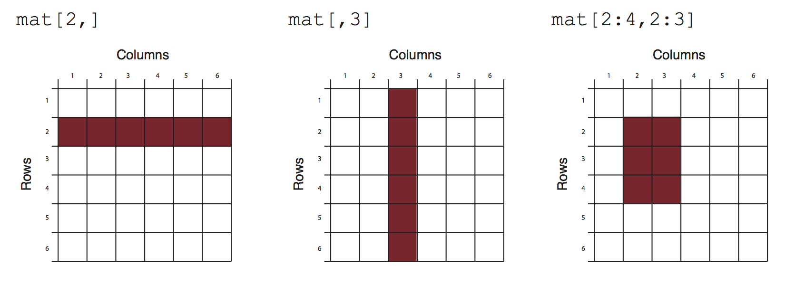
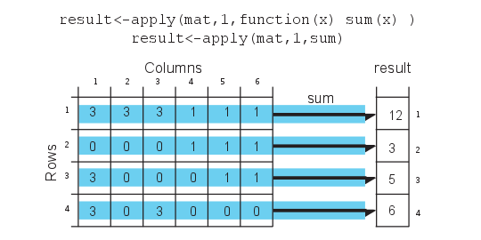
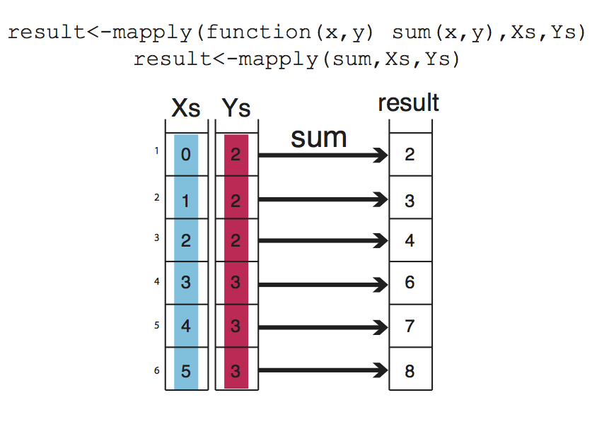
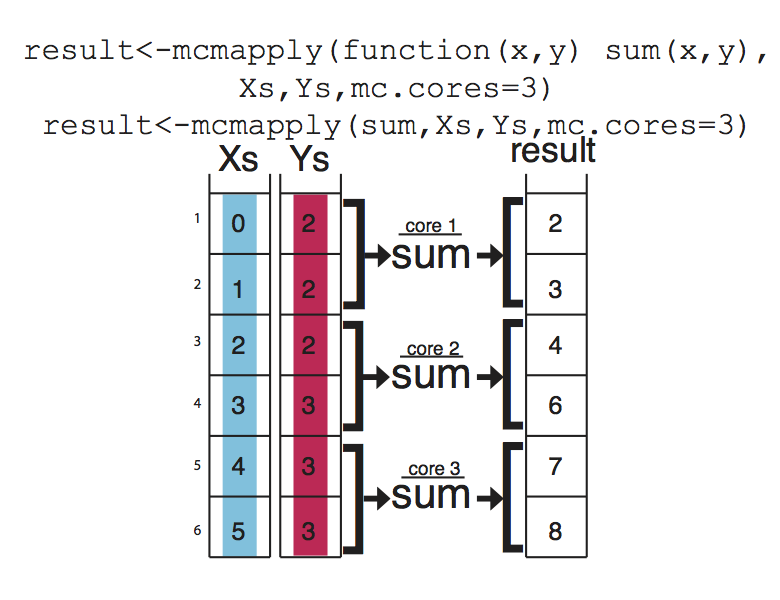

# Introduction to R for Genomic Data Analysis {#Rintro}


```{r setup_introtoR_seq, include=FALSE}
knitr::opts_chunk$set(echo      = TRUE,
                      message   = FALSE, 
                      error     = FALSE,
                      cache     = TRUE,
                      out.width = "55%",
                      fig.width = 5,
                      fig.align = 'center')
```


The aim of computational genomics is to provide biological interpretation and insights from
high-dimensional genomics data. Generally speaking, it is similar to any other kind 
of data analysis endeavor but oftentimes doing computational genomics will require domain-specific knowledge and tools.

As new high-throughput experimental techniques are on the rise, data analysis 
capabilities are sought-after features for researchers. The aim of this chapter is to first familiarize readers with data analysis steps and then provide basics of R programming within the context of genomic data analysis. R is a free statistical programming language that is popular among researchers and data miners to build software and analyze data. Although 
basic R programming tutorials are easily accessible, we are aiming to introduce 
the subject with the genomic context in the background. The examples and 
narrative will always be from real-life situations when you try to analyze 
genomic data with R. We believe tailoring material to the context of genomics 
makes a difference when learning this programming language for the sake of analyzing
genomic data.

## Steps of (genomic) data analysis
Regardless of the analysis type, data analysis has a common pattern. We will
discuss this general pattern and how it applies to genomics problems. The data analysis steps typically include data collection, quality check and cleaning, processing, modeling, visualization, and reporting. Although one expects to go through these steps in a linear fashion, it is normal to go back and repeat the steps with different parameters or tools. In practice, data analysis requires going through the same steps over and over again in order to be able to do a combination of the following: a)  answer other related questions, b) deal with data quality issues that are later realized, and c) include new data sets to the analysis. 

We will now go through a brief explanation of the steps within the context of genomic data analysis.

### Data collection
Data collection refers to any source, experiment or survey that provides data for the data analysis question you have. In genomics, data collection is done by high-throughput assays, introduced in Chapter \@ref(intro). One can also use publicly available data sets and specialized databases, also mentioned in Chapter \@ref(intro). How much data and what type of data you should collect depends on the question you are trying to answer and the technical and biological variability of the system you are studying.

### Data quality check and cleaning
In general, data analysis almost always deals with imperfect data. It is 
common to have missing values or measurements that are noisy. Data quality check
and cleaning aims to identify any data quality issue and clean it from the dataset.

High-throughput genomics data is produced by technologies that could embed 
technical biases into the data. If we were to give an example from sequencing,
the sequenced reads do not have the same quality of bases called. Towards the
ends of the reads, you could have bases that might be called incorrectly. Identifying those low-quality bases and removing them will improve the read mapping step. 

### Data processing 
This step refers to processing the data into a format that is suitable for 
exploratory analysis and modeling. Oftentimes, the data will not come in a ready-to-analyze 
format. You may need to convert it to other formats by transforming 
data points (such as log transforming, normalizing, etc.), or subset the data set
with some arbitrary or pre-defined condition. In terms of genomics, processing
includes multiple steps. Following the sequencing analysis example above, 
processing will include aligning reads to the genome and quantification over genes or regions of interest. This is simply counting how many reads are covering your regions of interest. This quantity can give you ideas about how much a gene is expressed if your experimental protocol was RNA sequencing\index{RNA-seq}. This can be followed by some normalization to aid the next step. 

### Exploratory data analysis and modeling
This phase usually takes in the processed or semi-processed data and applies machine learning or statistical methods to explore the data. Typically, one needs to see a relationship between variables measured, and a relationship between samples based on the variables measured. At this point, we might be looking to see if the samples are grouped as expected by the experimental design, or are there outliers or any other anomalies? After this step you might want to do additional cleanup or re-processing to deal with anomalies. 

Another related step is modeling. This generally refers to modeling your variable of interest based on other variables you measured. In the context of genomics, it could be that you are trying to predict disease status of the patients from expression of genes you measured from their tissue samples. Then your variable of interest is the disease status. This kind of approach is generally called "predictive modeling", and could be solved with regression-based machine learning methods. 


Statistical modeling would also be a part of this modeling step. This can cover predictive modeling as well, where we use statistical methods such as linear regression. Other analyses such as hypothesis testing, where we have an expectation and we are trying to confirm that expectation, is also related to statistical modeling. A good example of this in genomics is the differential gene expression analysis. This can be formulated as comparing two data sets, in this case expression values from condition A and condition B, with the expectation that condition A and condition B have similar expression values. You will see more on this in Chapter \@ref(stats).
 
### Visualization and reporting
Visualization is necessary for all the previous steps more or less. But in the final phase, we need final figures, tables, and text that describe the outcome of your analysis. This will be your report. In genomics, we use common data visualization methods as well as specific visualization methods developed or popularized by genomic data analysis. You will see many popular visualization methods in Chapters \@ref(stats) and \@ref(genomicIntervals).

### Why use R for genomics ?
R, with its statistical analysis
heritage, plotting features, and rich user-contributed packages is one of the 
best languages for the task of analyzing genomic data.
High-dimensional genomics datasets are usually suitable to 
be analyzed with core R packages and functions. On top of that, Bioconductor and CRAN have an 
array of specialized tools for doing genomics-specific analysis. Here is a list of computational genomics tasks that can be completed using R.

#### Data cleanup and processing

Most of general data cleanup, such as removing incomplete columns and values, reorganizing and transforming data, can be achieved using R. In addition, with the help of packages, R can connect to databases in various formats such as mySQL, mongoDB, etc., and query and get the data into the R environment using database specific tools. 

On top of these, genomic data-specific processing and quality check can be achieved via R/Bioconductor packages. For example, sequencing read quality checks and even \index{high-throughput sequencing} HT-read alignments \index{read alignment} can be achieved via R packages. 

#### General data analysis and exploration

Most genomics data sets are suitable for application of general data analysis tools. In some cases, you may need to preprocess the data to get it to a state that is suitable for application of such tools. Here is a non-exhaustive list of what kind of things can be done via R. You will see popular data analysis methods in Chapters \@ref(stats), \@ref(unsupervisedLearning) and \@ref(supervisedLearning).

 - Unsupervised data analysis: clustering (k-means, hierarchical), matrix factorization 
(PCA, ICA, etc.)
 - Supervised data analysis: generalized linear models, support vector machines, random forests

#### Genomics-specific data analysis methods
 R/Bioconductor gives you access to a multitude of other bioinformatics-specific algorithms. Here are some of the things you can do. We will touch upon many of the following methods in Chapter \@ref(genomicIntervals) and onwards.

 - Sequence analysis: TF binding motifs, GC content and CpG counts of a given DNA sequence
 - Differential expression (or arrays and sequencing-based measurements)
 - Gene set/pathway analysis: What kind of genes are enriched in my gene set?
 - Genomic interval operations such as overlapping CpG islands with transcription start sites, and filtering based on overlaps
 - Overlapping aligned reads with exons and counting aligned reads per gene
 
#### Visualization
Visualization is an important part of all data analysis techniques including computational genomics. Again, you can use core visualization techniques in R and also genomics-specific ones with the help of specific packages. Here are some of the things you can do with R.

 - Basic plots: Histograms, scatter plots, bar plots, box plots, heatmaps
 - Ideograms and circos plots for genomics provide visualization of different features over the whole genome.
 - Meta-profiles of genomic features, such as read enrichment over all promoters
 - Visualization of quantitative assays for given locus in the genome

## Getting started with R
Download and install R (http://cran.r-project.org/) and RStudio (http://www.rstudio.com/) if you do not have them already. RStudio is optional but it is a great tool if you are just starting to learn R.
You will need specific data sets to run the code snippets in this book; we have explained how to install and use the data in the [Data for the book] section in the [Preface]. If you have not used RStudio before, we recommend running it and familiarizing yourself with it first. To put it simply, this interface combines multiple features you will need while analyzing data. You can see your code, how it is executed, the plots you make, and your data all in one interface. 


### Installing packages
R packages are add-ons to base R that help you achieve additional tasks that are not directly supported by base R. It is by the action of these extra functionality that R excels as a tool for computational genomics. The Bioconductor project (http://bioconductor.org/) is a dedicated package repository for computational biology-related packages. However main package repository of R, called CRAN, also has computational biology related packages. In addition, R-Forge (http://r-forge.r-project.org/), GitHub (https://github.com/), and Bitbucket (http://www.bitbucket.org) are some of the other locations where R packages might be hosted. The packages needed for the code snippets in this book and how to install them are explained in the [Packages needed to run the book code] section in the [Preface] of the book.

You can install CRAN packages using `install.packages()` (# is the comment character in R).
```{r installpack1,eval=FALSE}
# install package named "randomForests" from CRAN
install.packages("randomForests")
```
You can install Bioconductor packages with a specific installer script.
```{r installpack2,eval=FALSE}
# get the installer package if you don't have
install.packages("BiocManager")

# install Bioconductor package "rtracklayer"
BiocManager::install("rtracklayer")
```
You can install packages from GitHub using the `install_github()` function from `devtools` package.
```{r installpack3,eval=FALSE}
library(devtools)
install_github("hadley/stringr")
```
Another way to install packages is from the source.
```{r installpack4,eval=FALSE}
# download the source file
download.file(
"https://github.com/al2na/methylKit/releases/download/v0.99.2/methylKit_0.99.2.tar.gz",
               destfile="methylKit_0.99.2.tar.gz")
# install the package from the source file
install.packages("methylKit_0.99.2.tar.gz",
                 repos=NULL,type="source")
# delete the source file
unlink("methylKit_0.99.2.tar.gz")
```
You can also update CRAN and Bioconductor packages.
```{r installpack5,eval=FALSE}
# updating CRAN packages
update.packages()

# updating Bioconductor packages
if (!requireNamespace("BiocManager", quietly = TRUE))
    install.packages("BiocManager")
BiocManager::install()
```

### Installing packages in custom locations
If you will be using R on servers or computing clusters rather than your personal computer, it is unlikely that you will have administrator access to install packages. In that case, you can install packages in custom locations by telling R where to look for additional packages. This is done by setting up an `.Renviron` file in your home directory and add the following line:
```
R_LIBS=~/Rlibs
```

This tells R that the “Rlibs” directory at your home directory will be the first choice of locations to look for packages and install packages (the directory name and location is up to you, the above is just an example). You should go and create that directory now. After that, start a fresh R session and start installing packages. From now on, packages will be installed to your local directory where you have read-write access.

### Getting help on functions and packages
You can get help on functions by using `help()` and `help.search()` functions. You can list the functions in a package with the `ls()` function

```{r getHelp,eval=FALSE}
library(MASS)
ls("package:MASS") # functions in the package
ls() # objects in your R enviroment
# get help on hist() function
?hist
help("hist")
# search the word "hist" in help pages
help.search("hist")
??hist

```
#### More help needed?
In addition, check package vignettes for help and practical understanding of the functions. All Bioconductor packages have vignettes that walk you through example analysis. Google search will always be helpful as well; there are many blogs and web pages that have posts about R. R-help mailing list (https://stat.ethz.ch/mailman/listinfo/r-help), Stackoverflow.com and R-bloggers.com are usually sources of good and reliable information.


## Computations in R
R can be used as an ordinary calculator, and some say it is an over-grown calculator. Here are some examples. Remember that `#` is the comment character. The comments give details about the operations in case they are not clear.
```{r basics, eval=FALSE}
2 + 3 * 5       # Note the order of operations.
log(10)        # Natural logarithm with base e
5^2            # 5 raised to the second power
3/2            # Division
sqrt(16)      # Square root
abs(3-7)      # Absolute value of 3-7
pi             # The number
exp(2)        # exponential function
# This is a comment line


```

## Data structures
R has multiple data structures. If you are familiar with Excel, you can think of a single Excel sheet as a table and data structures as building blocks of that table. Most of the time you will deal with tabular data sets or you will want to transform your raw data to a tabular data set, and you will try to manipulate this tabular data set in some way. For example, you may want to take sub-sections of the table or extract all the values in a column. For these and similar purposes, it is essential to know the common data structures in R and how they can be used. R deals with named data structures, which means you can give names to data structures and manipulate or operate on them using those names. It will be clear soon what we mean by this if "named data structures" does not ring a bell.

### Vectors
Vectors are one of the core R data structures. It is basically a list of elements of the same type (numeric, character or logical). Later you will see that every column of a table will be represented as a vector. R handles vectors easily and intuitively. You can create vectors with the `c()` function, however that is not the only way. The operations on vectors will propagate to all the elements of the vectors.\index{R Programming Language!vector}

```{r vectors}
x<-c(1,3,2,10,5)    #create a vector named x with 5 components
x = c(1,3,2,10,5)  
x
y<-1:5              #create a vector of consecutive integers y
y+2                 #scalar addition
2*y                 #scalar multiplication
y^2                 #raise each component to the second power
2^y                 #raise 2 to the first through fifth power
y                   #y itself has not been unchanged
y<-y*2
y                   #it is now changed
r1<-rep(1,3)        # create a vector of 1s, length 3
length(r1)           #length of the vector
class(r1)            # class of the vector
a<-1                # this is actually a vector length one
```

The standard assignment operator in R is `<-`. This operator is preferentially used in books and documentation. However, it is also possible to use the `=` operator for the assignment. 
We have an example in the above code snippet and throughout the book we use `<-` and `=` interchangeably for assignment.

### Matrices
A matrix refers to a numeric array of rows and columns. You can think of it as a stacked version of vectors where each row or column is a vector. One of the easiest ways to create a matrix is to combine vectors of equal length using `cbind()`, meaning 'column bind'.\index{R Programming Language!matrix}

```{r matrices}
x<-c(1,2,3,4)
y<-c(4,5,6,7)
m1<-cbind(x,y);m1
t(m1)                # transposed of m1
dim(m1)              # 4 by 2 matrix
```
You can also directly list the elements and specify the matrix:
```{r matrix2}
m2<-matrix(c(1,3,2,5,-1,2,2,3,9),nrow=3)
m2
```
Matrices and the next data structure, **data frames**, are tabular data structures. You can subset them using `[]` and providing desired rows and columns to subset. Figure  \@ref(fig:slicingDataFrames) shows how that works conceptually.

```{r,slicingDataFrames,fig.cap="Slicing/subsetting of a matrix and a data frame.",fig.align = 'center',out.width='80%',echo=FALSE}

```

### Data frames

A data frame is more general than a matrix, in that different columns can have different modes (numeric, character, factor, etc.). A data frame can be constructed by the `data.frame()` function. For example, we illustrate how to construct a data frame from genomic intervals or coordinates.\index{R Programming Language!data frame}

```{r dfcreate}
chr <- c("chr1", "chr1", "chr2", "chr2")
strand <- c("-","-","+","+")
start<- c(200,4000,100,400)
end<-c(250,410,200,450)
mydata <- data.frame(chr,start,end,strand)
#change column names
names(mydata) <- c("chr","start","end","strand")
mydata # OR this will work too
mydata <- data.frame(chr=chr,start=start,end=end,strand=strand)
mydata
```
There are a variety of ways to extract the elements of a data frame. You can extract certain columns using column numbers or names, or you can extract certain rows by using row numbers. You can also extract data using logical arguments, such as extracting all rows that have a value in a column larger than your threshold.

```{r dfSlice}
mydata[,2:4] # columns 2,3,4 of data frame
mydata[,c("chr","start")] # columns chr and start from data frame
mydata$start # variable start in the data frame
mydata[c(1,3),] # get 1st and 3rd rows
mydata[mydata$start>400,] # get all rows where start>400
```

### Lists
A list in R is an ordered collection of objects (components). A list allows you to gather a variety of (possibly unrelated) objects under one name. You can create a list with the `list()` function. Each object or element in the list has a numbered position and can have names. Below we show a few examples of how to create lists.
```{r makeList}
# example of a list with 4 components
# a string, a numeric vector, a matrix, and a scalar
w <- list(name="Fred",
       mynumbers=c(1,2,3),
       mymatrix=matrix(1:4,ncol=2),
       age=5.3)
w
```
You can extract elements of a list using the ``[[]]``, the double square-bracket, convention using either its position in the list or its name.
```{r sliceList}
w[[3]] # 3rd component of the list
w[["mynumbers"]] # component named mynumbers in list
w$age
```

### Factors
Factors are used to store categorical data. They are important for statistical modeling since categorical variables are treated differently in statistical models than continuous variables. This ensures categorical data treated accordingly in statistical models.
```{r makeFactor}
features=c("promoter","exon","intron")
f.feat=factor(features)
```
An important thing to note is that when you are reading a data frame with `read.table()` or creating a data frame with `data.frame()` function, the character columns are stored as factors by default, to change this behavior you need to set `stringsAsFactors=FALSE` in `read.table()` and/or `data.frame()` function arguments.\index{R Programming Language!factor}


## Data types
There are four common data types in R, they are `numeric`, `logical`, `character` and `integer`. All these data types can be used to create vectors natively.\index{R Programming Language!data types}
```{r dataTypes}
#create a numeric vector x with 5 components
x<-c(1,3,2,10,5)
x
#create a logical vector x
x<-c(TRUE,FALSE,TRUE)
x
# create a character vector
x<-c("sds","sd","as")
x
class(x)
# create an integer vector
x<-c(1L,2L,3L)
x
class(x)
```


## Reading and writing data
Most of the genomics data sets are in the form of genomic intervals associated with a score. That means mostly the data will be in table format with columns denoting chromosome, start positions, end positions, strand and score. One of the popular formats is the BED format, which is used primarily by the UCSC genome browser \index{UCSC Genome Browser} but most other genome browsers and tools will support the BED file format\index{BED file}. We have all the annotation data in BED format. You will read more about data formats in Chapter \@ref(genomicIntervals). In R, you can easily read tabular format data with the `read.table()` function. \index{R Programming Language!reading in data}
```{r readData}
enhancerFilePath=system.file("extdata",
                "subset.enhancers.hg18.bed",
                package="compGenomRData")
cpgiFilePath=system.file("extdata",
                "subset.cpgi.hg18.bed",
                package="compGenomRData")
# read enhancer marker BED file
enh.df <- read.table(enhancerFilePath, header = FALSE) 

# read CpG island BED file
cpgi.df <- read.table(cpgiFilePath, header = FALSE) 

# check first lines to see how the data looks like
head(enh.df)
head(cpgi.df)
```

You can save your data by writing it to disk as a text file. A data frame or matrix can be written out by using the `write.table()` function. Now let us write out `cpgi.df`. We will write it out as a tab-separated file; pay attention to the arguments.
```{r writeData,tidy=FALSE,eval=FALSE}
write.table(cpgi.df,file="cpgi.txt",quote=FALSE,
            row.names=FALSE,col.names=FALSE,sep="\t")
```
You can save your R objects directly into a file using `save()` and `saveRDS()` and load them back in with `load()` and `readRDS()`. By using these functions you can save any R object whether or not it is in data frame or matrix classes.
```{r writeData2,eval= FALSE}
save(cpgi.df,enh.df,file="mydata.RData")
load("mydata.RData")
# saveRDS() can save one object at a type
saveRDS(cpgi.df,file="cpgi.rds")
x=readRDS("cpgi.rds")
head(x)
```
One important thing is that with `save()` you can save many objects at a time, and when they are loaded into memory with `load()` they retain their variable names. For example, in the above code when you use `load("mydata.RData")` in a fresh R session, an object named `cpg.df` will be created. That means you have to figure out what name you gave to the objects before saving them. Conversely, when you save an object by `saveRDS()` and read by `readRDS()`, the name of the object is not retained, and you need to assign the output of `readRDS()` to a new variable (`x` in the above code chunk).\index{R Programming Language!writing data}

### Reading large files
Reading large files that contain tables with base R function `read.table()` might take a very long time. Therefore, there are additional packages that provide faster functions to read the files. The `data.table` \index{R Packages!\texttt{data.table}} and `readr` \index{R Packages!\texttt{readr}}packages provide this functionality. Below, we show how to use them. These functions with provided parameters will return equivalent output to the `read.table()` function.
```{r fastreader, eval=FALSE}
library(data.table)
df.f=d(enhancerFilePath, header = FALSE,data.table=FALSE)

library(readr)
df.f2=read_table(enhancerFilePath, col_names = FALSE)

```

## Plotting in R with base graphics
R has great support for plotting and customizing plots by default. This basic capability for plotting in R is referred to as "base graphics" or "R base graphics". We will show only a few below. Let us sample 50 values from the normal distribution \index{normal distribution} and plot them as a histogram. A histogram is an approximate representation of a distribution. Bars show how frequently we observe certain values in our sample.\index{R Programming Language!plotting} The resulting histogram from the code chunk below is shown in Figure \@ref(fig:sampleForPlots).

```{r sampleForPlots,out.width='40%',fig.width=5,fig.cap="Histogram of values sampled from normal distribution."}
# sample 50 values from normal distribution
# and store them in vector x
x<-rnorm(50)
hist(x) # plot the histogram of those values
```

We can modify all the plots by providing certain arguments to the plotting function. Now let's give a title to the plot using the `main` argument. We can also change the color of the bars using the `col` argument. You can simply provide the name of the color. Below, we are using `'red'` for the color. See Figure \@ref(fig:makeHist) for the result of this code chunk.

```{r makeHist,out.width='50%',fig.width=5, fig.cap="Histogram in red color."}
hist(x,main="Hello histogram!!!",col="red")
```

Next, we will make a scatter plot. Scatter plots are one of the most common plots you will encounter in data analysis. We will sample another set of 50 values and plot those against the ones we sampled earlier. The scatter plot shows values of two variables for a set of data points. It is useful to visualize relationships between two variables. It is frequently used in connection with correlation and linear regression. There are other variants of scatter plots which show density of the points with different colors. We will show examples of those scatter plots in later chapters. The scatter plot from our sampling experiment is shown in Figure \@ref(fig:makeScatter). Notice that, in addition to `main` argument we used `xlab` and `ylab` arguments to give labels to the plot. You can customize the plots even more than this. See `?plot` and `?par` for more arguments that can help you customize the plots.

```{r makeScatter,out.width='50%',fig.width=5, fig.cap="Scatter plot example."}
# randomly sample 50 points from normal distribution
y<-rnorm(50)
#plot a scatter plot
# control x-axis and y-axis labels
plot(x,y,main="scatterplot of random samples",
        ylab="y values",xlab="x values")
```

We can also plot boxplots for vectors x and y. Boxplots depict groups of numerical data through their quartiles. The edges of the box denote the 1st and 3rd quartiles, and the line that crosses the box is the median. The distance between the 1st and the 3rd quartiles is called interquartile tange. The whiskers (lines extending from the boxes) are usually defined using the interquartile range for symmetric distributions as follows: `lowerWhisker=Q1-1.5[IQR]` and `upperWhisker=Q3+1.5[IQR]`.

In addition, outliers can be depicted as dots. In this case, outliers are the values that remain outside the whiskers. The resulting plot from the code snippet below is shown in Figure \@ref(fig:makeBoxplot).

```{r makeBoxplot,out.width='50%',fig.width=5,fig.cap="Boxplot example"}
 boxplot(x,y,main="boxplots of random samples")
```
Next up is the bar plot, which you can plot using the `barplot()` function. We are going to plot four imaginary percentage values and color them with two colors, and this time we will also show how to draw a legend on the plot using the `legend()` function. The resulting plot is in Figure \@ref(fig:makebarplot).

```{r makebarplot,out.width='50%',fig.width=5,tidy=FALSE,fig.cap="Bar plot example"}
perc=c(50,70,35,25)
barplot(height=perc,
        names.arg=c("CpGi","exon","CpGi","exon"),
        ylab="percentages",main="imagine %s",
        col=c("red","red","blue","blue"))
legend("topright",legend=c("test","control"),
       fill=c("red","blue"))
```

### Combining multiple plots
In R, we can combine multiple plots in the same graphic. For this purpose, we use the `par()` function for simple combinations. More complicated arrangements with different sizes of sub-plots can be created with the `layout()` function. Below we will show how to combine two plots side-by-side using `par(mfrow=c(1,2))`. The `mfrow=c(nrows, ncols)` construct will create a matrix of `nrows` x `ncols` plots that are filled in by row. The following code will produce a histogram and a scatter plot stacked side by side. The result is shown in Figure \@ref(fig:combineBasePlots). If you want to see the plots on top of each other, simply change `mfrow=c(1,2)` to `mfrow=c(2,1)`.

```{r combineBasePlots,fig.cap="Combining two plots, a histogram and a scatter plot, with `par()` function.",fig.height=3.5}
par(mfrow=c(1,2)) # 

# make the plots
hist(x,main="Hello histogram!!!",col="red")
plot(x,y,main="scatterplot",
        ylab="y values",xlab="x values")

```

### Saving plots
If you want to save your plots to an image file there are couple of ways of doing that. Normally, you will have to do the following:

 1. Open a graphics device.
 2. Create the plot.
 3. Close the graphics device.

```{r savePlot,eval=FALSE}
pdf("mygraphs/myplot.pdf",width=5,height=5)
plot(x,y)
dev.off()
```
 Alternatively, you can first create the plot then copy the plot to a graphics device.
```{r savePlot2,eval=FALSE}
plot(x,y)
dev.copy(pdf,"mygraphs/myplot.pdf",width=7,height=5)
dev.off()
```

## Plotting in R with ggplot2
In R, there are other plotting systems besides “base graphics”, which is what we have shown until now. There is another popular plotting system called `ggplot2`\index{R Packages!\texttt{ggplot2}} which implements a different logic when constructing the plots. This system or logic is known as the “grammar of graphics”. This system defines a plot or graphics as a combination of different components. For example, in the scatter plot in \@ref(fig:makeScatter), we have the points which are geometric shapes, we have the coordinate system and scales of data. In addition, data transformations are also part of a plot. In Figure \@ref(fig:makeHist), the histogram has a binning operation and it puts the data into bins before displaying it as geometric shapes, the bars. The `ggplot2` system and its implementation of “grammar of graphics”^[This is a concept developed by Leland Wilkinson and popularized in R community by Hadley Wickham: https://doi.org/10.1198/jcgs.2009.07098] allows us to build the plot layer by layer using the predefined components. 


Next we will see how this works in practice. Let’s start with a simple scatter plot using `ggplot2`. In order to make basic plots in `ggplot2`, one needs to combine different components. First, we need the data and its transformation to a geometric object; for a scatter plot this would be mapping data to points, for histograms it would be binning the data and making bars. Second, we need the scales and coordinate system, which generates axes and legends so that we can see the values on the plot. And the last component is the plot annotation such as plot title and the background.


The main `ggplot2` function, called `ggplot()`, requires a data frame to work with, and this data frame is its first argument as shown in the code snippet below. The second thing you will notice is the `aes()` function in the `ggplot()` function. This function defines which columns in the data frame map to x and y coordinates and if they should be colored or have different shapes based on the values in a different column. These elements are the “aesthetic” elements, this is what we observe in the plot. The last line in the code represents the geometric object to be plotted. These geometric objects define the type of the plot. In this case, the object is a point, indicated by the `geom_point()`function. Another, peculiar thing in the code is the `+` operation. In `ggplot2`, this operation is used to add layers and modify the plot. The resulting scatter plot from the code snippet below can be seen in Figure \@ref(fig:ggScatterchp3). 

```{r ggScatterchp3,fig.cap="Scatter plot with ggplot2"}

library(ggplot2)

myData=data.frame(col1=x,col2=y)

 # the data is myData and I’m using col1 and col2 
# columns on x and y axes
ggplot(myData, aes(x=col1, y=col2)) +
  geom_point() # map x and y as points

```


Now, let’s re-create the histogram we created before. For this, we will start again with the `ggplot()` function. We are interested only in the x-axis in the histogram, so we will only use one column of the data frame. Then, we will add the histogram layer with the `geom_histogram()` function. In addition, we will be showing how to modify your plot further by adding an additional layer with the `labs()` function, which controls the axis labels and titles. The resulting plot from the code chunk below is shown in Figure \@ref(fig:ggHistChp3).

```{r ggHistChp3,fig.cap="Histograms made with ggplot2, the left histogram contains additional modifications introduced by `labs()` function.",fig.width=5}
ggplot(myData, aes(x=col1)) +
  geom_histogram() + # map x and y as points
  labs(title="Histogram for a random variable", x="my variable", y="Count")

```

We can also plot boxplots using `ggplot2`. Let's re-create the boxplot we did in Figure \@ref(fig:makeBoxplot). This time we will have to put all our data into a single data frame with extra columns denoting the group of our values. In the base graphics case, we could just input variables containing different vectors. However, `ggplot2` does not work like that and we need to create a data frame with the right format to use the `ggplot()` function. Below, we first concatenate the `x` and `y` vectors and create a second column denoting the group for the vectors. In this case, the x-axis will be the "group" variable which is just a character denoting the group, and the y-axis will be the numeric "values" for the `x` and `y` vectors. You can see how this is passed to the `aes()` function below. The resulting plot is shown in Figure \@ref(fig:ggBoxplotchp3).
```{r ggBoxplotchp3,fig.cap="Boxplots using ggplot2."}

# data frame with group column showing which 
# groups the vector x and y belong
myData2=rbind(data.frame(values=x,group="x"),
              data.frame(values=y,group="y"))

# x-axis will be group and y-axis will be values
ggplot(myData2, aes(x=group,y=values)) + 
         geom_boxplot()


```

### Combining multiple plots
There are different options for combining multiple plots. If we are trying to make similar plots for the subsets of the same data set, we can use faceting. This is a built-in and very useful feature of `ggplot2`. This feature is frequently used when investigating whether patterns are the same or different in different conditions or subsets of the data. It can be used via the `facet_grid()` function. Below, we will make two histograms faceted by the `group` variable in the input data frame. We will be using the same data frame we created for the boxplot in the previous section. The resulting plot is in Figure \@ref(fig:facetHistChp3).

(ref:reffacetHistChp3) Combining two plots using `ggplot2::facet_grid()` function.


```{r facetHistChp3,fig.cap='(ref:reffacetHistChp3)',fig.height=3}

ggplot(myData2, aes(x=values)) + 
         geom_histogram() +facet_grid(.~group)
```

Faceting only works when you are using the subsets of the same data set. However, you may want to combine different types of plots from different data sets. The base R functions such as `par()` and `layout()` will not work with `ggplot2` because it uses a different graphics system and this system does not recognize base R functionality for plotting. However, there are multiple ways you can combine plots from `ggplot2`. One way is using the `cowplot` package. This package aligns the individual plots in a grid and will help you create publication-ready compound plots. Below, we will show how to combine a histogram and a scatter plot side by side. The resulting plot is shown in Figure \@ref(fig:cowPlotChp3).


(ref:refcowPlotChp3) Combining a histogram and scatter plot using `cowplot` package. The plots are labeled as A and B using the arguments in `plot_grid()` function.

```{r cowPlotChp3,fig.cap='(ref:refcowPlotChp3)',fig.height=3.5,fig.width=7}
library(cowplot)
# histogram
p1 <- ggplot(myData2, aes(x=values,fill=group)) + 
        geom_histogram()
# scatterplot
p2 <- ggplot(myData, aes(x=col1, y=col2)) +
  geom_point() 

# plot two plots in a grid and label them as A and B
plot_grid(p1, p2, labels = c('A', 'B'), label_size = 12)

```


### ggplot2 and tidyverse
`ggplot2` is actually part of a larger ecosystem. You will need packages from this ecosystem when you want to use `ggplot2` in a more sophisticated manner or if you need additional functionality that is not readily available in base R or other packages. For example, when you want to make more complicated plots using `ggplot2`, you will need to modify your data frames to the formats required by the `ggplot()` function, and you will need to learn about the `dplyr`\index{R Packages!\texttt{dplyr}} and `tidyr`\index{R Packages!\texttt{tidyr}} packages for data formatting purposes. If you are working with character strings, `stringr` package might have functionality that is not available in base R. There are many more packages that users find useful in `tidyverse` and it could be important to know about this ecosystem of R packages.


```{block2, ggplotNote, type='rmdtip'}

__Want to know more ?__

- `ggplot2` has a free online book written by Hadley Wickham: https://ggplot2-book.org/  
- The `tidyverse` packages and the ecosystem is described in their website: https://www.tidyverse.org/. There you will find extensive documentation and resources on `tidyverse` packages. 

```

## Functions and control structures (for, if/else etc.)

### User-defined functions
Functions are useful for transforming larger chunks of code to re-usable pieces of code. Generally, if you need to execute certain tasks with variable parameters, then it is time you write a function. A function in R takes different arguments and returns a definite output, much like mathematical functions. Here is a simple function that takes two arguments, `x` and `y`, and returns the sum of their squares\index{R Programming Language!functions}.

```{r makeOwnFunc}
sqSum<-function(x,y){
result=x^2+y^2
return(result)
}
# now try the function out
sqSum(2,3)
```


Functions can also output plots and/or messages to the terminal. Here is a function that prints a message to the terminal:
```{r makeOwnFunc2}
sqSumPrint<-function(x,y){
result=x^2+y^2
cat("here is the result:",result,"\n")
}
# now try the function out
sqSumPrint(2,3)
```

Sometimes we would want to execute a certain part of the code only if a certain condition is satisfied. This condition can be anything from the type of an object (Ex: if the object is a matrix, execute certain code), or it can be more complicated, such as if the object value is between certain thresholds. Let us see how these if statements can be used. They can be used anywhere in your code; now we will use it in a function to decide if the CpG island is large, normal length or short.

```{r makeOwnFunc3,eval=FALSE}
cpgi.df <- read.table("intro2R_data/data/subset.cpgi.hg18.bed", header = FALSE)
# function takes input one row
# of CpGi data frame
largeCpGi<-function(bedRow){
 cpglen=bedRow[3]-bedRow[2]+1
 if(cpglen>1500){
	cat("this is large\n")
 }
 else if(cpglen<=1500 & cpglen>700){
	cat("this is normal\n")
 }
 else{
	cat("this is short\n")
 }
}
largeCpGi(cpgi.df[10,])
largeCpGi(cpgi.df[100,])
largeCpGi(cpgi.df[1000,])
```

### Loops and looping structures in R
When you need to repeat a certain task or execute a function multiple times, you can do that with the help of loops. A loop will execute the task until a certain condition is reached. The loop below is called a “for-loop” and it executes the task sequentially 10 times.
```{r forloop}
for(i in 1:10){ # number of repetitions
cat("This is iteration") # the task to be repeated
print(i)
}
```
The task above is a bit pointless. Normally in a loop, you would want to do something meaningful. Let us calculate the length of the CpG islands we read in earlier. Although this is not the most efficient way of doing that particular task, it serves as a good example for looping. The code below will execute a hundred times, and it will calculate the length of the CpG islands for the first 100 islands in
the data frame (by subtracting the end coordinate from the start coordinate).\index{R Programming Language!loops}


**Note:** If you are going to run a loop that has a lot of repetitions, it is smart to try the loop with few repetitions first and check the results. This will help you make sure the code in the loop works before executing it thousands of times.

```{r forloop2}
# this is where we will keep the lenghts
# for now it is an empty vector
result=c()
# start the loop
for(i in 1:100){
    #calculate the length
	len=cpgi.df[i,3]-cpgi.df[i,2]+1
    #append the length to the result
	result=c(result,len)
}
# check the results
head(result)
```

#### Apply family functions instead of loops
R has other ways of repeating tasks, which tend to be more efficient than using loops. They are known collectively as the "apply" family of functions, which include `apply`, `lapply`,`mapply` and `tapply` (and some other variants). All of these functions apply a given function to a set of instances and return the results of those functions for each instance. The difference between them is that they take different types of inputs. For example, `apply` works on data frames or matrices and applies the function on each row or column of the data structure. `lapply` works on lists or vectors and applies a function which takes the list element as an argument. Next we will demonstrate how to use `apply()` on a matrix. The example applies the sum function on the rows of a matrix; it basically sums up the values on each row of the matrix, which is conceptualized in Figure  \@ref(fig:applyConcept).\index{R Programming Language!apply family functions}


```{r,applyConcept,fig.cap="apply() concept in R.",fig.align = 'center',out.width='80%',echo=FALSE}

```

```{r showapply1}
mat=cbind(c(3,0,3,3),c(3,0,0,0),c(3,0,0,3),c(1,1,0,0),c(1,1,1,0),c(1,1,1,0))
result<-apply(mat,1,sum)
result
# OR you can define the function as an argument to apply()
result<-apply(mat,1,function(x) sum(x))
result
```
Notice that we used a second argument which equals 1, that indicates that rows of the matrix/ data frame will be the input for the function. If we change the second argument to 2, this will indicate that columns should be the input for the function that will be applied. See Figure \@ref(fig:applyConcept2) for the visualization of apply() on columns.


```{r,applyConcept2,fig.cap="apply() function on columns",fig.align = 'center',out.width='60%',echo=FALSE}
knitr::include_graphics("images/apply2.png" )
```

```{r showapply2}
result<-apply(mat,2,sum)
result
```
Next, we will use `lapply()`, which applies a function on a list or a vector. The function that will be applied is a simple function that takes the square of a given number.

```{r showapply3}
input=c(1,2,3)
lapply(input,function(x) x^2)
```
`mapply()` is another member of the `apply` family, it can apply a function on an unlimited set of vectors/lists, it is like a version of `lapply` that can handle multiple vectors as arguments. In this case, the argument to the `mapply()` is the function to be applied and the sets of parameters to be supplied as arguments of the function. As shown in the conceptualized Figure \@ref(fig:mapplyConcept), the function to be applied is a function that takes two arguments and sums them up. The arguments to be summed up are in the format of vectors `Xs` and `Ys`. `mapply()` applies the summation function to each pair in the `Xs` and `Ys` vector. Notice that the order of the input function and extra arguments are different for `mapply`.

```{r,mapplyConcept,fig.cap="mapply() concept.",fig.align = 'center',out.width='50%',echo=FALSE}

```

```{r showMapply1}
Xs=0:5
Ys=c(2,2,2,3,3,3)
result<-mapply(function(x,y) sum(x,y),Xs,Ys)
result
```

#### Apply family functions on multiple cores
If you have large data sets, apply family functions can be slow (although probably still better than for loops). If that is the case, you can easily use the parallel versions of those functions from the parallel package. These functions essentially divide your tasks to smaller chunks, run them on separate CPUs, and merge the results from those parallel operations. This concept is visualized in Figure below \@ref(fig:mcapplyConcept), `mcapply` runs the summation function on three different processors. Each processor executes the summation function on a part of the data set, and the results are merged and returned as a single vector that has the same order as the input parameters Xs and Ys.\index{R Programming Language!apply family functions}

```{r,mcapplyConcept,fig.cap="mcapply() concept.",fig.align = 'center',out.width='50%',echo=FALSE}

```

#### Vectorized functions in R
The above examples have been put forward to illustrate functions and loops in R because functions using sum() are not complicated and are easy to understand. You will probably need to use loops and looping structures with more complicated functions. In reality, most of the operations we used do not need the use of loops or looping structures because there are already vectorized functions that can achieve the same outcomes, meaning if the input arguments are R vectors, the output will be a vector as well, so no need for loops or vectorization.

For example, instead of using `mapply()` and `sum()` functions, we can just use the `+` operator and sum up `Xs` and `Ys`.
```{r vectorized1}
result=Xs+Ys
result
```
In order to get the column or row sums, we can use the vectorized functions `colSums()` and `rowSums()`.
```{r vectorized2}
colSums(mat)
rowSums(mat)
```
However, remember that not every function is vectorized in R, so use the ones that are. But sooner or later, apply family functions will come in handy.


## Exercises

### Computations in R

1. Sum 2 and 3 using the `+` operator. [Difficulty: **Beginner**]

2. Take the square root of 36, use `sqrt()`. [Difficulty: **Beginner**]

3. Take the log10 of 1000, use function `log10()`. [Difficulty: **Beginner**]

4. Take the log2 of 32, use function `log2()`. [Difficulty: **Beginner**]

5. Assign the sum of 2,3 and 4 to variable x. [Difficulty: **Beginner**]

6. Find the absolute value of  the expression `5 - 145` using the `abs()` function. [Difficulty: **Beginner**]

7. Calculate the square root of 625, divide it by 5, and assign it to variable `x`.Ex: `y= log10(1000)/5`, the previous statement takes log10 of 1000, divides it by 5, and assigns the value to variable y. [Difficulty: **Beginner**]

8. Multiply the value you get from previous exercise by 10000, assign it to variable x
Ex: `y=y*5`, multiplies `y` by 5 and assigns the value to `y`. 
**KEY CONCEPT:** results of computations or arbitrary values can be stored in variables we can re-use those variables later on and over-write them with new values. 
[Difficulty: **Beginner**]

### Data structures in R 


10. Make a vector of 1,2,3,5 and 10 using `c()`, and assign it to the `vec` variable. Ex: `vec1=c(1,3,4)` makes a vector out of 1,3,4. [Difficulty: **Beginner**]

11. Check the length of your vector with length(). 
Ex: `length(vec1)` should return 3. [Difficulty: **Beginner**]

12. Make a vector of all numbers between 2 and 15.
Ex: `vec=1:6` makes a vector of numbers between 1 and 6, and assigns it to the `vec` variable. [Difficulty: **Beginner**]

13. Make a vector of  4s repeated 10 times using the `rep()` function. Ex: `rep(x=2,times=5)` makes a vector of 2s repeated 5 times. [Difficulty: **Beginner**]

14. Make a logical vector with TRUE, FALSE values of length 4, use `c()`.
Ex: `c(TRUE,FALSE)`. [Difficulty: **Beginner**]

15. Make a character vector of the gene names PAX6,ZIC2,OCT4 and SOX2.
Ex: `avec=c("a","b","c")` makes a character vector of a,b and c. [Difficulty: **Beginner**]

16. Subset the vector using `[]` notation, and get the 5th and 6th elements. 
Ex: `vec1[1]` gets the first element. `vec1[c(1,3)]` gets the 1st and 3rd elements. [Difficulty: **Beginner**]

17. You can also subset any vector using a logical vector in `[]`. Run the following:

```{r subsetLogicExercise, eval=FALSE}
myvec=1:5
# the length of the logical vector 
# should be equal to length(myvec) 
myvec[c(TRUE,TRUE,FALSE,FALSE,FALSE)] 
myvec[c(TRUE,FALSE,FALSE,FALSE,TRUE)]
``` 
[Difficulty: **Beginner**]

18. `==,>,<, >=, <=` operators create logical vectors. See the results of the following operations:

```{r,eval=FALSE}
myvec > 3
myvec == 4
myvec <= 2
myvec != 4
```
[Difficulty: **Beginner**]

19.  Use the `>` operator in `myvec[ ]` to get elements larger than 2 in `myvec` which is described above. [Difficulty: **Beginner**]


20. Make a 5x3 matrix (5 rows, 3 columns) using `matrix()`.
Ex: `matrix(1:6,nrow=3,ncol=2)` makes a 3x2 matrix using numbers between 1 and 6. [Difficulty: **Beginner**]

21. What happens when you use `byrow = TRUE` in your matrix() as an additional argument?
Ex: `mat=matrix(1:6,nrow=3,ncol=2,byrow = TRUE)`. [Difficulty: **Beginner**]

22. Extract the first 3 columns and first 3 rows of your matrix using `[]` notation. [Difficulty: **Beginner**]

23. Extract the last two rows of the matrix you created earlier.
Ex: `mat[2:3,]` or `mat[c(2,3),]` extracts the 2nd and 3rd rows.
[Difficulty: **Beginner**]


24. Extract the first two columns and run `class()` on the result.
[Difficulty: **Beginner**]

25. Extract the first column and run `class()` on the result, compare with the above exercise.
[Difficulty: **Beginner**]

26. Make a data frame with 3 columns and 5 rows. Make sure first column is a sequence
of numbers 1:5, and second column is a character vector.
Ex: `df=data.frame(col1=1:3,col2=c("a","b","c"),col3=3:1) # 3x3 data frame`.
Remember you need to make a 3x5 data frame. [Difficulty: **Beginner**]

27. Extract the first two columns and first two rows. 
**HINT:** Use the same notation as matrices. [Difficulty: **Beginner**]

28. Extract the last two rows of the data frame you made.
**HINT:** Same notation as matrices. [Difficulty: **Beginner**]

29. Extract the last two columns using the column names of the data frame you made. [Difficulty: **Beginner**]


30. Extract the second column using the column names.
You can use `[]` or `$` as in lists; use both in two different answers. [Difficulty: **Beginner**]

31. Extract rows where the 1st column is larger than 3.
**HINT:** You can get a logical vector using the `>` operator
, and logical vectors can be used in `[]` when subsetting. [Difficulty: **Beginner**]

32. Extract rows where the 1st column is larger than or equal to 3.
[Difficulty: **Beginner**]

33. Convert a data frame to the matrix. **HINT:** Use `as.matrix()`.
Observe what happens to numeric values in the data frame. [Difficulty: **Beginner**]


34. Make a list using the `list()` function. Your list should have 4 elements;
the one below has 2. Ex: `mylist= list(a=c(1,2,3),b=c("apple,"orange"))`
[Difficulty: **Beginner**]

35. Select the 1st element of the list you made using `$` notation.
Ex: `mylist$a` selects first element named "a".
[Difficulty: **Beginner**]


36. Select the 4th element of the list you made earlier using `$` notation. [Difficulty: **Beginner**]

```{r,echo=FALSE,eval=FALSE}
mylist$d
```

37. Select the 1st element of your list using `[ ]` notation. 
Ex: `mylist[1]` selects the first element named "a", and you get a list with one element. `mylist["a"]` selects the first element named "a", and you get a list with one element.
[Difficulty: **Beginner**]

38. Select the 4th element of your list using `[ ]` notation. [Difficulty: **Beginner**]


39. Make a factor using factor(), with 5 elements.
Ex: `fa=factor(c("a","a","b"))`. [Difficulty: **Beginner**]

40. Convert a character vector to a factor using `as.factor()`.
First, make a character vector using `c()` then use `as.factor()`.
[Difficulty: **Intermediate**]

41. Convert the factor you made above to a character using `as.character()`. [Difficulty: **Beginner**]


### Reading in and writing data out in R

1. Read CpG island (CpGi) data from the compGenomRData package `CpGi.table.hg18.txt`. This is a tab-separated file. Store it in a variable called `cpgi`. Use 
```
cpgFilePath=system.file("extdata",
                "CpGi.table.hg18.txt",
                package="compGenomRData")
```
to get the file path within the installed `compGenomRData` package. [Difficulty: **Beginner**]

2. Use `head()` on CpGi to see the first few rows. [Difficulty: **Beginner**]

3. Why doesn't the following work? See `sep` argument at `help(read.table)`. [Difficulty: **Beginner**]

```{r readCpGex, eval=FALSE}
cpgtFilePath=system.file("extdata",
                "CpGi.table.hg18.txt",
                package="compGenomRData")
cpgtFilePath
cpgiSepComma=read.table(cpgtFilePath,header=TRUE,sep=",")
head(cpgiSepComma)
```

4. What happens when you set `stringsAsFactors=FALSE` in `read.table()`? [Difficulty: **Beginner**]
```{r readCpGex12, eval=FALSE}
cpgiHF=read.table("intro2R_data/data/CpGi.table.hg18.txt",
                     header=FALSE,sep="\t",
                     stringsAsFactors=FALSE)
```                
               

5. Read only the first 10 rows of the CpGi table. [Difficulty: **Beginner/Intermediate**]  

6. Use `cpgFilePath=system.file("extdata","CpGi.table.hg18.txt",`
`package="compGenomRData")` to get the file path, then use
`read.table()` with argument `header=FALSE`. Use `head()` to see the results. [Difficulty: **Beginner**]  


7. Write CpG islands to a text file called "my.cpgi.file.txt". Write the file
to your home folder; you can use `file="~/my.cpgi.file.txt"` in linux. `~/` denotes
home folder.[Difficulty: **Beginner**]  


8. Same as above but this time make sure to use the `quote=FALSE`,`sep="\t"` and `row.names=FALSE` arguments. Save the file to "my.cpgi.file2.txt" and compare it with "my.cpgi.file.txt". [Difficulty: **Beginner**]  


9. Write out the first 10 rows of the `cpgi` data frame.
**HINT:** Use subsetting for data frames we learned before. [Difficulty: **Beginner**]  


10. Write the first 3 columns of the `cpgi` data frame. [Difficulty: **Beginner**] 

11. Write CpG islands only on chr1. **HINT:** Use subsetting with `[]`, feed a logical vector using `==` operator.[Difficulty: **Beginner/Intermediate**] 


12. Read two other data sets "rn4.refseq.bed" and "rn4.refseq2name.txt" with `header=FALSE`, and assign them to df1 and df2 respectively.
They are again included in the compGenomRData package, and you
can use the `system.file()` function to get the file paths. [Difficulty: **Beginner**] 


13. Use `head()` to see what is inside the data frames above. [Difficulty: **Beginner**] 

14. Merge data sets using `merge()` and assign the results to a variable named 'new.df', and use `head()` to see the results. [Difficulty: **Intermediate**] 


### Plotting in R


Please run the following code snippet for the rest of the exercises. 
```{r plotExSeed}
set.seed(1001)
x1=1:100+rnorm(100,mean=0,sd=15)
y1=1:100
```

1. Make a scatter plot using the `x1` and `y1` vectors generated above. [Difficulty: **Beginner**] 


2. Use the `main` argument to give a title to `plot()` as in `plot(x,y,main="title")`. [Difficulty: **Beginner**] 


3. Use the `xlab` argument to set a label for the x-axis. Use `ylab` argument to set a label for the y-axis. [Difficulty: **Beginner**] 
4. Once you have the plot, run the following expression in R console. `mtext(side=3,text="hi there")` does. **HINT:** `mtext` stands for margin text. [Difficulty: **Beginner**] 

5. See what `mtext(side=2,text="hi there")` does. Check your plot after execution. [Difficulty: **Beginner**] 

6. Use *mtext()*  and *paste()* to put a margin text on the plot. You can use `paste()` as 'text' argument in `mtext()`. **HINT:** `mtext(side=3,text=paste(...))`. See how `paste()` is used for below. [Difficulty: **Beginner/Intermediate**] 

```{r pasteExample}
paste("Text","here")
myText=paste("Text","here")
myText
```


7. `cor()` calculates the correlation between two vectors.
Pearson correlation is a measure of the linear correlation (dependence) 
between two variables X and Y. Try using the `cor()` function on the `x1` and `y1` variables. [Difficulty: **Intermediate**] 

8. Try to use `mtext()`,`cor()` and `paste()` to display the correlation coefficient on your scatter plot.  [Difficulty: **Intermediate**] 

9. Change the colors of your plot using the `col` argument.
Ex: `plot(x,y,col="red")`. [Difficulty: **Beginner**] 

10. Use `pch=19` as an argument in your `plot()` command. [Difficulty: **Beginner**] 


11. Use `pch=18` as an argument to your `plot()` command. [Difficulty: **Beginner**] 

12. Make a histogram of `x1` with  the `hist()` function. A histogram is a graphical representation of the data distribution. [Difficulty: **Beginner**] 


13. You can change colors with 'col', add labels with 'xlab', 'ylab', and add a 'title' with 'main' arguments. Try all these in a histogram.
[Difficulty: **Beginner**]  
 ```{r,echo=FALSE,eval=FALSE}
hist(x1,main="title")
```

14. Make a boxplot of y1 with `boxplot()`.[Difficulty: **Beginner**] 

15. Make boxplots of `x1` and `y1` vectors in the same plot.[Difficulty: **Beginner**] 


16. In boxplot, use the `horizontal = TRUE`  argument. [Difficulty: **Beginner**] 


17. Make multiple plots with `par(mfrow=c(2,1))`
    - run `par(mfrow=c(2,1))` 
    - make a boxplot 
    - make a histogram
[Difficulty: **Beginner/Intermediate**] 


18. Do the same as above but this time with `par(mfrow=c(1,2))`. [Difficulty: **Beginner/Intermediate**] 


19. Save your plot using the "Export" button in RStudio. [Difficulty: **Beginner**] 

20. You can make a scatter plot showing the density
of points rather than points themselves. If you use points it looks like this:

```{r colorScatterEx,out.width='50%'}

x2=1:1000+rnorm(1000,mean=0,sd=200)
y2=1:1000
plot(x2,y2,pch=19,col="blue")
```

If you use the `smoothScatter()` function, you get the densities. 
```{r smoothScatterEx,out.width='50%'}
smoothScatter(x2,y2,
              colramp=colorRampPalette(c("white","blue",
                                         "green","yellow","red"))) 
```
 
Now, plot with the `colramp=heat.colors` argument and then use a custom color scale using the following argument.
```
colramp = colorRampPalette(c("white","blue", "green","yellow","red")))
```
[Difficulty: **Beginner/Intermediate**] 

### Functions and control structures (for, if/else, etc.)
Read CpG island data as shown below for the rest of the exercises.

```{r CpGexReadchp2,eval=TRUE}
cpgtFilePath=system.file("extdata",
                "CpGi.table.hg18.txt",
                package="compGenomRData")
cpgi=read.table(cpgtFilePath,header=TRUE,sep="\t")
head(cpgi)
```

1. Check values in the perGc column using a histogram.
The 'perGc' column in the data stands for GC percent => percentage of C+G nucleotides. [Difficulty: **Beginner**] 

2. Make a boxplot for the 'perGc' column. [Difficulty: **Beginner**] 


3. Use if/else structure to decide if the given GC percent is high, low or medium.
If it is low, high, or medium: low < 60, high>75, medium is between 60 and 75;
use greater or less than operators, `<`  or ` >`. Fill in the values in the code below, where it is written 'YOU_FILL_IN'. [Difficulty: **Intermediate**]
```{r functionEvExchp2,echo=TRUE,eval=FALSE}

GCper=65

  # check if GC value is lower than 60, 
  # assign "low" to result
  if('YOU_FILL_IN'){
    result="low"
    cat("low")
  }
  else if('YOU_FILL_IN'){  # check if GC value is higher than 75,      
                           #assign "high" to result
    result="high"
    cat("high")
  }else{ # if those two conditions fail then it must be "medium"
    result="medium"
  }

result

```

4. Write a function that takes a value of GC percent and decides
if it is low, high, or medium: low < 60, high>75, medium is between 60 and 75.
Fill in the values in the code below, where it is written 'YOU_FILL_IN'. [Difficulty: **Intermediate/Advanced**]


```
GCclass<-function(my.gc){
  
  YOU_FILL_IN
  
  return(result)
}
GCclass(10) # should return "low"
GCclass(90) # should return "high"
GCclass(65) # should return "medium"
```


5. Use a for loop to get GC percentage classes for `gcValues` below. Use the function
you wrote above.[Difficulty: **Intermediate/Advanced**]

```
gcValues=c(10,50,70,65,90)
for( i in YOU_FILL_IN){
  YOU_FILL_IN
}
```


6. Use `lapply` to get GC percentage classes for `gcValues`. [Difficulty: **Intermediate/Advanced**]

```{r lapplyExExerciseChp2,eval=FALSE}
vec=c(1,2,4,5)
power2=function(x){ return(x^2)  }
    lapply(vec,power2)
```


7. Use sapply to get values to get GC percentage classes for `gcValues`. [Difficulty: **Intermediate**]

8. Is there a way to decide on the GC percentage class of a given vector of `GCpercentages`
without using if/else structure and loops ? if so, how can you do it?
**HINT:** Subsetting using < and > operators.
[Difficulty: **Intermediate**]
