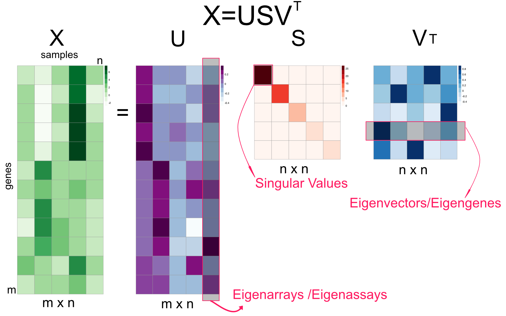
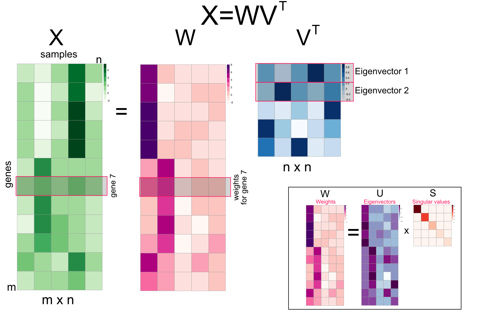
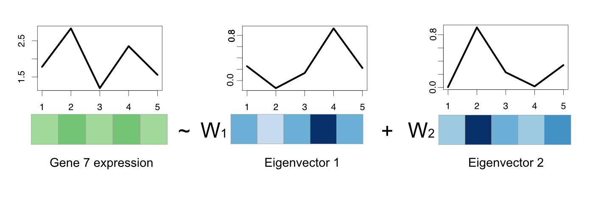
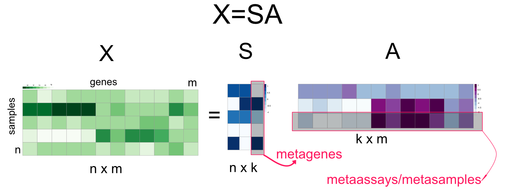
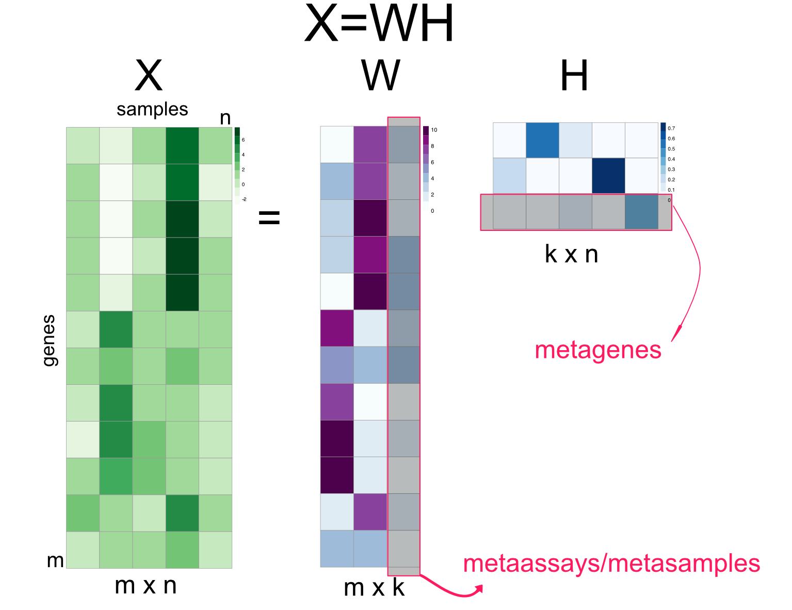

# Exploratory Data Analysis with Unsupervised Machine Learning {#unsupervisedLearning}
In this chapter, we will focus on using some of the machine learning techniques to explore genomics data. The goals of data exploration are usually many. Generally, we want to understand how the variables in our data set relate to each other and how the samples defined by those variables relate to each other. These points of information can be used to generate a hypothesis, find outliers \index{outliers}in the samples or identify sample groups that need more data points. In this chapter, we will focus on two main classes of techniques: "clustering" and "dimension reduction". We will show how to use these techniques and how to visualize them using R. As these techniques are fundamental for data analysis, we will see more of their use cases in Chapters \@ref(rnaseqanalysis), \@ref(chipseq), \@ref(bsseq) and \@ref(multiomics).

```{r setupML, include=FALSE}
knitr::opts_chunk$set(echo      = TRUE,
                      message   = FALSE, 
                      error     = FALSE,
                      warning = FALSE,
                      cache     = TRUE,
                      out.width = "55%",
                      fig.width = 5,
                      fig.align = 'center')

```

## Clustering: Grouping samples based on their similarity 

In genomics, we would very frequently want to assess how our samples relate to each other. Are our replicates similar to each other? Do the samples from the same treatment group have similar genome-wide signals? Do the patients with similar diseases have similar gene expression profiles?
Take the last question for example. We need to define a distance or similarity metric between patients' expression profiles and use that metric to find groups of patients that are more similar to each other than the rest of the patients. This, in essence, is the general idea behind clustering. We need a distance metric and a method to utilize that distance metric to find self-similar groups. Clustering is a ubiquitous procedure in bioinformatics as well as any field that deals with high-dimensional data. It is very likely that every genomics paper containing multiple samples has some sort of clustering. Due to this ubiquity and general usefulness, it is an essential technique to learn. 


### Distance metrics

The first required step for clustering is the distance metric. This is simply a measurement of how similar gene expressions are to each other. There are many options for distance metrics and the choice of the metric is quite important for clustering. Consider a simple example where we have four patients and expression of three genes measured in Table \@ref(tab:expTable). Which patients look similar to each other based on their gene expression profiles \index{gene expression}? 

```{r expTable,echo=FALSE}
df=data.frame(
    IRX4=c(11,13,2,1),
    OCT4=c(10,13,4,3 ),
    PAX6=c(1 ,3 ,10,9),
    row.names=c("patient1","patient2","patient3","patient4")
  )
knitr::kable(
  df,
  caption = 'Gene expressions from patients', 
  booktabs = FALSE
)
```

It may not be obvious from the table at first sight, but if we plot the gene expression profile for each patient (shown in Figure \@ref(fig:expPlot)), we will see that expression profiles of patient 1 and patient 2 are more similar to each other than patient 3 or patient 4. 

```{r expPlot,echo=FALSE,out.width='50%',fig.cap="Gene expression values for different patients. Certain patients have gene expression values that are similar to each other."}

library(ggplot2)
df2=tidyr::gather(cbind(patient=rownames(df),df),key="gene",value="expression",IRX4,PAX6,OCT4)
ggplot(df2, aes(gene,expression, fill = patient)) + geom_bar(stat = "identity", position = "dodge",width=0.3) +facet_wrap(~ patient,nrow=4)+ theme_bw()

```

But how can we quantify what we see? A simple metric for distance between gene expression vectors between a given patient pair is the sum of the absolute difference between gene expression values. This can be formulated as follows: $d_{AB}={\sum _{i=1}^{n}|e_{Ai}-e_{Bi}|}$, where $d_{AB}$ is the distance between patients A and B, and the $e_{Ai}$ and $e_{Bi}$ are expression values of the $i$th gene for patients A and B. This distance metric is called the **"Manhattan distance"** or **"L1 norm"**. \index{Manhattan distance}
\index{L1 norm}

Another distance metric uses the sum of squared distances and takes the square root of resulting value; this metric can be formulated as: $d_{AB}={{\sqrt {\sum _{i=1}^{n}(e_{Ai}-e_{Bi})^{2}}}}$. This distance is called **"Euclidean Distance"** or **"L2 norm"**. This is usually the default distance metric for many clustering algorithms. Due to the squaring operation, values that are very different get higher contribution to the distance. Due to this, compared to the Manhattan distance, it can be affected  more by outliers\index{outliers}. But, generally if the outliers are rare, this distance metric works well.

The last metric we will introduce is the **"correlation distance"**. This is simply $d_{AB}=1-\rho$, where $\rho$ is the Pearson correlation coefficient between two vectors; in our case those vectors are gene expression profiles of patients. Using this distance the gene expression vectors that have a similar pattern will have a small distance, whereas when the vectors have different patterns they will have a large distance. In this case, the linear correlation between vectors matters, although the scale of the vectors might be different.\index{correlation distance}

Now let's see how we can calculate these distances in R. First, we have our gene expression per patient table. 
```{r dists1}
df
```
Next, we calculate the distance metrics using the `dist()` function and `1-cor()` expression. 
```{r distMethodChp4}
dist(df,method="manhattan")
dist(df,method="euclidean")
as.dist(1-cor(t(df))) # correlation distance

```


#### Scaling before calculating the distance
Before we proceed to the clustering, there is one more thing we need to take care of. Should we normalize our data? The scale of the vectors in our expression matrix can affect the distance calculation. Gene expression tables might have some sort of normalization, so the values are in comparable scales. But somehow, if a gene's expression values are on a much higher scale than the other genes, that gene will affect the distance more than others when using Euclidean or Manhattan distance. If that is the case we can scale the variables. The traditional way of scaling variables is to subtract their mean, and divide by their standard deviation, this operation is also called "standardization". If this is done on all genes, each gene will have the same effect on distance measures. The decision to apply scaling ultimately depends on our data and what you want to achieve. If the gene expression values are previously normalized between patients, having genes that dominate the distance metric could have a biological meaning and therefore it may not be desirable to further scale variables. In R, the standardization is done via the `scale()` function. Here we scale the gene expression values.\index{scaling}
```{r scaling}
df
scale(df)
```


### Hierarchical clustering
This is one of the most ubiquitous clustering algorithms. Using this algorithm you can see the relationship of individual data points and relationships of clusters. This is achieved by successively joining small clusters to each other based on the inter-cluster distance. Eventually, you get a tree structure or a dendrogram that shows the relationship between the individual data points and clusters. The height of the dendrogram is the distance between clusters. Here we can show how to use this on our toy data set from four patients. The base function in R to do hierarchical clustering in `hclust()`. Below, we apply that function on Euclidean distances between patients. The resulting clustering tree or dendrogram is shown in Figure \@ref(fig:expPlot).\index{clustering!hierarchical clustering}
```{r toyClust,fig.cap="Dendrogram of distance matrix",out.width='50%'}
d=dist(df)
hc=hclust(d,method="complete")
plot(hc)
```
In the above code snippet, we have used the `method="complete"` argument without explaining it. The `method` argument defines the criteria that directs how the sub-clusters are merged. During clustering, starting with single-member clusters, the clusters are merged based on the distance between them. There are many different ways to define distance between clusters, and based on which definition you use, the hierarchical clustering results change. So the `method` argument controls that. There are a couple of values this argument can take; we list them and their description below:

- **"complete"** stands for "Complete Linkage" and the distance between two clusters is defined as the largest distance between any members of the two clusters. 
- **"single"** stands for "Single Linkage" and the distance between two clusters is defined as the smallest distance between any members of the two clusters. 
- **"average"** stands for "Average Linkage" or more precisely the UPGMA (Unweighted Pair Group Method with Arithmetic Mean) method. In this case, the distance between two clusters is defined as the average distance between any members of the two clusters. 
- **"ward.D2"** and **"ward.D"** stands for different implementations of Ward's minimum variance method. This method aims to find compact, spherical clusters by selecting clusters to merge based on the change in the cluster variances. The clusters are merged if the increase in the combined variance over the sum of the cluster-specific variances is the minimum compared to alternative merging operations.

```{r setupData,eval=FALSE,echo=FALSE}
library(leukemiasEset)
mat=exprs(leukemiasEset)
mat=(limma::normalizeQuantiles(mat))
mat2=mat[order(matrixStats::rowSds(mat)/rowMeans(mat)),][1:1000,]
saveRDS(mat2,"leukemiaExpressionSubset.rds")
saveRDS(mat,"leukemiaExpression.rds")
mat=readRDS("leukemiaExpressionSubset.rds")
```

In real life, we would get expression profiles from thousands of genes and we will typically have many more patients than our toy example. One such data set is gene expression values from 60 bone marrow samples of patients with one of the four main types of leukemia (ALL, AML, CLL, CML) or no-leukemia controls. We trimmed that data set down to the top 1000 most variable genes to be able to work with it more easily, since genes that are not very variable do not contribute much to the distances between patients. We will now use this data set to cluster the patients and display the values as a heatmap and a dendrogram. The heatmap shows the expression values of genes across patients in a color coded manner. The heatmap function, `pheatmap()`, that we will use performs the clustering as well. The matrix that contains gene expressions has the genes in the rows and the patients in the columns. Therefore, we will also use a column-side color code to mark the patients based on their leukemia type. For the hierarchical clustering, we will use Ward's method designated by the `clustering_method` argument to the `pheatmap()` function. The resulting heatmap is shown in Figure \@ref(fig:heatmap1). \index{heatmap}

```{r heatmap1,eval=TRUE,out.width='50%',fig.cap="Heatmap of gene expression values from leukemia patients. Each column represents a patient. Columns are clustered using gene expression and color coded by disease type: ALL, AML, CLL, CML or no-leukemia "}
library(pheatmap)
expFile=system.file("extdata","leukemiaExpressionSubset.rds",
                    package="compGenomRData")
mat=readRDS(expFile)

# set the leukemia type annotation for each sample
annotation_col = data.frame(
                    LeukemiaType =substr(colnames(mat),1,3))
rownames(annotation_col)=colnames(mat)
  

pheatmap(mat,show_rownames=FALSE,show_colnames=FALSE,
         annotation_col=annotation_col,
         scale = "none",clustering_method="ward.D2",
         clustering_distance_cols="euclidean")
```

As we can observe in the heatmap, each cluster has a distinct set of expression values. The main clusters almost perfectly distinguish the leukemia types. Only one CML patient is clustered as a non-leukemia sample. This could mean that gene expression profiles are enough to classify leukemia type. More detailed analysis and experiments are needed to verify that, but by looking at this exploratory analysis we can decide where to focus our efforts next.

#### Where to cut the tree ?
The example above seems like a clear-cut example where we can pick clusters from the dendrogram by eye. This is mostly due to Ward's method, where compact clusters are preferred. However, as is usually the case, we do not have patient labels and it would be difficult to tell which leaves (patients) in the dendrogram we should consider as part of the same cluster. In other words, how deep we should cut the dendrogram so that every patient sample still connected via the remaining sub-dendrograms constitute clusters. The `cutree()` function provides the functionality to output either desired number of clusters or clusters obtained from cutting the dendrogram at a certain height. Below, we will cluster the patients with hierarchical clustering using the default method "complete linkage" and cut the dendrogram at a certain height. In this case, you will also observe that, changing from Ward's distance to complete linkage had an effect on clustering. Now the two clusters that are defined by Ward's distance are closer to each other and harder to separate from each other, shown in Figure \@ref(fig:hclustNcut).
```{r hclustNcut,out.width='50%',fig.cap="Dendrogram of Leukemia patients clustered by hierarchical clustering. Rectangles show the cluster we will get if we cut the tree at `height=80`."}
hcl=hclust(dist(t(mat)))
plot(hcl,labels = FALSE, hang= -1)
rect.hclust(hcl, h = 80, border = "red")
clu.k5=cutree(hcl,k=5) # cut tree so that there are 5 clusters

clu.h80=cutree(hcl,h=80) # cut tree/dendrogram from height 80
table(clu.k5) # number of samples for each cluster
```

Apart from the arbitrary values for the height or the number of clusters, how can we define clusters more systematically? As this is a general question, we will show how to decide the optimal number of clusters later in this chapter. 


### K-means clustering
Another very common clustering algorithm is k-means. This method divides or partitions the data points, our working example patients, into a pre-determined, "k" number of clusters \index{clustering!k-means} [@hartigan1979algorithm]. Hence, these types of methods are generally called "partitioning" methods. The algorithm is initialized with randomly chosen $k$ centers or centroids. In a sense, a centroid is a data point with multiple values. In our working example, it is a hypothetical patient with gene expression values. But in the initialization phase, those gene expression values are chosen randomly within the boundaries of the gene expression distributions from real patients. As the next step in the algorithm, each patient is assigned to the closest centroid, and in the next iteration, centroids are set to the mean of values of the genes in the cluster. This process of setting centroids and assigning patients to the clusters repeats itself until the sum of squared distances to cluster centroids is minimized. 

As you might see, the cluster algorithm starts with random initial centroids. This feature might yield different results for each run of the algorithm. We will now show how to use the k-means method on the gene expression data set. We will use `set.seed()` for reproducibility. In the wild, you might want to run this algorithm multiple times to see if your clustering results are stable.

```{r kmeans}
set.seed(101)

# we have to transpore the matrix t()
# so that we calculate distances between patients
kclu=kmeans(t(mat),centers=5)  

# number of data points in each cluster
table(kclu$cluster)
```
Now let us check the percentage of each leukemia type in each cluster. We can visualize this as a table. Looking at the table below, we see that each of the 5 clusters predominantly represents one of the 4 leukemia types or the control patients without leukemia.
```{r type2kclu}
type2kclu = data.frame(
                    LeukemiaType =substr(colnames(mat),1,3),
                    cluster=kclu$cluster)

table(type2kclu)

```

Another related and maybe more robust algorithm is called **"k-medoids"** clustering [@reynolds2006clustering]. The procedure is almost identical to k-means clustering with a couple of differences. \index{clustering!k-medoids} In this case, centroids chosen are real data points in our case patients, and the metric we are trying to optimize in each iteration is based on the Manhattan distance to the centroid. In k-means this was based on the sum of squared distances, so Euclidean distance. Below we show how to use the k-medoids clustering function `pam()` \index{clustering!pam} from the `cluster` package.\index{R Packages!\texttt{cluster}}
```{r kmed}
kmclu=cluster::pam(t(mat),k=5) #  cluster using k-medoids

# make a data frame with Leukemia type and cluster id
type2kmclu = data.frame(
                    LeukemiaType =substr(colnames(mat),1,3),
                    cluster=kmclu$cluster)

table(type2kmclu)
```

We cannot visualize the clustering from partitioning methods with a tree like we did for hierarchical clustering. Even if we can get the distances between patients the algorithm does not return the distances between clusters out of the box. However, if we had a way to visualize the distances between patients in 2 dimensions we could see how patients and clusters relate to each other. It turns out that there is a way to compress between patient distances to a 2-dimensional plot. There are many ways to do this, and we introduce these dimension-reduction methods including the one we will use later in this chapter. For now, we are going to use a method called "multi-dimensional scaling" and plot the patients in a 2D plot color coded by their cluster assignments shown in Figure \@ref(fig:kmeansmds). We will explain this method in more detail in the [Multi-dimensional scaling] section below.

```{r, kmeansmds,out.width='50%',fig.cap="K-means cluster memberships are shown in a multi-dimensional scaling plot"}
# Calculate distances
dists=dist(t(mat))

# calculate MDS
mds=cmdscale(dists)

# plot the patients in the 2D space
plot(mds,pch=19,col=rainbow(5)[kclu$cluster])

# set the legend for cluster colors
legend("bottomright",
       legend=paste("clu",unique(kclu$cluster)),
       fill=rainbow(5)[unique(kclu$cluster)],
       border=NA,box.col=NA)
```

The plot we obtained shows the separation between clusters. However, it does not do a great job showing the separation between clusters 3 and 4, which represent CML and "no leukemia" patients. We might need another dimension to properly visualize that separation. In addition, those two clusters were closely related in the hierarchical clustering as well. 

### How to choose "k", the number of clusters
Up to this point, we have avoided the question of selecting optimal number of clusters. How do we know where to cut our dendrogram or which k to choose ? 
First of all, this is a difficult question. Usually, clusters have different granularity. Some clusters are tight and compact and some are wide, and both these types of clusters can be in the same data set. When visualized, some large clusters may look like they may have sub-clusters. So should we consider the large cluster as one cluster or should we consider the sub-clusters as individual clusters? There are some metrics to help but there is no definite answer. We will show a couple of them below.

#### Silhouette 
One way to determine the quality of the clustering is to measure the expected self-similar nature of the points in a set of clusters. The silhouette value does just that and it is a measure of how similar a data point is to its own cluster  compared to other clusters [@rousseeuw1987silhouettes]. The silhouette value ranges from -1 to +1, where values that are positive indicate that the data point is well matched to its own cluster, if the value is zero it is a borderline case, and if the value is minus it means that the data point might be mis-clustered because it is more similar to a neighboring cluster. If most data points have a high value, then the clustering is appropriate. Ideally, one can create many different clusterings with each with a different $k$ parameter indicating the number of clusters, and assess their appropriateness using the average 
silhouette values. In R, silhouette values are referred to as silhouette widths in the documentation.\index{silhouette}

A silhouette value is calculated for each data point. In our working example, each patient will get silhouette values showing how well they are matched to their assigned clusters. Formally this calculated as follows. For each data point $i$, we calculate ${\displaystyle a(i)}$, which denotes the average distance between $i$ and all other data points within the same cluster. This shows how well the point fits into that cluster. For the same data point, we also calculate ${\displaystyle b(i)}$, which denotes the lowest average distance of ${\displaystyle i}$ to all points in any other cluster, of which ${\displaystyle i}$ is not a member. The cluster with this lowest average $b(i)$ is the "neighboring cluster" of data point ${\displaystyle i}$ since it is the next best fit cluster for that data point. Then, the silhouette value for a given data point is $s(i) = \frac{b(i) - a(i)}{\max\{a(i),b(i)\}}$.

As described, this quantity is positive when $b(i)$ is high and $a(i)$ is low, meaning that the data point $i$ is self-similar to its cluster. And the silhouette value, $s(i)$, is negative if it is more similar to its neighbors than its assigned cluster. 

In R, we can calculate silhouette values using the `cluster::silhouette()` function. Below, we calculate the silhouette values for k-medoids clustering with the `pam()` function with `k=5`. The resulting silhouette values are shown in Figure \@ref(fig:sill).
```{r sill,out.width='50%',fig.cap="Silhouette values for k-medoids with `k=5`"}
library(cluster)
set.seed(101)
pamclu=cluster::pam(t(mat),k=5)
plot(silhouette(pamclu),main=NULL)
```
Now, let us calculate the average silhouette value for different $k$ values and compare. We will use `sapply()` function to get average silhouette values across $k$ values between 2 and 7. Within `sapply()` there is an anonymous function that that does the clustering and calculates average silhouette values for each $k$. The plot showing average  silhouette values for different $k$ values is shown in Figure \@ref(fig:sillav).
```{r sillav,out.width='40%',fig.cap="Average silhouette values for k-medoids clustering for `k` values between 2 and 7"}

Ks=sapply(2:7,
    function(i) 
      summary(silhouette(pam(t(mat),k=i)))$avg.width)
plot(2:7,Ks,xlab="k",ylab="av. silhouette",type="b",
     pch=19)
```
In this case, it seems the best value for $k$ is 4. The k-medoids function `pam()` will usually cluster CML and "no Leukemia" cases together when `k=4`, which are also related clusters according to the hierarchical clustering we did earlier.

#### Gap statistic 
As clustering aims to find self-similar data points, it would be reasonable to expect with the correct number of clusters the total within-cluster variation is minimized. Within-cluster variation for a single cluster can simply be defined as the sum of squares from the cluster mean, which in this case is the centroid we defined in the k-means algorithm. The total within-cluster variation is then the sum of within-cluster variations for each cluster. This can be formally defined as follows:\index{gap statistic}

$\displaystyle W_k = \sum_{k=1}^K \sum_{\mathrm{x}_i \in C_k} (\mathrm{x}_i - \mu_k )^2$

where $\mathrm{x}_i$ is a data point in cluster $k$, and $\mu_k$ is the cluster mean, and $W_k$ is the total within-cluster variation quantity we described. However, the problem is that the variation quantity decreases with the number of clusters. The more centroids we have, the smaller the distances to the centroids become. A more reliable approach would be somehow calculating the expected variation from a reference null distribution and compare that to the observed variation for each $k$. In the gap statistic approach, the expected distribution is calculated via sampling points from the boundaries of the original data and calculating within-cluster variation quantity for multiple rounds of sampling [@tibshirani2001estimating]. This way we have an expectation about the variability when there is no clustering, and then compare that expected variation to the observed within-cluster variation. The expected variation should also go down with the increasing number of clusters, but for the optimal number of clusters, the expected variation will be furthest away from observed variation. This distance is called the **"gap statistic"** and defined as follows:
$\displaystyle \mathrm{Gap}_n(k) = E_n^*\{\log W_k\} - \log W_k$, where $E_n^*\{\log W_k\}$ is the expected variation in log-scale under a sample size $n$ from the reference distribution and $\log W_k$ is the observed variation. Our aim is to choose the $k$ number of clusters that maximizes $\mathrm{Gap}_n(k)$.

We can easily calculate the gap statistic with the `cluster::clusGap()` function. We will now use that function to calculate the gap statistic for our patient gene expression data. The resulting gap statistics are shown in Figure \@ref(fig:clusGap).
```{r clusGap,out.width='50%',fig.cap="Gap statistic for clustering the leukemia dataset with k-medoids (pam) algorithm."}
library(cluster)
set.seed(101)
# define the clustering function
pam1 <- function(x,k) 
  list(cluster = pam(x,k, cluster.only=TRUE))

# calculate the gap statistic
pam.gap= clusGap(t(mat), FUN = pam1, K.max = 8,B=50)

# plot the gap statistic accross k values
plot(pam.gap, main = "Gap statistic for the 'Leukemia' data")

```

In this case, the gap statistic shows that $k=7$ is the best if we take the maximum value as the best. However, after $k=6$, the statistic has more or less a stable curve. This observation is incorporated into algorithms that can select the best $k$ value based on the gap statistic. A reasonable way is to take the simulation error (error bars in \@ref(fig:clusGap)) into account, and take the smallest $k$ whose gap statistic is larger or equal to the one of $k+1$ minus the simulation error. Formally written, we would pick the smallest $k$ satisfying the following condition: $\mathrm{Gap}(k) \geq \mathrm{Gap}(k+1) - s_{k+1}$, where  $s_{k+1}$ is the simulation error for $\mathrm{Gap}(k+1)$. 

Using this procedure gives us $k=6$ as the optimum number of clusters. Biologically, we know that there are 5 main patient categories but this does not mean there are no sub-categories or sub-types for the cancers we are looking at. 


#### Other methods
There are several other methods that provide insight into how many clusters. In fact, the package `NbClust` provides 30 different ways to determine the number of optimal clusters and can offer a voting mechanism to pick the best number. Below, we show how to use this function for some of the optimal number of cluster detection methods.\index{R Packages!\texttt{NbClust}}
```{r nbclustall, eval=FALSE,echo=TRUE, cache=TRUE}
library(NbClust)
nb = NbClust(data=t(mat), 
             distance = "euclidean", min.nc = 2,
        max.nc = 7, method = "kmeans",
        index=c("kl","ch","cindex","db","silhouette",
                "duda","pseudot2","beale","ratkowsky",
                "gap","gamma","mcclain","gplus",
                "tau","sdindex","sdbw"))

table(nb$Best.nc[1,]) # consensus seems to be 3 clusters 
```

However, readers should keep in mind that clustering is an exploratory technique. If you have solid labels for your data points, maybe clustering is just a sanity check, and you should just do predictive modeling instead. However, in biology there are rarely solid labels and things have different granularity. Take the leukemia patients case we have been using for example, it is known that leukemia types have subtypes and those sub-types that have different mutation profiles and consequently have different molecular signatures. Because of this, it is not surprising that some optimal cluster number techniques will find more clusters to be appropriate. On the other hand, CML (chronic myeloid leukemia) is a slow progressing disease and maybe their molecular signatures are closer to "no leukemia" patients, so clustering algorithms may confuse the two depending on what granularity they are operating with. It is always good to look at the heatmaps after clustering, if you have meaningful self-similar data points, even if the labels you have do not agree that there can be different clusters, you can perform downstream analysis to understand the sub-clusters better. As we have seen, we can estimate the optimal number of clusters but we cannot take that estimation as the absolute truth. Given more data points or a different set of expression signatures, you may have different optimal clusterings, or the supposed optimal clustering might overlook previously known sub-groups of your data.


## Dimensionality reduction techniques: Visualizing complex data sets in 2D
In statistics, dimension reduction techniques are a set of processes for reducing the number of random variables by obtaining a set of principal variables. For example, in the context of a gene expression matrix across different patient samples, this might mean getting a set of new variables that cover the variation in sets of genes. This way samples can be represented by a couple of principal variables instead of thousands of genes. This is useful for visualization, clustering and predictive modeling.\index{dimensionality reduction}

### Principal component analysis 
Principal component analysis (PCA)\index{principal component analysis (PCA)} is maybe the most popular technique to examine high-dimensional data. There are multiple interpretations of how PCA reduces dimensionality. We will first focus on geometrical interpretation, where this operation can be interpreted as rotating the original dimensions of the data. For this, we go back to our example gene expression data set. In this example, we will represent our patients with expression profiles of just two genes, CD33 (ENSG00000105383) and PYGL (ENSG00000100504). This way we can visualize them in a scatter plot (see Figure \@ref(fig:scatterb4PCA)). 
```{r scatterb4PCA,out.width='60%',fig.width=5.5, fig.cap="Gene expression values of CD33 and PYGL genes across leukemia patients."}
plot(mat[rownames(mat)=="ENSG00000100504",],
     mat[rownames(mat)=="ENSG00000105383",],pch=19,
     ylab="CD33 (ENSG00000105383)",
     xlab="PYGL (ENSG00000100504)")

```
PCA rotates the original data space such that the axes of the new coordinate system point to the directions of highest variance of the data. The axes or new variables are termed principal components (PCs) and are ordered by variance: The first component, PC 1, represents the direction of the highest variance of the data. The direction of the second component, PC 2, represents the highest of the remaining variance orthogonal to the first component. This can be naturally extended to obtain the required number of components, which together span a component space covering the desired amount of variance. In our toy example with only two genes, the principal components are drawn over the original scatter plot and in the next plot we show the new coordinate system based on the principal components. We will calculate the PCA with the `princomp()` function; this function returns the new coordinates as well. These new coordinates are simply a projection of data over the new coordinates. We will decorate the scatter plots with eigenvectors showing the direction of greatest variation. Then, we will plot the new coordinates (the resulting plot is shown in Figure \@ref(fig:pcaRot)). These are automatically calculated by the `princomp()` function. Notice that we are using the `scale()` function when plotting coordinates and also before calculating the PCA. This function centers the data, meaning it subtracts the mean of each column vector from the elements in the vector. This essentially gives the columns a zero mean. It also divides the data by the standard deviation of the centered columns. These two operations help bring the data to a common scale, which is important for PCA not to be affected by different scales in the data.
```{r pcaRot,out.width='60%',fig.width=8.5,fig.cap="Geometric interpretation of PCA finding eigenvectors that point to the direction of highest variance. Eigenvectors can be used as a new coordinate system."}
par(mfrow=c(1,2))

# create the subset of the data with two genes only
# notice that we transpose the matrix so samples are 
# on the columns
sub.mat=t(mat[rownames(mat) %in% c("ENSG00000100504","ENSG00000105383"),])

# ploting our genes of interest as scatter plots
plot(scale(mat[rownames(mat)=="ENSG00000100504",]),
     scale(mat[rownames(mat)=="ENSG00000105383",]),
     pch=19,
     ylab="CD33 (ENSG00000105383)",
     xlab="PYGL (ENSG00000100504)",
     col=as.factor(annotation_col$LeukemiaType),
     xlim=c(-2,2),ylim=c(-2,2))

# create the legend for the Leukemia types
legend("bottomright",
       legend=unique(annotation_col$LeukemiaType),
       fill =palette("default"),
       border=NA,box.col=NA)

# calculate the PCA only for our genes and all the samples
pr=princomp(scale(sub.mat))


# plot the direction of eigenvectors
# pr$loadings returned by princomp has the eigenvectors
arrows(x0=0, y0=0, x1 = pr$loadings[1,1], 
         y1 = pr$loadings[2,1],col="pink",lwd=3)
arrows(x0=0, y0=0, x1 = pr$loadings[1,2], 
         y1 = pr$loadings[2,2],col="gray",lwd=3)


# plot the samples in the new coordinate system
plot(-pr$scores,pch=19,
     col=as.factor(annotation_col$LeukemiaType),
     ylim=c(-2,2),xlim=c(-4,4))

# plot the new coordinate basis vectors
arrows(x0=0, y0=0, x1 =-2, 
         y1 = 0,col="pink",lwd=3)
arrows(x0=0, y0=0, x1 = 0, 
         y1 = -1,col="gray",lwd=3)


```
As you can see, the new coordinate system is useful by itself. The X-axis, which represents the first component, separates the data along the lymphoblastic and myeloid leukemias.\index{principal component analysis (PCA)}

PCA in this case, is obtained by calculating eigenvectors of the covariance matrix via an operation called eigen decomposition. The covariance matrix is obtained by covariance of pairwise variables of our expression matrix, which is simply ${ \operatorname{cov} (X,Y)={\frac {1}{n}}\sum _{i=1}^{n}(x_{i}-\mu_X)(y_{i}-\mu_Y)}$, where $X$ and $Y$ are expression values of genes in a sample in our example. This is a measure of how things vary together, if highly expressed genes in sample A are also highly expressed in sample B and lowly expressed in sample A are also lowly expressed in sample B, then sample A and B will have positive covariance. If the opposite is true, then they will have negative covariance. This quantity is related to correlation, and as we saw in the previous chapter, correlation is standardized covariance. Covariance of variables can be obtained with the `cov()` function, and eigen decomposition of such a matrix will produce a set of orthogonal vectors that span the directions of highest variation. In 2D, you can think of this operation as rotating two perpendicular lines  together until they point to the directions where most of the variation in the data lies, similar to Figure \@ref(fig:pcaRot). An important intuition is that, after the rotation prescribed by eigenvectors is complete, the covariance between variables in this rotated dataset will be zero. There is a proper mathematical relationship between covariances of the rotated dataset and the original dataset. That's why operating on the covariance matrix is related to the rotation of the original dataset.

```{r eigenOnCovMat,eval=FALSE}
cov.mat=cov(sub.mat) # calculate covariance matrix
cov.mat
eigen(cov.mat) # obtain eigen decomposition for eigen values and vectors
```

Eigenvectors and eigenvalues of the covariance matrix indicate the direction and the magnitude of variation of the data. In our visual example, the eigenvectors are so-called principal components. The eigenvector indicates the direction and the eigenvalues indicate the variation in that direction. Eigenvectors and values exist in pairs: every eigenvector has a corresponding eigenvalue and the eigenvectors are linearly independent from each other, which means they are orthogonal or uncorrelated as in our working example above. The eigenvectors are ranked by their corresponding eigenvalue, the higher the eigenvalue the more important the eigenvector is, because it explains more of the variation compared to the other eigenvectors. This feature of PCA makes the dimension reduction possible. We can sometimes display data sets that have many variables only in 2D or 3D because these top eigenvectors are sometimes enough to capture most of variation in the data. The `screeplot()` function takes the output of the `princomp()` or `prcomp()` functions as input and plots the variance explained by eigenvectors.

#### Singular value decomposition and principal component analysis
A more common way to calculate PCA is through something called singular value decomposition (SVD). \index{singular value decomposition (SVD)}This results in another interpretation of PCA, which is called "latent factor" or "latent component" interpretation. In a moment, it \index{principal component analysis (PCA)} will be clearer what we mean by "latent factors". SVD is a matrix factorization or decomposition algorithm that decomposes an input matrix,$X$, to three matrices as follows: $\displaystyle \mathrm{X} = USV^T$. In essence, many matrices can be decomposed as a product of multiple matrices and we will come to other techniques later in this chapter. Singular value decomposition is shown in Figure \@ref(fig:SVDcartoon). $U$ is the matrix with eigenarrays on the columns and this has the same dimensions as the input matrix; you might see elsewhere the columns are called eigenassays. $S$ is the matrix that contains the singular values on the diagonal. The singular values are also known as eigenvalues and their square is proportional to explained variation by each eigenvector. Finally, the matrix $V^T$ contains the eigenvectors on its rows. Its interpretation is still the same. Geometrically, eigenvectors point to the direction of highest variance in the data. They are uncorrelated or geometrically orthogonal to each other. These interpretations are identical to the ones we made before. The slight difference is that the decomposition seems to output $V^T$, which is just the transpose of the matrix $V$. However, the SVD algorithms in R usually return the matrix $V$. If you want the eigenvectors, you either simply use the columns of matrix $V$ or rows of $V^T$. 
```{r SVDcartoon,echo=FALSE,fig.align='center',out.width='60%',fig.cap="Singular value decomposition (SVD) explained in a diagram. "}

```
One thing that is new in Figure \@ref(fig:SVDcartoon) is the concept of eigenarrays. The eigenarrays, sometimes called eigenassays, represent the sample space and can be used to plot the relationship between samples rather than genes. In this way, SVD offers additional information than the PCA using the covariance matrix. It offers us a way to summarize both genes and samples. As we can project the gene expression profiles over the top two eigengenes and get a 2D representation of genes, but with the SVD, we can also project the samples over the top two eigenarrays and get a representation of samples in 2D scatter plot. The eigenvector could represent independent expression programs across samples, such as cell-cycle, if we had time-based expression profiles. However, there is no guarantee that each eigenvector will be biologically meaningful. Similarly each eigenarray represents samples with specific expression characteristics. For example, the samples that have a particular pathway activated might be correlated to an eigenarray returned by SVD. 

Previously, in order to map samples to the reduced 2D space we had to transpose the genes-by-samples matrix before using the `princomp()` function. We will now first use SVD on the genes-by-samples matrix to get eigenarrays and use that to plot samples on the reduced dimensions. We will project the columns in our original expression data on eigenarrays and use the first two dimensions in the scatter plot. If you look at the code you will see that for the projection we use $U^T  X$ operation, which is just $S V^T$ if you follow the linear algebra. We will also perform the PCA this time with the `prcomp()` function on the transposed genes-by-samples matrix to get similar information, and plot the samples on the reduced coordinates.

```{r svd,out.width='65%',fig.width=8.5,fig.cap="SVD on the matrix and its transpose"}
par(mfrow=c(1,2))
d=svd(scale(mat)) # apply SVD
assays=t(d$u) %*% scale(mat) # projection on eigenassays
plot(assays[1,],assays[2,],pch=19,
     col=as.factor(annotation_col$LeukemiaType))
#plot(d$v[,1],d$v[,2],pch=19,
#     col=annotation_col$LeukemiaType)
pr=prcomp(t(mat),center=TRUE,scale=TRUE) # apply PCA on transposed matrix

# plot new coordinates from PCA, projections on eigenvectors
# since the matrix is transposed eigenvectors represent 
plot(pr$x[,1],pr$x[,2],col=as.factor(annotation_col$LeukemiaType))

```
As you can see in Figure \@ref(fig:svd), the two approaches yield separation of samples, although they are slightly different. The difference comes from the centering and scaling. In the first case, we scale and center columns and in the second case we scale and center rows since the matrix is transposed. If we do not do any scaling or centering we would get identical plots.

##### Eigenvectors as latent factors/variables
Finally, we can introduce the latent factor interpretation of PCA via SVD. As we have already mentioned, eigenvectors can also be interpreted as expression programs that are shared by several genes such as cell cycle expression program when measuring gene expression across samples taken in different time points. In this interpretation, linear combination of expression programs makes up the expression profile of the genes. Linear combination simply means multiplying the expression program with a weight and adding them up. Our $USV^T$ matrix multiplication can be rearranged to yield such an understanding, we can multiply eigenarrays $U$ with the diagonal eigenvalues $S$, to produce an m-by-n weights matrix called $W$, so $W=US$ and we can re-write the equation as just weights by eigenvectors matrix, $X=WV^T$ as shown in Figure \@ref(fig:SVDasWeigths).
```{r SVDasWeigths,echo=FALSE,out.width='70%',fig.cap="Singular value decomposition (SVD) reorganized as multiplication of m-by-n weights matrix and eigenvectors "}

```
This simple transformation now makes it clear that indeed, if eigenvectors represent expression programs, their linear combination makes up individual gene expression profiles. As an example, we can show the linear combination of the first two eigenvectors can approximate the expression profile of a hypothetical gene in the gene expression matrix. Figure \@ref(fig:SVDlatentExample) shows eigenvector 1 and eigenvector 2 combined with certain weights in $W$ matrix can approximate gene expression pattern our example gene.
```{r SVDlatentExample,echo=FALSE,fig.cap="Gene expression of a gene can be regarded as a linear combination of eigenvectors. "}

```
However, SVD does not care about biology. The eigenvectors are just obtained from the data with constraints of orthogonality and the direction of variation. There are examples of eigenvectors representing
real expression programs but that does not mean eigenvectors will always be biologically meaningful. Sometimes a combination of them might make more sense in biology than single eigenvectors. This is also the same for the other matrix factorization techniques we describe below. 


### Other matrix factorization methods for dimensionality reduction
We must mention a few other techniques that are similar to SVD in spirit. Remember, we mentioned that every matrix can be decomposed to other matrices where matrix multiplication operations reconstruct the original matrix, which is in general called "matrix factorization"\index{matrix factorization}. In the case of SVD/PCA, the constraint is that eigenvectors/arrays are orthogonal, however, there are other decomposition algorithms with other constraints.

#### Independent component analysis (ICA)
We will first start with independent component analysis (ICA)\index{Independent component analysis} which is an extension of PCA. ICA algorithm decomposes a given matrix $X$ as follows: $X=SA$ [@hyvarinen2013independent]. The rows of $A$ could be interpreted similar to the eigengenes and columns of $S$ could be interpreted as eigenarrays. These components are sometimes called metagenes and metasamples in the literature. Traditionally, $S$ is called the source matrix and $A$ is called mixing matrix. ICA is developed for a problem called "blind-source separation". In this problem, multiple microphones record sound from multiple instruments, and the task is to disentangle sounds from original instruments since each microphone is recording a combination of sounds. In this respect, the matrix $S$ contains the original signals (sounds from different instruments) and their linear combinations identified by the weights in $A$, and the product of $A$ and $S$ makes up the matrix $X$, which is the observed signal from different microphones. With this interpretation in mind, if the interest is strictly expression patterns that represent the hidden expression programs, we see that the genes-by-samples matrix is transposed to a samples-by-genes matrix, so that the columns of $S$ represent these expression patterns, here referred to as "metagenes", hopefully representing distinct expression programs (Figure \@ref(fig:ICAcartoon) ). \index{independent component analyis (ICA)}
```{r ICAcartoon,echo=FALSE,fig.cap="Independent Component Analysis (ICA)"}

```


ICA requires that the columns of the $S$ matrix, the "metagenes" in our example above, are statistically independent. This is a stronger constraint than uncorrelatedness. In this case, there should be no relationship between non-linear transformation of the data either. There are different ways of ensuring this statistical indepedence and this is the main constraint when finding the optimal $A$ and $S$ matrices. The various ICA algorithms use different proxies for statistical independence, and the definition of that proxy is the main difference between many ICA algorithms. The algorithm we are going to use requires that metagenes or sources in the $S$ matrix are non-Gaussian (non-normal) as possible. Non-Gaussianity is shown to be related to statistical independence [@hyvarinen2013independent]. Below, we are using the `fastICA::fastICA()` function to extract 2 components and plot the rows of matrix $A$ which represents metagenes shown in Figure \@ref(fig:fastICAex). This way, we can visualize samples in a 2D plot. If we wanted to plot the relationship between genes we would use the columns of matrix $S$.
```{r fastICAex, out.width='50%',fig.width=5,fig.cap="Leukemia gene expression values per patient on reduced dimensions by ICA."}
library(fastICA)
ica.res=fastICA(t(mat),n.comp=2) # apply ICA

# plot reduced dimensions
plot(ica.res$S[,1],ica.res$S[,2],col=as.factor(annotation_col$LeukemiaType))
```


#### Non-negative matrix factorization (NMF)
Non-negative matrix factorization 
\index{non-negative matrix factorization (NMF)}algorithms are series of algorithms that aim to decompose the matrix $X$ into the product of matrices $W$ and $H$, $X=WH$ (Figure \@ref(fig:NMFcartoon)) [@lee2001algorithms]. The constraint is that $W$ and $H$ must contain non-negative values, so must $X$. This is well suited for data sets that cannot contain negative values such as gene expression. This also implies additivity of components or latent factors. This is in line with the idea that expression pattern of a gene across samples is the weighted sum of multiple metagenes. Unlike ICA and SVD/PCA, the metagenes can never be combined in a subtractive way. In this sense, expression programs potentially captured by metagenes are combined additively.


```{r NMFcartoon,echo=FALSE,fig.cap="Non-negative matrix factorization summary",out.width='70%'}

```

The algorithms that compute NMF try to minimize the cost function $D(X,WH)$, which is the distance between $X$ and $WH$. The early algorithms just use the Euclidean distance, which translates to $\sum(X-WH)^2$; this is also known as the Frobenius norm and you will see in the literature it is written as :$\||X-WH||_{F}$.
However, this is not the only distance metric; other distance metrics are also used in NMF algorithms. In addition, there could be other parameters to optimize that relates to sparseness of the $W$ and $H$ matrices. With sparse $W$ and $H$, each entry in the $X$ matrix is expressed as the sum of a small number of components. This makes the interpretation easier, if the weights are $0$ then there is no contribution from the corresponding factors.

Below, we are plotting the values of metagenes (rows of $H$) for components 1 and 3, shown in Figure \@ref(fig:nmfCode). In this context, these values can also be interpreted as the relationship between samples. If we wanted to plot the relationship between genes we would plot the columns of the $W$ matrix.
```{r nmfCode,out.width='60%',fig.width=5,fig.cap="Leukemia gene expression values per patient on reduced dimensions by NMF. Components 1 and 3 is used for the plot."}
library(NMF)
res=NMF::nmf(mat,rank=3,seed="nndsvd") # nmf with 3 components/factors
w <- basis(res) # get W
h <- coef(res)  # get H

# plot 1st factor against 3rd factor
plot(h[1,],h[3,],col=as.factor(annotation_col$LeukemiaType),pch=19)

```

We should add the note that, due to random starting points of the optimization algorithm, NMF is usually run multiple times and a consensus clustering approach is used when clustering samples. This simply means that samples are clustered together if they cluster together in multiple runs of the NMF. The NMF package we used above has built-in ways to achieve this. In addition, NMF is a family of algorithms. The choice of cost function to optimize the difference between $X$ and $WH$, and the methods used for optimization create multiple variants of NMF. The "method" parameter in the above `nmf()` function controls the algorithm choice for NMF. \index{R Packages!\texttt{NMF}}


#### Choosing the number of components and ranking components in importance
In both ICA and NMF, there is no well-defined way to rank components or to select the number of components. There are a couple of approaches that might suit both ICA and NMF for ranking components. One can use the norms of columns/rows in mixing matrices. This could simply mean take the sum of absolute values in mixing matrices. For our ICA example above, we would take the sum of the absolute values of the rows of $A$ since we transposed the input matrix $X$ before ICA. And for the NMF, we would use the columns of $W$. These ideas assume that the larger coefficients in the weight or mixing matrices indicate more important components.

For selecting the optimal number of components, the NMF package provides different strategies. One way is to calculate the RSS for each $k$, the number of components, and take the $k$ where the RSS curve starts to stabilize. However, these strategies require that you run the algorithm with multiple possible component numbers. The `nmf` function will run these automatically when the `rank` argument is a vector of numbers. For ICA there is no straightforward way to choose the right number of components. A common strategy is to start with as many components as variables and try to rank them by their usefulness. 


```{block2, nmfica, type='rmdtip'}

__Want to know more ?__

The NMF package vignette has extensive information on how to run NMF to get stable results and an estimate of components: https://cran.r-project.org/web/packages/NMF/vignettes/NMF-vignette.pdf

```


### Multi-dimensional scaling
MDS is a set of data analysis techniques that displays the structure of distance data in a high-dimensional space into a lower dimensional space without much loss of information [@cox2000multidimensional]. The overall goal of MDS is to faithfully represent these distances with the lowest possible dimensions. The so-called "classical multi-dimensional scaling" algorithm, tries to minimize the following function:\index{Multi-dimensional scaling (MDS)}

${\displaystyle Stress_{D}(z_{1},z_{2},...,z_{N})={\Biggl (}{\frac {\sum _{i,j}{\bigl (}d_{ij}-\|z_{i}-z_{j}\|{\bigr )}^{2}}{\sum _{i,j}d_{ij}^{2}}}{\Biggr )}^{1/2}}$

Here the function compares the new data points on the lower dimension $(z_{1},z_{2},...,z_{N})$ to the input distances between data points or distance between samples in our gene expression example. It turns out, this problem can be efficiently solved with SVD/PCA on the scaled distance matrix, the projection on eigenvectors will be the most optimal solution for the equation above. Therefore, classical MDS is sometimes called Principal Coordinates Analysis in the literature. However, later variants improve on classical MDS by using this as a starting point and optimize a slightly different cost function that again measures how well the low-dimensional distances correspond to high-dimensional distances. This variant is called non-metric MDS and due to the nature of the cost function, it assumes a less stringent relationship between the low-dimensional distances $\|z_{i}-z_{j}\| and input distances $d_{ij}$. Formally, this procedure tries to optimize the following function.

${\displaystyle Stress_{D}(z_{1},z_{2},...,z_{N})={\Biggl (}{\frac {\sum _{i,j}{\bigl (}\|z_{i}-z_{j}\|-\theta(d_{ij}){\bigr )}^{2}}{\sum _{i,j}\|z_{i}-z_{j}\|^{2}}}{\Biggr )}^{1/2}}$


The core of a non-metric MDS algorithm is a two-fold optimization process. First the optimal monotonic transformation of the distances has to be found, which is shown in the above formula as $\theta(d_{ij})$. Secondly, the points on a low dimension configuration have to be optimally arranged, so that their distances match the scaled distances as closely as possible. These two steps are repeated until some convergence criteria is reached. This usually means that the cost function does not improve much after certain number of iterations. The basic steps in a non-metric MDS algorithm are:

1) Find a random low-dimensional configuration of points, or in the variant we will be using below we start with the configuration returned by classical MDS.
2) Calculate the distances between the points in the low dimension $\|z_{i}-z_{j}\|$, $z_{i}$ and $z_{j}$ are vector of positions for samples $i$ and $j$.
3) Find the optimal monotonic transformation of the input distance, ${\textstyle \theta(d_{ij})}$, to approximate input distances to low-dimensional distances. This is achieved by isotonic regression, where a monotonically increasing free-form function is fit. This step practically ensures that ranking of low-dimensional distances are similar to rankings of input distances.
4) Minimize the stress function by re-configuring low-dimensional space and keeping $\theta$ function constant.
5) Repeat from Step 2 until convergence.

We will now demonstrate both classical MDS and Kruskal's isometric MDS.
```{r mds2,out.width='60%',fig.width=8.5,fig.cap="Leukemia gene expression values per patient on reduced dimensions by classical MDS and isometric MDS."}

mds=cmdscale(dist(t(mat)))
isomds=MASS::isoMDS(dist(t(mat)))

# plot the patients in the 2D space
par(mfrow=c(1,2))
plot(mds,pch=19,col=as.factor(annotation_col$LeukemiaType),
     main="classical MDS")
plot(isomds$points,pch=19,col=as.factor(annotation_col$LeukemiaType),
     main="isotonic MDS")

```
The resulting plot is shown in Figure \@ref(fig:mds2). In this example, there is not much difference between isotonic MDS and classical MDS. However, there might be cases where different MDS methods provide visible changes in the scatter plots.


### t-Distributed Stochastic Neighbor Embedding (t-SNE) 
t-SNE maps the distances in high-dimensional space to lower dimensions and it is similar to the MDS method in this respect. But the benefit of this particular method is that it tries to preserve the local structure of the data so the distances and grouping of the points we observe in lower dimensions such as a 2D scatter plot is as close as possible to the distances we observe in the high-dimensional space [@maaten2008visualizing]. As with other dimension reduction methods, you can choose how many lower dimensions you need. The main difference of t-SNE, as mentiones above, is that it tries to preserve the local structure of the data. This kind of local structure embedding is missing in the MDS algorithm, which also has a similar goal. MDS tries to optimize the distances as a whole, whereas t-SNE optimizes the distances with the local structure in mind. This is defined by the "perplexity" parameter in the arguments. This parameter controls how much the local structure influences the distance calculation. The lower the value, the more the local structure is taken into account. Similar to MDS, the process is an optimization algorithm. Here, we also try to minimize the divergence between observed distances and lower dimension distances. However, in the case of t-SNE, the observed distances and lower dimensional distances are transformed using a probabilistic framework with their local variance in mind.\index{t-Distributed Stochastic Neighbor Embedding (t-SNE)}

From here on, we will provide a bit more detail on how the algorithm works in case the conceptual description above is too shallow. In t-SNE the Euclidean distances between data points are transformed into a conditional similarity between points. This is done by assuming a normal distribution on each data point with a variance calculated ultimately by the use of the "perplexity" parameter. The perplexity parameter is, in a sense, a guess about the number of the closest neighbors each point has. Setting it to higher values gives more weight to global structure. Given $d_{ij}$ is the Euclidean distance between point $i$ and $j$, the similarity score $p_{ij}$ is calculated as shown below.


$$p_{j | i} = \frac{\exp(-\|d_{ij}\|^2 / 2 σ_i^2)}{∑_{k \neq i} \exp(-\|d_{ik}\|^2 / 2 σ_i^2)}$$

This distance is symmetrized by incorporating $p_{i | j}$ as shown below. 

$$p_{i j}=\frac{p_{j|i} + p_{i|j}}{2n}$$


For the distances in the reduced dimension, we use t-distribution with one degree of freedom. In the formula below, $| y_i-y_j\|^2$ is Euclidean distance between points $i$ and $j$ in the reduced dimensions.

$$
q_{i j} = \frac{(1+ \| y_i-y_j\|^2)^{-1}}{(∑_{k \neq l} 1+ \| y_k-y_l\|^2)^{-1} }
$$

As most of the algorithms we have seen in this section, t-SNE is an optimization process in essence. In every iteration the points along lower dimensions are re-arranged to minimize the formulated difference between the observed joint probabilities ($p_{i j}$) and low-dimensional joint probabilities ($q_{i j}$). Here we are trying to compare probability distributions. In this case, this is done using a method called Kullback-Leibler divergence, or KL-divergence. In the formula below, since the $p_{i j}$ is pre-defined using original distances, the only way to optimize is to play with $q_{i j}$ because it depends on the configuration of points in the lower dimensional space. This configuration is optimized to minimize the KL-divergence between $p_{i j}$ and $q_{i j}$. 

$$
KL(P||Q) = \sum_{i, j} p_{ij} \, \log \frac{p_{ij}}{q_{ij}}.
$$
Strictly speaking, KL-divergence measures how well the distribution $P$ which is observed using the original data points can be approximated by distribution $Q$, which is modeled using points on the lower dimension. If the distributions are identical, KL-divergence would be $0$. Naturally, the more divergent the distributions are, the higher the KL-divergence will be.


We will now show how to use t-SNE on our gene expression data set using the `Rtsne` package \index{R Packages!\texttt{Rtsne}}. We are setting the random seed because again, the t-SNE optimization algorithm has random starting points and this might create non-identical results in every run. After calculating the t-SNE lower dimension embeddings we plot the points in a 2D scatter plot, shown in Figure \@ref(fig:tsne).
```{r tsne,eval=TRUE, out.width='60%',fig.width=5, fig.cap="t-SNE of leukemia expression dataset"}
library("Rtsne")
set.seed(42) # Set a seed if you want reproducible results
tsne_out <- Rtsne(t(mat),perplexity = 10) # Run TSNE
 #image(t(as.matrix(dist(tsne_out$Y))))
# Show the objects in the 2D tsne representation
plot(tsne_out$Y,col=as.factor(annotation_col$LeukemiaType),
     pch=19)

# create the legend for the Leukemia types
legend("bottomleft",
       legend=unique(annotation_col$LeukemiaType),
       fill =palette("default"),
       border=NA,box.col=NA)

```
As you might have noticed, we set again a random seed with the `set.seed()` function. The optimization algorithm starts with random configuration of points in the lower dimension space, and in each iteration it tries to improve on the previous lower dimension conflagration, which is why starting points can result in different final outcomes.


```{block2, t-sne, type='rmdtip'}

__Want to know more ?__

- How perplexity affects t-SNE, interactive examples:  https://distill.pub/2016/misread-tsne/
- More on perplexity: https://blog.paperspace.com/dimension-reduction-with-t-sne/
- Intro to t-SNE: https://www.oreilly.com/learning/an-illustrated-introduction-to-the-t-sne-algorithm

```


## Exercises 
For this set of exercises we will be using the expression data shown below:
```{r dataLoadClu,eval=FALSE}
expFile=system.file("extdata",
                    "leukemiaExpressionSubset.rds",
                    package="compGenomRData")
mat=readRDS(expFile)

```

### Clustering

1. We want to observe the effect of data transformation in this exercise. Scale the expression matrix with the `scale()` function. In addition, try taking the logarithm of the data with the `log2()` function prior to scaling. Make box plots of the unscaled and scaled data sets using the `boxplot()` function. [Difficulty: **Beginner/Intermediate**]

2. For the same problem above using the unscaled data and different data transformation strategies, use the `ward.d` distance in hierarchical clustering and plot multiple heatmaps. You can try to use the `pheatmap` library or any other library that can plot a heatmap with a dendrogram. Which data-scaling strategy provides more homogeneous clusters with respect to disease types? [Difficulty: **Beginner/Intermediate**]

3. For the transformed and untransformed data sets used in the exercise above, use the silhouette for deciding number of clusters using hierarchical clustering. [Difficulty: **Intermediate/Advanced**]

4. Now, use the Gap Statistic for deciding the number of clusters in hierarchical clustering. Is it the same number of clusters identified by two methods? Is it similar to the number of clusters obtained using the k-means algorithm in the chapter. [Difficulty: **Intermediate/Advanced**]

### Dimension reduction
We will be using the leukemia expression data set again. You can use it as shown in the clustering exercises.

1. Do PCA on the expression matrix using the `princomp()` function and then use the `screeplot()` function to visualize the explained variation by eigenvectors. How many top components explain 95% of the variation? [Difficulty: **Beginner**]

2. Our next tasks are to remove eigenvectors and reconstruct the matrix using SVD, then calculate the reconstruction error as the difference between original and reconstructed matrix. HINT: You have to use the `svd()` function and equalize eigenvalue to $0$ for the component you want to remove. [Difficulty: **Intermediate/Advanced**]

3. Produce a 10-component ICA from the expression data set. Remove each component and measure the reconstruction error without that component. Rank the components by decreasing reconstruction-error. [Difficulty: **Advanced**]

4. In this exercise we use the `Rtsne()` function on the leukemia expression data set. Try to increase and decrease perplexity t-sne, and describe the observed changes in 2D plots. [Difficulty: **Beginner**]
