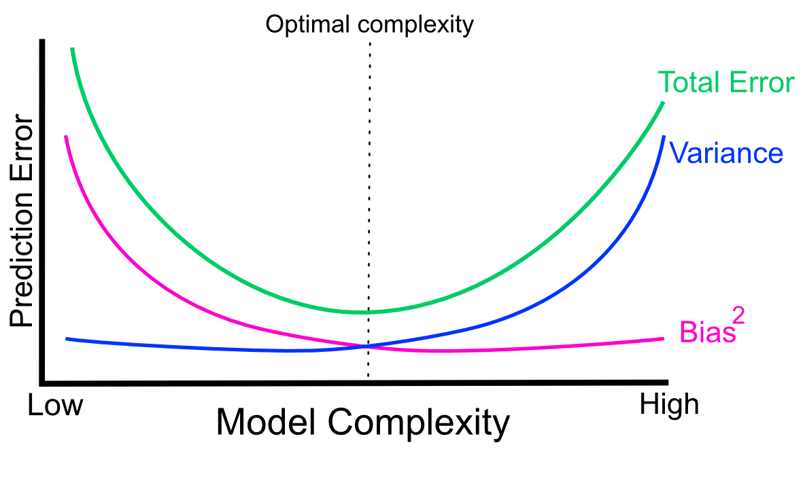
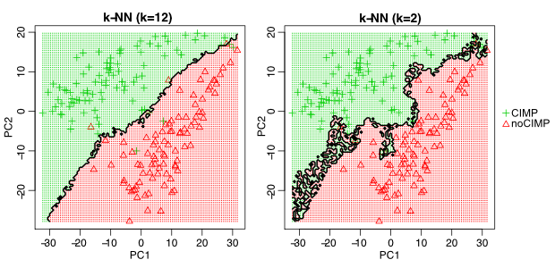
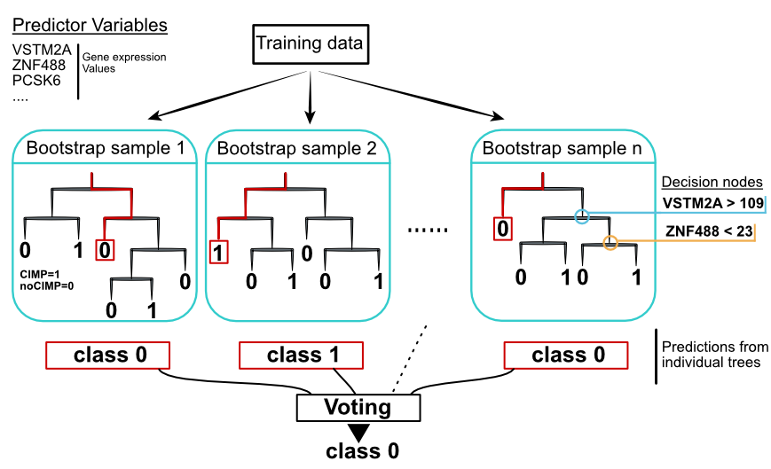
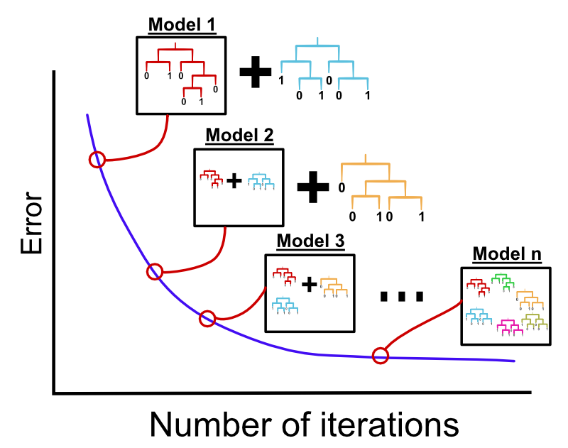
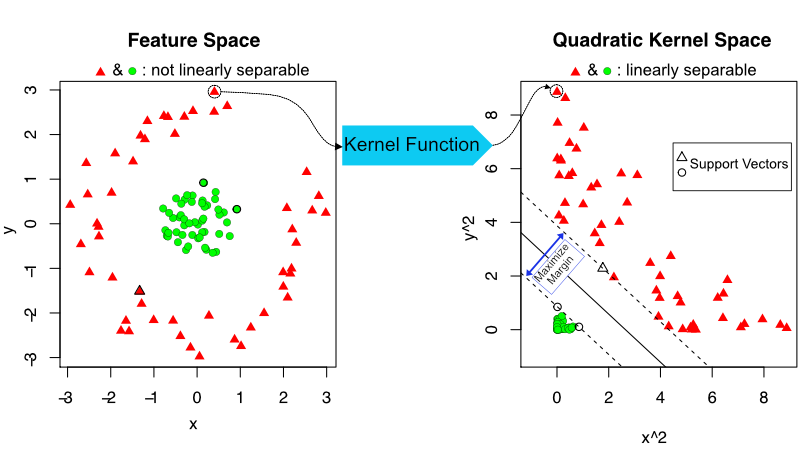
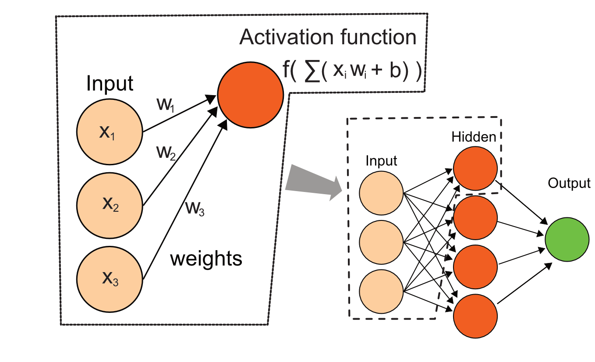

# Predictive Modeling with Supervised Machine Learning {#supervisedLearning} 

```{r setupSML, include=FALSE}
knitr::opts_chunk$set(echo      = TRUE,
                      message   = FALSE, 
                      error     = FALSE,
                      cache     = TRUE,
                      out.width = "55%",
                      fig.width = 5,
                      fig.align = 'center')
```

In this chapter we will introduce supervised machine learning applications for predictive modeling. In genomics, we are often faced with biological questions to answer using lots of data. Some of those questions can easily fit in the domain of machine learning, where algorithms will learn a mathematical model of the input data in order to make decisions about similar data, previously unseen by the model. Often we are trying to predict a medical or biological variable of interest using molecular signatures obtained via genomics methods. To give you a better idea, we listed some of the machine learning applications in genomics:

- Predicting gene expression from epigenetic modifications [@pmid22950368].
- Predicting gene locations [@pmid12364589].
- Predicting enhancer or other regulatory regions [@pmid22328731].
- Predicting drug response based on genomics [@pmid21428770].
- Predicting healthy/disease status or disease subtypes based on genomics [@pmid25750696].
- Predicting the effect of SNPs on gene regulation [@pmid26301843].
- Calling SNPs [@pmid30247488].

Apart from prediction of an outcome, machine learning can be used to understand which predictor variables are the most important for prediction performance. This often gives insights into the biology as well. Many machine learning algorithms have either built-in variable importance assessment or can be wrapped around a model-agnostic variable importance method. For example, we may want to find which epigenetic modifications are most important for gene expression prediction. Although decades of molecular biology gives a pretty good idea for this, we could arrive at similar conclusions by building a machine learning model to predict gene expression using histone modifications H3K27ac, H3K27me, H3K4me1, H3K4me3, and DNA methylation. \index{histone modification} \index{DNA methylation} We can then check which of these are most important for gene expression prediction using variable importance metrics. 

In this chapter, we will show how to use supervised machine learning models to solve problems in genomics. We will go over general steps in machine learning applications. In addition, we will introduce how to use some of the most popular supervised machine learning models in practice. 


## How are machine learning models fit?
We already have quite an insight on how machine learning models are fit. We have previously seen clustering methods, which are unsupervised machine learning models, and we have seen linear regression which is a simple machine learning model if we disregard its objectives for statistical inference.

Machine learning models are optimization methods at their core. They all depend on defining a "cost" or "loss" function to minimize\index{loss function}\index{cost function}. For example, in linear regression the difference between the predicted and the original values are being minimized. When we have a data set with the correct answer such as original values or class labels, this is called supervised learning. We use the structure in the data to predict a value, and optimization methods help us use the right structure or patterns in the data. The supervised machine learning methods use predictor variables such as gene expression values or other genomic scores to build a mathematical function, or a mapping method if you will. This function maps a predictor variable vector or matrix from a given sample to the response variable: labels/classes or numeric values. The response variable is also called the "dependent variable". Then, the predictions are simply output of mathematical functions, $f(X)$. These functions take predictor variables, $X$, as input. The variables in $X$ are also \index{independent variables} called "independent variables", "explanatory variables" or "features". \index{explanatory variables}The functions also have internal parameters that help map $X$ to the predicted values. The optimization works on the parameters of $f(X)$ and tries to minimize the difference between the function output and original response variables ($Y$): $\sum(Y-f(X))^2$. Now, this is just a simplification of the actual "cost" or "loss" function. Especially in classification problems, cost functions can take different forms, but the idea is the same. You have a mathematical expression you can minimize by searching for the optimal parameter values. The core ingredients of a machine learning algorithm are the same and they are listed as follows:

1) Define a prediction function or method $f(X)$.
2) Devise a function (called the loss or cost function) to optimize the difference between your predictions and observed values, such as $\sum (Y-f(X))^2$.
3) Apply mathematical optimization methods to find the best parameter values for $f(X)$ in relation to the cost/loss function.\index{optimization}

Similarly, clustering and dimension reduction techniques can use optimization methods, but they do so without having a correct answer to predict or train with. In this case, they find patterns or structure in the data without trying to estimate a correct answer. These patterns are groupings of samples or variables, such as common gene expression patterns, that can be obtained from dimension reduction techniques such as PCA. In general, dimension reduction algorithms can be thought of as optimization procedures that are trying to minimize $X-WH$. Here, $X$ is our original data set and $WH$ is the product of potentially two lower dimension matrices, $W$ and $H$. In this case, the optimization procedure hopefully gives us the lower-dimensional space so that we can represent our data without losing too much information.


### Machine learning vs. statistics 
Machine learning and statistics are related and sometimes overlapping fields. Statistical inference is the main purpose of statistics. The aim of inference is to find statistical properties of the underlying data and to estimate the uncertainty about those properties. However, while doing so, the field of statistics developed dimension reduction and regression techniques that are the cornerstone of machine learning applications.

Both machine learning and statistics share the same overarching goal, which is learning from the data. 
The difference between the two is that machine learning emphasizes optimization and performance over statistical inference. Statistics is also concerned about performance but would like to calculate the uncertainty associated with parameters of the model. It will try to model the population statistics from the sample data points to assess that uncertainty. Having said that, many machine learning algorithms, including a couple we will introduce below, are developed by scientists who will define themselves as statisticians, and work at statistics departments of universities. 


## Steps in supervised machine learning
There are many methods to use for supervised learning problems. However, there are similar steps that you will need to follow whatever machine learning method you choose to train. These steps are briefly described below and we will get back to these in detail later in the chapter:

- Pre-processing data: We might have to use normalization and data transformation procedures.
- Training and test data split: Decide which strategy you want to use for evaluation purposes. You need to use a test set to evaluate your model later on. 
- Training the model: This is where your choice of supervised learning algorithm becomes relevant. "Training" generally means your data set is used in optimization of the loss function to find parameters for $f(x)$. 
- Estimating performance of the model: This is about which metrics to use to evaluate performance and how to calculate those metrics.
- Model tuning and selection: We try different parameters and select the best model.

Many of these steps are identical for different supervised learning methods. Therefore, we will use the [`caret`](http://topepo.github.io/caret/index.html) package to\index{R Packages!\texttt{caret}} perform these steps, which streamlines the steps and provides a similar interface for different supervised learning methods. There are other similar packages, such as [`mlr`](https://mlr.mlr-org.com/), \index{R Packages!\texttt{mlr}}that can provide similar functionality. For now, we will focus on classification models, which is a subset of supervised learning models. In these types of models, we try to predict a categorical response variable, such as if a patient has the disease or not, or what type of disease the patient has based on predictor variables. 

## Use case: Disease subtype from genomics data
We will start our illustration of machine learning using a real dataset from tumor biopsies. We will use the gene expression data of glioblastoma tumor samples from The Cancer Genome Atlas\index{The Cancer Genome Atlas (TCGA)} project. We will try to predict the subtype of this disease using molecular markers. \index{CpG island}This subtype is characterized by large-scale epigenetic alterations called the "CpG island methylator phenotype" or "CIMP" [@pmid20399149]; half of the patients in our data set have this subtype and the rest do not, and we will try to predict which ones have the CIMP subtype. There are two data objects we need for this exercise, one for gene expression values per tumor sample and the other one is subtype annotation per patient. In the expression data set, every row is a patient and every column is a gene expression value\index{gene expression}. There are 184 tumor samples. This data set might be a bit small for real-world applications, however it is very relevant for the genomics focus of this book and the small datasets take less time to train, which is useful for reproducibility  purposes. We will read these data sets from the **compGenomRData** package now with the `readRDS()` function.
```{r,readMLdata}
# get file paths
fileLGGexp=system.file("extdata",
                      "LGGrnaseq.rds",
                      package="compGenomRData")
fileLGGann=system.file("extdata",
                      "patient2LGGsubtypes.rds",
                      package="compGenomRData")
# gene expression values
gexp=readRDS(fileLGGexp)
head(gexp[,1:5])
dim(gexp)

# patient annotation
patient=readRDS(fileLGGann)
head(patient)
dim(patient)
```

## Data preprocessing
We will have to preprocess the data before we start training. This might include exploratory data analysis to see how variables and samples relate to each other. For example, we might want to check the correlation between predictor variables and keep only one variable from that group. In addition, some training algorithms might be sensitive to data scales or outliers\index{outliers}. We should deal with those issues in this step. In some cases, the data might have missing values. We can choose to remove the samples that have missing values or try to impute them. Many machine learning algorithms will not be able to deal with missing values. 

We will show how to do this in practice using the `caret::preProcess()` function and base R functions. Please note that there are more preprocessing options available than we will show here. There are more possibilities in `caret::preProcess()`function and base R functions, we are just going to cover a few basics in this section.

### Data transformation
The first thing we will do is data normalization and transformation. We have to take care of data scale issues that might come from how the experiments are performed and the potential problems that might occur during data collection. Ideally, each tumor sample has a similar distribution of gene expression values. Systematic differences between tumor samples must be corrected. We check if there are such differences using box plots.
We will only plot the first 50 tumor samples so that the figure is not too
squished. The resulting boxplot is shown in Figure \@ref(fig:boxML).
```{r boxML,out.width='60%',fig.width=5,fig.cap="Boxplots for gene expression values."}
boxplot(gexp[,1:50],outline=FALSE,col="cornflowerblue")

```
It seems there was some normalization done on this data. Gene expression values per sample seem to have the same scale. However, it looks like they have long-tailed distributions, so a log transformation may fix that. These long-tailed distributions have outliers \index{outliers}and this might adversely affect the models. Below, we show the effect of log transformation on the gene expression profile of a patient. We add a pseudo count of 1 to avoid `log(0)`.
The resulting histograms are shown in Figure \@ref(fig:logTransform).
```{r  logTransform,out.width='60%',fig.width=8,fig.cap="Gene expression distribution for the 5th patient (left). Log transformed gene expression distribution for the same patient (right)."}
par(mfrow=c(1,2))
hist(gexp[,5],xlab="gene expression",main="",border="blue4",
     col="cornflowerblue")
hist(log10(gexp+1)[,5], xlab="gene expression log scale",main="",
     border="blue4",col="cornflowerblue")
```
Since taking a log seems to work to tame the extreme values, we do that below and also add $1$ pseudo-count to be able to deal with $0$ values:
```{r takeLog}
gexp=log10(gexp+1)

```
Another thing we can do in combination with this is to winsorize the data, which caps extreme values to the 1st and 99th percentiles or to other user-defined percentiles. But before we go forward, we should transpose our data. In this case, the predictor variables are gene expression values and they should be on the column side. It was OK to leave them on the row side, to check systematic errors with box plots, but machine learning algorithms require that predictor variables are on the column side.
```{r transposeML}
# transpose the data set
tgexp <- t(gexp)

```

### Filtering data and scaling
We can filter predictor variables which have low variation. They are not likely to have any predictive importance since there is not much variation and they will just slow our algorithms. The more variables, the slower the algorithms will be generally. The `caret::preProcess()` function can help filter the predictor variables with near zero variance. 
```{r nzv,eval=FALSE}
library(caret)
# remove near zero variation for the columns where at least
# 85% of the values are the same
# this function creates the filter but doesn't apply it yet
nzv=preProcess(tgexp,method="nzv",uniqueCut = 15)

# apply the filter using "predict" function
# return the filtered dataset and assign it to nzv_tgexp
# variable
nzv_tgexp=predict(nzv,tgexp)
```
In addition, we can also choose arbitrary cutoffs for variability. For example, we can choose to take the top 1000 variable predictors.
```{r, mostVar}
SDs=apply(tgexp,2,sd )
topPreds=order(SDs,decreasing = TRUE)[1:1000]
tgexp=tgexp[,topPreds]
```

We can also center the data, which as we have seen in Chapter 4, is subtracting the mean. Following this, the predictor variables will have zero means. In addition, we can scale the data. When we scale, each value of the predictor
variable is divided by its standard deviation. Therefore predictor variables will have the same standard deviation. These manipulations are generally used to improve the numerical stability of some calculations. In distance-based metrics, it could be beneficial to at least center the data. We will now center the data using the `preProcess()` function. This is more practical than the `scale()` function because when we get a new data point, we can use the `predict()` function and `processCenter` object to process it just like we did for the training samples.
```{r, preCenter}
library(caret)
processCenter=preProcess(tgexp, method = c("center"))
tgexp=predict(processCenter,tgexp)
```

We will next filter the predictor variables that are highly correlated. You may choose not to do this as some methods can handle correlation between predictor variables.\index{collinearity} However, the fewer predictor variables we have, the faster the model fitting can be done.

```{r filterCorr}
# create a filter for removing highly correlated variables
# if two variables are highly correlated only one of them
# is removed
corrFilt=preProcess(tgexp, method = "corr",cutoff = 0.9)
tgexp=predict(corrFilt,tgexp)
```

### Dealing with missing values
In real-life situations, there will be missing values in our data. In genomics, we might not have values for certain genes or genomic locations due to technical problems during experiments. We have to be able to deal with these missing values\index{missing values}. For demonstration purposes, we will now introduce NA values in our data, the "NA" value is normally used to encode missing values in R. We then show how to check and deal with those. One way is to impute them; here, we again use a machine learning algorithm to guess the missing values. Another option is to discard the samples with missing values or discard the predictor variables with missing values. First, we replace one of the values as NA and check if it is there.
```{r,checkNA}
missing_tgexp=tgexp
missing_tgexp[1,1]=NA
anyNA(missing_tgexp) # check if there are NA values
```

Next, we will try to remove that gene from the set. Removing genes or samples both have downsides. You might be removing a predictor variable that could be important for the prediction. Removing samples with missing values will decrease the number of samples in the training set. The code below checks which values are NA in the matrix, then runs a column sum and keeps everything where the column sum is equal to 0. The column sums where there are NA values will be higher than 0 depending on how many NA values there are in a column.
```{r,removeNA, eval=FALSE}

gexpnoNA=missing_tgexp[ , colSums(is.na(missing_tgexp)) == 0]
```

We will next try to impute the missing value(s). Imputation can be as simple as assigning missing values to the mean or median value of the variable, or assigning the mean/median of values from nearest neighbors of the sample having the missing value. We will show both using the `caret::preProcess()` function. First, let us run the median imputation. 
```{r, imputeDataML,eval=TRUE}
library(caret)
mImpute=preProcess(missing_tgexp,method="medianImpute")
imputedGexp=predict(mImpute,missing_tgexp)


```

Another imputation\index{imputation} method that is more precise than the median imputation is to impute the missing values based on the nearest neighbors of the samples. In this case, the algorithm finds samples that are most similar to the sample vector with NA values. Next, the algorithm averages the non-missing values from those neighbors and replaces the missing value with that value.
```{r knnimpute,eval=FALSE}
library(RANN)
knnImpute=preProcess(missing_tgexp,method="knnImpute")
knnimputedGexp=predict(knnImpute,missing_tgexp) 
```


## Splitting the data
At this point we might choose to split the data into the test and the training partitions. The reason for this is that we need an independent test we did not train on. This will become clearer in the following sections, but without having a separate test set, we cannot assess the performance of our model or tune it properly. 

### Holdout test dataset
There are multiple data split strategies. For starters, we will split 30% of the data as the test. This method is the gold standard for testing performance of our model. By doing this, we have a separate data set that the model has never seen. First, we create a single data frame with predictors and response variables.
```{r mergeLabelTrain}
tgexp=merge(patient,tgexp,by="row.names")

# push sample ids back to the row names
rownames(tgexp)=tgexp[,1]
tgexp=tgexp[,-1]
```
Now that the response variable or the class label is merged with our dataset, we can split it into test and training sets with the `caret::createDataPartition()` function. 
```{r datapart}

set.seed(3031) # set the random number seed for reproducibility 

# get indices for 70% of the data set
intrain <- createDataPartition(y = tgexp[,1], p= 0.7)[[1]]

# separate test and training sets
training <- tgexp[intrain,]
testing <- tgexp[-intrain,]

```

### Cross-validation
In some cases, we might have too few data points and it might be too costly to set aside a significant portion of the data set as a holdout test set. In these cases a resampling-based technique such as cross-validation may be useful.\index{cross-validation}

Cross-validation works by splitting the data into randomly sampled $k$ subsets, called k-folds. So, for example, in the case of 5-fold cross-validation with 100 data points, we would create 5 folds, each containing 20 data points. We would then build models and estimate errors 5 times. Each time, four of the groups are combined (resulting in 80 data points) and used to train your model. Then the 5th group of 20 points that was not used to construct the model is used to estimate the test error. In the case of 5-fold cross-validation, we would have 5 error estimates that could be averaged to obtain a more robust estimate of the test error.

An extreme case of k-fold cross-validation, is to equalize the $k$ to the number of data points or in our case, the number of tumor samples. This is called leave-one-out cross-validation (LOOCV). This could be better than k-fold cross-validation but it takes too much time to train that many models if the number of data points is large.

The `caret` package\index{R Packages!\texttt{caret}} has built-in cross-validation functionality for all the machine learning methods and we will be using that in the later sections.

### Bootstrap resampling
Another method to estimate the prediction error is to use bootstrap resampling. This is a general method we have already introduced in Chapter \@ref(stats). It can be used to estimate variability of any statistical parameter. In this case, that parameter is the test error or test accuracy.\index{bootstrap resampling}

The training set is drawn from the original set with replacement (same size as the original set), then we build a model with this bootstrap resampled set. Next, we take the data points that are not selected for the random sample and predict labels for them. These data points are called the "out-of-the-bag (OOB) sample". We repeat this process many times and record the error for the OOB samples. We can take the average of the OOB errors to estimate the real test error. This is a powerful method that is not only used to estimate test error but incorporated into the training part of some machine learning methods such as random forests. Normally, we should repeat the process hundreds or up to a thousand times to get good estimates. However, the limiting factor would be the time it takes to construct and test that many models. Twenty to 30 repetitions might be enough if the time cost of training is too high. Again, the `caret` \index{R Packages!\texttt{caret}} package provides the bootstrap interface for many machine learning models for sampling before training and estimating the error on OOB samples.

## Predicting the subtype with k-nearest neighbors  
One of the easiest things to wrap our heads around when we are trying to predict a label such as disease subtype is to look for similar samples and assign the labels of those similar samples to our sample.

Conceptually, k-nearest neighbors (k-NN) is very similar to\index{k-nearest neighbors (k-NN)} clustering algorithms we have seen earlier. If we have a measure of distance between the samples, we can find the nearest $k$ samples to our new sample and use a voting method to decide on the label of our new sample. 

Let us run the k-NN algorithm with our cancer data. For illustrative purposes, we provide the same data set for training and test data. Providing the training data as the test data shows us the training error or accuracy, which is how the model is doing on the data it is trained with. Below we are running k-NN with the `caret:knn3()` function. The most important argument is `k`, which is the number of nearest neighbors to consider. In this case, we set it to 5. We will later discuss how to find the best `k`.
```{r knn}

library(caret)
knnFit=knn3(x=training[,-1], # training set
            y=training[,1], # training set class labels
            k=5)
# predictions on the test set
trainPred=predict(knnFit,training[,-1])

```

## Assessing the performance of our model
We have to define some metrics to see if our model worked. The algorithm is trying to reduce the classification error, or in other words it is trying to increase the training accuracy. For the assessment of performance, there are other different metrics to consider. All the metrics for 2-class classification depend on the table below, which shows the number of true positives (TP), false positives (FP), true negatives (TN) and false negatives (FN), similar to a table we used in the hypothesis testing section in the statistics chapter previously.

-------------------------------------------------------------
                 Actual CIMP          Actual noCIMP
--------------- -------------------- -------------------- 
Predicted as    True Positives (TP)  False Positive (FP)   
CIMP                                

Predicted as
noCIMP           False Positives (FN) True negatives (TN)  

-------------------------------------------------------------

Accuracy is the first metric to look at. This metric is simply 
$(TP+TN)/(TP+TN+FP+FN)$ and shows the proportion of times we were right. There are other accuracy metrics that are important and output by `caret` functions. We will go over some of them here.\index{accuracy} 

Precision, $TP/(TP+FP)$, is about the confidence we have on our CIMP calls. If our method is very precise, we will have low false positives. That means every time we call a CIMP event, we would be relatively certain it is not a false positive.\index{precision}

Sensitivity, $TP/(TP+FN)$,  is how often we miss CIMP cases and call them as noCIMP. Making fewer mistakes in noCIMP cases will increase our sensitivity. You can think of sensitivity also in a sick/healthy context. A highly sensitive method will be good at classifying sick people when they are indeed sick.\index{sensitivity}

Specificity, $TN/(TN+FP)$, is about how sure we are when we call something noCIMP. If our method is not very specific, we would call many patients CIMP, while in fact, they did not have the subtype. In the sick/healthy context, a highly specific method will be good at not calling healthy people sick.\index{specificity}

An alternative to accuracy we showed earlier is "balanced accuracy". Accuracy does not perform well when classes have very different numbers of samples (class imbalance). For example, if you have 90 CIMP cases and 10 noCIMP cases, classifying all the samples as CIMP gives 0.9 accuracy score by default. Using the "balanced accuracy" metric can help in such situations. This is simply $(Precision+Sensitivity)/2$. In this case above with the class imbalance scenario, the "balanced accuracy" would be 0.5. Another metric that takes into account accuracy that could be generated by chance is the "Kappa statistic" or "Cohen's Kappa". This metric includes expected accuracy, which is affected by class imbalance in the training set and provides a metric corrected by that.

In the k-NN example above, we trained and tested on the same data. The model returned the predicted labels for our training. We can calculate the accuracy metrics using the `caret::confusionMatrix()` function. This is sometimes called training accuracy. If you take $1-accuracy$, it will be the "training error". 
```{r knnConfusionMatrix}

# get k-NN prediction on the training data itself, with k=5
knnFit=knn3(x=training[,-1], # training set
            y=training[,1], # training set class labels
            k=5)

# predictions on the training set
trainPred=predict(knnFit,training[,-1],type="class")

# compare the predicted labels to real labels
# get different performance metrics
confusionMatrix(data=training[,1],reference=trainPred)

```

Now, let us see what our test set accuracy looks like again using the `knn` function and the `confusionMatrix()` function on the predicted and real classes.
```{r testError}

# predictions on the test set, return class labels
testPred=predict(knnFit,testing[,-1],type="class")

# compare the predicted labels to real labels
# get different performance metrics
confusionMatrix(data=testing[,1],reference=testPred)

```
Test set accuracy is not as good as the training accuracy, which is usually the case. That is why the best way to evaluate performance is to use test data that is not used by the model for training. That gives you an idea about real-world performance where the model will be used to predict data that is not previously seen.


### Receiver Operating Characteristic (ROC) curves
One important and popular metric when evaluating performance is looking at receiver operating characteristic (ROC) curves.\index{receiver operating characteristic (ROC) curve} The ROC curve is created by evaluating the class probabilities for the model across a continuum of thresholds. Typically, in the case of two-class classification, the methods return a probability for one of the classes. If that probability is higher than $0.5$, you call the label, for example, class A. If less than $0.5$, we call the label class B. However, we can move that threshold and change what we call class A or B. For each candidate threshold, the resulting sensitivity and 1-specificity are plotted against each other. The best possible prediction would result in a point in the upper left corner, representing 100% sensitivity (no false negatives) and 100% specificity (no false positives). For the best model, the curve will be almost like a square. Since this is important information, the area under the curve (AUC) is \index{area under the curve (AUC)}calculated. This is a quantity between 0 and 1, and the closer to 1, the better the performance of your classifier in terms of sensitivity and specificity. For an uninformative classification model, AUC will be $0.5$. Although ROC curves are initially designed for two-class problems, later extensions made it possible to use ROC curves for multi-class problems.

ROC curves can also be used to determine alternate cutoffs for class probabilities for two-class problems. However, this will always result in a trade-off between sensitivity and specificity. Sometimes it might be desirable to limit the number of false positives because making such mistakes would be too costly for the individual cases. For example, if predicted with a certain disease, you might be recommended to have surgery. However, if your classifier has a relatively high false positive rate, low specificity, you might have surgery for no reason. Typically, you want your classification model to have high specificity and sensitivity, which may not always be possible in the real world. You might have to choose what is more important for a specific problem and try to increase that.

Next, we will show how to use ROC curves for our k-NN application\index{k-nearest neighbors (k-NN)}. The method requires classification probabilities in the format where 0 probability denotes class "noCIMP" and probability 1 denotes class "CIMP". This way the ROC curve can be drawn by varying the probability cutoff for calling class a "noCIMP" or "CIMP". Below we are getting a similar probability from k-NN, but we have to transform it to the format we described above. Then, we feed those class probabilities to the `pROC::roc()` function to calculate the ROC curve and the area-under-the-curve. The resulting ROC curve is shown in Figure \@ref(fig:ROC).
```{r ROC,message=FALSE,warning=FALSE,out.width='60%',fig.width=5,fig.cap="ROC curve for k-NN."}
library(pROC)

# get k-NN class probabilities
# prediction probabilities on the test set
testProbs=predict(knnFit,testing[,-1])

# get the roc curve
rocCurve <- pROC::roc(response = testing[,1],
                predictor = testProbs[,1],
              ## This function assumes that the second
              ## class is the class of interest, so we
              ## reverse the labels.
              levels = rev(levels(testing[,1])))
# plot the curve
plot(rocCurve, legacy.axes = TRUE)

# return area under the curve
pROC::auc(rocCurve)

```

## Model tuning and avoiding overfitting
How can we know that we picked the best $k$? One straightforward way is that we can try many different $k$ values and check the accuracy of our model. We will first check the effect of different $k$ values on training accuracy. Below, we will go through many $k$ values and calculate the training accuracy for each.
```{r trainingErrork,out.width='60%',fig.width=5, fig.cap="Training error for k-NN classification of glioma tumor samples."}
set.seed(101)
k=1:12 # set k values
trainErr=c() # set vector for training errors
for( i in k){
  
  knnFit=knn3(x=training[,-1], # training set
              y=training[,1], # training set class labels
              k=i)

  # predictions on the training set
  class.res=predict(knnFit,training[,-1],type="class")

  # training error
  err=1-confusionMatrix(training[,1],class.res)$overall[1]
  trainErr[i]=err
}

# plot training error vs k
plot(k,trainErr,type="p",col="#CC0000",pch=20)

# add a smooth line for the trend
lines(loess.smooth(x=k, trainErr,degree=2),col="#CC0000")
```

The resulting training error plot is shown in Figure \@ref(fig:trainingErrork). We can see the effect of $k$ in the training error; as $k$ increases the model tends to be a bit worse on training. This makes sense because with large $k$ we take into account more and more neighbors, and at some point we start considering data points from the other classes as well and that decreases our accuracy.

However, looking at the training accuracy is not the right way to test the model as we have mentioned. The models are generally tested on the datasets that are not used when building model. There are different strategies to do this. We have already split part of our dataset as test set, so let us see how we do it on the test data using the code below. The resulting plot is shown in Figure \@ref(fig:testTrainErr).
```{r testTrainErr,out.width='60%',fig.width=5, fig.cap="Training and test error for k-NN classification of glioma tumor samples."}

set.seed(31)
k=1:12
testErr=c()
for( i in k){

  knnFit=knn3(x=training[,-1], # training set
              y=training[,1], # training set class labels
              k=i)

  # predictions on the training set
  class.res=predict(knnFit,testing[,-1],type="class")
  testErr[i]=1-confusionMatrix(testing[,1],
                                 class.res)$overall[1]
 
}

# plot training error
plot(k,trainErr,type="p",col="#CC0000",
     ylim=c(0.000,0.08),
     ylab="prediction error (1-accuracy)",pch=19)
# add a smooth line for the trend
lines(loess.smooth(x=k, trainErr,degree=2), col="#CC0000")

# plot test error
points(k,testErr,col="#00CC66",pch=19) 
lines(loess.smooth(x=k,testErr,degree=2), col="#00CC66")
# add legend
legend("bottomright",fill=c("#CC0000","#00CC66"),
       legend=c("training","test"),bty="n")


```


The test data show a different thing, of course. It is not the best strategy to increase the $k$ indefinitely. The test error rate increases after a while. Increasing $k$ results in too many data points influencing the decision about the class of the new sample, this may not be desirable since this strategy might include points from other classes eventually. On the other hand, if we set $k$ too low, we are restricting the model to only look for a few neighbors. 

In addition, $k$ values that give the best performance for the training set are not the best $k$ for the test set. In fact, if we stick with $k=1$ as the best $k$ obtained from the training set, we would obtain a worse performance on the test set. In this case, we can talk about the concept of overfitting. This happens when our models fit the data in the training set extremely well but cannot perform well in the test data; in other words, they cannot generalize. Similarly, underfitting could occur when our models do not learn well from the training data and they are overly simplistic. Ideally, we should use methods that help us estimate the real test error when tuning the models such as cross-validation, bootstrap or holdout test set. 


### Model complexity and bias variance trade-off 
The case of over- and underfitting is closely related to the model complexity and the related bias-variance trade-off.\index{overfitting}  We will introduce these concepts now. First, let us point out that prediction error depends on the real value of the class label of the test case and predicted value. The test case label or value is not dependent on the prediction; the only thing that is variable here is the model. Therefore, if we could train multiple models with different data sets for the same problem, our predictions for the test set would vary. That means our prediction error would also vary. Now, with this setting we can talk about expected prediction error for a given machine learning model. This is the average error you would get for a test set if you were able to train multiple models. This expected prediction error can largely be decomposed into the variability of the predictions due to the model variability (variance) and the difference between the expected prediction values and the correct value of the response (bias). Formally, the expected prediction error, $E[Error]$ is decomposed as follows: 

$$
 E[Error]=Bias^2 + Variance + \sigma_e^2
$$
Note that in the above equation $\sigma_e^2$ is the irreducible error. This is the noise term that cannot fundamentally be accounted for by any model. The bias is formally the difference between the expected prediction value and the correct response value, $Y$: $Bias=(Y-E[PredictedValue])$. The variance is simply the variability of the prediction values when we construct models multiple times with different training sets for the same problem: $Variance=E[(PredictedValue-E[PredictedValue])^2]$. Note that this value of the variance does not depend of the correct value of the test cases.

The models that have high variance are generally more complex models that have many knobs or parameters than can fit the training data well. These models, due to their flexibility, can fit training data too much that it creates poor prediction performance in a new data set. On the other hand, simple, less complex models do not have the flexibility to fit every data set that well, so they can avoid overfitting. However, they can underfit if they are not flexible enough to model or at least approximate the true relationship between predictors and the response variable. The bias term is mostly about the general model performance (expected or average value of predictions) that can be attributed to approximating a real-life problem with simpler models. These simple models can have less variability in their predictions, so the prediction error will be mostly composed of the bias term. 

In reality, there is always a trade-off between bias and variance (See Figure \@ref(fig:varBias)). Increasing the variance with complex models will decrease the bias, but that might overfit. Conversely, simple models will increase the bias at the expense of the model variance, and that might underfit. There is an optimal point for model complexity, a balance between overfitting and underfitting.\index{overfitting} \index{underfitting} In practice, there is no analytical way to find this optimal complexity. Instead we must use an accurate measure of prediction error and explore different levels of model complexity and choose the complexity level that minimizes the overall error. Another approach to this is to use "the one standard error rule". Instead of choosing the parameter that minimizes the error estimate, we can choose the simplest model whose error estimate is within one standard error of the best model (see Chapter 7 of [@friedman2001elements]). The rationale behind that is to choose a simple model with the hope that it would perform better in the unseen data since its performance is not different from the best model in a statistically significant way. You might see the option to choose the "one-standard-error" model in some machine learning packages.

```{r,varBias,fig.cap="Variance-bias trade-off visualized as components of total prediction error in relation to model complexity.",fig.align = 'center',out.width='80%',echo=FALSE}

```

In our k-NN example\index{k-nearest neighbors (k-NN)}, lower $k$ values create a more flexible model. This might be counterintuitive, but as we have explained before having small $k$ values will fit the data in a very data-specific manner. It will probably not generalize well. Therefore in this respect, lower $k$ values will result in more complex models with high variance\index{model complexity}. On the other hand, higher $k$ values will result in less variance but higher bias. Figure \@ref(fig:kNNboundary) shows the decision boundary for two different k-NN models with $k=2$ and $k=12$. To be able to plot this in 2D we ran the model on principal component 1 and 2 of the training data set, and predicted the class label of many points in this 2D space. As you can see, $k=2$ creates a more variable model which tries aggressively to include all training samples in the correct class. This creates a high-variance model because the model could change drastically from dataset to dataset. On the other hand, setting $k=12$ creates a model with a smoother decision boundary. This model will have less variance since it considers many points for a decision, and therefore the decision boundary is smoother. 


```{r,kNNboundary,fig.cap="Decision boundary for different k values in k-NN models. k=12 creates a smooth decision boundary and ignores certain data points on either side of the boundary. k=2 is less smooth and more variable.",fig.align = 'center',out.width='70%',echo=FALSE}

```

### Data split strategies for model tuning and testing
The data split strategy is essential for accurate prediction of the test error. As we have seen in the model complexity/bias-variance discussion\index{model complexity}, estimating the prediction error is central for model tuning in order to find the model with the right complexity. Therefore, we will revisit this and show how to build and test models, and measure their prediction error in practice. 

#### Training-validation-test
This data split strategy creates three partitions of the dataset, training, validation, and test sets. In this strategy, the training set is used to train the data and the validation set is used to tune the model to the best possible model. The final partition, "test", is only used for the final test and should not be used to tune the model. This is regarded as the real-world prediction error for your model. This strategy works when you have a lot of data to do a three-way split. The test set we used above is most likely too small to measure the prediction error with just using a test set. In such cases, bootstrap or cross-validation should yield more stable results. 

#### Cross-validation 
A more realistic approach when you do not have a lot of data to do the three-way split is cross-validation. You can use\index{cross-validation} cross-validation in the model-tuning phase as well, instead of going with a single train-validation split. As with the three-way split, the final prediction error could be estimated with the test set. In other words, we can separate 80% of the data for model building with cross-validation, and the final model performance will be measured on the test set.

We have already split our glioma dataset into training and test sets. Now, we will show how to run a k-NN \index{k-nearest neighbors (k-NN)}model with cross-validation using the `caret::train()` function. This function will use cross-validation to train models for different $k$ values. Every $k$ value will be trained and tested with cross-validation to estimate prediction performance for each $k$. We will then plot the cross-validation error and the resulting plot is shown in Figure \@ref(fig:kknCv).
```{r, kknCv,eval=TRUE,out.width='60%',fig.width=5,fig.cap="Cross-validated estimate of prediction error of k in k-NN models."}
set.seed(17)
# this method controls everything about training
# we will just set up 10-fold cross validation
trctrl <- trainControl(method = "cv",number=10)

# we will now train k-NN model
knn_fit <- train(subtype~., data = training, 
                 method = "knn",
                 trControl=trctrl,
                 tuneGrid = data.frame(k=1:12))

# best k value by cross-validation accuracy
knn_fit$bestTune

# plot k vs prediction error
plot(x=1:12,1-knn_fit$results[,2],pch=19,
     ylab="prediction error",xlab="k")
lines(loess.smooth(x=1:12,1-knn_fit$results[,2],degree=2),
      col="#CC0000")

```
Based on Figure \@ref(fig:kknCv) the cross-validation accuracy reveals that $k=5$ is the best $k$ value. On the other hand, we can also try bootstrap resampling and check the prediction error that way. We will again use the `caret::trainControl()` function to do the bootstrap sampling and estimate OOB-based error. However, for a small number of samples like we have in our example, the difference between the estimated and the true value of the prediction error can be large. Below we show how to use bootstrapping for the k-NN model.
```{r knnboot,eval=FALSE,out.width='60%',fig.width=5,fig.cap="bootstrap estimate of Prediction error of k in k-NN models"}
set.seed(17)
# this method controls everything about training
# we will just set up 100 bootstrap samples and for each 
# bootstrap OOB samples to test the error
trctrl <- trainControl(method = "boot",number=20,
                       returnResamp="all")

# we will now train k-NN model
knn_fit <- train(subtype~., data = training, 
                 method = "knn",
                 trControl=trctrl,
                 tuneGrid = data.frame(k=1:12))

```


## Variable importance
Another important purpose of machine learning models could be to learn which variables are more important for the prediction. This information could lead to potential biological insights or could help design better data collection methods or experiments.\index{variable importance}

Variable importance metrics can be separated into two groups: those that are model dependent and those that are not. Many machine-learning methods come with built-in variable importance measures. These may be able to incorporate the correlation structure between the predictors into the importance calculation. Model-independent methods are not able to use any internal model data. We will go over some model-independent strategies below. The model-dependent importance measures will be mentioned when we introduce machine learning methods that have built-in variable importance measures.

One simple method for variable importance is to correlate or apply statistical tests to test the association of the predictor variable with the response variable. Variables can be ranked based on the strength of those associations. For classification problems, ROC curves can be computed by thresholding the predictor variable, and for each variable an AUC can be computed. The variables can be ranked based on these values. However, these methods completely ignore how variables would behave in the presence of other variables. The `caret::filterVarImp()` function implements some of these strategies.

If a variable is important for prediction, removing that variable before model training will cause a drop in performance. With this understanding, we can remove the variables one by one and train models without them and rank them by the loss of performance. The most important variables must cause the largest loss of performance. This strategy requires training and testing models as many times as the number of predictor variables. This will consume a lot of time. A related but more practical approach has been put forward to measure variable importance in a model-independent manner but without re-training [@dalex; @mcr]. In this case, instead of removing the variables at training, variables are permuted at the test phase. The loss in prediction performance is calculated by comparing the labels/values from the original response variable to the labels/values obtained by running the permuted test data through the model. This is called "variable dropout loss". In this case, we are not really dropping out variables, but by permuting them, we destroy their relationship to the response variable. The dropout loss is compared to the "worst case" scenario where the response variable is permuted and compared against the original response variables, which is called "baseline loss". The algorithm ranks the variables by their variable dropout loss or by their ratio of variable dropout to baseline loss. Both quantities are proportional but the second one contains information about the baseline loss.
\index{variable importance}
Below, we run the `DALEX::explain()` function to do the permutation drop-out strategy for the variables. The function needs the machine learning model, and new data and its labels to do the permutation-based dropout strategy. In this case, we are feeding the function with the data we used for training. 
For visualization we can use the `DALEX::feature_importance()` function which plots the loss. Although, in this case we are not plotting the results. In the following sections, we will discuss method-specific variable importance measures.
```{r dalex,eval=FALSE,out.width='50%',fig.cap="Variable importance as loss from variable drop out."}
library(DALEX)
set.seed(102)
# do permutation drop-out
explainer_knn<- DALEX::explain(knn_fit, 
                               label="knn", 
                               data =training[,-1], 
                               y = as.numeric(training[,1]))

viknn=feature_importance(explainer_knn,n_sample=50,type="difference")
plot(viknn)

```

Although the variable drop-out strategy will still be slow if you have a lot of variables, the upside is that you can use any black-box model as long as you have access to the model to run new predictions. Later sections in this chapter will show methods with built-in variable importance metrics, since these are calculated during training it comes with less of an additional compute cost.

## How to deal with class imbalance 
A common hurdle in many applications of machine learning on genomic data is the large class imbalance. The imbalance refers to relative difference in the sizes of the groups being classified. For example, if we had class imbalance in our example data set we could have much more CIMP samples in the training than noCIMP samples, or the other way around. Another example with severe class imbalance would be enhancer prediction [@enhancerImbalance]. Depending on which training data set you use, you can have a couple of hundred to thousands of positive examples for enhancer locations in the human genome. In either case, the negative set, "not enhancer", will overwhelm the training, because the human genome is 3 billion base-pairs long and most of that does not overlap with an enhancer annotation. In whatever strategy you pick to build a negative set, it will contain many more data points than the positive set. As we have mentioned in the model performance section above, if we have a severe imbalance in the class sizes, the training algorithm may get better accuracy just by calling everything one class. This will be evident in specificity and sensitivity metrics, and the related balanced accuracy metric. Below, we will discuss a couple of techniques that might help when the training set has class imbalance. 

### Sampling for class balance
If we think class imbalance is a problem based on looking at the relative sizes of the classes and relevant accuracy metrics of a model, there are a couple of things that might help. First, we can try sampling or "stratified" sampling when we are constructing our training set. This simply means that before training we can build the classification model with samples of the data so we have the same size classes. This could be down-sampling the classes with too many data points. For this purpose, you can simply use the `sample()` or `caret::downSample()` function and create your training set prior to modeling. In addition, the minority class could be up-sampled for the missing number of data points using sampling with replacement similar to bootstrap sampling with the `caret::upSample()` function. There are more advanced up-sampling methods such as the synthetic up-sampling method SMOTE [@smote]. In this method, each data point from the minority class is up-sampled synthetically by adding variability to the predictor variable vector from one of the k-nearest neighbors of the data point. Specifically, one neighbor is randomly chosen and the difference between predictor variables of the neighbor and the original data point is added to the original predictor variables after multiplying the difference values with a random number between $0$ and $1$. This creates synthetic data points that are similar to original data points but not identical. This method and other similar methods of synthetic sampling are available at [`smotefamily`](https://cran.r-project.org/web/packages/smotefamily/index.html) package \index{R Packages!\texttt{smotefamily}} in CRAN.

In addition to the strategies above, some methods can do sampling during training to cope with the effects of class imbalance. For example, random forests has a sampling step during training, and this step can be altered to do stratified sampling. We will be introducing random forests later in the chapter. 

However, even if we are doing the sampling on the training set to avoid problems, the test set proportions should have original class label proportions to evaluate the performance in a real-world situation. 


### Altering case weights
For some methods, we can use different case weights proportional to the imbalance suffered by the minority class. This means cases from the minority class will have higher case weights, which causes an effect as if we are up-sampling the minority class. Logistic regression-based methods and boosting methods are examples of algorithms that can utilize case weights, both of which will be introduced later.

### Selecting different classification score cutoffs
Another simple approach for dealing with class imbalance is to select a prediction score cutoff that minimizes the excess true positives or false positives depending on the direction of the class imbalance. This can simply be done using ROC curves. For example, the classical prediction cutoff for a  2-class classification problems is 0.5. We can alter this cutoff to optimize sensitivity and specificity. 


## Dealing with correlated predictors 
Highly correlated predictors can lead to collinearity issues and this can greatly increase the model variance, especially in the context of regression. In some cases, there could be relationships between multiple predictor variables and this is called multicollinearity. Having correlated variables will result in unnecessarily complex models with more than necessary predictor variables. From a data collection point of view, spending time and money for collecting correlated variables could be a waste of effort. In terms of linear regression or the models that are based on regression, the collinearity problem is more severe because it creates unstable models where statistical inference becomes difficult or unreliable. On the other hand, correlation between variables may not be a problem for the predictive performance if the correlation structure in the training and the future tests data sets are the same. However, more often, correlated structures within the training set might lead to overfitting.

Here are couple of things to do if collinearity \index{collinearity} is a problem:

- We can do PCA on the training data, which creates new variables removing the collinearity between them. We can then train models on these new dimensions. The downside is that it is harder to interpret these variables. They are now linear combinations of original variables. The variable importance would be harder to interpret.

- As we have already shown in the data preprocessing section, we can try variable filtering and reduce the number of correlated variables. However, this may not address the multicollinearity issue where linear combinations of variables might be correlated while they are not directly correlated themselves.

- Method-specific techniques such as regularization \index{regularization}can decrease the effects of collinearity. Regularization, as we will see in the later chapter, is a technique that is used to prevent overfitting and it can also dampen the effects of collinearity. In addition, decision-tree-based methods could suffer less from the effects of collinearity. 


## Trees and forests: Random forests in action

### Decision trees
Decision trees are a popular method for various machine learning tasks mostly because their interpretability is very high. A decision tree is a series of filters on the predictor variables. The series of filters end up in a class prediction. Each filter is a binary yes/no question, which creates bifurcations in the series of filters thus leading to a treelike structure. The filters are dependent on the type of predictor variables. If the variables are categorical, such as gender, then the filters could be "is gender female" type of questions. If the variables are continuous, such as gene expression, the filter could be "is PIGX expression larger than 210?". Every point where we filter samples based on these questions are called "decision nodes". The tree-fitting algorithm finds the best variables at decision nodes depending on how well they split the samples into classes after the application of the decision node. Decision trees handle both categorical and numeric predictor variables, they are easy to interpret, and they can deal with missing variables. Despite their advantages, decision trees tend to overfit if they are grown very deep and can learn irregular patterns.
\index{decision tree}
There are many variants of tree-based machine learning algorithms. However, most algorithms construct decision nodes in a top down manner. They select the best variables to use in decision nodes based on how homogeneous the sample sets are after the split. One measure of homogeneity is "Gini impurity". This measure is calculated for each subset after the split and later summed up as a weighted average. For a decision node that splits the data perfectly in a two-class problem, the gini impurity will be $0$, and for a node that splits the data into a subset that has 50% class A and 50% class B the impurity will be $0.5$. Formally, the gini impurity, ${I}_{G}(p)$, of a set of samples with known class labels for $K$ classes is the following, where $p_{i}$ is the probability of observing class $i$ in the subset:

$$
{\displaystyle {I}_{G}(p)=\sum _{i=1}^{K}p_{i}(1-p_{i})=\sum _{i=1}^{K}p_{i}-\sum _{i=1}^{K}{p_{i}}^{2}=1-\sum _{i=1}^{K}{p_{i}}^{2}}
$$


For example, if a subset of data after split has 75% class A and 25% class B for that subset, the impurity would be $1-(0.75^2+0.25^2)=0.375$. If the other subset had 5% class A and 95% class B, its impurity would be $1-(0.95^2+0.05^2)=0.095$. If the subset sizes after the split were equal, total weighted impurity would be $0.5*0.375+0.5*0.095= 0.235$. These calculations will be done for each potential variable and the split, and every node will be constructed based on gini impurity decrease. If the variable is continuous, the cutoff value will be decided based on the best impurity. For example, gene expression values will have splits such as "PIGX expression < 2.1". Here $2.1$ is the cutoff value that produces the best impurity. There are other homogeneity measures, however gini impurity is the one that is used for random forests, which we will introduce next.


### Trees to forests
Random forests are devised to counter the shortcomings of decision trees. They are simply ensembles of decision trees. Each tree is trained with a different randomly selected part of the data with randomly selected predictor variables. The goal of introducing randomness is to reduce the variance of the model so it does not overfit, at the expense of a small increase in the bias and some loss of interpretability. This strategy generally boosts the performance of the final model.\index{random forest}

The random forests algorithm tries to decorrelate the trees so that they learn different things about the data. It does this by selecting a random subset of variables. If one or a few predictor variables are very strong predictors for the response variable, these features will be selected in many of the trees, causing them to become correlated. Random subsampling of predictor variables ensures that not always the best predictors overall are selected for every tree and, the model does
have a chance to learn other features of the data.

Another sampling method introduced when building random forest models is bootstrap resampling before constructing each tree. This brings the advantage of out-of-the-bag (OOB) error prediction. In this case, the prediction error can be estimated for training samples that were OOB, meaning they were not used in the training, for some percentage of the trees. The prediction error for each sample can be estimated from the trees where that sample was OOB. OOB estimates claimed to be a good alternative to cross-validation estimated errors [@breiman2001random].

```{r,RFcartoon,fig.cap="Random forest concept. Individual decision trees are built with sampling strategies. Votes from each tree define the final class.",fig.align = 'center',out.width='70%',echo=FALSE}

```


For demonstration purposes, we will use the `caret` \index{R Packages!\texttt{caret}}package interface to the `ranger` random forest package\index{R Packages!\texttt{ranger}}. This is a fast implementation of the original random forest algorithm. For random forests, we have two critical arguments. One of the most critical arguments for random forest is the number of predictor variables to sample in each split of the tree. This parameter controls the independence between the trees, and as explained before, this limits overfitting. Below, we are going to fit a random forest model to our tumor subtype problem. We will set `mtry=100` and not perform the training procedure to find the best `mtry` value for simplicity. However, it is good practice
to run the model with cross-validation and let it pick the best parameters based on the cross-validation performance. It defaults to the square root of number of predictor variables. Another variable we can tune is the minimum node size of terminal nodes in the trees (`min.node.size`). This controls the depth of the trees grown. Setting this to larger numbers might cost a small loss in accuracy but the algorithm will run faster.
```{r,RFex,fig.cap="description",fig.align = 'center',out.width='70%'}
set.seed(17)

# we will do no resampling based prediction error
# although it is advised to do so even for random forests
trctrl <- trainControl(method = "none")

# we will now train random forest model
rfFit <- train(subtype~., 
               data = training, 
               method = "ranger",
               trControl=trctrl,
               importance="permutation", # calculate importance
               tuneGrid = data.frame(mtry=100,
                                     min.node.size = 1,
                                     splitrule="gini")
               )
# print OOB error
rfFit$finalModel$prediction.error
```

### Variable importance
Random forests come with built-in variable importance metrics. One of the metrics is similar to the "variable dropout metric" where the predictor variables are permuted. In this case, OOB samples are used and the variables are permuted one at a time. Every time, the samples with the permuted variables are fed to the network and the decrease in accuracy is measured. Using this quantity, the variables can be ranked. \index{variable importance}

A less costly method with similar performance is to use gini impurity. Every time a variable is used in a tree to make a split, the gini impurity is less than the parent node. This method adds up these gini impurity decreases for each individual variable across the trees and divides it by the number of the trees in the forest. This metric is often consistent with the permutation importance measure [@breiman2001random]. Below, we are going to plot the permutation-based importance metric. This metric has been calculated during the run of the model above. We will use the `caret::varImp()` function to access the importance values and plot them using the `plot()` function; the result is shown in Figure \@ref(fig:RFvarImp). 

```{r,RFvarImp,fig.cap="Top 10 important variables based on permutation-based method for the random forest classification.",fig.align = 'center',out.width='50%'}
plot(varImp(rfFit),top=10)
```


## Logistic regression and regularization
Logistic regression \index{logistic regression} is a statistical method that is used to model a binary response variable based on predictor variables. Although initially devised for two-class or binary response problems, this method can be generalized to multiclass problems. However, our example tumor sample data is a binary response or two-class problem, therefore we will not go into the  multiclass case in this chapter.

Logistic regression is very similar to linear regression as a concept and it can be thought of as a "maximum likelihood estimation" problem where we are trying to find statistical parameters that maximize the likelihood of the observed data being sampled from the statistical distribution of interest. This is also very related to the general cost/loss function approach we see in supervised machine learning algorithms. In the case of binary response variables, the simple linear regression model, such as $y_i \sim \beta _{0}+\beta _{1}x_i$, would be a poor choice because it can easily generate values outside of the $0$ to $1$ boundary. What we need is a
model that restricts the lower bound of the prediction to zero and an upper
bound to $1$. The first thing towards this requirement is to formulate the problem differently. If $y_i$ can only be $0$ or $1$, we can formulate $y_i$ as a realization of a random variable that can take the values one and zero with probabilities $p_i$ and $1-{p_i}$, respectively. This random variable follows the Bernoulli distribution, and instead of predicting the binary variable we can formulate the problem as $p_i \sim \beta _{0}+\beta _{1}x_i$. However, our initial problem still stands, simple linear regression will still result in values that are beyond $0$ and $1$ boundaries. A model that satisfies the boundary requirement is the logistic equation shown below.

$$
{\displaystyle p_i={\frac {e^{(\beta _{0}+\beta _{1}x_i)}}{1+e^{(\beta _{0}+\beta_{1}x_i)}}}}
$$

This equation can be linearized by the following transformation

$$
{\displaystyle \operatorname{logit} (p_i)=\ln \left({\frac {p_i}{1-p_i}}\right)=\beta _{0}+\beta _{1}x_i}
$$
The left-hand side is termed the logit, which stands for “logistic unit". It is also known as the log odds. In this case, our model will produce values on the log scale and with the logistic equation above, we can transform the values to the $0-1$ range. Now, the question remains: "What are the best parameter estimates for our training set". Within the maximum likelihood framework\index{maximum likelihood estimation} we have touched upon in Chapter \@ref(stats), the best parameter estimates are the ones that maximize the likelihood of the statistical model actually producing the observed data. You can think of this fitting as a probability distribution to an observed data set. The parameters of the probability distribution should maximize the likelihood that the observed data came from the distribution in question. If we were using a Gaussian distribution we would change the mean and variance parameters until the observed data was more plausible to be drawn from that specific Gaussian distribution. 

In logistic regression, \index{logistic regression}the response variable is modeled with a binomial distribution or its special case Bernoulli distribution. The value of each response variable, $y_i$, is 0 or 1, and we need to figure out parameter $p_i$ values that could generate such a distribution of 0s and 1s. If we can find the best $p_i$ values for each tumor sample $i$, we would be maximizing the log-likelihood function of the model over the observed data. The maximum log-likelihood function for our binary response variable case is shown as Equation \@ref(eq:logLik). 

\begin{equation}
 \operatorname{\ln} (L)=\sum_{i=1}^N\bigg[{\ln(1-p_i)+y_i\ln \left({\frac {p_i}{1-p_i}}\right)\bigg]}
 (\#eq:logLik)
\end{equation}

In order to maximize this equation we have to find optimum $p_i$ values which are dependent on parameters $\beta_0$ and $\beta_1$, and also dependent on the  values of predictor variables $x_i$. We can rearrange the equation replacing $p_i$ with the logistic equation. In addition, many optimization functions minimize rather than maximize. Therefore, we will be using negative log likelihood, which is also called  the "log loss" or "logistic loss" function. The function below is the "log loss" function. We substituted $p_i$ with the logistic equation and simplified the expression.

\begin{equation}
\operatorname L_{log}=-{\ln}(L)=-\sum_{i=1}^N\bigg[-{\ln(1+e^{(\beta _{0}+\beta _{1}x_i)})+y_i \left(\beta _{0}+\beta _{1}x_i\right)\bigg]}
 (\#eq:llog)
\end{equation}


Now, let us see how this works in practice. First, as in the example above we will use one predictor variable, the expression of one gene to classify tumor samples to "CIMP" and "noCIMP" subtypes. We will be using PDPN gene expression, which was one of the most important variables in our random forest model. We will use the formula interface in `caret`, where we will supply the names of the response and predictor variables in a formula. In this case, we will be using a core R function, `glm()`, from the `stats` package.\index{R Packages!\texttt{stats}} "glm" stands for generalized linear models, and it is the main interface for different types of regression 
in R. 
```{r, logReg1,out.width='60%',fig.width=5,fig.cap="Sigmoid curve for prediction of subtype based on one predictor variable."}

# fit logistic regression model
# method and family defines the type of regression
# in this case these arguments mean that we are doing logistic
# regression
lrFit = train(subtype ~ PDPN,  
               data=training, trControl=trainControl("none"),
               method="glm", family="binomial")

# create data to plot the sigmoid curve
newdat <- data.frame(PDPN=seq(min(training$PDPN),
                               max(training$PDPN),len=100))

# predict probabilities for the simulated data
newdat$subtype = predict(lrFit, newdata=newdat, type="prob")[,1]

# plot the sigmoid curve and the training data
plot(ifelse(subtype=="CIMP",1,0) ~ PDPN, 
     data=training, col="red4",
     ylab="subtype as 0 or 1", xlab="PDPN expression")
lines(subtype ~ PDPN, newdat, col="green4", lwd=2)
```

Figure \@ref(fig:logReg1) shows the sigmoidal curve that is fitted by the logistic regression. "noCIMP" subtype has higher expression of the PDPN gene than the "CIMP" subtype. In other words, the higher the values of PDPN, the more likely that the tumor sample will be classified as "noCIMP". We can also assess the performance of our model with the test set and the training set. Let us try to do that again with the `caret::predict()` and `caret::confusionMatrix()` functions. 
```{r confusionLR2}

# training accuracy 
class.res=predict(lrFit,training[,-1])
confusionMatrix(training[,1],class.res)$overall[1]

# test accuracy 
class.res=predict(lrFit,testing[,-1])
confusionMatrix(testing[,1],class.res)$overall[1]

```
The test accuracy\index{accuracy} is slightly worse than the training accuracy. Overall this is not as good as k-NN\index{k-nearest neighbors (k-NN)}, but remember we used only one predictor variable. We have thousands of genes as predictor variables. Now we will try to use all of them in the classification problem. After fitting the model, we will check training and test accuracy. We fit the model again with the `caret::train()` function.
```{r logRegMulti, warning=FALSE,message=FALSE}
lrFit2 = train(subtype ~ .,  
                data=training, 
                # no model tuning with sampling
                trControl=trainControl("none"),
                method="glm", family="binomial")

# training accuracy 
class.res=predict(lrFit2,training[,-1])
confusionMatrix(training[,1],class.res)$overall[1]

# test accuracy 
class.res=predict(lrFit2,testing[,-1])
confusionMatrix(testing[,1],class.res)$overall[1]

  
```
Training accuracy is $1$, so training error is $0$, and nothing is misclassified in the training set. However, test accuracy/error is close to terrible. It does only little better than a random guess. If we randomly assigned class labels we would get 0.5 accuracy. The test set accuracy is 0.55 despite the 100% training accuracy. This is because the model overfits to the training data. There are too many variables in the model. The number of predictor variables is ~6.5 times more than the number of samples. The excess of predictor variables makes the model very flexible (high variance), and this leads to overfitting.

### Regularization in order to avoid overfitting
If \index{regularization}we can limit the flexibility of the model, this might help with performance on the unseen, new data sets. Generally, any modification of the learning method to improve performance on the unseen datasets is called regularization. We need regularization to introduce bias to the model and to decrease the variance. This can be achieved by modifying the loss function with a penalty term which effectively shrinks the estimates of the coefficients. Therefore these types of methods within the framework of regression are also called "shrinkage" methods or "penalized regression" methods.\index{overfitting} 

One way to ensure shrinkage is to add the penalty term, $\lambda\sum{\beta_j}^2$, to the loss function. This penalty term is also known as the L2 norm or L2 penalty. It is calculated as the square root of the sum of the squared vector values. This term will help shrink the coefficients in the regression towards zero. The new loss function is as follows, where $j$ is the number of parameters/coefficients in the model and $L_{log}$ is the log loss function in Eq. \@ref(eq:llog).

\begin{equation}
L_{log}+\lambda\sum_{j=1}^p{\beta_j}^2
(\#eq:L2norm)
\end{equation}

This penalized loss function is called "ridge regression" [@hoerl1970ridge].\index{ridge regression} When we add the penalty, the only way the optimization procedure keeps the overall loss function minimum is to assign smaller values to the coefficients. The $\lambda$ parameter controls how much emphasis is given to the penalty term. The higher the $\lambda$ value, the more coefficients in the regression will be pushed towards zero. However, they will never be exactly zero. This is not desirable if we want the model to select important variables. A small modification to the penalty is to use the absolute values of $B_j$ instead of squared values. This penalty is called the "L1 norm" or "L1 penalty". The regression method that uses the L1 penalty is known as "Lasso regression"\index{lasso regression} [@tibshirani1996regression].

$$
L_{log}+\lambda\sum_{j=1}^p{|\beta_j}|
$$
However, the L1 penalty tends to pick one variable at random when predictor variables are correlated. In this case, it looks like one of the variables is not important although it might still have predictive power. The Ridge regression on the other hand shrinks coefficients of correlated variables towards each other, keeping all of them. It has been shown that both Lasso and Ridge regression have their drawbacks and advantages [@friedman2010regularization]. More recently, a method called "elastic net" \index{elastic net}was proposed to include the best of both worlds [@zou2005regularization]. This method uses both L1 and L2 penalties. The equation below shows the modified loss function by this penalty. As you can see the $\lambda$ parameter still controls the weight that is given to the penalty. This time the additional parameter $\alpha$ controls the weight given to L1 or L2 penalty and it is a value between 0 and 1. 
$$
L_{log}+\lambda\sum_{j=1}^p{(\alpha\beta_j^2+(1-\alpha)|\beta_j}|)
$$

We have now got the concept behind regularization and we can see how it works in practice. We are going to use elastic net on our tumor subtype prediction problem. We will let cross-validation select the best $\lambda$ and we will fix the $\alpha$ parameter at $0.5$.
```{r}
set.seed(17)
library(glmnet)

# this method controls everything about training
# we will just set up 10-fold cross validation
trctrl <- trainControl(method = "cv",number=10)

# we will now train elastic net model
# it will try
enetFit <- train(subtype~., data = training, 
                 method = "glmnet",
                 trControl=trctrl,
                 # alpha and lambda parameters to try
                 tuneGrid = data.frame(alpha=0.5,
                                       lambda=seq(0.1,0.7,0.05)))

# best alpha and lambda values by cross-validation accuracy
enetFit$bestTune

# test accuracy 
class.res=predict(enetFit,testing[,-1])
confusionMatrix(testing[,1],class.res)$overall[1]

```
As you can see regularization worked, the tuning step selected $\lambda=1$, and we were able to get a satisfactory test set accuracy with the best model.


### Variable importance 
The variable importance\index{variable importance} of the penalized regression, especially for lasso and elastic net, is more or less out of the box. As discussed, these methods will set regression coefficients for irrelevant variables to zero. This provides a system for selecting important variables but it does not necessarily provide a way to rank them. Using the size of the regression coefficients is a way to rank predictor variables, however if the data is not normalized, you will get different scales for different variables. In our case, we normalized the data and we know that the variables have the same scale before they went into the training. We can use this fact and rank them based on the regression coefficients. The `caret::varImp()` function uses the coefficients to rank the variables from the elastic net model. Below, were going to plot the top 10 important variables which are normalized to the importance of the most important variable.
```{r varImpEnet,out.width='60%',fig.width=5,fig.cap="Variable importance metric for elastic net. This metric uses regression coefficients as importance."}
plot(varImp(enetFit),top=10)
```


```{block2, glmnetHastie, type='rmdtip'}

__Want to know more ?__

- Lecture by Trevor Hastie on regularized regression. You probably need to understand the basics of regression and its terminology to follow this. However, the lecture is not very heavy on math. https://youtu.be/BU2gjoLPfDc

```

## Other supervised algorithms
We will next introduce a couple of other supervised algorithms for completeness but in less detail. These algorithms are also as popular as the others we introduced above and people who are interested in computational genomics see them used in the field for different problems. These algorithms also fit to the general framework of optimization of a cost/loss function. However, the approaches to the construction of the cost function and the cost function itself are different in each case.


### Gradient boosting 
Gradient boosting is a prediction model that uses an ensemble of decision trees similar to random forest. However, the decision trees are added sequentially, which is why these models are also called "Multiple Additive Regression Trees (MART)" [@friedman2003mart]. Apart from this, you will see similar methods called "Gradient boosting machines (GBM)"[@friedman2001gbm] or "Boosted regression trees (BRT)" [@elith2008brt] in the literature. 

Generally, "boosting" \index{gradient boosting} refers to an iterative learning approach where each new model tries to focus on data points where the previous ensemble of simple models did not predict well. Gradient boosting is an improvement over that, where each new model tries to focus on the residual errors (prediction error for the current ensemble of models) of the previous model. Specifically in gradient boosting, the simple models are trees.  As in random forests, many trees are grown but in this case, trees are sequentially grown and each tree focuses on fixing the shortcomings of the previous trees. Figure \@ref(fig:GBMcartoon) shows this concept.  One of the most widely used algorithms for gradient boosting is `XGboost` which stands for "extreme gradient boosting" [@chen2016xgboost]. Below we will demonstrate how to use this on our problem. `XGboost`\index{R Packages!\texttt{XGboost}} as well as other gradient boosting methods has many parameters to regularize and optimize the complexity of the model. Finding the best parameters for your problem might take some time. However, this flexibility comes with benefits; methods depending on `XGboost` have won many machine learning competitions [@chen2016xgboost]. 
```{r,GBMcartoon,fig.cap="Gradient boosting machines concept. Individual decision trees are built sequentially in order to fix the errors from the previous trees.",fig.align = 'center',out.width='70%',echo=FALSE}

```

The most important parameters are number of trees (`nrounds`),  tree depth (`max_depth`), and learning rate or shrinkage (`eta`). Generally, the more trees we have, the better the algorithm will learn because each tree tries to fix classification errors that the previous tree ensemble could not perform. Having too many trees might cause overfitting. However, the learning rate parameter,  eta, combats that by shrinking the contribution of each new tree. This can be set to lower values if you have many trees. You can either set a large number of trees and then tune the model with the learning rate parameter or set the learning rate low, say to $0.01$ or $0.1$ and tune the number of trees. Similarly, tree depth also controls for overfitting. The deeper the tree, the more usually it will overfit. This has to be tuned as well; the default is at 6. You can try to explore a range around the default. Apart from these, as in random forests, you can subsample the training data and/or the predictive variables. These strategies can also help you counter overfitting.  

We are now going to use `XGboost` with the caret package on our cancer subtype classification problem. We are going to try different learning rate parameters. In this instance, we also subsample the dataset before we train each tree. The "subsample" parameter controls this and we set this to be 0.5, which means that before we train a tree we will sample 50% of the data and use only that portion to train the tree.
```{r,xgboost}
library(xgboost)
set.seed(17)

# we will just set up 5-fold cross validation
trctrl <- trainControl(method = "cv",number=5)

# we will now train elastic net model
# it will try
gbFit <- train(subtype~., data = training, 
                 method = "xgbTree",
                 trControl=trctrl,
                 # paramters to try
                 tuneGrid = data.frame(nrounds=200,
                                       eta=c(0.05,0.1,0.3),
                                       max_depth=4,
                                       gamma=0,
                                       colsample_bytree=1,
                                       subsample=0.5,
                                       min_child_weight=1))
                                       

# best parameters by cross-validation accuracy
gbFit$bestTune
```

Similar to random forests, we can estimate the variable importance for gradient boosting using the improvement in gini impurity or other performance-related metrics every time a variable is selected in a tree. Again, the `caret::varImp()` function can be used to plot the importance metrics.

```{block2, xgboostMore, type='rmdtip'}

__Want to know more ?__

- More background on gradient boosting and XGboost: (https://xgboost.readthedocs.io/en/latest/tutorials/model.html). This explains the cost/loss function and regularization in more detail.
- Lecture on Gradient boosting and random forests by Trevor Hastie: (https://youtu.be/wPqtzj5VZus)

```


### Support Vector Machines (SVM)
Support vector machines (SVM) \index{Support vector machines (SVM)} were popularized in the 90s due the efficiency and the performance of the algorithm [@boser1992svm]. The algorithm works by identifying the optimal decision boundary that separates the data points into different groups (or classes), and then predicts the class of new observations based on this separation boundary. Depending on the situation, the different groups might be separable by a linear straight line or by a non-linear boundary line or plane. If you review k-NN decision boundaries in Figure \@ref(fig:kNNboundary), you can see that the decision boundary is not linear. SVM can deal with linear or non-linear decision boundaries. 

First, SVM can map the data to higher dimensions where the decision boundary can be linear. This is achieved by applying certain mathematical functions, called "kernel functions", to the predictor variable space. For example, a second-degree polynomial can be applied to predictor variables which creates new variables and in this new space the problem is linearly separable. Figure \@ref(fig:SVMcartoon) demonstrates this concept where points in feature space are mapped to quadratic space where linear separation is possible.
```{r,SVMcartoon,fig.cap="Support vector machine concept. With the help of a kernel function,points in feature space are mapped to higher dimensions where linear separation is possible.",fig.align = 'center',out.width='80%',echo=FALSE}

```


Second, SVM not only tries to find a decision boundary, but tries to find the boundary with the largest buffer zone on the sides of the boundary. Having a boundary with a large buffer or "margin", as it is formally called, will perform better for the new data points not used in the model training (margin is marked in Figure \@ref(fig:SVMcartoon) ). In addition, SVM calculates the decision boundary with some error toleration. As we have seen it may not always be possible to find a linear boundary that perfectly separates the classes. SVM tolerates some degree of error, as in data points on the wrong side of the decision boundary. 

Another important feature of the algorithm is that SVM decides on the decision boundary by only relying on the "landmark" data points, formally known as "support vectors". These are points that are closest to the decision boundary and harder to classify. By keeping track of such points only for decision boundary creation, the computational complexity of the algorithm is reduced. However, this depends on the margin or the buffer zone. If we have a large margin then there are many landmark points. The extent of the margin is also related to the variance-bias trade-off. If the allowed margin is small the classification will try to find a boundary that makes fewer errors in the training set therefore might overfit. If the margin is larger, it will tolerate more errors in the training set and might generalize better. Practically, this is controlled by the "C" or "Cost" parameter in the SVM example we will show below. Another important choice we will make is the kernel function. Below we use the radial basis kernel function. This function provides an extra predictor dimension where the problem is linearly separable. The model we will use has only one parameter, which is "C". It is recommended that $C$ is in the form of $2^k$ where $k$ is in the range of -5 and 15 [@hsu2003practical]. Another parameter that can be tuned is related to the radial basis function called "sigma". A smaller sigma means less bias and more variance, while a larger sigma means less variance and more bias. Again, exponential sequences are recommended for tuning that [@hsu2003practical]. We will set it to 1 for demonstration purposes below. 
```{r, SVMcode}
#svm code here
library(kernlab)
set.seed(17)

# we will just set up 5-fold cross validation
trctrl <- trainControl(method = "cv",number=5)

# we will now train elastic net model
# it will try
svmFit <- train(subtype~., data = training, 
                # this SVM used radial basis function
                 method = "svmRadial", 
                 trControl=trctrl,
                tuneGrid=data.frame(C=c(0.25,0.5,1),
                                    sigma=1))
```


```{block2, svmMore, type='rmdtip'}

__Want to know more ?__

- MIT lecture by Patrick Winston on SVM: https://youtu.be/_PwhiWxHK8o. This lecture explains the concept with some mathematical background. It is not hard to follow. You should be able to follow this if you know what vectors are and if you have some knowledge on derivatives and basic algebra. 
- Online demo for SVM: (https://cs.stanford.edu/people/karpathy/svmjs/demo/). You can play with sigma and C parameters for radial basis SVM and see how they affect the decision boundary.

```

### Neural networks and deep versions of it  
Neural networks \index{neural network} are another popular machine learning method which is recently regaining popularity. The earlier versions of the algorithm were popularized in the 80s and 90s. The advantage of neural networks is like SVM, they can model non-linear decision boundaries. The basic idea of neural networks is to combine the predictor variables in order to model the response variable as a non-linear function. In a neural network, input variables pass through several layers that combine the variables and transform those combinations and recombine outputs depending on how many layers the network has. In the conceptual example in Figure \@ref(fig:neuralNetDiagram) the input nodes receive predictor variables and make linear combinations of them in the form of $\sum ( w_ixi +b)$. Simply put, the variables are multiplied with weights and summed up. This is what we call "linear combination". These quantities are further fed into another layer called the hidden layer where an activation function is applied on the sums. And these results are further fed into an output node which outputs class probabilities assuming we are working on a classification algorithm. There could be many more hidden layers that will even further combine the output from hidden layers before them. The algorithm in the end also has a cost function similar to the logistic regression  cost function, but it now has to estimate all the weight parameters: $w_i$. This is a more complicated problem than logistic regression because of the number of parameters to be estimated but neural networks are able to fit complex functions due their parameter space flexibility as well.

```{r,neuralNetDiagram,fig.cap="Diagram for a simple neural network, their combinations pass through hidden layers and are combined again for the output. Predictor variables are fed to the network and weights are adjusted to optimize the cost function.",fig.align = 'center',out.width='80%',echo=FALSE}

```

In a practical sense, the number of nodes in the hidden layer (size) and some regularization on the weights can be applied to control for overfitting. This is called the calculated (decay) parameter controls for overfitting. 

We will train a simple neural network on our cancer data set. In this simple example, the network architecture is somewhat fixed. We can only the choose number of nodes (denoted by "size") in the hidden layer and a regularization parameter (denoted by "decay"). Increasing the number of nodes in the hidden layer or in other implementations increasing the number of the hidden layers, will help model non-linear relationships but can overfit. One way to combat that is to limit the number of nodes in the hidden layer; another way is to regularize the weights. The decay parameter does just that, it penalizes the loss function by $decay(weigths^2)$. In the example below, we try 1 or 2 nodes in the hidden layer in the interest of simplicity and run-time. In addition, we set `decay=0`, which will correspond to not doing any regularization. 
```{r, nnet, eval=FALSE}
#nnet code here
library(nnet)
set.seed(17)

# we will just set up 5-fold cross validation
trctrl <- trainControl(method = "cv",number=5)

# we will now train neural net model
# it will try
nnetFit <- train(subtype~., data = training, 
                 method = "nnet",
                 trControl=trctrl,
                 tuneGrid=data.frame(size=1:2,decay=0
                                      ),
                 # this is maximum number of weights
                 # needed for the nnet method
                 MaxNWts=2000) 
```

The example we used above is a bit outdated. The modern "deep" neural networks provide much more flexibility in the number of nodes, number of layers and regularization options. In many areas, especially computer vision deep neural networks are the state-of-the-art [@lecun2015deep]. These modern implementations of neural networks are available in R via the `keras`\index{R Packages!\texttt{keras}} package and can also be trained via the `caret`\index{R Packages!\texttt{caret}} package with the similar interface we have shown until now.

```{block2, DL, type='rmdtip'}

__Want to know more ?__

- Deep neural networks in R: (https://keras.rstudio.com/). There are examples and background information on deep neural networks.
- Online demo for neural networks: (https://cs.stanford.edu/~karpathy/svmjs/demo/demonn.html). You can see the effect of the number of hidden layers and number of nodes on the decision boundary.

```


### Ensemble learning
Ensemble learning \index{ensemble learning}models are simply combinations of different machine learning models. By now, we already introduced the concept of ensemble learning in random forests and gradient boosting. However, this concept can be generalized to combining all kinds of different models. "Random forests" is an ensemble of the same type of models, decision trees. We can also have ensembles of different types of models. For example, we can combine random forest, k-NN and elastic net models, and make class predictions based on the votes from those different models. Below, we are showing how to do this. We are going to get predictions for three different models on the test set, use majority voting to decide on the class label, and then check performance using `caret::confusionMatrix()`.
```{r, simpleEnsembl}
# predict with k-NN model
knnPred=as.character(predict(knnFit,testing[,-1],type="class"))
# predict with elastic Net model
enetPred=as.character(predict(enetFit,testing[,-1]))
# predict with random forest model
rfPred=as.character(predict(rfFit,testing[,-1]))

# do voting for class labels
# code finds the most frequent class label per row
votingPred=apply(cbind(knnPred,enetPred,rfPred),1,
                 function(x) names(which.max(table(x))))

# check accuracy
confusionMatrix(data=testing[,1],
                reference=as.factor(votingPred))$overall[1]

```

In the test set, we were able to obtain perfect accuracy after voting. More complicated and accurate ways to build ensembles exist. We could also use the mean of class probabilities instead of voting for final class predictions. We can even combine models in a regression-based scheme to assign weights to the votes or to the predicted class probabilities of each model. In these cases, the prediction performance of the ensembles can also be tested with sampling techniques such as cross-validation. You can think of this as another layer of optimization or modeling for combining results from different models. We will not pursue this further in this chapter but packages such as [`caretEnsemble`](https://cran.r-project.org/web/packages/caretEnsemble/), [`SuperLearner`](https://cran.r-project.org/web/packages/SuperLearner/index.html) or [`mlr`](https://mlr.mlr-org.com/) can combine models in various ways described above. \index{R Packages!\texttt{caretEnsemble}}
\index{R Packages!\texttt{SuperLearner}}
\index{R Packages!\texttt{mlr}}


## Predicting continuous variables: Regression with machine learning
Until now, we only considered methods that can help us predict class labels. However, all the methods we have shown can also be used to predict continuous variables. In this case, the methods will try to optimize the prediction in error which is usually in the form of the sum of squared errors (SSE): $SSE=\sum (Y-f(X))^2$, where $Y$ is the continuous response variable and $f(X)$ is the outcome of the machine learning model. \index{sum of squared errors (SSE)}

In this section, we are going to show how to use a supervised learning method for regression. All the methods we have introduced previously in the context of classification can also do regression. Technically, this is just a simple change in the  cost function format and the optimization step still tries to optimize the parameters of the cost function. In many cases, if your response variable is numeric, methods in the `caret` package will automatically apply regression. 

### Use case: Predicting age from DNA methylation
We will demonstrate random forest regression using a different data set which has a continuous response variable. This time we are going to try to predict the age of individuals from their DNA methylation \index{DNA methylation} levels. Methylation is a DNA modification which has implications in gene regulation and cell state. We have introduced DNA methylation in depth in Chapters \@ref(intro) and  \@ref(bsseq), however for now, what we need to know is that there are about 24 million CpG dinucleotides in the human genome. Their methylation status can be measured with quantitative assays and the value is between 0 and 1. If it is 0, the CpG is not methylated in any of the cells in the sample, and if it is 1, the CpG is methylated in all the cells of the sample. It has been shown that methylation is predictive of the age of the individual that the sample is taken from [@numata2012dna; @horvath2013dna]. Now, we will try to test that with a data set containing hundreds of individuals, their age, and methylation values for ~27000 CpGs. We first read in the files and construct a training set.

### Reading and processing the data
Let us first read in the data. When we run the summary and histogram we see that the methylation values are between $0$ and $1$ and there are $108$ samples (see Figure \@ref(fig:readMethAge) ). Typically, methylation values have bimodal distribution. In this case many of them have values around $0$ and the second-most frequent value bracket is around $0.9$.   
```{r, readMethAge,out.width='60%',fig.width=4.5,fig.cap="Histogram of methylation values in the training set for age prediction."}
# file path for CpG methylation and age
fileMethAge=system.file("extdata",
                      "CpGmeth2Age.rds",
                      package="compGenomRData")

# read methylation-age table
ameth=readRDS(fileMethAge)
dim(ameth)
summary(ameth[,1:3])
# plot histogram of methylation values
hist(unlist(ameth[,-1]),border="white",
      col="cornflowerblue",main="",xlab="methylation values")
```

There are $~27000$ predictor variables. We can remove the ones that have low variation across samples. In this case, the methylation values are between $0$ and $1$. The CpGs that have low variation are not likely to have any association with age; they could simply be technical variation of the experiment. We will remove CpGs that have less than 0.1 standard deviation.
```{r, readMethAgeremove}
ameth=ameth[,c(TRUE,matrixStats::colSds(as.matrix(ameth[,-1]))>0.1)]
dim(ameth)
```

### Running random forest regression 
Now we can use random forest regression to predict the age from methylation values. We are then going to plot the predicted vs. observed ages and see how good our predictions are. The resulting plots are shown in Figure \@ref(fig:predictAge). \index{random forest regression}

```{r, predictAge, fig.width=11,out.width='80%', fig.cap="Observed vs. predicted age (Left). Residual plot showing that for older people the error increases (Right)."}

set.seed(18)

par(mfrow=c(1,2))

# we are not going to do any cross-validation
# and rely on OOB error
trctrl <- trainControl(method = "none")

# we will now train random forest model
rfregFit <- train(Age~., 
               data = ameth, 
               method = "ranger",
               trControl=trctrl,
               # calculate importance
               importance="permutation", 
               tuneGrid = data.frame(mtry=50,
                                     min.node.size = 5,
                                     splitrule="variance")
               )
# plot Observed vs OOB predicted values from the model
plot(ameth$Age,rfregFit$finalModel$predictions,
     pch=19,xlab="observed Age",
     ylab="OOB predicted Age")
mtext(paste("R-squared",
            format(rfregFit$finalModel$r.squared,digits=2)))

# plot residuals
plot(ameth$Age,(rfregFit$finalModel$predictions-ameth$Age),
     pch=18,ylab="residuals (predicted-observed)",
     xlab="observed Age",col="blue3")
abline(h=0,col="red4",lty=2)

```

In this instance, we are using OOB errors and $R^2$ value which shows how the model performs on OOB samples. The model can capture the general trend and it has acceptable OOB performance. It is not perfect as it makes errors on average close to 10 years when predicting the age, and the errors are more severe for older people (Figure \@ref(fig:predictAge)). This could be due to having fewer older people to model or missing/inadequate predictor variables. However, everything we discussed in classification applies here. We had even fewer data points than the classification problem, so we did not do a split for a test data set. However, this should also be done for regression problems, especially when we are going to compare the performance of different models or want to have a better idea of the real-world performance of our model. We might also be interested in which variables are most important as in the classification problem; we can use the `caret:varImp()` function to get access to random-forest-specific variable importance metrics.


## Exercises

### Classification 
For this set of exercises we will be using the gene expression and patient annotation data from the glioblastoma patient. You can read the data as shown below:
```{r,readMLdataEx,eval=FALSE}
library(compGenomRData)
# get file paths
fileLGGexp=system.file("extdata",
                      "LGGrnaseq.rds",
                      package="compGenomRData")
fileLGGann=system.file("extdata",
                      "patient2LGGsubtypes.rds",
                      package="compGenomRData")
# gene expression values
gexp=readRDS(fileLGGexp)

# patient annotation
patient=readRDS(fileLGGann)

```

1. Our first task is to not use any data transformation and do classification. Run the k-NN classifier on the data without any transformation or scaling. What is the effect on classification accuracy for k-NN predicting the CIMP and noCIMP status of the patient? [Difficulty: **Beginner**]

2. Bootstrap resampling can be used to measure the variability of the prediction error. Use bootstrap resampling with k-NN for the prediction accuracy. How different is it from cross-validation for different $k$s? [Difficulty: **Intermediate**]

3. There are a number of ways to get variable importance for a classification problem. Run random forests on the classification problem above. Compare the variable importance metrics from random forest and the one obtained from DALEX. How many variables are the same in the top 10? [Difficulty: **Advanced**]

4. Come up with a unified importance score by normalizing importance scores from random forests and DALEX, followed by taking the average of those scores. [Difficulty: **Advanced**]

### Regression
For this set of problems we will use the regression data set where we tried to predict the age of the sample from the methylation values. The data can be loaded as shown below: 
```{r, readMethAgeex,eval=FALSE}
# file path for CpG methylation and age
fileMethAge=system.file("extdata",
                      "CpGmeth2Age.rds",
                      package="compGenomRData")

# read methylation-age table
ameth=readRDS(fileMethAge)
```

1. Run random forest regression and plot the importance metrics. [Difficulty: **Beginner**]

2. Split 20% of the methylation-age data as test data and run elastic net regression on the training portion to tune parameters and test it on the test portion. [Difficulty: **Intermediate**] 

3. Run an ensemble model for regression using the **caretEnsemble** or **mlr** package and compare the results with the elastic net and random forest model. Did the test accuracy increase?
**HINT:** You need to install these extra packages and learn how to use them in the context of ensemble models. [Difficulty: **Advanced**] 