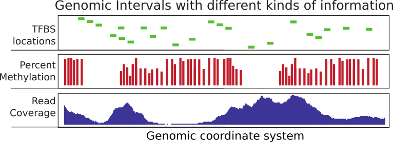
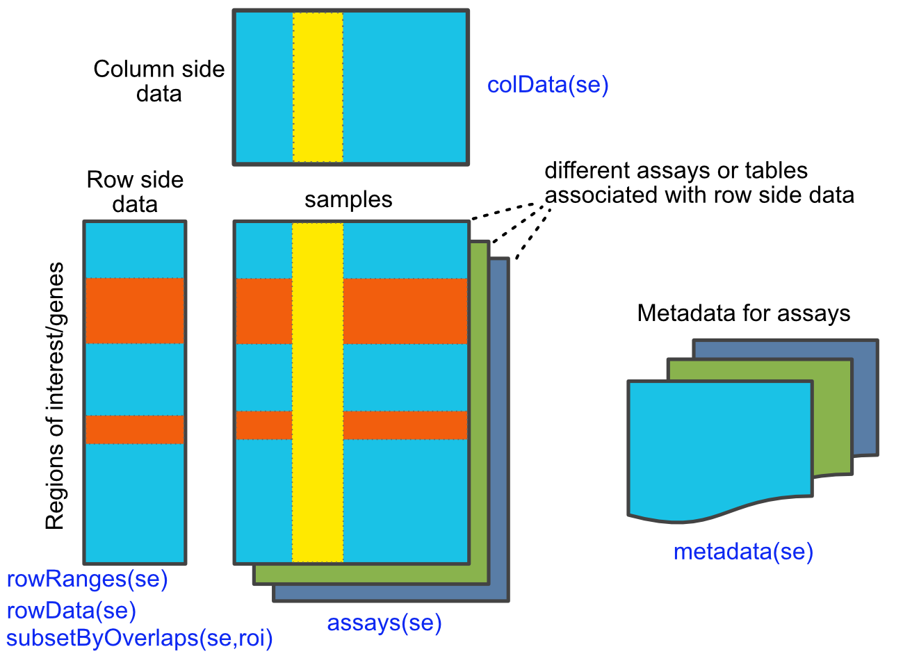

# Operations on Genomic Intervals and Genome Arithmetic {#genomicIntervals}

```{r,setupGenomicIntervals,echo=FALSE}
library(knitr)
knitr::opts_chunk$set(echo      = TRUE,
                      message   = FALSE, 
                      error     = FALSE,
                      warning = FALSE,
                      cache     = TRUE,
                      out.width = "50%",
                      fig.width = 5,
                      fig.align = 'center')
```

Considerable time in computational genomics is spent on overlapping different 
features of the genome. Each feature can be represented with a genomic interval 
within the chromosomal coordinate system. In addition, each interval can carry 
different sorts of information. An interval may for instance represent exon coordinates or a transcription factor binding site. On the other hand,
you can have base-pair resolution, continuous scores over the genome such as read coverage, or 
scores that could be associated with only certain bases such as in the case of CpG 
methylation (see Figure \@ref(fig:gintsum) ).
Typically, you will need to overlap intervals of interest with other features of 
the genome, again represented as intervals. For example, you may want to overlap 
transcription factor binding sites with CpG islands or promoters to quantify what percentage of binding sites overlap with your regions of interest. Overlapping mapped reads from high-throughput sequencing experiments with genomic features such as exons, promoters, and enhancers can also be classified as operations on genomic intervals. You can think of a million other ways that involve overlapping two sets of different features on the genome. This chapter aims to show how to do analysis involving operations on genomic intervals.


```{r,gintsum,fig.cap="Summary of genomic intervals with different kinds of information.",fig.align = 'center',out.width='75%',echo=FALSE}

```


## Operations on genomic intervals with `GenomicRanges` package
The [Bioconductor](http://bioconductor.org) project has a dedicated package called [`GenomicRanges`](http://www.bioconductor.org/packages/release/bioc/html/GenomicRanges.html) to deal with genomic intervals. In this section, we will provide use cases involving operations on genomic intervals. The main reason we will stick to this package is that it provides tools to do overlap operations. However, the package requires that users operate on specific data types that are conceptually similar to a tabular data structure implemented in a way that makes overlapping and related operations easier. The main object we will be using is called the `GRanges` object and we will also see some other related objects from the `GenomicRanges` package.\index{R Packages!\texttt{GenomicRanges}}


### How to create and manipulate a GRanges object

`GRanges` (from `GenomicRanges` package) is the main object that holds the genomic intervals and extra information about those intervals. Here we will show how to create one. Conceptually, it is similar to a data frame and some operations such as using `[ ]` notation to subset the table will also work on `GRanges`, but keep in mind that not everything that works for data frames will work on `GRanges` objects.

```{r,createGR}
library(GenomicRanges)
gr=GRanges(seqnames=c("chr1","chr2","chr2"),
           ranges=IRanges(start=c(50,150,200),
                          end=c(100,200,300)),
           strand=c("+","-","-")
)
gr
# subset like a data frame
gr[1:2,]
```
As you can see, it looks a bit like a data frame. Also, note that the peculiar second argument “ranges” basically contains the start and end positions of the genomic intervals. However, you cannot just give start and end positions, you actually have to provide another object of `IRanges`. Do not let this confuse you; `GRanges` actually depends on another object that is very similar to itself called `IRanges` and you have to provide the “ranges” argument as an `IRanges` object. In its simplest form, an `IRanges` object can be constructed by providing start and end positions to the `IRanges()` function. Think of it as something you just have to provide in order to construct the `GRanges` object.

`GRanges` can also contain other information about the genomic interval such as scores, names, etc. You can provide extra information at the time of the construction or you can add it later. Here is how you can do that:

```{r,createGRwMetadata}
gr=GRanges(seqnames=c("chr1","chr2","chr2"),
           ranges=IRanges(start=c(50,150,200),
                          end=c(100,200,300)),
           names=c("id1","id3","id2"),
           scores=c(100,90,50)
)
# or add it later (replaces the existing meta data)
mcols(gr)=DataFrame(name2=c("pax6","meis1","zic4"),
                    score2=c(1,2,3))

gr=GRanges(seqnames=c("chr1","chr2","chr2"),
           ranges=IRanges(start=c(50,150,200),
                          end=c(100,200,300)),
           names=c("id1","id3","id2"),
           scores=c(100,90,50)
)

# or appends to existing meta data
mcols(gr)=cbind(mcols(gr),
                          DataFrame(name2=c("pax6","meis1","zic4")) )
gr
# elementMetadata() and values() do the same things
elementMetadata(gr)
values(gr)

# you may also add metadata using the $ operator, as for data frames
gr$name3 = c("A","C", "B")
gr
```

### Getting genomic regions into R as GRanges objects

There are multiple ways you can read your genomic features into R and create a `GRanges` object. Most genomic interval data comes in a tabular format that has the basic information about the location of the interval and some other information. We already showed how to read BED files as a data frame in Chapter \@ref(Rintro). Now we will show how to convert it to the `GRanges` object. This is one way of doing it, but there are more convenient ways described further in the text.

```{r,convertDataframe2gr}
# read CpGi data set
filePath=system.file("extdata",
                      "cpgi.hg19.chr21.bed",
                      package="compGenomRData")
cpgi.df = read.table(filePath, header = FALSE,
                     stringsAsFactors=FALSE) 
# remove chr names with "_"
cpgi.df =cpgi.df [grep("_",cpgi.df[,1],invert=TRUE),]

cpgi.gr=GRanges(seqnames=cpgi.df[,1],
                ranges=IRanges(start=cpgi.df[,2],
                              end=cpgi.df[,3]))
```

You may need to do some pre-processing before/after reading in the BED file\index{BED file}. Below is an example of getting transcription start sites from BED files containing RefSeq transcript locations.

```{r,convertDataframe2grTSS}
# read refseq file
filePathRefseq=system.file("extdata",
                      "refseq.hg19.chr21.bed",
                      package="compGenomRData")


ref.df = read.table(filePathRefseq, header = FALSE,
                     stringsAsFactors=FALSE) 
ref.gr=GRanges(seqnames=ref.df[,1],
               ranges=IRanges(start=ref.df[,2],
                              end=ref.df[,3]),
               strand=ref.df[,6],name=ref.df[,4])
# get TSS
tss.gr=ref.gr
# end of the + strand genes must be equalized to start pos
end(tss.gr[strand(tss.gr)=="+",])  =start(tss.gr[strand(tss.gr)=="+",])
# startof the - strand genes must be equalized to end pos
start(tss.gr[strand(tss.gr)=="-",])=end(tss.gr[strand(tss.gr)=="-",])
# remove duplicated TSSes ie alternative transcripts
# this keeps the first instance and removes duplicates
tss.gr=tss.gr[!duplicated(tss.gr),]
```

Another way of doing this from a BED file is to use the `readTranscriptfeatures()`
function from the `genomation` package. This function takes care of the steps described in the code chunk above.


Reading the genomic features as text files and converting to `GRanges` is not the only way to create a `GRanges` object. With the help of the [`rtracklayer`](http://www.bioconductor.org/packages/release/bioc/html/rtracklayer.html) package we can directly import BED files.\index{R Packages!\texttt{rtracklayer}}

```{r,importbed_rtracklayer,eval=FALSE}
require(rtracklayer)

# we are reading a BED file, the path to the file
# is stored in filePathRefseq variable
import.bed(filePathRefseq)

```

Next, we will show how to use other methods to automatically obtain the data in the `GRanges` format from online databases. But you will not be able to use these methods for every data set, so it is good to know how to read data from flat files as well. We will use the `rtracklayer` package to download data from the UCSC Genome Browser\index{UCSC Genome Browser}. We will download CpG islands as `GRanges` objects. The `rtracklayer` workflow we show below works like using the UCSC table browser. You need to select which species you are working with, then you need to select which dataset you need to download and lastly you download the UCSC dataset or track as a `GRanges` object.

```{r,importFromUCSC,eval=FALSE}
require(rtracklayer)
session <- browserSession("UCSC",url = 'http://genome-euro.ucsc.edu/cgi-bin/')
genome(session) <- "mm9"
## choose CpG island track on chr12
query <- ucscTableQuery(session, track="CpG Islands",table="cpgIslandExt",
        range=GRangesForUCSCGenome("mm9", "chr12"))
## get the GRanges object for the track
track(query)
```
There is also an interface to the Ensembl database called [biomaRt](https://bioconductor.org/packages/release/bioc/html/biomaRt.html). \index{R Packages!\texttt{biomaRt}}
This package will enable you to access and import all of the datasets included
in Ensembl. Another similar package is [AnnotationHub](https://bioconductor.org/packages/release/bioc/html/AnnotationHub.html).\index{R Packages!\texttt{AnnotationHub}}
This package is an aggregator for different datasets from various sources. 
Using `AnnotationHub` one can access data sets from the UCSC browser, Ensembl browser
and datasets from genomics consortia such as ENCODE and Roadmap Epigenomics\index{ENCODE}.\index{Roadmap Epigenomics} 
We provide examples of using `Biomart` package further into the chapter. In addition, the `AnnotationHub` package is used in Chapter \@ref(chipseq).


#### Frequently used file formats and how to read them into R as a table
There are multiple file formats in genomics but some of them you will see more
frequently than others. We already mentioned some of them. Here is a list of files
and functions that can read them into R as `GRanges` objects or something coercible to
`GRanges` objects.

1) **BED**: This format is used and popularized by the UCSC browser, and can hold a variety of 
information including exon/intron structure of transcripts in a single line. We will be using BED files in this chapter. In its simplest form, the BED file contains the chromosome name, the start position and end position for a genomic feature of interest.\index{BED file}
    - `genomation::readBed()` 
    - `genomation::readTranscriptFeatures()` good for getting intron/exon/promoters from BED12 files
    - `rtracklayer::import.bed()`

2) **GFF**: GFF format is a tabular text format for genomic features similar to BED. However,
it is a more flexible format than BED, which makes it harder to parse at times. Many gene annotation files are in this format.
    - `genomation::gffToGranges()`
    - `rtracklayer::import.gff()`

3) **BAM/SAM**: BAM format is a compressed and indexed tabular file format designed for aligned sequencing reads. SAM is the uncompressed version of the BAM file. We will touch upon BAM files in this chapter. The uncompressed SAM file is similar in spirit to a BED file where you have the basic location of chromosomal location information plus additional columns that are related to the quality of alignment or other relevant information. We will introduce this format in detail later in this chapter.\index{BAM file} 
\index{SAM file}
    - `GenomicAlignments::readGAlignments`
    - `Rsamtools::scanBam` returns a data frame with columns from a SAM/BAM file.

4) **BigWig**: This is used to for storing scores associated with genomic intervals. It is an indexed format. Similar to BAM, this makes it easier to query and only necessary portions 
of the file could be loaded into memory.
    - `rtracklayer::import.bw()`

5) **Generic Text files**: This represents any text file with the minimal information of chromosome, start and end coordinates. 
    - `genomation::readGeneric()`

6) **Tabix/Bcf**: These are tabular file formats indexed and compressed similar to
BAM. The following functions return lists rather than tabular data structures. These 
formats are mostly used to store genomic variation data such as SNPs and indels.\index{SNP}
    - `Rsamtools::scanTabix` 
    - `Rsamtools::scanBcf` 


### Finding regions that do/do not overlap with another set of regions

This is one of the most common tasks in genomics. Usually, you have a set of regions that you are interested in and you want to see if they overlap with another set of regions or see how many of them overlap. A good example is transcription factor binding sites determined by [ChIP-seq](http://en.wikipedia.org/wiki/ChIP-sequencing) experiments. We will introduce ChIP-seq in more detail in Chapter \@ref(chipseq). However, in these types of experiments and the following analysis, one usually ends up with genomic regions that are bound by transcription factors. One of the standard next questions would be to annotate binding sites with genomic annotations such as promoter, exon, intron and/or CpG islands, which are important for gene regulation. Below is a demonstration of how transcription factor binding sites can be annotated using CpG islands\index{CpG island}. First, we will get the subset of binding sites that overlap with the CpG islands. In this case, binding sites are ChIP-seq peaks.\index{ChIP-seq}

In the code snippet below, we read the ChIP-seq analysis output files using the `genomation::readBroadPeak()` function. This function directly outputs a `GRanges` object. These output files are similar to BED files, where the location of the predicted binding sites are written out in a tabular format with some analysis-related scores and/or P-values. After reading the files, we can find the subset of peaks that overlap with the CpG islands using the `subsetByoverlaps()` function. 

```{r,findPeakwithCpGi}
library(genomation)
filePathPeaks=system.file("extdata",   
              "wgEncodeHaibTfbsGm12878Sp1Pcr1xPkRep1.broadPeak.gz",
                      package="compGenomRData")

# read the peaks from a bed file
pk1.gr=readBroadPeak(filePathPeaks)

# get the peaks that overlap with CpG islands
subsetByOverlaps(pk1.gr,cpgi.gr)

```
For each CpG island, we can count the number of peaks that overlap with a given CpG island with `GenomicRanges::countOverlaps()`.

```{r,countOverlaps}
counts=countOverlaps(pk1.gr,cpgi.gr)
head(counts)
```

The `GenomicRanges::findOverlaps()` function can be used to see one-to-one overlaps between peaks and CpG islands. It returns a matrix showing which peak overlaps which CpG island.

```{r,findOverlaps}
findOverlaps(pk1.gr,cpgi.gr)

```

Another interesting thing would be to look at the distances to the nearest CpG islands for each peak. In addition, just finding the nearest CpG island could also be interesting. Oftentimes, you will need to find the nearest TSS\index{transcription start site (TSS)} or gene to your regions of interest, and the code below is handy for doing that using the `nearest()` and `distanceToNearest()` functions, the resulting plot is shown in Figure \@ref(fig:findNearest).

```{r,findNearest,fig.cap="Histogram of distances of CpG islands to the nearest TSSes."}
# find nearest CpGi to each TSS
n.ind=nearest(pk1.gr,cpgi.gr)
# get distance to nearest
dists=distanceToNearest(pk1.gr,cpgi.gr,select="arbitrary")
dists

# histogram of the distances to nearest TSS
dist2plot=mcols(dists)[,1]
hist(log10(dist2plot),xlab="log10(dist to nearest TSS)",
     main="Distances")

```

## Dealing with mapped high-throughput sequencing reads
The reads from sequencing machines are usually pre-processed and aligned to the genome with the help of specific bioinformatics tools. We have introduced the details of general read processing, quality check and alignment methods in Chapter \@ref(processingReads). In this section we will deal with mapped reads. Since each mapped read has a start and end position the genome, mapped reads can be thought of as genomic intervals stored in a file. After mapping, the next task is to quantify the enrichment of those aligned reads in the regions of interest. You may want to count how many reads overlap with your promoter set of interest or you may want to quantify RNA-seq reads\index{RNA-seq} overlap with exons. This is similar to operations on genomic intervals which are described previously. If you can read all your alignments into memory and create a `GRanges` object, you can apply the previously described operations. However, most of the time we can not read all mapped reads into memory, so we have to use specialized tools to query and quantify alignments on a given set of regions. One of the most common alignment formats is SAM/BAM format, most aligners will produce SAM/BAM output or you will be able to convert your specific alignment format to SAM/BAM format. The BAM format is a binary version of the human-readable SAM format. The SAM format has specific columns that contain different kinds of information about the alignment such as mismatches, qualities etc. (see [http://samtools.sourceforge.net/SAM1.pdf] for SAM format specification).


### Counting mapped reads for a set of regions

The `Rsamtools` package has functions to query BAM files\index{R Packages!\texttt{Rsamtools}}. The function we will use in the first example is the `countBam()` function, which takes as input of the BAM file and param argument. The `param` argument takes a `ScanBamParam` object. The object is instantiated using `ScanBamParam()` and contains parameters for scanning the BAM file. The example below is a simple example where `ScanBamParam()` only includes regions of interest, promoters on chr21.

```{r,countBam}
promoter.gr=tss.gr
start(promoter.gr)=start(promoter.gr)-1000
end(promoter.gr)  =end(promoter.gr)+1000
promoter.gr=promoter.gr[seqnames(promoter.gr)=="chr21"]

library(Rsamtools)
bamfilePath=system.file("extdata",
            "wgEncodeHaibTfbsGm12878Sp1Pcr1xAlnRep1.chr21.bam",
                      package="compGenomRData")

# get reads for regions of interest from the bam file
param <- ScanBamParam(which=promoter.gr)
counts=countBam(bamfilePath, param=param)

```

Alternatively, aligned reads can be read in using the `GenomicAlignments` package (which on this occasion relies on the `Rsamtools` package).\index{R Packages!\texttt{GenomicAlignments}}

```{r,readGAlignments}
library(GenomicAlignments)
alns <- readGAlignments(bamfilePath, param=param)
```

## Dealing with continuous scores over the genome
Most high-throughput data can be viewed as a continuous score over the bases of the genome. In case of RNA-seq or ChIP-seq experiments, the data can be represented as read coverage values per genomic base position\index{RNA-seq}\index{ChIP-seq}. In addition, other information (not necessarily from high-throughput experiments) can be represented this way. The GC content and conservation scores per base are prime examples of other data sets that can be represented as scores over the genome. This sort of data can be stored as a generic text file or can have special formats such as Wig (stands for wiggle) from UCSC, or the bigWig format, which is an indexed binary format of the wig files\index{wig file}\index{bigWig file}. The bigWig format is great for data that covers a large fraction of the genome with varying scores, because the file is much smaller than regular text files that have the same information and it can be queried more easily since it is indexed.

In R/Bioconductor, continuous data can also be represented in a compressed format, called Rle vector, which stands for run-length encoded vector. This gives superior memory performance over regular vectors because repeating consecutive values are represented as one value in the Rle vector (see Figure \@ref(fig:Rle)).


```{r,Rle,fig.cap="Rle encoding explained.",fig.align = 'center',out.width='100%',echo=FALSE}
knitr::include_graphics("images/Rle_demo.png" )
```


Typically, for genome-wide data you will have an `RleList` object, which is a list of Rle vectors per chromosome. You can obtain such vectors by reading the reads in and calling the `coverage()` function from the `GenomicRanges` package. Let's try that on the above data set.\index{R Packages!\texttt{GenomicRanges}}

```{r,getCoverageFromAln}
covs=coverage(alns) # get coverage vectors
covs
```

Alternatively, you can get the coverage from the BAM file directly. Below, we are getting the coverage directly from the BAM file for our previously defined promoters.\index{BAM/SAM file}
```{r,getCoverageFromBam}
covs=coverage(bamfilePath, param=param) # get coverage vectors

```

One of the most common ways of storing score data is, as mentioned, the wig or bigWig format. Most of the ENCODE project\index{ENCODE} data can be downloaded in bigWig format. In addition, conservation scores can also be downloaded in the wig/bigWig format. You can import bigWig files into R using the `import()` function from the `rtracklayer` package. However, it is generally not advisable to read the whole bigWig file in memory as was the case with BAM files. Usually, you will be interested in only a fraction of the genome, such as promoters, exons etc. So it is best that you extract the data for those regions and read those into memory rather than the whole file. Below we read a bigWig file only for the bases on promoters. The operation returns a `GRanges` object with the score column which indicates the scores in the bigWig file per genomic region.
```{r,getRleFromBigWig}
library(rtracklayer)

# File from ENCODE ChIP-seq tracks
bwFile=system.file("extdata",
                      "wgEncodeHaibTfbsA549.chr21.bw",
                      package="compGenomRData")
bw.gr=import(bwFile, which=promoter.gr) # get coverage vectors
bw.gr
```
Following this we can create an `RleList` object from the `GRanges` with the `coverage()` function.
```{r,BigWigCov}
cov.bw=coverage(bw.gr,weight = "score")

# or get this directly from
cov.bw=import(bwFile, which=promoter.gr,as = "RleList")

```
### Extracting subsections of Rle and RleList objects 
Frequently, we will need to extract subsections of the Rle vectors or `RleList` objects.
We will need to do this to visualize that subsection or get some statistics out 
of those sections. For example, we could be interested in average coverage per 
base for the regions we are interested in. We have to extract those regions 
from the `RleList` object and apply summary statistics. Below, we show how to extract
subsections of the `RleList` object. We are extracting promoter regions from the ChIP-seq\index{ChIP-seq}
read coverage `RleList`. Following that, we will plot one of the promoter's coverage values.
```{r,getViews,fig.cap="Coverage vector extracted from the RleList via the Views() function is plotted as a line plot."}
myViews=Views(cov.bw,as(promoter.gr,"IRangesList")) # get subsets of coverage
# there is a views object for each chromosome
myViews
myViews[[1]]
# get the coverage vector from the 5th view and plot
plot(myViews[[1]][[5]],type="l")

```

Next, we are interested in average coverage per base for the promoters using summary
functions that work on the `Views` object.
```{r, viewMeans}
# get the mean of the views
head(
  viewMeans(myViews[[1]])
)

# get the max of the views
head(
  viewMaxs(myViews[[1]])
)
```

## Genomic intervals with more information: SummarizedExperiment class
As we have seen, genomic intervals can be mainly contained in a `GRanges` object.
It can also contain additional columns associated with each interval. Here 
you can save information such as read counts or other scores associated with the
interval. However,
genomic data often have many layers. With `GRanges` you can have a table 
associated with the intervals, but what happens if you have many tables and each
table has some metadata associated with it. In addition, rows and columns might 
have additional annotation that cannot be contained by row or column names. 
For these cases, the `SummarizedExperiment` class is ideal. It can hold multi-layered
tabular data associated with each genomic interval and the meta-data associated with
rows and columns, or associated with each table. For example, genomic intervals
associated with the `SummarizedExperiment` object can be gene locations, and 
each tabular data structure can be RNA-seq read counts in a time course experiment.
Each table could represent different conditions in which experiments are performed. 
The `SummarizedExperiment` class is outlined in the figure below (Figure \@ref(fig:SumExpOv) ).


```{r,SumExpOv,fig.cap="Overview of SummarizedExperiment class and functions. Adapted from the SummarizedExperiment package vignette.",fig.align = 'center',out.width='100%',echo=FALSE}

```

### Create a SummarizedExperiment object
Here we show how to create a basic `SummarizedExperiment` object. We will first
create a matrix of read counts. This matrix will represent read counts from
a series of RNA-seq experiments from different time points. Following that, 
we create a `GRanges` object to represent the locations of the genes, and a table
for column annotations. This will include the names for the columns and any 
other value we want to represent. Finally, we will create a `SummarizedExperiment`
object by combining all those pieces.

```{r,sumExpCreate}

# simulate an RNA-seq read counts table
nrows <- 200
ncols <- 6
counts <- matrix(runif(nrows * ncols, 1, 1e4), nrows)

# create gene locations
rowRanges <- GRanges(rep(c("chr1", "chr2"), c(50, 150)),
                     IRanges(floor(runif(200, 1e5, 1e6)), width=100),
                     strand=sample(c("+", "-"), 200, TRUE),
                     feature_id=paste0("gene", 1:200))

# create table for the columns
colData <- DataFrame(timepoint=1:6,
                     row.names=LETTERS[1:6])


# create SummarizedExperiment object
se=SummarizedExperiment(assays=list(counts=counts),
                     rowRanges=rowRanges, colData=colData)

se
```

### Subset and manipulate the SummarizedExperiment object
Now that we have a `SummarizedExperiment` object, we can subset it and extract/change
parts of it. 

#### Extracting parts of the object
`colData()` and `rowData()` extract the column-associated and row-associated
tables. `metaData()` extracts the meta-data table if there is any table associated.
```{r,extractSe}
colData(se) # extract column associated data

rowData(se) # extrac row associated data
```

To extract the main table or tables that contain the values of interest such 
as read counts, we must use the `assays()` function. This returns a list of 
`DataFrame` objects associated with the object.
```{r,assaysSe}
assays(se) # extract list of assays

```
 You can use names with `$` or `[]` notation to extract specific tables from the list.
```{r,assaysSe2,eval=FALSE}

assays(se)$counts # get the table named "counts"

assays(se)[[1]] # get the first table

```


#### Subsetting
Subsetting is easy using the `[ ]` notation. This is similar to the way we 
subset data frames or matrices.
```{r,subsetSe1}
# subset the first five transcripts and first three samples
se[1:5, 1:3]
```

One can also use the `$` operator to subset based on `colData()` columns. You can 
extract certain samples or in our case, time points.
```{r,subsetSe2,eval=FALSE}
se[, se$timepoint == 1]
```

In addition, as `SummarizedExperiment` objects are `GRanges` objects on steroids,
they support all of the `findOverlaps()` methods and associated functions that
work on `GRanges` objects. 
```{r,subsetByolapSE}
# Subset for only rows which are in chr1:100,000-1,100,000 
roi <- GRanges(seqnames="chr1", ranges=100000:1100000)
subsetByOverlaps(se, roi)
```

## Visualizing and summarizing genomic intervals
Data integration and visualization is cornerstone of genomic data analysis. Below, we will
show different ways of integrating and visualizing genomic intervals. These methods
can be used to visualize large amounts of data in a locus-specific or multi-loci
manner.

### Visualizing intervals on a locus of interest
Oftentimes, we will be interested in a particular genomic locus and try to visualize 
different genomic datasets over that locus. This is similar to looking at the data 
over one of the genome browsers. Below we will display genes, GpG islands and read \index{R Packages!\texttt{Gviz}}
coverage from a ChIP-seq experiment using the `Gviz` package\index{ChIP-seq}. For the `Gviz` package, we first need to 
set the tracks to display. The tracks can be in various formats. They can be R 
objects such as `IRanges`, `GRanges` and `data.frame`, or  they can be in flat file formats
such as bigWig, BED, and BAM. After the tracks are set, we can display them with the
`plotTracks` function, the resulting plot is shown in Figure \@ref(fig:GvizExchp6).

```{r GvizExchp6,fig.cap="Genomic data tracks visualized using the Gviz functions."}
library(Gviz)
# set tracks to display

# set CpG island track
cpgi.track=AnnotationTrack(cpgi.gr,
                           name = "CpG")

# set gene track
# we will get this from EBI Biomart webservice
gene.track <- BiomartGeneRegionTrack(genome = "hg19",
                                    chromosome = "chr21", 
                                    start = 27698681, end = 28083310,
                                    name = "ENSEMBL")


# set track for ChIP-seq coverage
chipseqFile=system.file("extdata",
                      "wgEncodeHaibTfbsA549.chr21.bw",
                      package="compGenomRData")
cov.track=DataTrack(chipseqFile,type = "l",
                    name="coverage")
  
# call the display function plotTracks
track.list=list(cpgi.track,gene.track,cov.track)
plotTracks(track.list,from=27698681,to=28083310,chromsome="chr21")
```


### Summaries of genomic intervals on multiple loci
Looking at data one region at a time could be inefficient. One can summarize 
different data sets over thousands of regions of interest and identify patterns. 
These summaries can include different data types such as motifs, read coverage 
and other scores associated with genomic intervals. The `genomation` package can 
summarize and help identify patterns in the datasets. The datasets can have
different kinds of information and multiple file types can be used such as BED, GFF, BAM and bigWig. We will look at H3K4me3 ChIP-seq \index{ChIP-seq} \index{histone modification}and DNAse-seq signals from the H1 embryonic stem cell line. H3K4me3 is usually associated with promoters and regions with high DNAse-seq signal are associated with accessible regions, which means mostly regulatory regions. We will summarize those datasets around the transcription start sites (TSS)\index{transcription start site (TSS)} of genes on chromosome 20 of the human hg19 assembly. We will first read the genes and extract the region around the TSS, 500bp upstream and downstream. We will then create a matrix of ChIP-seq scores for those regions. Each row will represent a region around a specific TSS and columns will be the scores per base. We will then plot average enrichment values around the TSS of genes on chromosome 20.
```{r metaRegionchp6,fig.cap="Meta-region plot using genomation."}

# get transcription start sites on chr20
library(genomation)
transcriptFile=system.file("extdata",
                      "refseq.hg19.chr20.bed",
                      package="compGenomRData")
feat=readTranscriptFeatures(transcriptFile,
                            remove.unusual = TRUE,
                            up.flank = 500, down.flank = 500)
prom=feat$promoters # get promoters from the features


# get for H3K4me3 values around TSSes
# we use strand.aware=TRUE so - strands will
# be reversed
H3K4me3File=system.file("extdata",
                      "H1.ESC.H3K4me3.chr20.bw",
                      package="compGenomRData")
sm=ScoreMatrix(H3K4me3File,prom,
               type="bigWig",strand.aware = TRUE)


# look for the average enrichment
plotMeta(sm, profile.names = "H3K4me3", xcoords = c(-500,500),
         ylab="H3K4me3 enrichment",dispersion = "se",
         xlab="bases around TSS")

```
The resulting plot is shown in Figure \@ref(fig:metaRegionchp6). The pattern we see is expected, there is a dip just around TSS \index{transcription start site (TSS)}and the signal is more 
intense downstream of the TSS. 

We can also plot a heatmap where each row is a
region around the TSS and color coded by enrichment. This can show us not only the
general pattern, as in the meta-region 
plot, but also how many of the regions produce such a pattern. The `heatMatrix()` function shown below achieves that. The resulting heatmap plot is shown in Figure \@ref(fig:heatmatrix1Chp6).
```{r heatmatrix1Chp6,fig.cap="Heatmap of enrichment of H3K4me2 around the TSS."}
heatMatrix(sm,order=TRUE,xcoords = c(-500,500),
           xlab="bases around TSS")
```

Here we saw that about half of the regions do not have any signal. In addition it seems the multi-modal profile we have observed earlier is more complicated. Certain regions seem to have signal on both sides of the TSS, \index{transcription start site (TSS)}whereas others have signal mostly on the downstream side.

Normally, there would be more than one experiment or we can integrate datasets from
public repositories. In this case, we can see how different signals look in the regions we are interested in. Now, we will also use DNAse-seq data and create a list of matrices with our datasets and plot the average profile of the signals from both datasets. The resulting meta-region plot is shown in Figure \@ref(fig:heatmatrixlistchp6).
```{r heatmatrixlistchp6,fig.cap= "Average profiles of DNAse and H3K4me3 ChIP-seq.",out.width='50%'}

DNAseFile=system.file("extdata",
                      "H1.ESC.dnase.chr20.bw",
                      package="compGenomRData")

sml=ScoreMatrixList(c(H3K4me3=H3K4me3File,
                      DNAse=DNAseFile),prom,
                      type="bigWig",strand.aware = TRUE)
plotMeta(sml)

```

 We should now look at the heatmaps side by side and we should also cluster the rows
based on their similarity. We will be using `multiHeatMatrix` since we have multiple `ScoreMatrix` objects in the list. In this case, we will also use the `winsorize` argument to limit extreme values, 
every score above 95th percentile will be equalized the value of the 95th percentile. In addition, `heatMatrix` and `multiHeatMatrix` can cluster the rows.
Below, we will be using k-means clustering with 3 clusters.
```{r,multiHeatMatrix,fig.cap= "Heatmaps of H3K4me3 and DNAse data.",out.width='40%'}
set.seed(1029)
multiHeatMatrix(sml,order=TRUE,xcoords = c(-500,500),
                xlab="bases around TSS",winsorize = c(0,95),
                matrix.main = c("H3K4me3","DNAse"),
                column.scale=TRUE,
                clustfun=function(x) kmeans(x, centers=3)$cluster)

```

The resulting heatmaps are shown in Figure \@ref(fig:multiHeatMatrix). These plots revealed a different picture than we have observed before. Almost half of the promoters have no signal for DNAse or H3K4me3; these\index{histone modification} regions are probably not active and associated genes are not expressed. For regions with the H3K4me3 signal, there are two major patterns: one pattern where both downstream and upstream of the TSS are enriched, and on the other pattern, mostly downstream of the TSS is enriched.\index{transcription start site (TSS)}

### Making karyograms and circos plots
Chromosomal karyograms  and circos plots are beneficial for displaying data over the 
whole genome of chromosomes of interest, although the information that can be 
displayed over these large regions are usually not very clear and only large trends 
can be discerned by eye, such as loss of methylation in large regions or genome-wide. 
Below, we show how to use the `ggbio` package for plotting.
This package has a slightly different syntax than base graphics. The syntax follows
"grammar of graphics" logic, and depends on the `ggplot2` package we introduced in Chapter \@ref(Rintro). It is 
a deconstructed way of thinking about the plot. You add your data and apply mappings
and transformations in order to achieve the final output. In `ggbio`, things are 
relatively easy since a high-level function, the `autoplot` function, will recognize \index{R Packages!\texttt{ggbio}}
most of the datatypes and guess the most appropriate plot type. You can change
its behavior by applying low-level functions. We first get  the sizes of chromosomes
and make a karyogram template. The empty karyogram is shown in Figure \@ref(fig:karyo1).

```{r,karyo1,fig.cap= "Karyogram example."}
library(ggbio)
data(ideoCyto, package = "biovizBase")
p <- autoplot(seqinfo(ideoCyto$hg19), layout = "karyogram")
p
```

Next, we would like to plot CpG islands on this karyogram. We simply do this
by adding a layer with the `layout_karyogram()` function. The resulting karyogram is shown in Figure \@ref(fig:karyo2).
```{r,karyo2,fig.cap= "Karyogram of CpG islands over the human genome."}
# read CpG islands from a generic text file

CpGiFile=filePath=system.file("extdata",
                      "CpGi.hg19.table.txt",
                      package="compGenomRData")
cpgi.gr=genomation::readGeneric(CpGiFile, 
            chr = 1, start = 2, end = 3,header=TRUE, 
          keep.all.metadata =TRUE,remove.unusual=TRUE )

p + layout_karyogram(cpgi.gr)


```

Next, we would like to plot some data over the chromosomes. This could be the ChIP-seq \index{ChIP-seq}
signal
or any other signal over the genome; we will use CpG island scores from the data set
we read earlier. We will plot a point proportional to "obsExp" column in the data set. We use the `ylim` argument to squish the chromosomal rectangles and plot on top of those. The `aes` argument defines how the data is mapped to geometry. In this case,
the argument indicates that the points will have an x coordinate from CpG island start positions and a y coordinate from the obsExp score of CpG islands. The resulting karyogram is shown in Figure \@ref(fig:karyoCpG).
```{r,karyoCpG,fig.cap="Karyogram of CpG islands and their observed/expected scores over the human genome."}

p + layout_karyogram(cpgi.gr, aes(x= start, y = obsExp),
                     geom="point",
                     ylim = c(2,50), color = "red",
                     size=0.1,rect.height=1)


```

Another way to depict regions or quantitative signals on the chromosomes is circos plots. These are circular plots usually used for showing chromosomal rearrangements, but can also be used for depicting signals. The `ggbio` package can produce all kinds of circos plots. Below, we will show how to use that for our CpG island score example, and the resulting plot is shown in Figure \@ref(fig:circosCpG).

```{r,"circosCpG",fig.cap="Circos plot for CpG island scores."}

# set the chromsome in a circle
# color set to white to look transparent 
p <- ggplot() + layout_circle(ideoCyto$hg19, geom = "ideo", fill = "white",
                              colour="white",cytoband = TRUE,
                              radius = 39, trackWidth = 2)
# plot the scores as points   
p <- p + layout_circle(cpgi.gr, geom = "point", grid=TRUE,
                           size = 0.01, aes(y = obsExp),color="red",
                       radius = 42, trackWidth = 10)
# set the chromosome names
p <- p + layout_circle(as(seqinfo(ideoCyto$hg19),"GRanges"), 
                       geom = "text", aes(label = seqnames), 
                      vjust = 0, radius = 55, trackWidth = 7,
                      size=3) 

# display the plot
p
```


## Exercises
The data for the exercises is within the `compGenomRData` package. 

Run the following to see the data files. 
```
dir(system.file("extdata",
             package="compGenomRData"))
```
You will need some of those files to complete the exercises.

### Operations on genomic intervals with the `GenomicRanges` package

1. Create a `GRanges` object using the information in the table below:[Difficulty: **Beginner**]

| chr  | start | end  |strand | score | 
| :--- |:------| :-----| :-----|:-----|
| chr1 | 10000 | 10300 |  +    | 10 |
| chr1 | 11100 | 11500 |  -    | 20 |
| chr2 | 20000 | 20030 |  +    | 15 |


2. Use the `start()`, `end()`, `strand()`,`seqnames()` and `width()` functions on the `GRanges`
object you created. Figure out what they are doing. Can you get a subset of the `GRanges` object for intervals that are only on the + strand? If you can do that, try getting intervals that are on chr1. *HINT:* `GRanges` objects can be subset using the `[ ]` operator, similar to data frames, but you may need
to use `start()`, `end()` and `strand()`,`seqnames()` within the `[]`. [Difficulty: **Beginner/Intermediate**]


3. Import mouse (mm9 assembly) CpG islands and RefSeq transcripts for chr12 from the UCSC browser as `GRanges` objects using `rtracklayer` functions. HINT: Check chapter content and modify the code there as necessary. If that somehow does not work, go to the UCSC browser and download it as a BED file. The track name for Refseq genes is "RefSeq Genes" and the table name is "refGene". [Difficulty: **Beginner/Intermediate**]


4. Following from the exercise above, get the promoters of Refseq transcripts (-1000bp and +1000 bp of the TSS) and calculate what percentage of them overlap with CpG islands. HINT: You have to get the promoter coordinates and use the `findOverlaps()` or `subsetByOverlaps()` from the `GenomicRanges` package. To get promoters, type `?promoters` on the R console and see how to use  that function to get promoters or calculate their coordinates as shown in the chapter. [Difficulty: **Beginner/Intermediate**]


5. Plot the distribution of CpG island lengths for CpG islands that overlap with the 
promoters. [Difficulty: **Beginner/Intermediate**]


6. Get canonical peaks for SP1 (peaks that are in both replicates) on chr21. Peaks for each replicate are located in the `wgEncodeHaibTfbsGm12878Sp1Pcr1xPkRep1.broadPeak.gz` and `wgEncodeHaibTfbsGm12878Sp1Pcr1xPkRep2.broadPeak.gz` files. **HINT**: You need to use `findOverlaps()` or `subsetByOverlaps()` to get the subset of peaks that occur in both replicates (canonical peaks). You can try to read "...broadPeak.gz" files using  the `genomation::readBroadPeak()` function; broadPeak is just an extended BED format. In addition, you can try to use `the coverage()` and `slice()` functions to get more precise canonical peak locations. [Difficulty: **Intermediate/Advanced**]


### Dealing with mapped high-throughput sequencing reads

1.  Count the reads overlapping with canonical SP1 peaks using the BAM file for one of the replicates. The following file in the `compGenomRData` package contains the alignments for SP1 ChIP-seq reads: `wgEncodeHaibTfbsGm12878Sp1Pcr1xAlnRep1.chr21.bam`. **HINT**: Use functions from the `GenomicAlignments` package. [Difficulty: **Beginner/Intermediate**]


### Dealing with contiguous scores over the genome

1. Extract the `Views` object for the promoters on chr20 from the `H1.ESC.H3K4me1.chr20.bw` file available at `CompGenomRData` package. Plot the first "View" as a line plot. **HINT**: See the code in the relevant section in the chapter and adapt the code from there. [Difficulty: **Beginner/Intermediate**]

2. Make a histogram of the maximum signal for the Views in the object you extracted above. You can use any of the view summary functions or use `lapply()` and write your own summary function. [Difficulty: **Beginner/Intermediate**]

3. Get the genomic positions of maximum signal in each view and make a `GRanges` object. **HINT**: See the `?viewRangeMaxs` help page. Try to make a `GRanges` object out of the returned object. [Difficulty: **Intermediate**]

### Visualizing and summarizing genomic intervals

1. Extract -500,+500 bp regions around the TSSes on chr21; there are refseq files for the hg19 human genome assembly in the `compGenomRData` package. Use SP1 ChIP-seq data in the `compGenomRData` package, access the file path via the `system.file()` function, the file name is:
`wgEncodeHaibTfbsGm12878Sp1Pcr1xAlnRep1.chr21.bam`. Create an average profile of read coverage around the TSSes. Following that, visualize the read coverage with a heatmap. **HINT**: All of these are possible using the `genomation` package functions. Check `help(ScoreMatrix)` to see how you can use bam files. As an example here is how you can get the file path to refseq annotation on chr21. [Difficulty: **Intermediate/Advanced**]
```{r example,eval=FALSE}
transcriptFilechr21=system.file("extdata",
                      "refseq.hg19.chr21.bed",
                      package="compGenomRData")
```

2. Extract -500,+500 bp regions around the TSSes on chr20. Use H3K4me3 (`H1.ESC.H3K4me3.chr20.bw`) and H3K27ac (`H1.ESC.H3K27ac.chr20.bw`) ChIP-seq enrichment data in the `compGenomRData` package and create heatmaps and average signal profiles for regions around the TSSes.[Difficulty: **Intermediate/Advanced**]


3. Download P300 ChIP-seq peaks data from the UCSC browser. The peaks are locations where P300 binds. The P300 binding marks enhancer regions in the genome. (**HINT**:  group: "regulation", track: "Txn Factor ChIP", table:"wgEncodeRegTfbsClusteredV3", you need to filter the rows for "EP300" name.) Check enrichment of H3K4me3, H3K27ac and DNase-seq (`H1.ESC.dnase.chr20.bw`) experiments on chr20 on and arounf the P300 binding-sites, use data from `compGenomRData` package. Make multi-heatmaps and metaplots. What is different from the TSS profiles? [Difficulty: **Advanced**]

4. Cluster the rows of multi-heatmaps for the task above. Are there obvious clusters? **HINT**: Check arguments of the `multiHeatMatrix()` function. [Difficulty: **Advanced**]


5. Visualize one of the -500,+500 bp regions around the TSS using `Gviz` functions. You should visualize both H3K4me3 and H3K27ac and the gene models. [Difficulty: **Advanced**]


