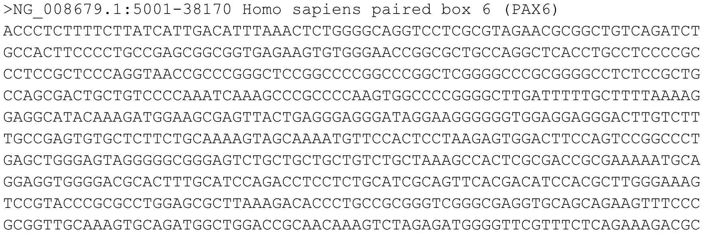
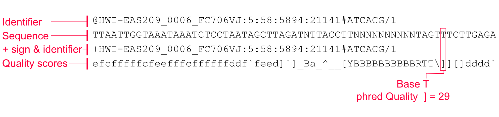

# Quality Check, Processing and Alignment of High-throughput Sequencing Reads {#processingReads}

```{r,setupProcessingReads,echo=FALSE}
knitr::opts_chunk$set(echo      = TRUE,
                      message   = FALSE, 
                      error     = FALSE,
                      cache     = TRUE,
                      out.width = "55%",
                      fig.width = 5,
                      fig.align = 'center')

```

Advances in sequencing technology are helping researchers sequence the genome deeper than ever. These sequencing experiments typically yield millions of reads. These reads have to be further processed, quality checked and aligned before we can quantify the genomic signal of interest and apply statistics and/or machine learning methods. For example, you may want to count how many reads overlap with your promoter set of interest or you may want to quantify RNA-seq reads that overlap with exons. Post-alignment operations are usually, but not always, similar to operations on genomic intervals. Dealing with mapped reads is described previously in Chapter \@ref(genomicIntervals). In addition, we have introduced high-throughput sequencing and its applications in general in Chapter \@ref(intro). In this chapter we will introduce the fundamentals of read processing and quality check, and we will show how to do those tasks in R. The read quality check and processing is a fundamental step in all high-throughput sequencing analyses. For example, RNA-seq, ChIP-seq and BS-seq analyses shown in Chapters \@ref(rnaseqanalysis), \@ref(chipseq) and \@ref(bsseq) require these quality check and processing steps prior to further analysis.  For a long time, quality check and mapping tasks were outside the R domain. However, nowadays certain packages in R/Bioconductor can accomplish those tasks. 

## FASTA and FASTQ formats
High-throughput sequencing reads are usually output from sequencing facilities as text files in a format called "FASTQ" or "fastq". This format depends on an earlier format called FASTA. The FASTA format was developed as a text-based format to represent nucleotide or protein sequences (see Figure \@ref(fig:fasta) for an example).

```{r,fasta,fig.cap="An example fasta file showing the first part of the PAX6 gene.",fig.align = 'center',out.width='80%',echo=FALSE}

```

The first line in a FASTA file usually starts with  a ">" (greater-than) symbol. This first line is called the "description line", and can contain descriptive information about the sequence in the subsequent lines. The description can be the ID or name of the sequence such as gene names. However, very infrequently you may see lines starting with a ";" (semicolon). These lines will be taken as a comment, and can hold additional descriptive information about the sequence in subsequent lines. 

An extension of the FASTA format is FASTQ format. This format is designed to handle base quality metrics output from sequencing machines. In this format, both the sequence and quality scores are represented as single ASCII characters. The format uses four lines for each sequence, and these four lines are stacked on top of each other in text files output by sequencing workflows. Each of the 4 lines will represent a read. Figure \@ref(fig:fastq) shows those four lines with brief explanations for each line.

```{r,fastq,fig.cap="FASTQ format and a brief explanation of each line in the format.",fig.align = 'center',out.width='80%',echo=FALSE}

```

__Line 1__ begins with the '@' character and is followed by a sequence identifier and an optional description. This line is utilized by the sequencing technology, and usually contains specific information for the technology. It can contain flow cell IDs, lane numbers, and information on read pairs. __Line 2__ is the sequence letters. __Line 3__ begins with a '+' character; it marks the end of the sequence and is optionally followed by the same sequence identifier again in line 1. __Line 4__ encodes the quality values for the sequence in Line 2, and must contain the same number of symbols as letters in the sequence. Each letter corresponds to a quality score. Although there might be different definitions of the quality scores, a *de facto* standard in the field is to use "Phred quality scores". These scores represent the likelihood of the base being called wrong. Formally, ${\displaystyle Q_{\text{phred}}=-10\log _{\text{10}}e}$, where $e$ is the probability that the base is called wrong. Since the score is in minus log scale, the higher the score, the more unlikely that the base is called wrong. 

## Quality check on sequencing reads 
The sequencing technologies usually produce basecalls with varying quality. In addition, there could be sample-specific issues in your sequencing run, such as adapter contamination. It is standard procedure to check the quality of the reads and identify problems before doing further analysis. Checking the quality and making some decisions for the downstream analysis can influence the outcome of your project.

Below, we will walk you through the quality check steps using the [`Rqc`](https://bioconductor.org/packages/release/bioc/html/Rqc.html) package\index{R Packages!\texttt{Rqc}}. First, we need to feed fastq files to the `rqc()` function and obtain an object with sequence quality-related results. We are using example fastq files from the `ShortRead` package\index{R Packages!\texttt{ShortRead}}.
```{r,rqcStart,echo=TRUE, warning=FALSE}
library(Rqc)
folder = system.file(package="ShortRead", "extdata/E-MTAB-1147")

# feeds fastq.qz files in "folder" to quality check function
qcRes=rqc(path = folder, pattern = ".fastq.gz", openBrowser=FALSE)


```


### Sequence quality per base/cycle
Now that we have the `qcRes` object, we can plot various sequence quality metrics for our fastq files. We will first plot "sequence quality per base/cycle". This plot, shown in Figure \@ref(fig:CycleQualityBoxPlot),  depicts the quality scores across all bases at each position in the reads.

```{r,CycleQualityBoxPlot,fig.cap="Per base sequence quality boxplot.",fig.align = 'center',out.width='80%',echo=TRUE, warning=FALSE,fig.height=3,fig.width=5}
rqcCycleQualityBoxPlot(qcRes)

```

In our case, the x-axis in the plot is labeled as "cycle". This is because in each sequencing "cycle" a fluorescently labeled nucleotide is added to complement the template sequence, and the sequencing machine identifies which nucleotide is added. Therefore, cycles correspond to bases/nucleotides along the read, and the number of cycles is equivalent to the read length. 

Long sequences can have degraded quality towards the ends of the reads. Looking at quality distribution over base positions can help us decide to do trimming towards the end of the reads or not. A good sample will have median quality scores per base above 28. If scores are below 20 towards the ends, you can think about trimming the reads.


### Sequence content per base/cycle 
Per-base sequence content shows nucleotide proportions for each position. In a random sequencing library there should be no nucleotide bias and the lines should be almost parallel with each other. The code below shows how to get this plot. The resulting plot is shown in Figure \@ref(fig:baseCallFreq).

```{r,baseCallFreq,fig.cap="Percentage of nucleotide bases per position across different FASTQ files.",fig.align = 'center',out.width='80%',echo=TRUE, warning=FALSE,fig.height=3,fig.width=5}
rqcCycleBaseCallsLinePlot(qcRes)

```


However, some types of sequencing libraries can produce a biased sequence composition. For example, in RNA-Seq, it is common to have bias at the beginning of the reads. This happens because of random primers annealing to the start of reads during RNA-Seq library preparation. These primers are not truly random, which leads to a variation at the beginning of the reads. Although RNA-seq experiments will usually have these biases, this will not affect the ability of measuring gene expression. 

In addition, some libraries are inherently biased in their sequence composition. For example, in bisulfite sequencing experiments, most of the cytosines will be converted to thymines. This will create a difference in C and T base compositions over the read, however this type of difference is normal for bisulfite sequencing experiments.


### Read frequency plot
This plot shows the degree of duplication for every read in the library. We show how to get this plot in the code snippet below and the resulting plot is in Figure \@ref(fig:ReadFrequencyPlot). A high level of duplication, non-unique reads, is  likely to indicate an enrichment bias. Technical duplicates arising from PCR artifacts could cause this. PCR is a common step in library preparation which creates many copies of the sequence fragment. In RNA-seq \index{RNA-seq}data, the non-unique read proportion can reach more than 20%. However, these duplications may stem from genes simply being expressed at high levels. This means that there will be many copies of transcripts and many copies of the same fragment. Since we cannot be sure these duplicated reads are due to PCR bias or an effect of high transcription, we should not remove duplicated reads in RNA-seq analysis. However, in ChIP-seq experiments duplicated reads are more likely to be due to PCR bias.

```{r,ReadFrequencyPlot,fig.height=3,fig.width=5,fig.cap="The percent of different duplication levels in FASTQ files. Most of the reads in all libraries have only one copy in this case. ",fig.align = 'center',out.width='60%',echo=TRUE, warning=FALSE}
rqcReadFrequencyPlot(qcRes)

```

### Other quality metrics and QC tools
Over-represented k-mers along the reads can be an additional check. If there are such sequences it may point to adapter contamination and should be trimmed. Adapters are known sequences that are added to the ends of the reads. This kind of contamination could also be visible at "sequence content per base" plots. In addition, if you know the adapter sequences, you can match it to the end of the reads and trim them. The most popular tool for sequencing quality control is the fastQC tool [@noauthor_babraham_nodate], which is written in Java. It produces the plots that we described above in addition to k-mer overrepresentation and adapter overrepresentation plots. The R package [fastqcr](https://cran.r-project.org/web/packages/fastqcr/index.html) can run this Java tool\index{R Packages!\texttt{fastqcr}} and produce R-based plots and reports. This package simply calls the Java tool and parses its results. Below, we show how to do that.

```{r,fastqcr,eval=FALSE}
library(fastqcr)

# install the FASTQC java tool
fastqc_install()

# call FASTQC and record the resulting statistics
# in fastqc_results folder
fastqc(fq.dir = folder,qc.dir = "fastqc_results")
```

Now that we have run FastQC on our fastq files, we can read the results to R and construct plots or reports. The `qc_report()` function can create an Rmarkdown-based report from FastQC output.
```{r, fastqcr2,eval=FALSE}
# view the report rendered by R functions
qc_report(qc.path="fastqc_results", 
          result.file="reportFile", preview = TRUE)
```

Alternatively, we can read the results with `qc_read()` and make specific plots we are interested in with `qc_plot()`.
```{r,fastqcr3,eval=FALSE}
# read QC results to R for one fastq file
qc <- qc_read("fastqc_results/ERR127302_1_subset_fastqc.zip")

# make plots, example "Per base sequence quality plot"
qc_plot(qc, "Per base sequence quality")
```


Apart from this, the Bioconductor packages Rqc [@Rqc] (see `Rqc::rqcReport` function), QuasR [@gaidatzis_quasr:_2015] (see `QuasR::qQCReport` function), systemPipeR [@backman_systempiper:_2016] (see `systemPipeR::seeFastq` function), and ShortRead [@morgan_shortread:_2009] (see `ShortRead::report` function) can all generate quality reports in a similar fashion to FastQC with some differences in plot content and number.

## Filtering and trimming reads
Based on the results of the quality check, you may want to trim or filter the reads. The quality check might have shown the number of reads that have low quality scores. These reads will probably not align very well because of the potential mistakes in base calling, or they may align to wrong places in the genome. Therefore, you may want to remove these reads from your fastq file. Another potential scenario is that parts of your reads need to be trimmed in order to align the reads. In some cases, adapters will be present in either side of the read; in other cases technical errors will lead to decreasing base quality towards the ends of the reads. Both in these cases, the portion of the read should be trimmed so the read can align or better align the genome. We will show how to use the `QuasR` package to trim the reads. Other packages such as `ShortRead` also have capabilities to trim and filter reads. However, the `QuasR::preprocessReads()` function provides a single interface to multiple preprocessing possibilities. With this function, we match adapter sequences and remove them. We can remove  low-complexity reads (reads containing repetitive sequences). We can trim the start or ends of the reads by a pre-defined length. 

Below we will first set up the file paths to fastq files and filter them based on their length and whether or not they contain the "N" character, which stands for unidentified base. With the same function we will also trim 3 bases from the end of the reads and also trim segments from the start of the reads if they match the "ACCCGGGA" sequence.

```{r,preprocRead,eval=FALSE}
library(QuasR)

# obtain a list of fastq file paths
fastqFiles <- system.file(package="ShortRead",
                          "extdata/E-MTAB-1147",
                          c("ERR127302_1_subset.fastq.gz",
                            "ERR127302_2_subset.fastq.gz")
)

# defined processed fastq file names
outfiles <- paste(tempfile(pattern=c("processed_1_",
                              "processed_2_")),".fastq",sep="")

# process fastq files
# remove reads that have more than 1 N, (nBases)
# trim 3 bases from the end of the reads (truncateEndBases)
# Remove ACCCGGGA patern if it occurs at the start (Lpattern)
# remove reads shorter than 40 base-pairs (minLength)
preprocessReads(fastqFiles, outfiles, 
                nBases=1,
                truncateEndBases=3,
                Lpattern="ACCCGGGA",
                minLength=40)

```

As we have mentioned, the `ShortRead` package has low-level functions, which `QuasR::preprocessReads()` also depends on. We can use these low-level functions to filter reads in ways that are not possible using the `QuasR::preprocessReads()` function. Below we are going to read in a fastq file and filter the reads where every quality score is below 20.

```{r,shortreadQual}
library(ShortRead)

# obtain a list of fastq file paths
fastqFile <- system.file(package="ShortRead",
                          "extdata/E-MTAB-1147",
                          "ERR127302_1_subset.fastq.gz")

# read fastq file
fq = readFastq(fastqFile)

# get quality scores per base as a matrix
qPerBase = as(quality(fq), "matrix")

# get number of bases per read that have quality score below 20
# we use this
qcount = rowSums( qPerBase <= 20) 

# Number of reads where all Phred scores >= 20
fq[qcount == 0]

```
We can finally write out the filtered fastq file with the `ShortRead::writeFastq()` function.
```{r,eval=FALSE}
# write out fastq file with only reads where all 
# quality scores per base are above 20
writeFastq(fq[qcount == 0], 
           paste(fastqFile, "Qfiltered", sep="_"))
```

As fastq files can be quite large, it may not be feasible to read a 30-Gigabyte file into memory. A more memory-efficient way would be to read the file piece by piece. We can do our filtering operations for each piece, write the filtered part out, and read a new piece. Fortunately, this is possible using the `ShortRead::FastqStreamer()` function. This function enables "streaming" the fastq file in pieces, which are blocks of the fastq file with a pre-defined number of reads. We can access the successive blocks with the `yield()` function. Each time we call the `yield()` function after opening the fastq file with `FastqStreamer()`, a new part of the file will be read to the memory.

```{r,fastqStreamer, eval=FALSE}

# set up streaming with block size 1000
# every time we call the yield() function 1000 read portion
# of the file will be read successively. 
f <- FastqStreamer(fastqFile,readerBlockSize=1000) 

# we set up a while loop to call yield() function to
# go through the file
while(length(fq <- yield(f))) {
  
    # remove reads where all quality scores are < 20 
    # get quality scores per base as a matrix
    qPerBase = as(quality(fq), "matrix")

    # get number of bases per read that have Q score < 20
    qcount = rowSums( qPerBase <= 20) 
 
    # write fastq file with mode="a", so every new block
    # is written out to the same file
    writeFastq(fq[qcount == 0], 
               paste(fastqFile, "Qfiltered", sep="_"), 
               mode="a")
}
```


## Mapping/aligning reads to the genome
After the quality check and potential pre-processing, the reads are ready to be mapped or aligned to the reference genome. This process simply finds the most probable origin of each read in the genome. Since there might be errors in sequencing and mutations in the genomes, we may not find exact matches of reads in the genomes. An important feature of the alignment algorithms is to tolerate potential mismatches between reads and the reference genome. In addition, efficient algorithms and data structures are needed for the alignment to be completed in a reasonable amount of time. Alignment methods usually create data structures to store and efficiently search the genome for matching reads. These data structures are called genome indices and creating these indices is the first step for the read alignment. Based on how indices are created, there are two major types of methods. One class of methods relies on "hash tables", to store and search the genomes. Hash tables are simple lookup tables in which all possible k-mers point to locations in the genome. The general idea is that overlapping k-mers constructed from a read go through this lookup table. Each k-mer points to potential locations in the genome. Then, the final location for the read is obtained by optimizing the k-mer chain by their distances in the genome and in the read. This optimization process removes k-mer locations that are distant from other k-mers that map nearby each other. 

Another class of algorithms builds genome indices by creating a Burrows-Wheeler transformation of the genome. This in essence creates a compact and searchable data structure for all reads. Although details are out of the scope of this section, these alignment tools provide faster alignment and use less memory. BWA[@li2009fast], Bowtie1/2[@langmead2012fast] and SOAP[@li2009soap2] are examples of such algorithms.


The read mapping in R can be done with the `gmapR` [@gmapR], `QuasR` [@gaidatzis_quasr:_2015], `Rsubread` [@liao_subread_2013], and `systemPipeR` [@backman_systempiper:_2016] packages. We will demonstrate read mapping with QuasR which uses the `Rbowtie` package, which wraps the Bowtie aligner. Below, we show how to map reads from a ChIP-seq experiment using QuasR/bowtie. 

We will use the `qAlign()` function which requires two mandatory arguments: 1) a genome file in either fasta format or as a `BSgenome` package and 2) a sample file which is a text file and contains file paths to fastq files and sample names. In the case below, sample file looks like this:

```
FileName	SampleName
chip_1_1.fq.bz2	Sample1
chip_2_1.fq.bz2	Sample2
```

```{r,eval=FALSE}
library(QuasR)

# copy example data to current working directory
file.copy(system.file(package="QuasR", "extdata"), ".", recursive=TRUE)

# genome file in fasta format
genomeFile <- "extdata/hg19sub.fa"

# text file containing sample names and fastq file paths
sampleFile <- "extdata/samples_chip_single.txt"

# create alignments 
proj <- qAlign(sampleFile, genomeFile)
```

It is good to explain what is going on here as the `qAlign()` function makes things look simple. This function is designed to be easy. For example, it creates a genome index automatically if it does not exist, and will look for existing indices before it creates one. We provided only two arguments, a text file containing sample names and fastq file paths and a reference genome file. In fact, this function also has many knobs and you can change its behavior by supplying different arguments in order to affect the behavior of Bowtie. For example, you can supply parameters to Bowtie using the `alignmentParameter` argument. However the `qAlign()` function is optimized for different types of alignment problems and selects alignment parameters automatically. It is designed to work with alignment and quantification tasks for RNA-seq\index{RNA-seq}, ChIP-seq\index{ChIP-seq}, small-RNA sequencing, Bisulfite sequencing (DNA methylation)\index{Bisulfite sequencing} and allele-specific analysis. If you want to change the default bowtie parameters, only do it for simple alignment problems such as ChIP-seq and RNA-seq.

```{block2, mappingKnowledge, type='rmdtip'}

__Want to know more ?__

- More on hash tables and Burrows-Wheeler-based aligners
    - A survey of sequence alignment algorithms for next-generation sequencin: (https://academic.oup.com/bib/article/11/5/473/264166) H Li, N Homer - Briefings in bioinformatics, 2010
- More on QuasR and all the alignment and post-processing capabilities: (https://bioconductor.org/packages/release/bioc/vignettes/QuasR/inst/doc/QuasR.html) 

```


## Further processing of aligned reads
After alignment, some further processing might be necessary. However, these steps are usually sequencing protocol specific. For example, for methylation obtained via bisulfite sequencing, C->T mismatches should be counted\index{Bisulfite sequencing}. For gene expression measurements, reads that overlap with transcripts should be counted. These further processing tasks are either done by a specialized alignment-related software or can be done in R in some cases. We will explain these further processing steps when they become relevant in the context of the following chapters.


## Exercises 
For this set of exercises, we will use the `chip_1_1.fq.bz2` and `chip_2_1.fq.bz2` files from the `QuasR` package. You can reach the folder that contains the files as follows:
```{r seqProcessEx,eval=FALSE}
folder=(system.file(package="QuasR", "extdata"))
dir(folder) # will show the contents of the folder
```
1. Plot the base quality distributions of the ChIP-seq samples `Rqc` package.
**HINT**: You need to provide a regular expression pattern for extracting the right files from the folder. `"^chip"` matches the files beginning with "chip". [Difficulty: **Beginner/Intermediate**]

```{r seqProcessEx2,eval=FALSE,echo=FALSE}
folder=(system.file(package="QuasR", "extdata"))
library(Rqc)
folder = system.file(package="ShortRead", "extdata/E-MTAB-1147")

# feeds fastq.qz files in "folder" to quality check function
qcRes=rqc(path = folder, pattern = "^chip", openBrowser=FALSE)
rqcCycleQualityBoxPlot(qcRes)

```

2. Now we will trim the reads based on the quality scores. Let's trim 2-4 bases on the 3' end depending on the quality scores. You can use the `QuasR::preprocessReads()` function for this purpose. [Difficulty: **Beginner/Intermediate**]

3. Align the trimmed and untrimmed reads using `QuasR` and plot alignment statistics, did the trimming improve alignments? [Difficulty: **Intermediate/Advanced**]
