# RNA-seq Analysis {#rnaseqanalysis}

*Chapter Author*: **Bora Uyar**


RNA sequencing (RNA-seq) \index{RNA-seq}has proven to be a revolutionary tool since the time it was introduced. The throughput, accuracy, and resolution of data produced with RNA-seq has been instrumental in the study of transcriptomics in the last decade [@wang_rna-seq:_2009]. There is a variety of applications of transcriptome sequencing and each application may consist of different chains of tools each with many alternatives [@conesa_survey_2016]. In this chapter, we are going to demonstrate a common workflow for doing differential expression analysis with downstream applications such as GO term and gene set enrichment analysis. We assume that the sequencing data was generated using one of the NGS sequencing platforms. Where applicable, we will try to provide alternatives to the reader in terms of both the tools to carry out a demonstrated analysis and also the other applications of the same sequencing data depending on the different biological questions. 

## What is gene expression?

Gene expression is a term used to describe the contribution of a gene to the overall functions and phenotype of a cell through the activity of the molecular products, which are encoded in the specific nucleotide sequence of the gene. RNA is the primary product encoded in a gene, which is transcribed in the nucleus of a cell. A class of RNA molecules, messenger RNAs, are transported from the nucleus to the cytoplasm, where the translation machinery of the cell translates the nucleotide sequence of the mRNA into proteins. The functional protein repertoire in a given cell is the primary factor that dictates the shape, function, and phenotype of a cell. Due to the prime roles of proteins for a cell's fate, most molecular biology literature is focused on protein-coding genes. However, a bigger proportion of a eukaryotic gene repertoire is reserved for non-coding genes, which code for RNA molecules that are not translated into proteins, yet carry out many important cellular functions. All in all, the term gene expression \index{gene expression}refers to the combined activity of protein-coding or non-coding products of a gene. 

In a cell, there are many layers of quality controls and modifications that act upon a gene's product until the end-product attains a particular function. These layers of regulation include epigenetic, transcriptional, post-transcriptional, translational, and post-translational control mechanisms, the latter two applying only to protein-coding genes. A protein or RNA molecule, is only functional if it is produced at the right time, at the right cellular compartment, with the necessary base or amino-acid modifications, with the correct secondary/tertiary structure (or unstructure wherever applicable), among the availability of other metabolites or molecules, which are needed to form complexes to altogether accomplish a certain cellular function. However, traditionally, the number of copies of a gene's products is considered a quantitative measure of a gene's activity. Although this approach does not reflect all of the complexity that defines a functional molecule, quantification of the abundance of transcripts from a gene has proven to be a cost-effective method of understanding genes' functions. 

## Methods to detect gene expression

Quantification of how much gene expression levels deviate from a baseline gives clues about which genes are actually important for, for instance, disease outcome or cell/tissue identity. The methods of detecting and quantifying gene expression have evolved from low-throughput methods such as the usage of a reporter gene with a fluorescent protein product to find out if a single gene is expressed at all, to high-throughput methods such as massively parallel RNA-sequencing that can profile -at single-nucleotide resolution- the abundance of tens of thousands of distinct transcripts encoded in the largest eukaryotic genomes. 

## Gene expression analysis using high-throughput sequencing technologies

With the advent of the second-generation (a.k.a next-generation or high-throughput) sequencing technologies, 
the number of genes that can be profiled for expression levels with a single experiment has increased to the order of tens of thousands of genes. Therefore, the bottleneck in this process has become the data analysis rather than the data generation. Many statistical methods and computational tools are required for getting meaningful results from the data, which comes with a lot of valuable information along with a lot of sources of noise. Fortunately, most of the steps of RNA-seq analysis have become quite mature over the years. Below we will first describe how to reach a read count table from raw fastq reads obtained from an Illumina sequencing run. We will then demonstrate in R how to process the count table, make a case-control differential expression analysis, and do some downstream functional enrichment analysis. 

### Processing raw data

#### Quality check and read processing

The first step in any experiment that involves high-throughput short-read sequencing should be to check the sequencing quality of the reads before starting to do any downstream analysis. The quality of the input sequences holds fundamental importance in the confidence for the biological conclusions drawn from the experiment. We have introduced quality check and processing in Chapter \@ref(processingReads), and those tools and workflows also apply in RNA-seq analysis.

#### Improving the quality 

The second step in the RNA-seq analysis workflow is to improve the quality of the input reads. This step could be regarded as an optional step when the sequencing quality is very good. However, even with the highest-quality sequencing datasets, this step may still improve the quality of the input sequences. The most common technical artifacts that can be filtered out are the adapter sequences that contaminate the sequenced reads, and the low-quality bases that are usually found at the ends of the sequences. Commonly used tools in the field (trimmomatic [@bolger_trimmomatic:_2014], trimGalore [@noauthor_babraham_nodate]) are again not written in R, however there are alternative R libraries for carrying out the same functionality, for instance, QuasR [@gaidatzis_quasr:_2015] (see `QuasR::preprocessReads` function) and ShortRead [@morgan_shortread:_2009] (see `ShortRead::filterFastq` function). Some of these approaches are introduced in Chapter \@ref(processingReads).

The sequencing quality control and read pre-processing steps can be visited multiple times until achieving a satisfactory level of quality in the sequence data before moving on to the downstream analysis steps. 

### Alignment 

Once a decent level of quality in the sequences is reached, the expression level of the genes can be quantified by first mapping the sequences to a reference genome, and secondly matching the aligned reads to the gene annotations, in order to count the number of reads mapping to each gene. If the species under study has a well-annotated transcriptome, the reads can be aligned to the transcript sequences instead of the reference genome. In cases where there is no good quality reference genome or transcriptome, it is possible to de novo assemble the transcriptome from the sequences and then quantify the expression levels of genes/transcripts.  

For RNA-seq read alignments, apart from the availability of reference genomes and annotations, probably the most important factor to consider when choosing an alignment tool is whether the alignment method considers the absence of intronic regions in the sequenced reads, while the target genome may contain introns. Therefore, it is important to choose alignment tools that take into account alternative splicing. In the basic setting where a read, which originates from a cDNA sequence corresponding to an exon-exon junction, needs to be split into two parts when aligned against the genome. There are various tools that consider this factor such as STAR [@dobin_star:_2013], Tophat2 [@kim_tophat2:_2013], Hisat2 [@kim_hisat:_2015], and GSNAP [@wu_gmap_2016]. Most alignment tools are written in C/C++ languages because of performance concerns. There are also R libraries that can do short read alignments; these are discussed in Chapter \@ref(processingReads).

### Quantification

After the reads are aligned to the target, a SAM/BAM file sorted by coordinates should have been obtained. The BAM file \index{BAM file}contains all alignment-related information of all the reads that have been attempted to be aligned to the target sequence. This information consists of - most basically - the genomic coordinates (chromosome, start, end, strand) of where a sequence was matched (if at all) in the target, specific insertions/deletions/mismatches that describe the differences between the input and target sequences. These pieces of information are used along with the genomic coordinates of genome annotations such as gene/transcript models in order to count how many reads have been sequenced from a gene/transcript. As simple as it may sound, it is not a trivial task to assign reads to a gene/transcript just by comparing the genomic coordinates of the annotations and the sequences, because of confounding factors such as overlapping gene annotations, overlapping exon annotations from different transcript isoforms of a gene, and overlapping annotations from opposite DNA strands in the absence of a strand-specific sequencing protocol. Therefore, for read counting, it is important to consider: 

  1. Strand specificity of the sequencing protocol: Are the reads expected to originate from the forward strand, reverse strand, or unspecific? 
  2. Counting mode: 
  
    - when counting at the gene-level: When there are overlapping annotations, which features should the read be assigned to? Tools usually have a parameter that lets the user select a counting mode.
    - when counting at the transcript-level: When there are multiple isoforms of a gene, which isoform should the read be assigned to? This consideration is usually an algorithmic consideration that is not modifiable by the end-user. 
    
Some tools can couple alignment to quantification (e.g. STAR), while some assume the alignments are already calculated and require BAM files as input. On the other hand, in the presence of good transcriptome annotations, alignment-free methods (Salmon [@patro_salmon:_2017], Kallisto [@bray_near-optimal_2016], Sailfish [@patro_sailfish_2014]) can also be used to estimate the expression levels of transcripts/genes. There are also reference-free quantification methods that can first de novo assemble the transcriptome and estimate the expression levels based on this assembly. Such a strategy can be useful in discovering novel transcripts or may be required in cases when a good reference does not exist. If a reference transcriptome exists but of low quality, a reference-based transcriptome assembler such as Cufflinks [@trapnell_transcript_2010] can be used to improve the transcriptome. In case there is no available transcriptome annotation, a de novo assembler such as Trinity [@haas_novo_2013] or Trans-ABySS [@robertson_novo_2010] can be used to assemble the transcriptome from scratch.  

Within R, quantification can be done using:
  - `Rsubread::featureCounts`
  - `QuasR::qCount` 
  - `GenomicAlignments::summarizeOverlaps`

### Within sample normalization of the read counts 

The most common application after a gene's expression is quantified (as the number of reads aligned to the gene), is to compare the gene's expression in different conditions, for instance, in a case-control setting (e.g. disease versus normal) or in a time-series (e.g. along different developmental stages). Making such comparisons helps identify the genes that might be responsible for a disease or an impaired developmental trajectory. However, there are multiple caveats that needs to be addressed before making a comparison between the read counts of a gene in different conditions [@maza_comparison_2013].

  - Library size (i.e. sequencing depth) varies between samples coming from different lanes of the flow cell of the sequencing machine. 
  - Longer genes will have a higher number of reads.  
  - Library composition (i.e. relative size of the studied transcriptome) can be different in two different biological conditions. 
  - GC content biases across different samples may lead to a biased sampling of genes [@risso_gc-content_2011]. 
  - Read coverage of a transcript can be biased and non-uniformly distributed along the transcript [@mortazavi_mapping_2008].

Therefore these factors need to be taken into account before making comparisons.

The most basic normalization\index{normalization} approaches address the sequencing depth bias. Such procedures normalize the read counts per gene by dividing each gene's read count by a certain value and multiplying it by 10^6. These normalized values are usually referred to as CPM (counts per million reads):
  
   - Total Counts Normalization (divide counts by the **sum** of all counts)
   - Upper Quartile Normalization (divide counts by the **upper quartile** value of the counts)
   - Median Normalization (divide counts by the **median** of all counts)

Popular metrics that improve upon CPM are RPKM/FPKM (reads/fragments per kilobase of million reads) and TPM (transcripts per million). RPKM is obtained by dividing the CPM value by another factor, which is the length of the gene per kilobase. FPKM is the same as RPKM, but is used for paired-end reads. Thus, RPKM/FPKM methods account for, firstly, the **library size**, and secondly, the **gene lengths**. 

TPM also controls for both the library size and the gene lengths, however, with the TPM method, the read counts are first normalized by the gene length (per kilobase), and then gene-length normalized values are divided by the sum of the gene-length normalized values and multiplied by 10^6. Thus, the sum of normalized values for TPM will always be equal to 10^6 for each library, while the sum of RPKM/FPKM values do not sum to 10^6. Therefore, it is easier to interpret TPM values than RPKM/FPKM values. 

### Computing different normalization schemes in R

Here we will assume that there is an RNA-seq count table comprising raw counts, meaning the number of reads counted for each gene has not been exposed to any kind of normalization and consists of integers. The rows of the count table correspond to the genes and the columns represent different samples. Here we will use a subset of the RNA-seq count table from a colorectal cancer study. We have filtered the original count table for only protein-coding genes (to improve the speed of calculation) and also selected only five metastasized colorectal cancer samples along with five normal colon samples. There is an additional column `width` that contains the length of the corresponding gene in the unit of base pairs. The length of the genes are important to compute RPKM and TPM values. The original count tables can be found from the recount2 database (https://jhubiostatistics.shinyapps.io/recount/) using the SRA project code _SRP029880_, and the experimental setup along with other accessory information can be found from the NCBI Trace archive using the SRA project code [SRP029880`](https://trace.ncbi.nlm.nih.gov/Traces/sra/?study=SRP029880). 


```r
#colorectal cancer
counts_file <- system.file("extdata/rna-seq/SRP029880.raw_counts.tsv",
                           package = "compGenomRData")
coldata_file <- system.file("extdata/rna-seq/SRP029880.colData.tsv",
                            package = "compGenomRData")

counts <- as.matrix(read.table(counts_file, header = T, sep = '\t'))
```

#### Computing CPM

Let's do a summary of the counts table. Due to space limitations, the summary for only the first three columns is displayed.


```r
summary(counts[,1:3])
```

```
##      CASE_1              CASE_2              CASE_3         
##  Min.   :        0   Min.   :        0   Min.   :        0  
##  1st Qu.:     5155   1st Qu.:     6464   1st Qu.:     3972  
##  Median :    80023   Median :    85064   Median :    64145  
##  Mean   :   295932   Mean   :   273099   Mean   :   263045  
##  3rd Qu.:   252164   3rd Qu.:   245484   3rd Qu.:   210788  
##  Max.   :205067466   Max.   :105248041   Max.   :222511278
```

To compute the CPM values for each sample (excluding the `width` column):


```r
cpm <- apply(subset(counts, select = c(-width)), 2, 
             function(x) x/sum(as.numeric(x)) * 10^6)
```

Check that the sum of each column after normalization equals to 10^6 (except the width column). 


```r
colSums(cpm)
```

```
## CASE_1 CASE_2 CASE_3 CASE_4 CASE_5 CTRL_1 CTRL_2 CTRL_3 CTRL_4 CTRL_5 
##  1e+06  1e+06  1e+06  1e+06  1e+06  1e+06  1e+06  1e+06  1e+06  1e+06
```

#### Computing RPKM


```r
# create a vector of gene lengths 
geneLengths <- as.vector(subset(counts, select = c(width)))

# compute rpkm 
rpkm <- apply(X = subset(counts, select = c(-width)),
              MARGIN = 2, 
              FUN = function(x) {
                10^9 * x / geneLengths / sum(as.numeric(x))
               })
```

Check the sample sizes of RPKM. Notice that the sums of samples are all different.


```r
colSums(rpkm)
```

```
##   CASE_1   CASE_2   CASE_3   CASE_4   CASE_5   CTRL_1   CTRL_2   CTRL_3 
## 158291.0 153324.2 161775.4 173047.4 172761.4 210032.6 301764.2 241418.3 
##   CTRL_4   CTRL_5 
## 291674.5 252005.7
```

#### Computing TPM 


```r
#find gene length normalized values 
rpk <- apply( subset(counts, select = c(-width)), 2, 
              function(x) x/(geneLengths/1000))
#normalize by the sample size using rpk values
tpm <- apply(rpk, 2, function(x) x / sum(as.numeric(x)) * 10^6)
```

Check the sample sizes of `tpm`. Notice that the sums of samples are all equal to 10^6.


```r
colSums(tpm)
```

```
## CASE_1 CASE_2 CASE_3 CASE_4 CASE_5 CTRL_1 CTRL_2 CTRL_3 CTRL_4 CTRL_5 
##  1e+06  1e+06  1e+06  1e+06  1e+06  1e+06  1e+06  1e+06  1e+06  1e+06
```

None of these metrics (CPM, RPKM/FPKM, TPM) account for the other important confounding factor when comparing expression levels of genes across samples: the **library composition**, which may also be referred to as the **relative size of the compared transcriptomes**. This factor is not dependent on the sequencing technology, it is rather biological. For instance, when comparing transcriptomes of different tissues, there can be sets of genes in one tissue that consume a big chunk of the reads, while in the other tissues they are not expressed at all. This kind of imbalance in the composition of compared transcriptomes can lead to wrong conclusions about which genes are actually differentially expressed. This consideration is addressed in two popular R packages: `DESeq2`\index{R Packages!\texttt{DESeq2}} [@love_moderated_2014] and edgeR [@robinson_edger:_2010] each with a different algorithm. `edgeR`\index{R Packages!\texttt{edgeR}} uses a normalization procedure called Trimmed Mean of M-values (TMM). `DESeq2` implements a normalization procedure using median of Ratios, which is obtained by finding the ratio of the log-transformed count of a gene divided by the average of log-transformed values of the gene in all samples (geometric mean), and then taking the median of these values for all genes. The raw read count of the gene is finally divided by this value (median of ratios) to obtain the normalized counts.

### Exploratory analysis of the read count table

A typical quality control, in this case interrogating the RNA-seq experiment design, is to measure the similarity of the samples with each other in terms of the quantified expression level profiles across a set of genes. One important observation to make is to see whether the most similar samples to any given sample are the biological replicates of that sample. This can be computed using unsupervised clustering techniques such as hierarchical clustering and visualized as a heatmap with dendrograms. Another most commonly applied technique is a dimensionality reduction technique called Principal Component Analysis (PCA) and visualized as a two-dimensional (or in some cases three-dimensional) scatter plot. In order to find out more about the clustering methods and PCA, please refer to Chapter \@ref(unsupervisedLearning). 
  
#### Clustering

We can combine clustering and visualization of the clustering results by using heatmap functions that are available in a variety of R libraries. The basic R installation comes with the `stats::heatmap` function. However, there are other libraries available in CRAN (e.g. `pheatmap` [@pheatmap])\index{R Packages!\texttt{pheatmap}} or Bioconductor (e.g. `ComplexHeatmap` [@gu_complex_2016]) \index{R Packages!\texttt{ComplexHeatmap}}that come with more flexibility and more appealing visualizations. 

Here we demonstrate a heatmap using the `pheatmap` package and the previously calculated `tpm` matrix. 
As these matrices can be quite large, both computing the clustering and rendering the heatmaps can take a lot of resources and time. Therefore, a quick and informative way to compare samples is to select a subset of genes that are, for instance, most variable across samples, and use that subset to do the clustering and visualization. 

Let's select the top 100 most variable genes among the samples. 


```r
#compute the variance of each gene across samples
V <- apply(tpm, 1, var)
#sort the results by variance in decreasing order 
#and select the top 100 genes 
selectedGenes <- names(V[order(V, decreasing = T)][1:100])
```

Now we can quickly produce a heatmap where samples and genes are clustered (see Figure \@ref(fig:tpmhierClust1) ).


```r
library(pheatmap)
pheatmap(tpm[selectedGenes,], scale = 'row', show_rownames = FALSE)
```

<div class="figure" style="text-align: center">
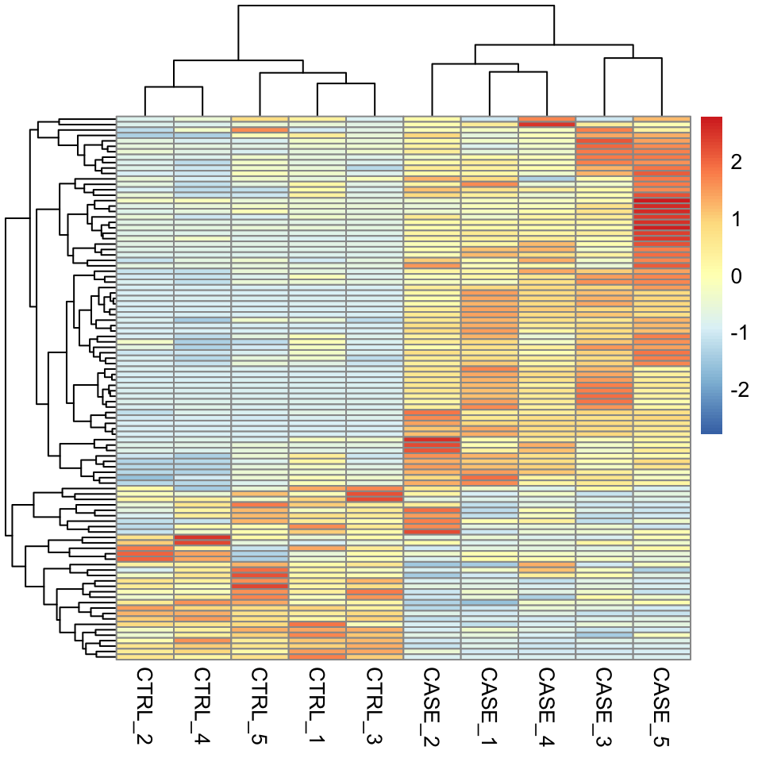
<p class="caption">(\#fig:tpmhierClust1)Clustering and visualization of the topmost variable genes as a heatmap.</p>
</div>

We can also overlay some annotation tracks to observe the clusters. 
Here it is important to observe whether the replicates of the same sample cluster most closely with each other, or not. Overlaying the heatmap with such annotation and displaying sample groups with distinct colors helps quickly see if there are samples that don't cluster as expected (see Figure \@ref(fig:tpmhierclust2) ).  


```r
colData <- read.table(coldata_file, header = T, sep = '\t', 
                      stringsAsFactors = TRUE)
pheatmap(tpm[selectedGenes,], scale = 'row', 
         show_rownames = FALSE, 
         annotation_col = colData)
```

<div class="figure" style="text-align: center">
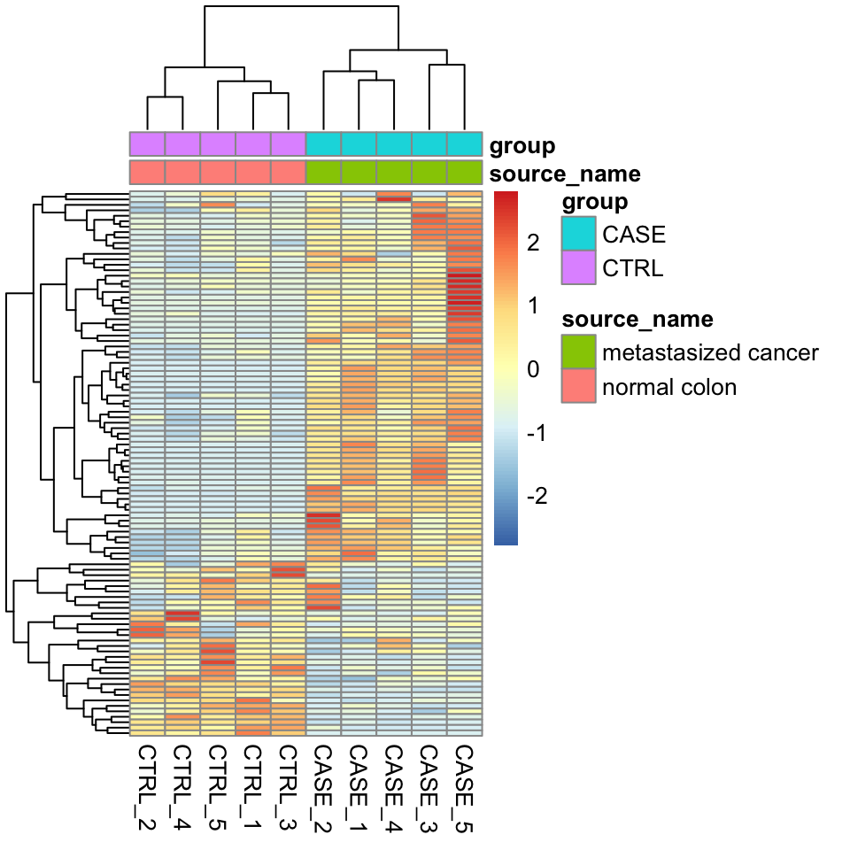
<p class="caption">(\#fig:tpmhierclust2)Clustering samples as a heatmap with sample annotations.</p>
</div>

#### PCA

Let's make a PCA plot \index{principal component analysis (PCA)} to see the clustering of replicates as a scatter plot in two dimensions (Figure \@ref(fig:pca1)). 


```r
library(stats)
library(ggplot2)
#transpose the matrix 
M <- t(tpm[selectedGenes,])
# transform the counts to log2 scale 
M <- log2(M + 1)
#compute PCA 
pcaResults <- prcomp(M)

#plot PCA results making use of ggplot2's autoplot function
#ggfortify is needed to let ggplot2 know about PCA data structure. 
autoplot(pcaResults, data = colData, colour = 'group')
```

<div class="figure" style="text-align: center">
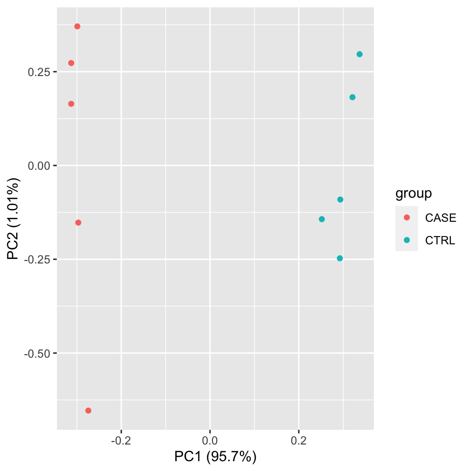
<p class="caption">(\#fig:pca1)PCA plot of samples using TPM counts.</p>
</div>

We should observe here whether the samples from the case group (CASE) and samples from the control group (CTRL) can be split into two distinct clusters on the scatter plot of the first two largest principal components. 

We can use the `summary` function to summarize the PCA results to observe the contribution of the principal components in the explained variation. 


```r
summary(pcaResults)
```

```
## Importance of components:
##                           PC1     PC2     PC3     PC4     PC5    PC6     PC7
## Standard deviation     24.396 2.50514 2.39327 1.93841 1.79193 1.6357 1.46059
## Proportion of Variance  0.957 0.01009 0.00921 0.00604 0.00516 0.0043 0.00343
## Cumulative Proportion   0.957 0.96706 0.97627 0.98231 0.98747 0.9918 0.99520
##                            PC8     PC9      PC10
## Standard deviation     1.30902 1.12657 4.616e-15
## Proportion of Variance 0.00276 0.00204 0.000e+00
## Cumulative Proportion  0.99796 1.00000 1.000e+00
```

#### Correlation plots

Another complementary approach to see the reproducibility of the experiments is to compute the correlation scores between each pair of samples and draw a correlation plot. \index{correlation}

Let's first compute pairwise correlation scores between every pair of samples.


```r
library(stats)
correlationMatrix <- cor(tpm)
```

Let's have a look at how the correlation matrix looks (\@ref(tab:corrplot2))
(showing only two samples each of case and control samples):


Table: (\#tab:corrplot2)Correlation scores between samples

             CASE_1      CASE_2      CTRL_1      CTRL_2
-------  ----------  ----------  ----------  ----------
CASE_1    1.0000000   0.9924606   0.9594011   0.9635760
CASE_2    0.9924606   1.0000000   0.9725646   0.9793835
CTRL_1    0.9594011   0.9725646   1.0000000   0.9879862
CTRL_2    0.9635760   0.9793835   0.9879862   1.0000000

We can also draw more visually appealing correlation plots using the `corrplot` package (Figure \@ref(fig:corrplot3)). 
Using the `addrect` argument, we can split clusters into groups and surround them with rectangles. 
By setting the `addCoef.col` argument to 'white', we can display the correlation coefficients as numbers in white color. 


```r
library(corrplot)
corrplot(correlationMatrix, order = 'hclust', 
         addrect = 2, addCoef.col = 'white', 
         number.cex = 0.7) 
```

<div class="figure" style="text-align: center">
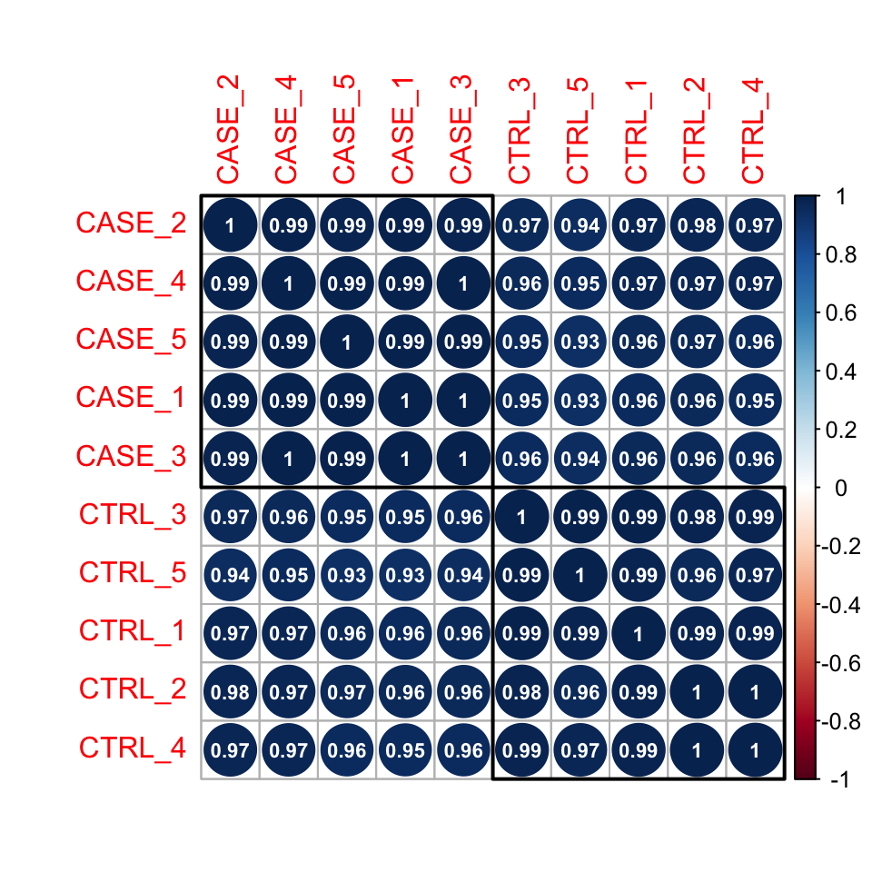
<p class="caption">(\#fig:corrplot3)Correlation plot of samples ordered by hierarchical clustering</p>
</div>


Here pairwise correlation levels are visualized as colored circles. `Blue` indicates positive correlation, while `Red` indicates negative correlation. 

We could also plot this correlation matrix as a heatmap (Figure \@ref(fig:corrplot4)). As all the samples have a high pairwise 
correlation score, using a heatmap instead of a corrplot helps to see the differences between samples more easily. The 
`annotation_col` argument helps to display sample annotations and the `cutree_cols` argument is set to 2 to split the clusters into two groups based on the hierarchical clustering results. 


```r
library(pheatmap)
# split the clusters into two based on the clustering similarity 
pheatmap(correlationMatrix,  
         annotation_col = colData, 
         cutree_cols = 2)
```

<div class="figure" style="text-align: center">
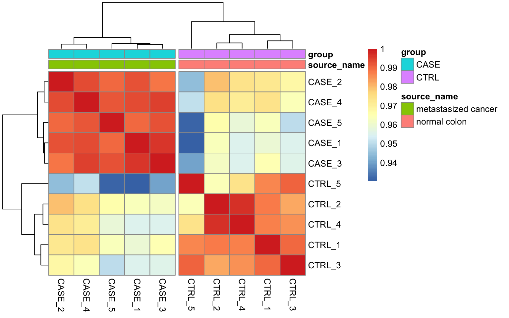
<p class="caption">(\#fig:corrplot4)Pairwise correlation of samples displayed as a heatmap.</p>
</div>


### Differential expression analysis

Differential expression analysis allows us to test tens of thousands of hypotheses (one test for each gene) against the null hypothesis that the activity of the gene stays the same in two different conditions. There are multiple limiting factors that influence the power of detecting genes that have real changes between two biological conditions. Among these are the limited number of biological replicates, non-normality of the distribution of the read counts, and higher uncertainty of measurements for lowly expressed genes than highly expressed genes [@love_moderated_2014]. Tools such as `edgeR` and `DESeq2` address these limitations using sophisticated statistical models in order to maximize the amount of knowledge that can be extracted from such noisy datasets. In essence, these models assume that for each gene, the read counts are generated by a negative binomial distribution\index{negative binomial distribution}. This is a popular distribution that is used for modeling count data. This distribution can be specified with a mean parameter, $m$, and a dispersion parameter, $\alpha$. The dispersion parameter $\alpha$ is directly related to the variance as the variance of this distribution is formulated as: $m+\alpha m^{2}$. Therefore, estimating these parameters are crucial for differential expression tests. The methods used in `edgeR` and `DESeq2` use dispersion estimates from other genes with similar counts to precisely estimate the per-gene dispersion values. With accurate dispersion parameter estimates, one can estimate the variance more precisely, which in turn
improves the result of the differential expression test. Although statistical models are different, the process here is similar to the moderated t-test \index{moderated t-test}and qualifies as an empirical Bayes method \index{empirical Bayes methods} which,we introduced in Chapter \@ref(stats). There, we calculated gene-wise variability and shrunk each gene-wise variability towards the median variability of all genes. In the case of RNA-seq the dispersion coefficient $\alpha$ is shrunk towards the value of dispersion from other genes with similar read counts.

Now let us take a closer look at the `DESeq2` \index{R Packages!\texttt{DESeq2}}workflow and how it calculates differential expression: 

1. The read counts are normalized by computing size factors, which addresses the differences not only in the library sizes, but also the library compositions. 
2. For each gene, a dispersion estimate is calculated. The dispersion value computed by `DESeq2` is equal to the squared coefficient of variation (variation divided by the mean).  
3. A line is fit across the dispersion estimates of all genes computed in 2) versus the mean normalized counts of the genes. 
4. Dispersion values of each gene is shrink towards the fitted line in 3). 
5. A Generalized Linear Model\index{generalized linear model} is fitted which considers additional confounding variables related to the experimental design such as sequencing batches, treatment, temperature, patient's age, sequencing technology, etc., and uses negative binomial distribution for fitting count data.
6. For a given contrast (e.g. treatment type: drug-A versus untreated), a test for differential expression is carried out against the null hypothesis that the log fold change of the normalized counts of the gene in the given pair of groups is exactly zero. 
7. It adjusts p-values for multiple-testing. 

In order to carry out a differential expression analysis using `DESeq2`, three kinds of inputs are necessary:

1. The **read count table**: This table must be raw read counts as integers that are not processed in any form by a normalization technique. The rows represent features (e.g. genes, transcripts, genomic intervals) and columns represent samples. 
2. A **colData** table: This table describes the experimental design. 
3. A **design formula**: This formula is needed to describe the variable of interest in the analysis (e.g. treatment status) along with (optionally) other covariates (e.g. batch, temperature, sequencing technology). 

Let's define these inputs:


```r
#remove the 'width' column
countData <- as.matrix(subset(counts, select = c(-width)))
#define the experimental setup 
colData <- read.table(coldata_file, header = T, sep = '\t', stringsAsFactors = TRUE)
#define the design formula
designFormula <- "~ group"
```

Now, we are ready to run `DESeq2`. 


```r
library(DESeq2)
library(stats)
#create a DESeq dataset object from the count matrix and the colData 
dds <- DESeqDataSetFromMatrix(countData = countData, 
                              colData = colData, 
                              design = as.formula(designFormula))
#print dds object to see the contents
print(dds)
```

```
## class: DESeqDataSet 
## dim: 19719 10 
## metadata(1): version
## assays(1): counts
## rownames(19719): TSPAN6 TNMD ... MYOCOS HSFX3
## rowData names(0):
## colnames(10): CASE_1 CASE_2 ... CTRL_4 CTRL_5
## colData names(2): source_name group
```

The `DESeqDataSet` object contains all the information about the experimental setup, the read counts, and the design formulas. Certain functions can be used to access this information separately: `rownames(dds)` shows which features are used in the study (e.g. genes), `colnames(dds)` displays the studied samples, `counts(dds)` displays the count table, and `colData(dds)` displays the experimental setup. 

Remove genes that have almost no information in any of the given samples. 

```r
#For each gene, we count the total number of reads for that gene in all samples 
#and remove those that don't have at least 1 read. 
dds <- dds[ rowSums(DESeq2::counts(dds)) > 1, ]
```

Now, we can use the `DESeq()` function of `DESeq2`, which is a wrapper function that implements estimation of size factors to normalize the counts, estimation of dispersion values, and computing a GLM model based on the experimental design formula. This function returns a `DESeqDataSet` object, which is an updated version of the `dds` variable that we pass to the function as input. 

```r
dds <- DESeq(dds)
```

Now, we can compare and contrast the samples based on different variables of interest. In this case, we currently have only one variable, which is the `group` variable that determines if a sample belongs to the CASE group or the CTRL group. 


```r
#compute the contrast for the 'group' variable where 'CTRL' 
#samples are used as the control group. 
DEresults = results(dds, contrast = c("group", 'CASE', 'CTRL'))
#sort results by increasing p-value
DEresults <- DEresults[order(DEresults$pvalue),]
```

Thus we have obtained a table containing the differential expression status of case samples compared to the control samples. 

It is important to note that the sequence of the elements provided in the `contrast` argument determines which group of samples are to be used as the control. This impacts the way the results are interpreted, for instance, if a gene is found up-regulated (has a positive log2 fold change), the up-regulation status is only relative to the factor that is provided as control. In this case, we used samples from the "CTRL" group as control and contrasted the samples from the "CASE" group with respect to the "CTRL" samples. Thus genes with a positive log2 fold change are called up-regulated in the case samples with respect to the control, while genes with a negative log2 fold change are down-regulated in the case samples. Whether the deregulation is significant or not, warrants assessment of the adjusted p-values. 

Let's have a look at the contents of the `DEresults` table. 


```r
#shows a summary of the results
print(DEresults)
```

```
## log2 fold change (MLE): group CASE vs CTRL 
## Wald test p-value: group CASE vs CTRL 
## DataFrame with 19097 rows and 6 columns
##             baseMean log2FoldChange     lfcSE       stat       pvalue
##            <numeric>      <numeric> <numeric>  <numeric>    <numeric>
## CYP2E1       4829889        9.36024  0.215223    43.4909  0.00000e+00
## FCGBP       10349993       -7.57579  0.186433   -40.6355  0.00000e+00
## ASGR2         426422        8.01830  0.216207    37.0863 4.67898e-301
## GCKR          100183        7.82841  0.233376    33.5442 1.09479e-246
## APOA5         438054       10.20248  0.312503    32.6477 8.64906e-234
## ...              ...            ...       ...        ...          ...
## CCDC195      20.4981      -0.215607   2.89255 -0.0745386           NA
## SPEM3        23.6370     -22.154765   3.02785 -7.3170030           NA
## AC022167.5   21.8451      -2.056240   2.89545 -0.7101618           NA
## BX276092.9   29.9636       0.407326   2.89048  0.1409199           NA
## ETDC         22.5675      -1.795274   2.89421 -0.6202983           NA
##                    padj
##               <numeric>
## CYP2E1      0.00000e+00
## FCGBP       0.00000e+00
## ASGR2      2.87741e-297
## GCKR       5.04945e-243
## APOA5      3.19133e-230
## ...                 ...
## CCDC195              NA
## SPEM3                NA
## AC022167.5           NA
## BX276092.9           NA
## ETDC                 NA
```

The first three lines in this output show the contrast and the statistical test that were used to compute these results, along with the dimensions of the resulting table (number of columns and rows). Below these lines is the actual table with 6 columns: `baseMean` represents the average normalized expression of the gene across all considered samples. `log2FoldChange` represents the base-2 logarithm of the fold change of the normalized expression of the gene in the given contrast. `lfcSE` represents the standard error of log2 fold change estimate, and `stat` is the statistic calculated in the contrast which is translated into a `pvalue` and adjusted for multiple testing in the `padj` column. To find out about the importance of adjusting for multiple testing, see Chapter \@ref(stats). 

#### Diagnostic plots 

At this point, before proceeding to do any downstream analysis and jumping to conclusions about the biological insights that are reachable with the experimental data at hand, it is important to do some more diagnostic tests to improve our confidence about the quality of the data and the experimental setup. 


##### MA plot
An MA plot is useful to observe if the data normalization worked well (Figure \@ref(fig:DEmaplot)). The MA plot is a scatter plot where the x-axis denotes the average of normalized counts across samples and the y-axis denotes the log fold change in the given contrast. Most points are expected to be on the horizontal 0 line (most genes are not expected to be differentially expressed).


```r
library(DESeq2)
DESeq2::plotMA(object = dds, ylim = c(-5, 5))
```

<div class="figure" style="text-align: center">
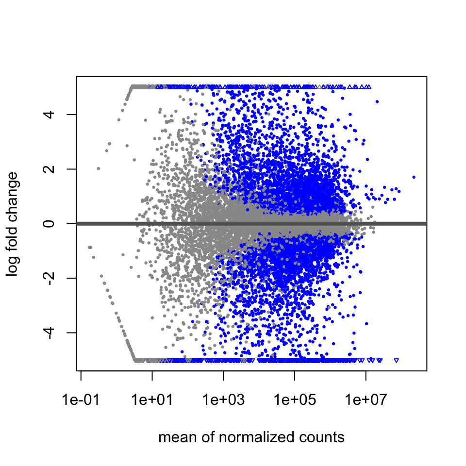
<p class="caption">(\#fig:DEmaplot)MA plot of differential expression results.</p>
</div>


##### P-value distribution

It is also important to observe the distribution of raw p-values (Figure \@ref(fig:DEpvaldist)). We expect to see a peak around low p-values and a uniform distribution at P-values above 0.1. Otherwise, adjustment for multiple testing does not work and the results are not meaningful.


```r
library(ggplot2)
ggplot(data = as.data.frame(DEresults), aes(x = pvalue)) + 
  geom_histogram(bins = 100)
```

<div class="figure" style="text-align: center">
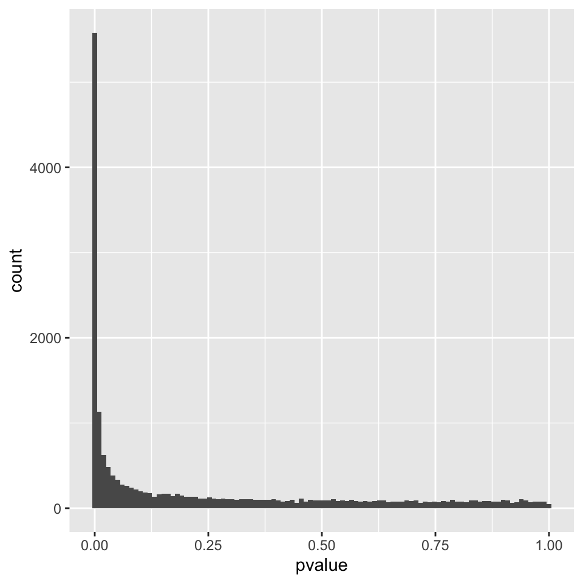
<p class="caption">(\#fig:DEpvaldist)P-value distribution genes before adjusting for multiple testing.</p>
</div>


##### PCA plot
A final diagnosis is to check the biological reproducibility of the sample replicates in a PCA plot or a heatmap. To plot the PCA results, we need to extract the normalized counts from the DESeqDataSet object. It is possible to color the points in the scatter plot by the variable of interest, which helps to see if the replicates cluster well (Figure \@ref(fig:DEpca)). 


```r
library(DESeq2)
# extract normalized counts from the DESeqDataSet object
countsNormalized <- DESeq2::counts(dds, normalized = TRUE)

# select top 500 most variable genes
selectedGenes <- names(sort(apply(countsNormalized, 1, var), 
                            decreasing = TRUE)[1:500])

plotPCA(countsNormalized[selectedGenes,], 
        col = as.numeric(colData$group), adj = 0.5, 
        xlim = c(-0.5, 0.5), ylim = c(-0.5, 0.6))
```

<div class="figure" style="text-align: center">
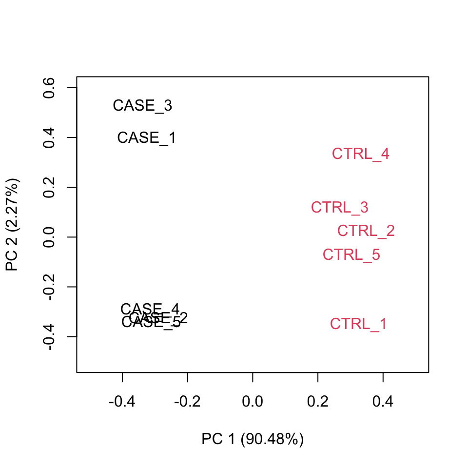
<p class="caption">(\#fig:DEpca)Principle component analysis plot based on top 500 most variable genes.</p>
</div>

Alternatively, the normalized counts can be transformed using the `DESeq2::rlog` function and `DESeq2::plotPCA()` can be readily used to plot the PCA results (Figure \@ref(fig:DErldnorm)). 


```r
rld <- rlog(dds)
DESeq2::plotPCA(rld, ntop = 500, intgroup = 'group') + 
  ylim(-50, 50) + theme_bw()
```

<div class="figure" style="text-align: center">
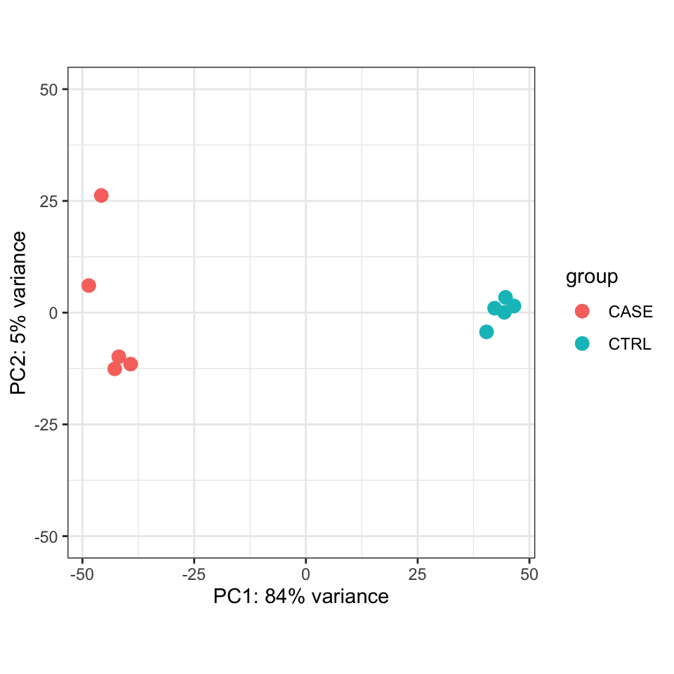
<p class="caption">(\#fig:DErldnorm)PCA plot of top 500 most variable genes </p>
</div>

##### Relative Log Expression (RLE) plot

A similar plot to the MA plot is the RLE (Relative Log Expression) plot that is useful in finding out if the data at hand needs normalization [@gandolfo_rle_2018]. Sometimes, even the datasets normalized using the explained methods above may need further normalization due to unforeseen sources of variation that might stem from the library preparation, the person who carries out the experiment, the date of sequencing, the temperature changes in the laboratory at the time of library preparation, and so on and so forth. The RLE plot is a quick diagnostic that can be applied on the raw or normalized count matrices to see if further processing is required. 

Let's do RLE plots on the raw counts and normalized counts using the `EDASeq` package [@risso_gc-content_2011]\index{R Packages!\texttt{EDASeq}} (see Figure \@ref(fig:DErleplot)). 


```r
library(EDASeq)
par(mfrow = c(1, 2))
plotRLE(countData, outline=FALSE, ylim=c(-4, 4), 
        col=as.numeric(colData$group), 
        main = 'Raw Counts')
plotRLE(DESeq2::counts(dds, normalized = TRUE), 
        outline=FALSE, ylim=c(-4, 4), 
        col = as.numeric(colData$group), 
        main = 'Normalized Counts')
```

<div class="figure" style="text-align: center">
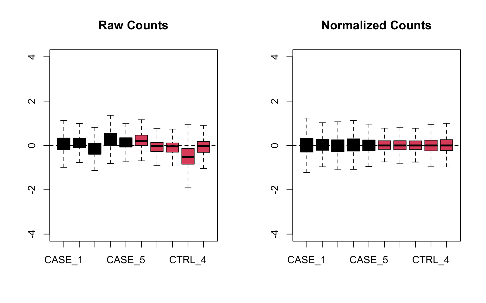
<p class="caption">(\#fig:DErleplot)Relative log expression plots based on raw and normalized count matrices</p>
</div>

Here the RLE plot is comprised of boxplots, where each box-plot represents the distribution of the relative log expression of the genes expressed in the corresponding sample. Each gene's expression is divided by the median expression value of that gene across all samples. Then this is transformed to log scale, which gives the relative log expression value for a single gene. The RLE values for all the genes from a sample are visualized as a boxplot. 

Ideally the boxplots are centered around the horizontal zero line and are as tightly distributed as possible [@risso_normalization_2014]. From the plots that we have made for the raw and normalized count data, we can observe how the normalized dataset has improved upon the raw count data for all the samples. However, in some cases, it is important to visualize RLE plots in combination with other diagnostic plots such as PCA plots, heatmaps, and correlation plots to see if there is more unwanted variation in the data, which can be further accounted for using packages such as `RUVSeq` [@risso_normalization_2014]\index{R Packages!\texttt{RUVSeq}}  and `sva` [@leek_sva_2012]\index{R Packages!\texttt{sva}}. We will cover details about the `RUVSeq` package to account for unwanted sources of noise in RNA-seq datasets in later sections. 

### Functional enrichment analysis

#### GO term analysis 

In a typical differential expression analysis, thousands of genes are found differentially expressed between two groups of samples. While prior knowledge of the functions of individual genes can give some clues about what kind of cellular processes have been affected, e.g. by a drug treatment, manually going through the whole list of thousands of genes would be very cumbersome and not be very informative in the end. Therefore a commonly used tool to address this problem is to do enrichment analyses of functional terms that appear associated to the given set of differentially expressed genes more often than expected by chance. The functional terms are usually associated to multiple genes. Thus, genes can be grouped into sets by shared functional terms. However, it is important to have an agreed upon controlled vocabulary on the list of terms used to describe the functions of genes. Otherwise, it would be impossible to exchange scientific results globally. That's why initiatives such as the Gene Ontology Consortium have collated a list of Gene Ontology (GO) \index{Gene Ontology (GO)}terms for each gene. GO term analysis is probably the most common analysis applied after a differential expression analysis. GO term analysis helps quickly find out systematic changes that can describe differences between groups of samples. 

In R, one of the simplest ways to do functional enrichment analysis for a set of genes is via the `gProfileR` package. \index{R Packages!\texttt{gProfileR}}.

Let's select the genes that are significantly differentially expressed between the case and control samples. 
Let's extract genes that have an adjusted p-value below 0.1 and that show a 2-fold change (either negative or positive) in the case compared to control. We will then feed this gene set into the `gProfileR` function. The top 10 detected GO terms are displayed in Table \@ref(tab:GOanalysistable).


```r
library(DESeq2)
library(gProfileR)
library(knitr)
# extract differential expression results
DEresults <- results(dds, contrast = c('group', 'CASE', 'CTRL'))

#remove genes with NA values 
DE <- DEresults[!is.na(DEresults$padj),]
#select genes with adjusted p-values below 0.1
DE <- DE[DE$padj < 0.1,]
#select genes with absolute log2 fold change above 1 (two-fold change)
DE <- DE[abs(DE$log2FoldChange) > 1,]

#get the list of genes of interest
genesOfInterest <- rownames(DE)

#calculate enriched GO terms
goResults <- gprofiler(query = genesOfInterest, 
                     organism = 'hsapiens', 
                     src_filter = 'GO', 
                     hier_filtering = 'moderate')
```


Table: (\#tab:GOanalysistable)Top GO terms sorted by p-value.

      p.value   term.size   precision  domain   term.name                            
---  --------  ----------  ----------  -------  -------------------------------------
64          0        2740       0.223  CC       plasma membrane part                 
23          0        1609       0.136  BP       ion transport                        
16          0        3656       0.258  BP       regulation of biological quality     
30          0         385       0.042  BP       extracellular structure organization 
34          0        7414       0.452  BP       multicellular organismal process     
78          0        1069       0.090  MF       transmembrane transporter activity   
47          0        1073       0.090  BP       organic acid metabolic process       
5           0         975       0.083  BP       response to drug                     
18          0        1351       0.107  BP       biological adhesion                  
31          0        4760       0.302  BP       system development                   

#### Gene set enrichment analysis 

A gene set is a collection of genes with some common property. This shared property among a set of genes could be a GO term, a common biological pathway, a shared interaction partner, or any biologically relevant commonality that is meaningful in the context of the pursued experiment. Gene set enrichment analysis (GSEA) is a valuable exploratory analysis tool that can associate systematic changes to a high-level function rather than individual genes. Analysis of coordinated changes of expression levels of gene sets can provide complementary benefits on top of per-gene-based differential expression analyses. For instance, consider a gene set belonging to a biological pathway where each member of the pathway displays a slight deregulation in a disease sample compared to a normal sample. In such a case, individual genes might not be picked up by the per-gene-based differential expression analysis. Thus, the GO/Pathway enrichment on the differentially expressed list of genes would not show an enrichment of this pathway. However, the additive effect of slight changes of the genes could amount to a large effect at the level of the gene set, thus the pathway could be detected as a significant pathway that could explain the mechanistic problems in the disease sample. 

We use the bioconductor package `gage` [@luo_gage:_2009] \index{R Packages!\texttt{gage}}to demonstrate how to do GSEA using normalized expression data of the samples as input. Here we are using only two gene sets: one from the top GO term discovered from the previous GO analysis, one that we compile by randomly selecting a list of genes. However, annotated gene sets can be used from databases such as MSIGDB [@subramanian_gene_2005], which compile gene sets from a variety of resources such as KEGG [@kanehisa_kegg_2016] and REACTOME [@fabregat_reactome_2018]. 


```r
#Let's define the first gene set as the list of genes from one of the
#significant GO terms found in the GO analysis. order go results by pvalue
goResults <- goResults[order(goResults$p.value),]
#restrict the terms that have at most 100 genes overlapping with the query
go <- goResults[goResults$overlap.size < 100,]
# use the top term from this table to create a gene set 
geneSet1 <- unlist(strsplit(go[1,]$intersection, ','))

#Define another gene set by just randomly selecting 25 genes from the counts
#table get normalized counts from DESeq2 results
normalizedCounts <- DESeq2::counts(dds, normalized = TRUE)
geneSet2 <- sample(rownames(normalizedCounts), 25)

geneSets <- list('top_GO_term' = geneSet1,
                 'random_set' = geneSet2)
```

Using the defined gene sets, we'd like to do a group comparison between the case samples with respect to the control samples. 


```r
library(gage)
#use the normalized counts to carry out a GSEA. 
gseaResults <- gage(exprs = log2(normalizedCounts+1), 
           ref = match(rownames(colData[colData$group == 'CTRL',]), 
                       colnames(normalizedCounts)), 
           samp = match(rownames(colData[colData$group == 'CASE',]), 
                        colnames(normalizedCounts)),
           gsets = geneSets, compare = 'as.group')
```

We can observe if there is a significant up-regulation or down-regulation of the gene set in the case group compared to the controls by accessing `gseaResults$greater` as in Table \@ref(tab:gseaPost1) or `gseaResults$less` as in Table \@ref(tab:gseaPost2). 


Table: (\#tab:gseaPost1)Up-regulation statistics

               p.geomean   stat.mean    p.val    q.val   set.size     exp1
------------  ----------  ----------  -------  -------  ---------  -------
top_GO_term       0.0000      7.1994   0.0000   0.0000         32   0.0000
random_set        0.5832     -0.2113   0.5832   0.5832         25   0.5832


Table: (\#tab:gseaPost2)Down-regulation statistics

               p.geomean   stat.mean    p.val    q.val   set.size     exp1
------------  ----------  ----------  -------  -------  ---------  -------
random_set        0.4168     -0.2113   0.4168   0.8336         25   0.4168
top_GO_term       1.0000      7.1994   1.0000   1.0000         32   1.0000

We can see that the random gene set shows no significant up- or down-regulation (Tables \@ref(tab:gseaPost1) and (\@ref(tab:gseaPost2)), while the gene set we defined using the top GO term shows a significant up-regulation (adjusted p-value < 0.0007) (\@ref(tab:gseaPost1)). It is worthwhile to visualize these systematic changes in a heatmap as in Figure \@ref(fig:gseaPost3). 


```r
library(pheatmap)
# get the expression data for the gene set of interest
M <- normalizedCounts[rownames(normalizedCounts) %in% geneSet1, ]
# log transform the counts for visualization scaling by row helps visualizing
# relative change of expression of a gene in multiple conditions
pheatmap(log2(M+1), 
         annotation_col = colData, 
         show_rownames = TRUE, 
         fontsize_row = 8,
         scale = 'row', 
         cutree_cols = 2, 
         cutree_rows = 2)
```

<div class="figure" style="text-align: center">

<p class="caption">(\#fig:gseaPost3)Heatmap of expression value from the genes with the top GO term.</p>
</div>

We can see that almost all genes from this gene set display an increased level of expression in the case samples
compared to the controls. 

### Accounting for additional sources of variation 

When doing a differential expression analysis in a case-control setting, the variable of interest, i.e. the variable that explains the separation of the case samples from the control, is usually the treatment, genotypic differences, a certain phenotype, etc. However, in reality, depending on how the experiment and the sequencing were designed, there may be additional factors that might contribute to the variation between the compared samples. Sometimes, such variables are known, for instance, the date of the sequencing for each sample (batch information), or the temperature under which samples were kept. Such variables are not necessarily biological but rather technical, however, they still impact the measurements obtained from an RNA-seq experiment. Such variables can introduce systematic shifts in the obtained measurements. Here, we will demonstrate: firstly how to account for such variables using DESeq2, when the possible sources of variation are actually known; secondly, how to account for such variables when all we have is just a count table but we observe that the variable of interest only explains a small proportion of the differences between case and control samples.  

#### Accounting for covariates using DESeq2

For demonstration purposes, we will use a subset of the count table obtained for a heart disease study, where there are RNA-seq samples from subjects with normal and failing hearts. We again use a subset of the samples, focusing on 6 case and 6 control samples and we only consider protein-coding genes (for speed concerns). 

Let's import count and colData for this experiment. 

```r
counts_file <- system.file('extdata/rna-seq/SRP021193.raw_counts.tsv', 
                           package = 'compGenomRData')
colData_file <- system.file('extdata/rna-seq/SRP021193.colData.tsv', 
                            package = 'compGenomRData')

counts <- read.table(counts_file)
colData <- read.table(colData_file, header = T, sep = '\t', 
                      stringsAsFactors = TRUE)
```

Let's take a look at how the samples cluster by calculating the TPM counts as displayed as a heatmap in Figure \@ref(fig:batcheffects2).  


```r
library(pheatmap)
#find gene length normalized values 
geneLengths <- counts$width
rpk <- apply( subset(counts, select = c(-width)), 2, 
              function(x) x/(geneLengths/1000))
#normalize by the sample size using rpk values
tpm <- apply(rpk, 2, function(x) x / sum(as.numeric(x)) * 10^6)

selectedGenes <- names(sort(apply(tpm, 1, var), 
                            decreasing = T)[1:100])
pheatmap(tpm[selectedGenes,], 
             scale = 'row',
             annotation_col = colData, 
             show_rownames = FALSE)
```

<div class="figure" style="text-align: center">
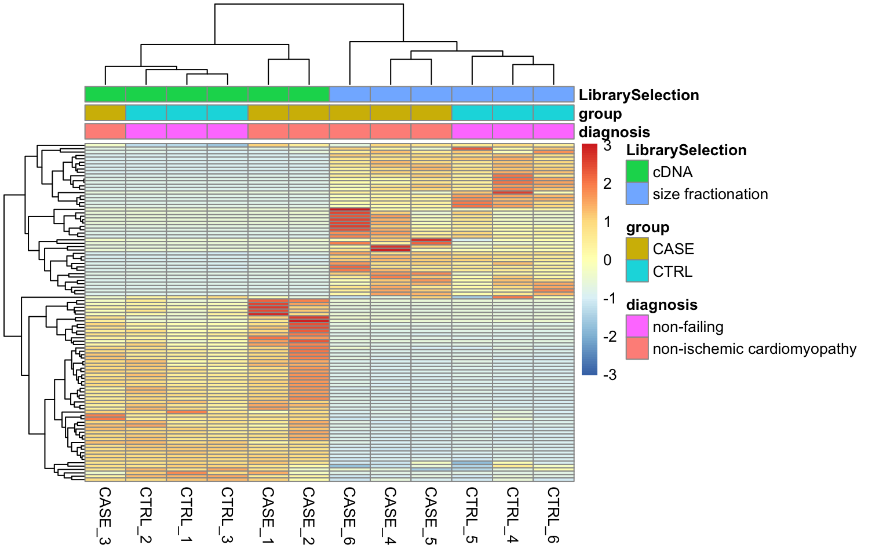
<p class="caption">(\#fig:batcheffects2)Visualizing batch effects in an experiment.</p>
</div>

Here we can see from the clusters that the dominating variable is the 'Library Selection' variable rather than the 'diagnosis' variable, which determines the state of the organ from which the sample was taken. Case and control samples are all mixed in both two major clusters. However, ideally, we'd like to see a separation of the case and control samples regardless of the additional covariates. When testing for differential gene expression between conditions, such confounding variables can be accounted for using `DESeq2`. Below is a demonstration of how we instruct `DESeq2` to account for the 'library selection' variable:


```r
library(DESeq2)
# remove the 'width' column from the counts matrix
countData <- as.matrix(subset(counts, select = c(-width)))
# set up a DESeqDataSet object
dds <- DESeqDataSetFromMatrix(countData = countData, 
                              colData = colData, 
                              design = ~ LibrarySelection + group)
```

When constructing the design formula, it is very important to pay attention to the sequence of variables. We leave the variable of interest to the last and we can add as many covariates as we want to the beginning of the design formula. Please refer to the `DESeq2` vignette if you'd like to learn more about how to construct design formulas. 

Now, we can run the differential expression analysis as has been demonstrated previously. 

```r
# run DESeq
dds <- DESeq(dds)
# extract results
DEresults <- results(dds, contrast = c('group', 'CASE', 'CTRL'))
```

#### Accounting for estimated covariates using RUVSeq

In cases when the sources of potential variation are not known, it is worthwhile to use tools such as `RUVSeq` or `sva` that can estimate potential sources of variation and clean up the counts table from those sources of variation. Later on, the estimated covariates can be integrated into DESeq2's design formula. 

Let's see how to utilize the `RUVseq` package to first diagnose the problem and then solve it. Here, for demonstration purposes, we'll use a count table from a lung carcinoma study in which a transcription factor (Ets homologous factor - EHF) is overexpressed and compared to the control samples with baseline EHF expression. Again, we only consider protein coding genes and use only five case and five control samples. The original data can be found on the `recount2` database with the accession 'SRP049988'. 


```r
counts_file <- system.file('extdata/rna-seq/SRP049988.raw_counts.tsv', 
                           package = 'compGenomRData')
colData_file <- system.file('extdata/rna-seq/SRP049988.colData.tsv', 
                            package = 'compGenomRData')

counts <- read.table(counts_file)
colData <- read.table(colData_file, header = T, 
                      sep = '\t', stringsAsFactors = TRUE)
# simplify condition descriptions
colData$source_name <- ifelse(colData$group == 'CASE', 
                              'EHF_overexpression', 'Empty_Vector')
```

Let's start by making heatmaps of the samples using TPM counts (see Figure \@ref(fig:ruvdiagnose1)).

```r
#find gene length normalized values 
geneLengths <- counts$width
rpk <- apply( subset(counts, select = c(-width)), 2, 
              function(x) x/(geneLengths/1000))
#normalize by the sample size using rpk values
tpm <- apply(rpk, 2, function(x) x / sum(as.numeric(x)) * 10^6)
selectedGenes <- names(sort(apply(tpm, 1, var), 
                            decreasing = T)[1:100])
pheatmap(tpm[selectedGenes,], 
             scale = 'row',
             annotation_col = colData, 
             cutree_cols = 2, 
             show_rownames = FALSE)
```

<div class="figure" style="text-align: center">
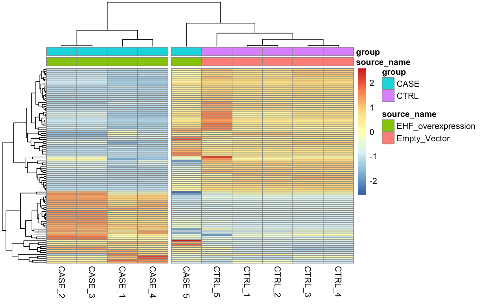
<p class="caption">(\#fig:ruvdiagnose1)Diagnostic plot to observe.</p>
</div>

We can see that the overall clusters look fine, except that one of the case samples (CASE_5) clusters more closely with the control samples than the other case samples. This mis-clustering could be a result of some batch effect, or any other technical preparation steps. However, the `colData` object doesn't contain any variables that we can use to pinpoint the exact cause of this. So, let's use `RUVSeq` to estimate potential covariates to see if the clustering results can be improved.

First, we set up the experiment: 


```r
library(EDASeq)
# remove 'width' column from counts
countData <- as.matrix(subset(counts, select = c(-width)))
# create a seqExpressionSet object using EDASeq package 
set <- newSeqExpressionSet(counts = countData,
                           phenoData = colData)
```

Next, let's make a diagnostic RLE plot on the raw count table.


```r
# make an RLE plot and a PCA plot on raw count data and color samples by group
par(mfrow = c(1,2))
plotRLE(set, outline=FALSE, ylim=c(-4, 4), col=as.numeric(colData$group))
plotPCA(set, col = as.numeric(colData$group), adj = 0.5, 
        ylim = c(-0.7, 0.5), xlim = c(-0.5, 0.5))
```

<div class="figure" style="text-align: center">
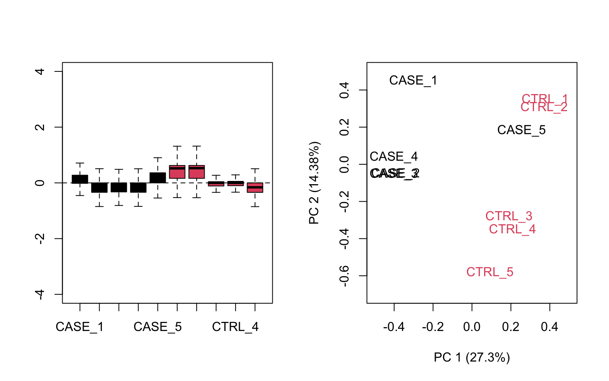
<p class="caption">(\#fig:ruvdiagnose2p1)Diagnostic RLE and PCA plots based on raw count table.</p>
</div>


```r
## make RLE and PCA plots on TPM matrix 
par(mfrow = c(1,2))
plotRLE(tpm, outline=FALSE, ylim=c(-4, 4), col=as.numeric(colData$group))
plotPCA(tpm, col=as.numeric(colData$group), adj = 0.5, 
        ylim = c(-0.3, 1), xlim = c(-0.5, 0.5))
```

<div class="figure" style="text-align: center">
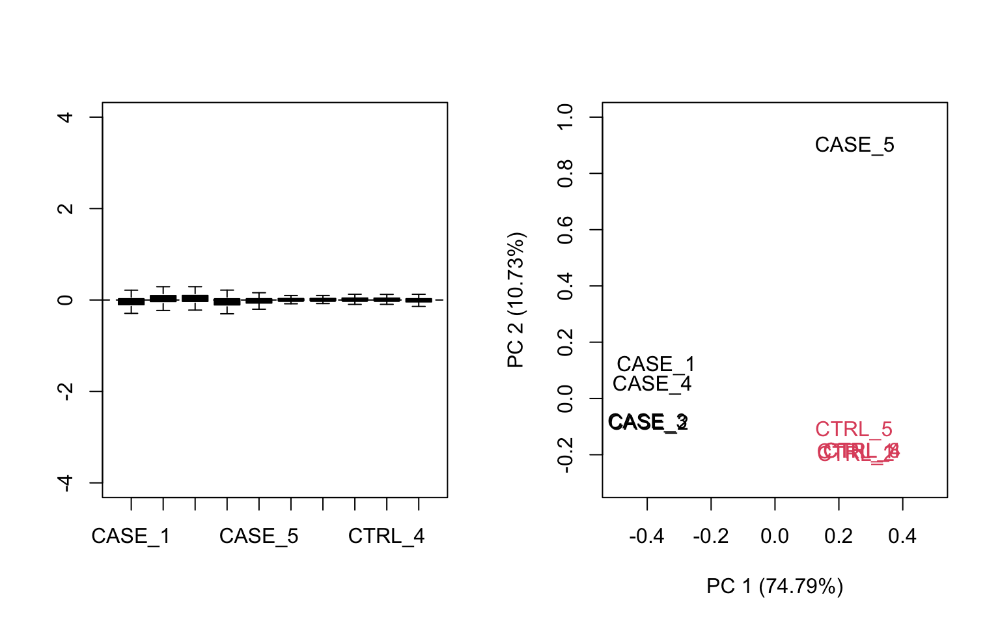
<p class="caption">(\#fig:ruvdiagnose2p2)Diagnostic RLE and PCA plots based on TPM normalized count table.</p>
</div>

Both RLE and PCA plots look better on normalized data (Figure \@ref(fig:ruvdiagnose2p2)) compared to raw data (Figure \@ref(fig:ruvdiagnose2p1)), but still suggest the necessity of further improvement, because the CASE_5 sample still clusters with the control samples. We haven't yet accounted for the source of unwanted variation. 

#### Removing unwanted variation from the data 

`RUVSeq` has three main functions for removing unwanted variation: `RUVg()`, `RUVs()`, and `RUVr()`. Here, we will demonstrate how to use `RUVg` and `RUVs`. `RUVr` will be left as an exercise for the reader. 

##### Using RUVg

One way of removing unwanted variation depends on using a set of reference genes that are not expected to change by the sources of technical variation. One strategy along this line is to use spike-in genes, which are artificially introduced into the sequencing run [@jiang_synthetic_2011]. However, there are many sequencing datasets that don't have this spike-in data available. In such cases, an empirical set of genes can be collected from the expression data by doing a differential expression analysis and discovering genes that are unchanged in the given conditions. These unchanged genes are used to clean up the data from systematic shifts in expression due to the unwanted sources of variation. Another strategy could be to use a set of house-keeping genes as negative controls, and use them as a reference to correct the systematic biases in the data. Let's use a list of ~500 house-keeping genes compiled here: https://www.tau.ac.il/~elieis/HKG/HK_genes.txt. 


```r
library(RUVSeq)
 
#source for house-keeping genes collection:
#https://m.tau.ac.il/~elieis/HKG/HK_genes.txt
HK_genes <- read.table(file = system.file("extdata/rna-seq/HK_genes.txt", 
                                          package = 'compGenomRData'), 
                       header = FALSE)
# let's take an intersection of the house-keeping genes with the genes available
# in the count table
house_keeping_genes <- intersect(rownames(set), HK_genes$V1)
```
We will now run `RUVg()` with the different number of factors of unwanted variation. We will plot the PCA after removing the unwanted variation. We should be able to see which `k` values, number of factors, produce better separation between sample groups.

```r
# now, we use these genes as the empirical set of genes as input to RUVg.
# we try different values of k and see how the PCA plots look 
 
par(mfrow = c(2, 2))
for(k in 1:4) {
  set_g <- RUVg(x = set, cIdx = house_keeping_genes, k = k)
  plotPCA(set_g, col=as.numeric(colData$group), cex = 0.9, adj = 0.5, 
          main = paste0('with RUVg, k = ',k), 
          ylim = c(-1, 1), xlim = c(-1, 1), )
}
```

<div class="figure" style="text-align: center">
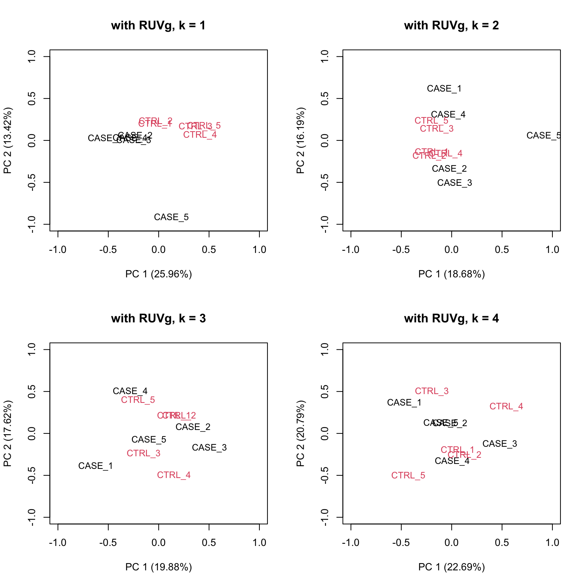
<p class="caption">(\#fig:ruvgf1)PCA plots on RUVg normalized data with varying number of covariates (k).</p>
</div>

Based on the separation of case and control samples in the PCA plots in Figure \@ref(fig:ruvgf1), 
we choose k = 1 and re-run the `RUVg()` function with the house-keeping genes to do more diagnostic plots. 


```r
# choose k = 1
 
set_g <- RUVg(x = set, cIdx = house_keeping_genes, k = 1)
```

Now let's do diagnostics: compare the count matrices with or without RUVg processing, comparing RLE plots (Figure \@ref(fig:ruvgf2)) and PCA plots (Figure \@ref(fig:ruvgf3)) to see the effect of RUVg on the normalization and separation of case and control samples. 


```r
# RLE plots
 
par(mfrow = c(1,2))
plotRLE(set, outline=FALSE, ylim=c(-4, 4), 
        col=as.numeric(colData$group), main = 'without RUVg')
plotRLE(set_g, outline=FALSE, ylim=c(-4, 4), 
        col=as.numeric(colData$group), main = 'with RUVg')
```

<div class="figure" style="text-align: center">
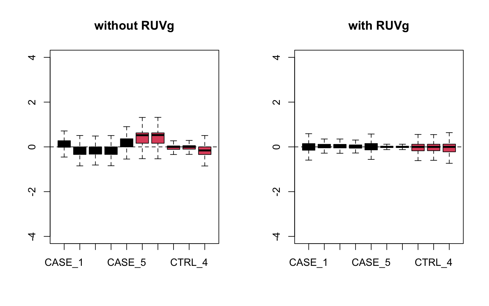
<p class="caption">(\#fig:ruvgf2)RLE plots to observe the effect of RUVg.</p>
</div>


```r
# PCA plots
 
par(mfrow = c(1,2))
plotPCA(set, col=as.numeric(colData$group), adj = 0.5,
        main = 'without RUVg', 
        ylim = c(-1, 0.5), xlim = c(-0.5, 0.5))
plotPCA(set_g, col=as.numeric(colData$group), adj = 0.5, 
        main = 'with RUVg',
        ylim = c(-1, 0.5), xlim = c(-0.5, 0.5))
```

<div class="figure" style="text-align: center">
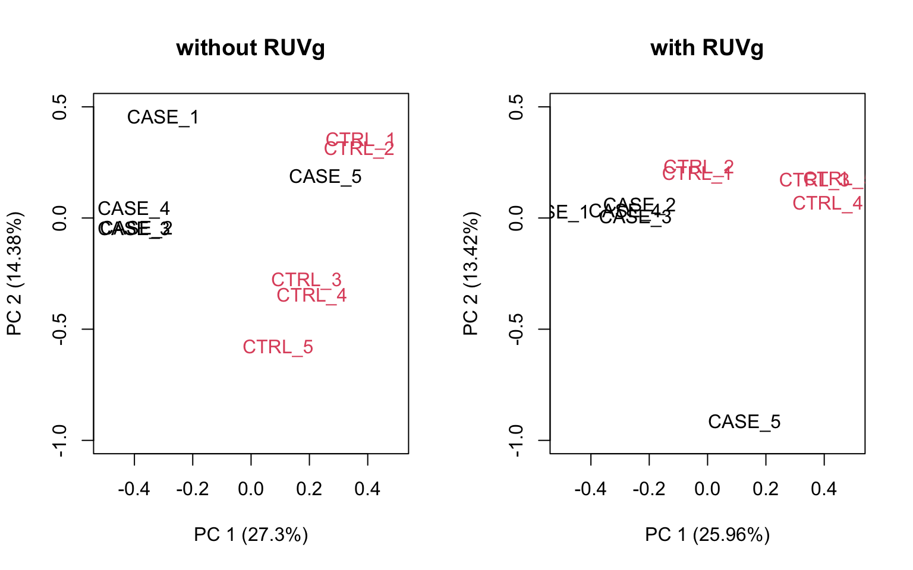
<p class="caption">(\#fig:ruvgf3)PCA plots to observe the effect of RUVg.</p>
</div>

We can observe that using `RUVg()` with house-keeping genes as reference has improved the clusters, however not yielded ideal separation. Probably the effect that is causing the 'CASE_5' to cluster with the control samples still hasn't been completely eliminated. 

##### Using RUVs

There is another strategy of `RUVSeq` that works better in the presence of replicates in the absence of a confounded experimental design, which is the `RUVs()` function. Let's see how that performs with this data. This time we don't use the house-keeping genes. We rather use all genes as input to `RUVs()`. This function estimates the correction factor by assuming that replicates should have constant biological variation, rather, the variation in the replicates are the unwanted variation.


```r
# make a table of sample groups from colData 
differences <- makeGroups(colData$group)
## looking for two different sources of unwanted variation (k = 2)
## use information from all genes in the expression object
par(mfrow = c(2, 2))
for(k in 1:4) {
  set_s <- RUVs(set, unique(rownames(set)), 
                k=k, differences) #all genes
  plotPCA(set_s, col=as.numeric(colData$group), 
          cex = 0.9, adj = 0.5, 
        main = paste0('with RUVs, k = ',k), 
        ylim = c(-1, 1), xlim = c(-0.6, 0.6))
}
```

<div class="figure" style="text-align: center">
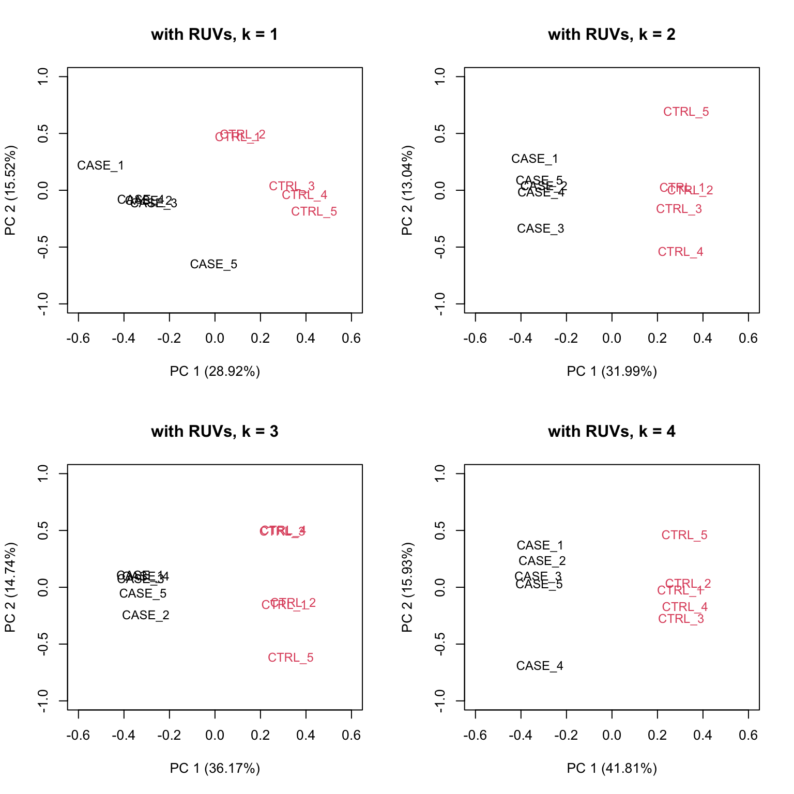
<p class="caption">(\#fig:ruvsf1)PCA plots on RUVs normalized data with varying number of covariates (k).</p>
</div>

Based on the separation of case and control samples in the PCA plots in Figure \@ref(fig:ruvsf1), 
we can see that the samples are better separated event at k = 2 when using `RUVs()`. Here, we re-run the `RUVs()` function using k = 2, in order to do more diagnostic plots. We try to pick a value of k that is good enough to distinguish the samples by condition of interest. While setting the value of k to higher values could improve the percentage of explained variation by the first principle component to up to 61%, we try to avoid setting the value unnecessarily high to avoid removing factors that might also correlate with important biological differences between conditions. 


```r
# choose k = 2
set_s <- RUVs(set, unique(rownames(set)), k=2, differences) #
```

Now let's do diagnostics again: compare the count matrices with or without RUVs processing, comparing RLE plots (Figure \@ref(fig:ruvsf2)) and PCA plots (Figure \@ref(fig:ruvsf3)) to see the effect of RUVg on the normalization and separation of case and control samples. 


```r
## compare the initial and processed objects
## RLE plots
 
par(mfrow = c(1,2))
plotRLE(set, outline=FALSE, ylim=c(-4, 4), 
        col=as.numeric(colData$group), 
        main = 'without RUVs')
plotRLE(set_s, outline=FALSE, ylim=c(-4, 4), 
        col=as.numeric(colData$group),
        main = 'with RUVs')
```

<div class="figure" style="text-align: center">
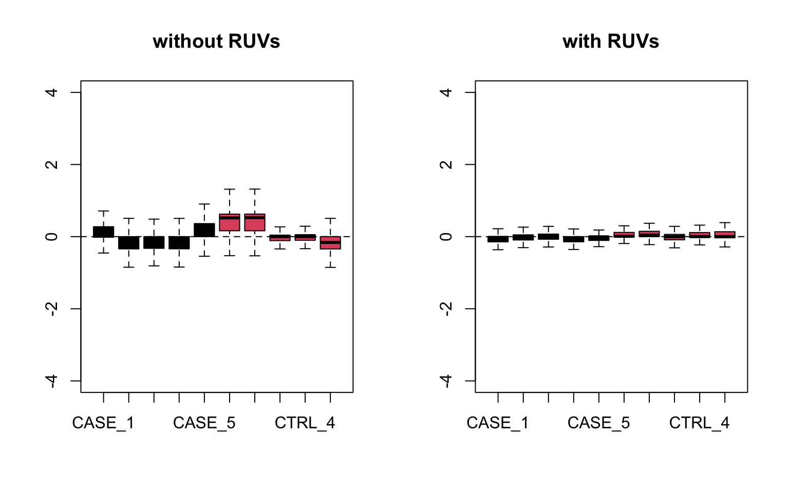
<p class="caption">(\#fig:ruvsf2)RLE plots to observe the effect of RUVs.</p>
</div>


```r
## PCA plots
 
par(mfrow = c(1,2))
plotPCA(set, col=as.numeric(colData$group), 
        main = 'without RUVs', adj = 0.5,
        ylim = c(-0.75, 0.75), xlim = c(-0.75, 0.75))
plotPCA(set_s, col=as.numeric(colData$group), 
        main = 'with RUVs', adj = 0.5,
        ylim = c(-0.75, 0.75), xlim = c(-0.75, 0.75))
```

<div class="figure" style="text-align: center">
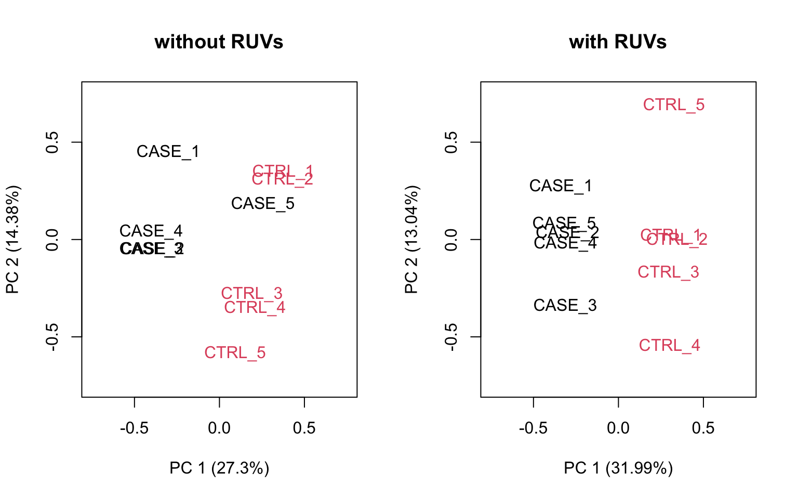
<p class="caption">(\#fig:ruvsf3)PCA plots to observe the effect of RUVs.</p>
</div>

Let's compare PCA results from RUVs and RUVg with the initial raw counts matrix. We will simply run the `plotPCA()` function on different normalization schemes. The resulting plots are in Figure \@ref(fig:ruvcompare):


```r
par(mfrow = c(1,3))
plotPCA(countData, col=as.numeric(colData$group), 
        main = 'without RUV - raw counts', adj = 0.5,
        ylim = c(-0.75, 0.75), xlim = c(-0.75, 0.75))
plotPCA(set_g, col=as.numeric(colData$group), 
        main = 'with RUVg', adj = 0.5,
        ylim = c(-0.75, 0.75), xlim = c(-0.75, 0.75))
plotPCA(set_s, col=as.numeric(colData$group), 
        main = 'with RUVs', adj = 0.5,
        ylim = c(-0.75, 0.75), xlim = c(-0.75, 0.75))
```

<div class="figure" style="text-align: center">
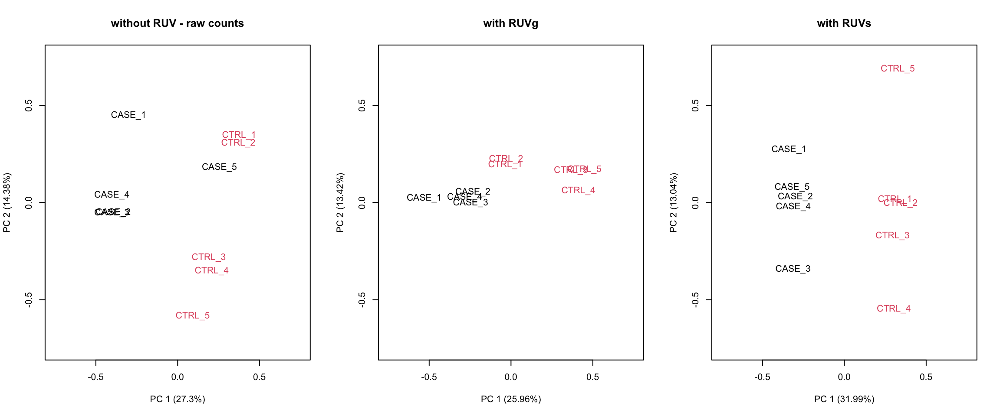
<p class="caption">(\#fig:ruvcompare)PCA plots to observe the before/after effect of RUV functions.</p>
</div>

It looks like `RUVs()` has performed better than `RUVg()` in this case. So, let's use count data that is processed by `RUVs()` to re-do the initial heatmap. The resulting heatmap is in Figure \@ref(fig:ruvpost). 


```r
library(EDASeq)
library(pheatmap)
# extract normalized counts that are cleared from unwanted variation using RUVs
normCountData <- normCounts(set_s)
selectedGenes <- names(sort(apply(normCountData, 1, var), 
                            decreasing = TRUE))[1:500]
pheatmap(normCountData[selectedGenes,], 
         annotation_col = colData, 
         show_rownames = FALSE, 
         cutree_cols = 2,
         scale = 'row')
```

<div class="figure" style="text-align: center">
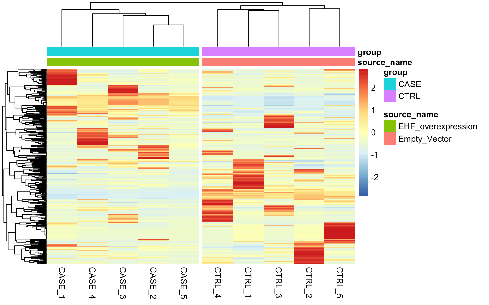
<p class="caption">(\#fig:ruvpost)Clustering samples using top 500 most variable genes normalized using RUVs (k = 2).</p>
</div>

As can be observed the replicates from different groups cluster much better with each other after processing with `RUVs()`. It is important to note that RUVs uses information from replicates to shift the expression data and it would not work in a confounding design where the replicates of case samples and replicates of the control samples are sequenced in different batches.

#### Re-run DESeq2 with the computed covariates

Having computed the sources of variation using `RUVs()`, we can actually integrate these variables with `DESeq2` to re-do the differential expression analysis. 


```r
library(DESeq2)
#set up DESeqDataSet object
dds <- DESeqDataSetFromMatrix(countData = countData,
                              colData = colData, 
                              design = ~ group)
# filter for low count genes
dds <- dds[rowSums(DESeq2::counts(dds)) > 10]

# insert the covariates W1 and W2 computed using RUVs into DESeqDataSet object
colData(dds) <- cbind(colData(dds), 
                      pData(set_s)[rownames(colData(dds)), 
                                   grep('W_[0-9]', 
                                        colnames(pData(set_s)))])

# update the design formula for the DESeq analysis (save the variable of
# interest to the last!)
design(dds) <- ~ W_1 + W_2 + group 
# repeat the analysis 
dds <- DESeq(dds)
# extract deseq results 
res <- results(dds, contrast = c('group', 'CASE', 'CTRL'))
res <- res[order(res$padj),]
```

## Other applications of RNA-seq

RNA-seq generates valuable data that contains information not only at the gene level but also at the level of exons and transcripts. Moreover, the kind of information that we can extract from RNA-seq is not limited to expression quantification. It is possible to detect alternative splicing events such as novel isoforms [@trapnell_transcript_2010], and differential usage of exons [@anders_detecting_2012]. It is also possible to observe sequence variants (substitutions, insertions, deletions, RNA-editing) that may change the translated protein product [@mckenna_genome_2010]. In the context of cancer genomes, gene-fusion events can be detected with RNA-seq [@mcpherson_defuse:_2011]. Finally, for the purposes of gene prediction or improving existing gene predictions, RNA-seq is a valuable method [@stanke_augustus:_2005]. In order to learn more about how to implement these, it is recommended that you go through the tutorials of the cited tools.  
  
## Exercises

### Exploring the count tables

Here, import an example count table and do some exploration of the expression data. 


```r
counts_file <- system.file("extdata/rna-seq/SRP029880.raw_counts.tsv",
                           package = "compGenomRData")
coldata_file <- system.file("extdata/rna-seq/SRP029880.colData.tsv", 
                            package = "compGenomRData")
```

1. Normalize the counts using the TPM approach. [Difficulty: **Beginner**]
2. Plot a heatmap of the top 500 most variable genes. Compare with the heatmap obtained using the 100 most variable genes. [Difficulty: **Beginner**]
3. Re-do the heatmaps setting the `scale` argument to `none`, and `column`. Compare the results with `scale = 'row'`. [Difficulty: **Beginner**]
4. Draw a correlation plot for the samples depicting the sample differences as 'ellipses', drawing only the upper end of the matrix, and order samples by hierarchical clustering results based on `average` linkage clustering method. [Difficulty: **Beginner**]
5. How else could the count matrix be subsetted to obtain quick and accurate clusters? Try selecting the top 100 genes that have the highest total expression in all samples and re-draw the cluster heatmaps and PCA plots. [Difficulty: **Intermediate**]
6. Add an additional column to the annotation data.frame object to annotate the samples and use the updated annotation data.frame to plot the heatmaps. (Hint: Assign different batch values to CASE and CTRL samples). Make a PCA plot and color samples by the added variable (e.g. batch). [Difficulty: Intermediate]
7. Try making the heatmaps using all the genes in the count table, rather than sub-selecting. [Difficulty: **Advanced**]
8. Use the [`Rtsne` package](https://cran.r-project.org/web/packages/Rtsne/Rtsne.pdf) to draw a t-SNE plot of the expression values. Color the points by sample group. Compare the results with the PCA plots. [Difficulty: **Advanced**]


### Differential expression analysis

Firstly, carry out a differential expression analysis starting from raw counts

Use the following datasets:

```
counts_file <- system.file("extdata/rna-seq/SRP029880.raw_counts.tsv", 
                            package = "compGenomRData")
coldata_file <- system.file("extdata/rna-seq/SRP029880.colData.tsv", 
                            package = "compGenomRData")
```

- Import the read counts and colData tables.
- Set up a DESeqDataSet object.
- Filter out genes with low counts.
- Run DESeq2 contrasting the `CASE` sample with `CONTROL` samples. 

Now, you are ready to do the following exercises: 

1. Make a volcano plot using the differential expression analysis results. (Hint: x-axis denotes the log2FoldChange and the y-axis represents the -log10(pvalue)). [Difficulty: **Beginner**]  
2. Use DESeq2::plotDispEsts to make a dispersion plot and find out the meaning of this plot. (Hint: Type ?DESeq2::plotDispEsts) [Difficulty: **Beginner**]
3. Explore `lfcThreshold` argument of the `DESeq2::results` function. What is its default value? What does it mean to change the default value to, for instance, `1`? [Difficulty: **Intermediate**]
4. What is independent filtering? What happens if we don't use it? Google `independent filtering statquest` and watch the online video about independent filtering. [Difficulty: **Intermediate**]
5. Re-do the differential expression analysis using the `edgeR` package. Find out how much DESeq2 and edgeR agree on the list of differentially expressed genes. [Difficulty: **Advanced**] 
6. Use the `compcodeR` package to run the differential expression analysis using at least three different tools and compare and contrast the results following the `compcodeR` vignette. [Difficulty: **Advanced**]

### Functional enrichment analysis

1. Re-run gProfileR, this time using pathway annotations such as KEGG, REACTOME, and protein complex databases such as CORUM, in addition to the GO terms. Sort the resulting tables by columns `precision` and/or `recall`. How do the top GO terms change when sorted for `precision`, `recall`, or `p.value`? [Difficulty: **Beginner**]
2. Repeat the gene set enrichment analysis by trying different options for the `compare` argument of the `GAGE:gage`
function. How do the results differ? [Difficulty: **Beginner**]
3. Make a scatter plot of GO term sizes and obtained p-values by setting the `gProfiler::gprofiler` argument `significant = FALSE`. Is there a correlation of term sizes and p-values? (Hint: Take -log10 of p-values). If so, how can this bias be mitigated? [Difficulty: **Intermediate**]
4. Do a gene-set enrichment analysis using gene sets from top 10 GO terms. [Difficulty: **Intermediate**]
5. What are the other available R packages that can carry out gene set enrichment analysis for RNA-seq datasets? [Difficulty: **Intermediate**]
6.  Use the topGO package (https://bioconductor.org/packages/release/bioc/html/topGO.html) to re-do the GO term analysis. Compare and contrast the results with what has been obtained using the `gProfileR` package. Which tool is faster, `gProfileR` or topGO? Why? [Difficulty: **Advanced**]
7. Given a gene set annotated for human, how can it be utilized to work on _C. elegans_ data? (Hint: See `biomaRt::getLDS`). [Difficulty: **Advanced**]
8. Import curated pathway gene sets with Entrez identifiers from the [MSIGDB database](http://software.broadinstitute.org/gsea/msigdb/collections.jsp) and re-do the GSEA for all curated gene sets. [Difficulty: **Advanced**]

### Removing unwanted variation from the expression data

For the exercises below, use the datasets at: 
```
counts_file <- system.file('extdata/rna-seq/SRP049988.raw_counts.tsv', 
                           package = 'compGenomRData')
colData_file <- system.file('extdata/rna-seq/SRP049988.colData.tsv', 
                           package = 'compGenomRData')
```

1. Run RUVSeq using multiple values of `k` from 1 to 10 and compare and contrast the PCA plots obtained from the normalized counts of each RUVSeq run. [Difficulty: **Beginner**]
2. Re-run RUVSeq using the `RUVr()` function. Compare PCA plots from `RUVs`, `RUVg` and `RUVr` using the same `k` values and find out which one performs the best. [Difficulty: **Intermediate**]
3. Do the necessary diagnostic plots using the differential expression results from the EHF count table. [Difficulty: **Intermediate**]
4. Use the `sva` package to discover sources of unwanted variation and re-do the differential expression analysis using variables from the output of `sva` and compare the results with `DESeq2` results using `RUVSeq` corrected normalization counts. [Difficulty: **Advanced**]

