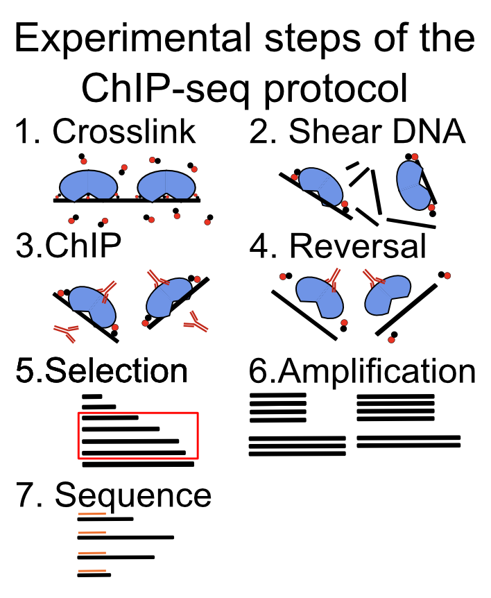
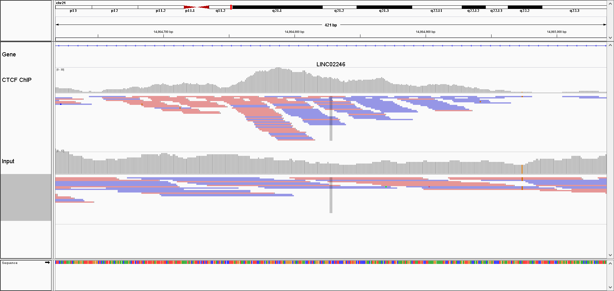
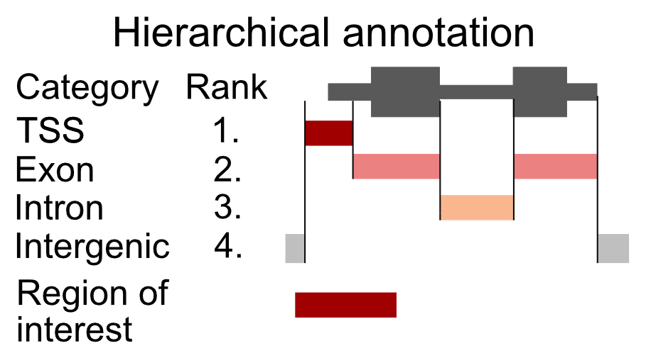
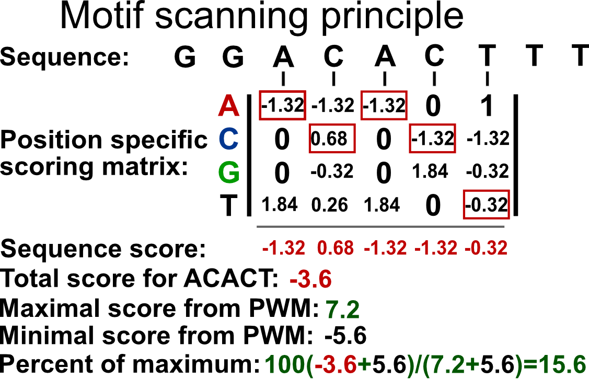
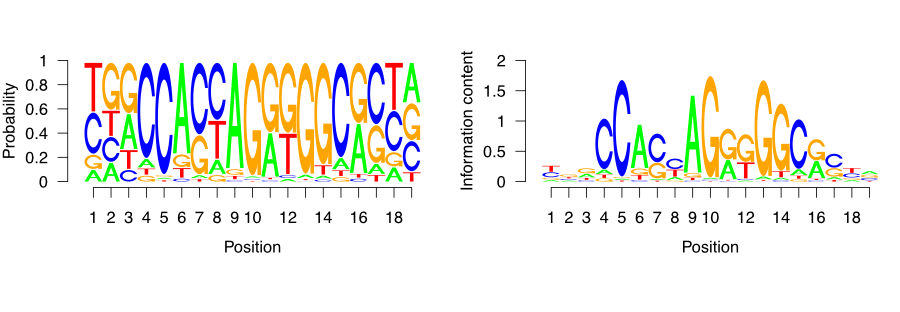

# ChIP-seq analysis {#chipseq}


```{r setup_chip_seq, include=FALSE}
knitr::opts_chunk$set(echo      = TRUE,
                      message   = FALSE, 
                      error     = FALSE,
                      cache     = TRUE,
                      warning   = FALSE,
                      out.width = "50%",
                      fig.width = 5,
                      fig.align = 'center')
```
*Chapter Author*: **Vedran Franke**


Protein-DNA interactions are responsible for a large part of the gene expression regulation. Proteins such as transcription factors as well as histones are directly related to how much and in which contexts the genes are expressed. Some of these concepts are already introduced in Chapter \@ref(intro) if readers need a more in-depth introduction. In this chapter, we will introduce how to process and analyze ChIP-seq data in order to identify genome-wide protein binding sites and to discover underlying sequence context via transcription factor binding-site motifs.

## Regulatory protein-DNA interactions
One of the most fascinating biological phenomena is the fact that a myriad of  different cell types, in a multicellular organism, are encoded by one single genome. How exactly this is achieved is still a
major unanswered question in biology. 
Cell types differ based on a multitude of features:
their size, shape, mobility, surface receptors, metabolic content.
However, the main predominant feature, which influences all of the above, is which
genes are expressed in each cell type. 
Therefore, if we can understand what controls which
genes will be expressed, and where they will be expressed, 
we can start forming a picture of how a single genomic template, 
can give rise to a complex organism.

As explained in Chapter \@ref(intro), gene expression is controlled by a special class of genes called 
transcription factors - genes which control other genes. 
Transcription factor genes encode  proteins which
can bind to the DNA, and control whether a certain part of DNA will be
transcribed (expressed), or stay silent (repressed). 
They program the expression patterns in each cell.
Transcription factors contain DNA binding domains, which are specifically folded protein sequences
which recognize specific DNA motifs (a short nucleotide sequence).
Such sequence binding imparts transcription factors with specificity, 
transcription factors do not bind everywhere on the DNA, rather they are localized to 
short stretches which contain the corresponding DNA motif.

DNA in the nucleus is wrapped around a protein complex called the histone complex.
Histones form a chain of beads along the DNA. By changing their position, histones can make
certain parts of the DNA more or less accessible to transcription 
factors. Histone complexes can be chemically modified with different post-translational modifications (see Chapter \@ref(intro)). Such modifications change histone
mobility, and their interactions with different proteins, thereby creating
an additional regulatory layer on top of the DNA sequence.

In order to understand the target genes of a certain transcription factor,
and how they control the gene expression, we need to know where on the DNA the 
transcription factor is located. 


## Measuring protein-DNA interactions with ChIP-seq 

ChIP-seq stands for chromatin immunoprecipitation followed by sequencing, and is an experimental method for finding locations on DNA which are bound by proteins. It has been extensively used to study 
in-vivo binding preferences of transcription factors, and genomic distribution of modified histones.

In the remainder of this chapter, you will learn how to assess quality control
of ChIP-seq data sets, perform peak calling to find bound regions, and 
assess the quality of the peak calling.

Once you have obtained peaks, you will learn how to perform sequence analysis
to construct motif models, and compare signals between experiments.
Biological experiments often contain a multitude of consecutive steps. Each 
step can profoundly influence the quality of the data, and the subsequent analysis.
The computational biologist has to have an in-depth knowledge of the experimental
design, and the underlying experimental steps, in order to choose the proper tools
and the type of analysis, which will give proper and correct results [@kharchenko_2008; @kidder_2011; @landt_2012; @chen_2012; @felsani_2015].
In this chapter we will go through the main experimental steps in the
ChIP-seq analysis and address the most common experimental pitfalls.

The main principle of the method is to use a specific antibody to enrich
DNA fragments which are bound by the protein of interest.

The DNA fragments are then sequenced, mapped onto the corresponding 
reference genome, and computationally analyzed to distinguish regions which
were really bound by the protein, from the background regions.

The experimental methodology is depicted in 
Figure \@ref(fig:ChIP-seq-Protocol-plot), and consists of the following steps:

1. Cross linking of cells with formaldehyde to bind the proteins to the DNA.
This process covalently links the proteins to the DNA.

2. Fragmentation of DNA using sonication or enzymatic digestion, shearing
of DNA into small fragments (ranging from 50 - 500 bp).

3. Immunoprecipitation using a specific antibody. An immunoprecipitation step
which enriches fragments bound by the protein.

4. Cross-link reversal. Frees the DNA fragments for further processing.

5. Size selection of DNA fragments. Only fragments of certain length are used in the
library preparation and sequencing.

6. Fragment amplification using PCR. The amount of DNA is a limiting step for the
protocol. Therefore the fragments need to be amplified using PCR.

7. DNA fragment sequencing 

```{r ChIP-seq-Protocol-plot, echo=FALSE, include=TRUE, fig.cap="Main experimental steps in the ChIP-seq protocol."}

```


After sequencing, the role of the computational biologist is to assess the 
quality of the experiment, find the location of the protein of interest, and
finally, to integrate with existing data sets.

Each step of the experimental protocol can affect the quality
of the data set, and the subsequent analysis steps. It is, therefore, of crucial
importance to perform quality control for every sequenced experiment.

## Factors that affect ChIP-seq experiment and analysis quality

### Antibody specificity

Antibody specificity is a term which refers to how strongly an antibody
binds to its preferred target, with respect to everything else present in the cell.
It is the paramount measure influencing the successful execution of a ChIP
experiment.
Antibodies can bind multiple proteins with the same affinity. 
This is called antibody cross-reactivity. If an antibody cross-reacts with
multiple proteins, the results of a ChIP experiment will be ambiguous.
Instead of finding where our protein binds to the DNA, we will get a
superposition of binding of multiple proteins.
Such data are impossible to analyze correctly, and will produce false conclusions.
There are many experimental procedures for validating antibody specificities, and 
an antibody should pass multiple tests in order to be considered valid.
The exact recommendations are listed by the ENCODE consortium [@landt_2012].

Every time we are analyzing a new ChIP-seq experiment, we have to take our time
to convince ourselves that all of the appropriate experimental controls were performed
to validate the antibody specificity [@Wardle_2015].


### Sequencing depth

Variation in sequencing depth is the first systematic technical bias we 
encounter in ChIP-seq experiments. Namely, different samples will contain different number of 
sequenced reads. Different sequencing depth influences our ability to detect 
enriched regions, and complicates comparisons between samples [@jung_2014].
The statistical procedure of removing the influence of sequencing depth on the
quantification is called depth scaling; we calculate a scaling factor which
is used to multiply the signal strength before the comparison. 
There are multiple methods for normalization, and each method comes with its assumptions.
**Scale normalization** is done by dividing the read counts (in certain genomic locations)
by the total amount of sequenced reads. This method presumes that the ChIP
efficiency worked equally well in all studied conditions. Because the ChIP efficiency
differs in different antibodies, it is often unsuitable for comparisons of ChIP-seq
experiments done on different proteins.
**Robust normalization** tries to locate genomic regions which do not change between 
different  biological conditions (regions where the protein is constantly bound), 
and then uses the sum of the reads in those regions as the scaling factor. This
method presumes that we can reliably identify regions which do not change [@shao_2012].
**Background normalization** presumes that the genome can be split into two categories:
background regions and true signal regions. It then uses the number of reads in the
background regions to define the scaling factor [@liang_2012].
**External normalization** uses external reference for normalization; we
add known amounts of chromatin from a distant species, or artificial spike-ins which are then
used as a scaling reference. This is used when we think there are global changes
in the biding profiles between two biological conditions -- very large changes in the 
signal profile [@bonhoure_2014].

The choice of normalization method depends on the type of analysis [@angelini_2015];
if we want to quantitatively compare the abundance of different histone marks in 
different cell types, we will need a different normalization procedure than if
we want to compare TF binding in the same setting.


### PCR duplication

The amounts of the DNA obtained after the ChIP experiment are quite often lower
than the minimal amount which can be sequenced.
Polymerase chain reaction (PCR) is a procedure used for amplification of DNA fragments.
It is used to increase the amount of DNA in our sample prior to sequencing.
PCR is a stochastic procedure, meaning that the results of each PCR
reaction cannot be predicted. Due to its stochastic nature, PCR can
be a significant source of variability in the ChIP-seq experiments 
[@aird_2011; @benjamini_2012; @teng_2016]. A quality control is necessary to 
check whether all of our samples have the same sequence properties, i.e. the
same enrichment of dinucleotides, such as CpG.
If the samples differ in their sequence properties, that means we have
to account for them during the analysis [@Teng_2017].


### Biological replicates

Biological replicates are independently executed ChIP-seq experiments from different
samples, corresponding to the same biological conditions. They are indispensable
for estimating ChIP quality, and give us an estimate of the variability in the
experiment which we can expect due to unknown biological variables.
Without biological replicates, it is statistically impossible to compare
ChIP-seq samples from different biological conditions, because we do not know
whether the observed changes are a result of the inherent biological variability
(the source of which we do not understand), or they result from the change
in the biological condition (different tissue or transcription factor used
in the experiment).
If we encounter an experimental setup which does not include biological 
replicates, we should be extremely skeptical about all conclusions derived
from such analysis.

### Control experiments\index{Peak calling}

There are three types of control experiments which can be performed to control
for known and unknown experimental biases:

1. **Input control**: Sequencing of genomic DNA without the immunoprecipitation step.

2. **IgG control**: Using a polyclonal mixture of non-specific IgG antibodies instead of a specific antibody.

3. **Knockout control**: Performing the ChIP experiment in a biological system which
does not contains our protein of interest (i.e. in a cell line where the transcription
factor was knocked out) [@krebs_2014].

Each type of control experiment controls for a certain set of experimental biases.

**Input control** is the most frequent type of control performed. 
It shows the differential susceptibility of genomic regions to the ChIP-procedure. 
Due to the hierarchical structure of  chromatin, different genomic regions have different propensities for cross-linking, 
sonication, and immunoprecipitation. This causes an uneven probability of
observing DNA fragments originating from different genomic regions.
Because different cell types (cell lines, and cancer cell lines), 
have different chromatin structure, ChIP samples will show a cell-type-specific
bias in observed enrichment profiles.
An important note to consider is that the input control is basically a 
reduced whole genome sequencing experiment, while the ChIP enriches for only a subset
of genomic regions. If both ChIP and Input samples are sequenced to the same
depth (same number of reads), the background distribution in the input sample will
be under sampled. It is recommended to sequence the input sample deeper than the ChIP sample [@chen2012systematic].

**IgG control** uses a soup of nonspecific antibodies to control for background
binding. In principle, the antibodies should be isolated from the same batch of
serum which was used to create the specific antibody (used for ChIP). It should, 
in theory, give a background profile of non-specific binding. 
The proper control, is however, seldom available. Additionally, because the antibodies
are unspecific, the amount of precipitated DNA will be low, and the samples
will require additional rounds of PCR amplification.

**KO control** is a ChIP experiment performed in the biological system where
the native protein is not present. Such an experiment profiles the non-specific
binding of the antibody to other proteins, and directly to the DNA.
The primary, and only, concern is that the perturbation caused by the knock-out (or knock-down),
changes the cell so much, that the ChIP profile is not comparable to the original cell.
This is the most accurate type of control experiment, however, it is frequently technically challenging
to perform if the cells are not viable after the knock-out, or
if the knock-out is impossible to perform.


### Using tagged proteins

If an antibody of sufficient quality is not available, it is possible
to resort to constructs where the protein of interest gets engineered
with a ChIP-able tag. The proper control for such experiments is to perform
the ChIP in the cell line containing the engineered protein, and without the
protein.
It must be noted that the tagging procedure can change the binding preferences
of the protein, and therefore the experimental conclusions.


## Pre-processing ChIP data

The focus of ChIP preprocessing is to check the quality of the sequencing
experiment, remove sequencing artifacts, and find the genomic location of 
sequenced fragments using read mapping. 
The quality control consists of read quality control and adapter trimming.
These methods are described in depth in Chapter \@ref(processingReads).

### Mapping of ChIP-seq data

Mapping is a procedure of trying to locate the exact genomic location which
created each genomic fragment, each sequenced read. 
Several tools are available for mapping ChIP-seq data sets:
Bowtie, Bowtie2, BWA [@langmead_2009; @langmead_2012; @li_2009], and all of them have comparable sensitivity and 
specificity [@ruffalo_2011].
Read length is the variable with the biggest effect on the mapping procedure.
The longer the sequenced reads, the more uniquely can the read be assigned
to a position on the genome. Reads which are assigned ambiguously to multiple
locations in the genome are called multi-mapping reads. Such fragments
are most often produced by repetitive genomic regions, such as retrotransposons,
pseudogenes or paralogous genes [@li_2014].
It is important to, a priori, decide whether such duplicated regions are of 
interest for the current experimental setup (i.e. whether we want to study transcription factor binding 
in olfactory receptors). If they are, then the multi-mapping
reads should be included in the analysis. If they are not, they should be omitted.
This is done during the mapping step, by limiting the number of locations to which a read can map.
The methodology of working with multi-mapping reads differs according to the
use case, and will not be considered in this chapter. For more information, please
see the references [@chung_2011].

Current Illumina sequencing procedures enable sequencing of DNA
fragments from just one, or both ends.
Sequencing from both ends is called **paired-end** sequencing and greatly enhances
the sample **mappability**, the percentage of genome which can be uniquely mapped. 
Additionally, it provides an out-of-the-box estimate of the
average DNA fragment length, a parameter which is important for quality control
and peak calling.
Although it would always be preferable to do paired-end sequencing it 
substantially increases the sequencing costs, which can be prohibitive.

Different reads, which map to the same genomic location (same chromosome, position, and strand),
are called **duplicated reads**. Such reads are an indication that the same 
DNA fragment was present multiple times during the library preparation. This
can happen due to high enrichment with highly specific antibodies, or such 
fragments can be artificially produced during PCR amplification. Because we do not know
the exact origin of the duplicated fragments, they are most often collapsed during
the peak calling procedure, i.e. when multiple reads map to the same chromosome,
position, and strand, only one read is used. If the transcription factor
binds to a small number of regions in the genome, such data reduction might be
too stringent, and we can increase the sensitivity by allowing up to __N__ different
reads, per position (i.e. if more than __N__ reads map to the same location, only
__N__ reads are kept for the downstream analysis).

Some peak calling algorithms have automated statistical methods for determining the number
of reads, per position, which will be used in the analysis [@zhang_2008].

An important consideration to take into account is the genome which was used in
the experiment. Cell lines, cancer samples, and personal genomes usually contain
structural genomic alterations which are not present in the reference genome 
(duplications, insertions, and deletions). Such regions can cause false 
negatives, and false positives in the ChIP-seq experiment.
If a region was present multiple times in the experimental system, and only a single
time in the reference genome, it will be relatively enriched in the final 
sequencing library. Such fragments will pile up on a single location during
the mapping step, and create an artificial peak, which can be falsely characterized
as a binding event.
Such regions are called **blacklisted** regions and should be removed from the
downstream analysis. The [UCSC browser database](http://genome.ucsc.edu) contains tables with
such regions for the most commonly used model organism species.

This chapter presumes that the user is already familiar with 
the following technical and conceptual knowledge in computational data processing.
From Chapters \@ref(processingReads) and \@ref(genomicIntervals), you should be familiar with \index{read filtering}
\index{read mapping} the concept of multi-mapping reads, 
and the following file formats BED\index{BED file}, GTF\index{GTF file}, 
WIG\index{WIG file}, bigWig\index{bigWig file}, BAM\index{BAM file}. 
You should also be familiar with PCR\index{PCR}, what
are PCR duplicates, positive and negative DNA strands, and technical and biological 
replicates.


## ChIP quality control

While the goal of the read quality assessment is to check whether the sequencing
produced a high enough number of high-quality reads
the goal of ChIP quality control is to ascertain whether the chromatin immunoprecipitation
enrichment was successful.
This is a crucial step in the ChIP-seq analysis because it can help us
identify low-quality ChIP samples, and give information about which experimental
steps went wrong.

There are four steps in ChIP quality control:

1. Sample correlation clustering: Clustering of the pair-wise correlations between
genome-wide signal profiles.

2. Data visualization in a genomic browser.

3. Average fragment length determination: Determining whether the ChIP was enriched for fragments of a certain length.

4. Visualization of GC bias. Here we will plot the ChIP enrichment versus the 
average GC content in the corresponding genomic bin.


### The data

Here we will familiarize ourselves with the datasets that will be used in the
chapter.
Experimental data was downloaded from the public ENCODE [@ENCODE_Project_Consortium2012-wf] 
database of ChIP-seq experiments.
The experiments were performed on a lymphoblastoid cell line, GM12878, and mapped
to the GRCh38 (hg38) version of the human genome, using the standard ENCODE
ChIP-seq pipeline. In this chapter, due to compute time considerations, we have taken a subset of the data which corresponds to the human chromosome 21 (chr21).

The data sets are located in the `compGenomRData`\index{R Packages!\texttt{compGenomRData}} package.
The location of the data sets can be accessed using the `system.file()` command,
in the following way:

```{r data.path}
data_path = system.file('extdata/chip-seq',package='compGenomRData')
```

The available datasets can be listed using the `list.files()` function:

```{r load.data, echo=TRUE, eval=TRUE, include=TRUE}
chip_files = list.files(data_path, full.names=TRUE)
```

```{r data.path.show, echo=FALSE, eval=FALSE, include=TRUE}
head(chip_files)
```

The dataset consists of the following ChIP experiments:

1. **Transcription factors**: CTCF\index{CTCF protein}, SMC3, ZNF143, PolII 
(RNA polymerase 2)

2. **Histone modifications**\index{histone modification}: H3K4me3, H3K36me3, H3k27ac, H3k27me3

3. Various input samples

### Sample clustering

Clustering is an ordering procedure which groups samples by similarity;
the more similar samples are grouped closer to one another.
The details of clustering methodologies are described in Chapter \@ref(unsupervisedLearning).
Clustering of ChIP signal profiles is used for two purposes:
The first one is to ascertain whether there is concordance between
biological replicates; biological replicates should show greater similarity
than ChIP of different proteins. The second function is to see whether our experiments conform to known prior knowledge. For example, we would expect to see greater similarity between proteins
which belong to the same protein complex.

To quantify the ChIP signal we will firstly construct 1-kilobase-wide tiling
windows over the genome, and subsequently count the number of reads
in each window, for each experiment. We will then normalize the counts, to
account for a different total number of reads in each experiment, and finally 
calculate the correlation between all pairs of samples.
Although this procedure represents a crude way of data quantification, it provides sufficient
information to ascertain the data quality.

Using the `GenomeInfoDb` we will first fetch the chromosome lengths corresponding
to the hg38 version of the human genome, and filter the length for human
chromosome 21.


```{r sample-clustering.seqlen, message=FALSE, warning=FALSE}
# load the chromosome info package
library(GenomeInfoDb)

# fetch the chromosome lengths for the human genome
hg_chrs = getChromInfoFromUCSC('hg38')

# find the length of chromosome 21
hg_chrs = subset(hg_chrs, grepl('chr21$',chrom))
    
```

The `tileGenome()` function from the `GenomicRanges` package constructs equally sized
windows over the genome of interest.
The function takes two arguments:

1. A vector of chromosome lengths

2. Window size

Firstly, we convert the chromosome lengths _data.frame_ into a _named vector_.


```{r sample-clustering.seqlen_vector}
# downloaded hg_chrs is a data.frame object,
# we need to convert the data.frame into a named vector
seqlengths = with(hg_chrs, setNames(size, chrom))
```

Then we construct the windows.

```{r sample-clustering.tiling_window}
# load the genomic ranges package
library(GenomicRanges)

# tileGenome function returns a list of GRanges of a given width, 
# spanning the whole chromosome
tiling_window = tileGenome(seqlengths, tilewidth=1000)

# unlist converts the list to one GRanges object
tiling_window = unlist(tiling_window)
```

```{r sample-clustering.show_tiling_window, include=TRUE, echo=FALSE, eval=TRUE}
tiling_window
```

We will use the `summarizeOverlaps()` function from the `GenomicAlignments` package
to count the number of reads in each genomic window.
The function will do the counting automatically for all our experiments.
The `summarizeOverlaps()` function returns a `SummarizedExperiment` object.
The object contains the counts, genomic ranges which were used for the quantification,
and the sample descriptions.

```{r sample-clustering.GenomicAlignments, warning=FALSE, message=FALSE}
# load GenomicAlignments
library(GenomicAlignments)

# fetch bam files from the data folder
bam_files = list.files(
    path       = data_path, 
    full.names = TRUE, 
    pattern    = 'bam$'
)

# use summarizeOverlaps to count the reads
so = summarizeOverlaps(tiling_window, bam_files)

# extract the counts from the SummarizedExperiment
counts = assays(so)[[1]]
```


Different ChIP experiments were sequenced to different depths; each experiment
contains a different number of reads. To remove the effect of the experimental
depth on the quantification, the samples need to be normalized.
The standard normalization procedure, for ChIP data, is to divide the 
counts in each tiling window by the total number of sequenced reads, and
multiply it by a constant factor (to avoid extremely small numbers).
This normalization procedure is called the **cpm**\index{cpm} - counts per million.

\[
CPM = counts * (10^{6} / total\>number\>of\>reads)
\]


```{r sample-clustering.norm}
# calculate the cpm from the counts matrix
# the following command works because 
# R calculates everything by columns
cpm = t(t(counts)*(1000000/colSums(counts)))
```

We remove all tiles which do not have overlapping reads.
Tiles with 0 counts do not provide any additional discriminatory power, rather, 
they introduce artificial similarity between the samples (i.e. samples with
only a handful of bound regions will have a lot of tiles with $0$ counts, while
they do not have to have any overlapping enriched tiles).

```{r sample-clustering.filter_cpm}
# remove all tiles which do not contain reads
cpm = cpm[rowSums(cpm) > 0,]
```

We use the `sub()` function to shorten the column names of the cpm matrix.

```{r sample-clustering.change_colnames}
# change the formatting of the column names
# remove the .chr21.bam suffix
colnames(cpm) = sub('.chr21.bam','',   colnames(cpm))

# remove the GM12878_hg38 prefix
colnames(cpm) = sub('GM12878_hg38_','',colnames(cpm))
```

```{r sample-clustering.colnames, include=FALSE, eval=TRUE, echo=TRUE}
colnames(cpm)
```


Finally, we calculate the pairwise Pearson correlation coefficient using the
`cor()` function.
The function takes as input a region-by-sample count matrix, and returns
a sample X sample matrix, where each field contains the correlation coefficient
between two samples.

```{r sample-clustering.correlation}
# calculates the pearson correlation coefficient between the samples
correlation_matrix = cor(cpm, method='pearson')
```

The `Heatmap()` function from the `ComplexHeatmap` [@Gu_2016] package is used to visualize 
the correlation coefficient.\index{R Packages!\texttt{ComplexHeatmap}}
The function automatically performs hierarchical clustering - it groups the 
samples which have the highest pairwise correlation.
The diagonal represents the correlation of each sample with itself.


```{r sample-clustering-complex-heatmap, fig.cap='Heatmap showing ChIP-seq sample similarity using the Pearson correlation coefficient.'}
# load ComplexHeatmap
library(ComplexHeatmap)

# load the circlize package, and define 
# the color palette which will be used in the heatmap
library(circlize)
heatmap_col = circlize::colorRamp2(
    breaks = c(-1,0,1),
    colors = c('blue','white','red')
)

# plot the heatmap using the Heatmap function
Heatmap(
    matrix = correlation_matrix, 
    col    = heatmap_col
)
```

In Figure \@ref(fig:sample-clustering-complex-heatmap) we can see a 
perfect example of why quality control is important. 
**CTCF** is a zinc finger protein which co-localizes with the Cohesin complex.
**SMC3** is a sub unit of the Cohesin complex, and we would therefore expect to
see that the **SMC3** signal profile has high correlation with the **CTCF** signal profile.
This is true for the second biological replicate of **SMC3**, while the first
replicate (SMC3_r1) clusters with the input samples. This indicates that the
sample likely has low enrichment.
We can see that the ChIP and Input samples form separate clusters. This implies
that the ChIP samples have an enrichment of fragments.
Additionally, we see that the biological replicates of other experiments
cluster together.


### Visualization in the genome browser


One of the first steps in any ChIP-seq analysis should be looking at the
data. By looking at the data we get an intuition about the quality of the
experiment, and start seeing preliminary correlations between the samples, which
we can use to guide our analysis.
This can be achieved either by plotting signal profiles around
regions of interest, or by loading data into a genome browser 
(such as IGV\index{IGV Browser}, or UCSC genome browsers\index{UCSC Genome Browser}).

Genome browsers are standalone applications which represent the genome
as a one-dimensional (1D) coordinate system. The browsers enable
simultaneous visualization and comparison of multiple types of annotations and experimental data.


Genome browsers can visualize most of the commonly used genomic data formats:
BAM\index{BAM file}, BED\index{BED file}, wig\index{wig file}, and bigWig\index{bigWig file}.
The easiest way to access our data would be to load the .bam files into the browser. This will show us the sequence and position of every mapped read. If we want to view multiple samples in parallel, loading every mapped read can be restrictive. It takes up a lot of computational resources, and the amount of information 
makes the visual comparison hard to do.
We would like to convert our data so that we get a compressed visualization, 
which would show us the main properties of our samples, namely, the quality and
the location of the enrichment.
This is achieved by summarizing the read enrichment into a signal profile - 
the whole experiment is converted into a numeric vector - a coverage vector. 
The vector contains information on how many reads overlap each position 
in the genome.

We will proceed as follows: Firstly, we will import a **.bam** file into **R**. Then we will calculate the signal profile (construct the coverage vector), and finally, we export the vector as a **.bigWig** file.

First we select one of the ChIP samples.

```{r genome-browser.file}
# list the bam files in the directory
# the '$' sign tells the pattern recognizer to omit bam.bai files
bam_files = list.files(
    path       = data_path, 
    full.names = TRUE, 
    pattern    = 'bam$'
)

# select the first bam file
chip_file = bam_files[1]
```

We will use the `readGAlignments()` function from the `GenomicAlignments` 
package to load the reads into **R**, and then the `GRanges()` function
to convert them into a `GRanges` object.

```{r genome-browser.alignments}
# load the genomic alignments package
library(GenomicAlignments)

# read the ChIP reads into R
reads = readGAlignments(chip_file)

# the reads need to be converted to a granges object
reads = granges(reads)
```

Because DNA fragments are being sequenced from their ends (both the 3' and 5' end), 
the read enrichment does not correspond to the exact location of the bound protein. 
Rather, reads end to form clusters of enrichment upstream and downstream of the true binding location.
To correct for this, we use a small hack. Before we create the signal profiles, 
we will extend the reads towards their __3'__ end. The reads are extended to
form fragments of 200 base pairs. This is an empiric measure, which 
corresponds to the average fragment size of the Illumina sample preparation kit.
The exact average fragment size will differ from 200 base pairs, but if the
deviation is not large (i.e. more than 200 base pairs), 
it will not affect the visual properties of our samples.

Read extension is done using the `resize()` function. The function
takes two arguments:

1. `width`: resulting fragment width

2. `fix`: which position of the fragment should not be changed (if `fix` is set to start, 
the reads will be extended towards the __3'__ end. If `fix` is set to end, they will
be extended towards the __5'__ end)


```{r genome-browser.resize}
# extends the reads towards the 3' end
reads = resize(reads, width=200, fix='start')

# keeps only chromosome 21
reads = keepSeqlevels(reads, 'chr21', pruning.mode='coarse')
```

Conversion of reads into coverage vectors is done with the `coverage()`
function.
The function takes only one argument (`width`), which corresponds to chromosome sizes.
For this purpose we can use the, previously created, `seqlengths` variable.
The `coverage()` function converts the reads into a compressed `Rle` object. We have introduced these workflows in Chapter \@ref(genomicIntervals).

```{r genome-browser.coverage}
# convert the reads into a signal profile
cov = coverage(reads, width = seqlengths)
```

```{r genome-browser.coverage.show, include=TRUE, echo=FALSE, eval=TRUE}
head(cov, 5)
```

The name of the output file is created by changing the file suffix from **.bam** 
to **.bigWig**.

```{r genome-browser.rename}
# change the file extension from .bam to .bigWig
output_file = sub('.bam','.bigWig', chip_file)
```
 
Now we can use the `export.bw()` function from the rtracklayer package to
write the bigWig file.

```{r genome-browser.export}
# load the rtracklayer package
library(rtracklayer)

# export the bigWig output file
export.bw(cov, 'output_file')
```


#### Vizualization of track data using Gviz

We can create genome browser-like visualizations using the `Gviz` package, 
which was introduced in Chapter \@ref(genomicIntervals).
The `Gviz` is a tool which enables exhaustive customized visualization of 
genomics experiments. The basic usage principle is to define tracks, where each track can represent
genomic annotation, or a signal profile; subsequently we define the order
of the tracks and plot them.
Here we will define two tracks, a genome axis, which will show the position
along the human chromosome 21; and a signal track from our CTCF experiment.

```{r genome-browser.gviz}
library(Gviz)
# define the genome axis track
axis   = GenomeAxisTrack(
    range = GRanges('chr21', IRanges(1, width=seqlengths))
)

# convert the signal into genomic ranges and define the signal track
gcov   = as(cov, 'GRanges')
dtrack = DataTrack(gcov, name = "CTCF", type='l')

# define the track ordering
track_list = list(axis,dtrack)
```

Tracks are plotted with the `plotTracks()` function. The `sizes` argument needs to be the same size as the track_list, and defines the 
relative size of each track. 
Figure \@ref(fig:genome-browser-gviz-show) shows the output of the
`plotTracks()` function.

```{r genome-browser-gviz-show, fig.cap='ChIP-seq signal visualized as a browser track using Gviz.', fig.width=8, fig.height = 3}
# plot the list of browser tracks
# sizes argument defines the relative sizes of tracks
# background title defines the color for the track labels
plotTracks(
    trackList        = track_list, 
    sizes            = c(.1,1), 
    background.title = "black"
)
```


### Plus and minus strand cross-correlation

Cross-correlation between plus and minus strands is a method
which quantifies whether the DNA library was enriched for fragments of 
a certain length.

Similarity between the plus and minus strands defined as the correlation of
the signal profiles for the reads that map to the **+** and the **-** strands.
The distribution of reads is shown in Figure \@ref(fig:Figure-BrowserScreenshot).

```{r Figure-BrowserScreenshot, echo=FALSE, include=TRUE, fig.cap='Browser screenshot of aligned reads for one ChIP, and control sample. ChIP samples have an asymetric distribution of reads; reads mapping to the + strand are located on the left side of the peak, while the reads mapping to the - strand are found on the right side of the peak.'}

```

Due to the  sequencing properties, reads which correspond to
the __5'__ fragment ends will map to the opposite strand from the reads
coming from the __3'__ ends. Most often (depending on the sequencing protocol) 
the reads from the __5'__ fragment ends map to the **+** strand, 
while the reads from the __3'__ ends map to the **-** strand.
 

We calculate the cross-correlation by shifting the signal on the **+** strand,
by a pre-defined amount (i.e. shift by 1 - 400 nucleotides), and calculating, 
for each shift, the correlation between the **+**, and the **-** strands.
Subsequently we plot the correlation versus shift, and locate the maximum value.
The maximum value should correspond to the average DNA fragment length which
was present in the library. This value tells us whether the ChIP enriched for
fragments of certain length (i.e. whether the ChIP was successful).

Due to the size of genomic data, it might be computationally prohibitive to 
calculate the Pearson correlation between whole genome (or even whole chromosome)
signal profiles.
To get around this problem, we will resort to a trick; we will disregard the dynamic
range of the signal profiles, and only keep the information of which
genomic bases contained the ends of the fragments.
This is done by calculating the coverage vector of the read starting position (separately
for each strand), and converting the coverage vector into a Boolean vector.
The Boolean vector contains the information of which genomic positions
contained the DNA fragment ends.

Similarity between two Boolean vectors can be promptly computed  using the Jaccard index.
The Jaccard index is defined as an intersection between two Boolean vectors, 
divided by their union as shown in Figure \@ref(fig:FigureJaccardSimilarity).

```{r, FigureJaccardSimilarity, echo=FALSE,fig.align = 'center', fig.cap="Jaccard similarity is defined as the ratio of the intersection and union of two sets.",out.width="30%"}

```

Firstly, we load the reads for one of the CTCF ChIP experiments.
Then we create signal profiles, separately for reads on the  **+** and  **-** 
strands.
Unlike before, we do not extend the reads to the average expected fragment
length (200 base pairs); we keep only the starting position of each read.

```{r correlation.load}
# load the reads
reads = readGAlignments(chip_file)
reads = granges(reads)

# keep only the starting position of each read
reads = resize(reads, width=1, fix='start')

reads = keepSeqlevels(reads, 'chr21', pruning.mode='coarse')
```

Now we can calculate the coverage vector of the read starting position.
The coverage vector is then automatically converted into a Boolean vector by
asking which genomic positions have $coverage > 0$.

```{r correlation.coverage}
# calculate the coverage profile for plus and minus strand
reads = split(reads, strand(reads))

# coverage(x, width = seqlengths)[[1]] > 0 
# calculates the coverage and converts
# the coverage vector into a boolean
cov   = lapply(reads, function(x){
    coverage(x, width = seqlengths)[[1]] > 0
})
cov   = lapply(cov, as.vector)
```

We will now shift the coverage vector from the plus strand by $1$ to $400$ base pairs, and for each pair shift we will calculate the Jaccard index between the vectors
on the plus and minus strand.

```{r correlation.jaccard, cache=TRUE}
# defines the shift range
wsize = 1:400

# defines the jaccard similarity
jaccard = function(x,y)sum((x & y)) / sum((x | y))

# shifts the + vector by 1 - 400 nucleotides and 
# calculates the correlation coefficient
cc = shiftApply(
    SHIFT = wsize, 
    X     = cov[['+']], 
    Y     = cov[['-']], 
    FUN   = jaccard
)

# converts the results into a data frame
cc = data.frame(fragment_size = wsize, cross_correlation = cc)
```

We can finally plot the shift in base pairs versus the correlation coefficient: 

```{r correlation-plot, fig.cap='The figure shows the correlation coefficient between the ChIP-seq signal on + and $-$ strands. The peak of the distribution designates the fragment size'}
library(ggplot2)
ggplot(data = cc, aes(fragment_size, cross_correlation)) +
    geom_point() +
    geom_vline(xintercept = which.max(cc$cross_correlation), 
               size=2, color='red', linetype=2) +
    theme_bw() +
    theme(
        axis.text = element_text(size=10, face='bold'),
        axis.title = element_text(size=14,face="bold"),
        plot.title = element_text(hjust = 0.5)) +
    xlab('Shift in base pairs') +
    ylab('Jaccard similarity') 

```

Figure \@ref(fig:correlation-plot) shows the shift in base pairs, 
which corresponds to the  maximum value of the correlation coefficient 
gives us an approximation to the expected average DNA fragment length. 
Because this value is not 0, or monotonically decreasing, we can conclude
that there was substantial enrichment of certain fragments in the ChIP samples.


### GC bias quantification

The PCR amplification procedure can cause a significant bias in the ChIP 
experiments. The bias can be influenced by the DNA fragment size distribution,
sequence composition, hexamer distribution of PCR primers, and the number of cycles used
for the amplification. 
One way to determine whether some of the samples have significantly 
different sequence composition is to look at whether regions with 
differing GC composition were equally enriched in all experiments.

We will do the following: Firstly we will calculate the GC content of each
of the tiling windows, and then we will compare the GC content with the corresponding
cpm\index{cpm} (count per million reads) value, for each tile.


```{r gc.tile}
# fetches the chromosome lengths and constructs the tiles
library(GenomeInfoDb)
library(GenomicRanges)

hg_chrs        = getChromInfoFromUCSC('hg38')
hg_chrs        = subset(hg_chrs, grepl('chr21$',chrom))
seqlengths     = with(hg_chrs, setNames(size, chrom))

# tileGenome produces a list per chromosome
# unlist combines the elemenents of the list 
# into one GRanges object
tiling_window = unlist(tileGenome(
    seqlengths = seqlengths, 
    tilewidth  = 1000
))
```

We will extract the sequence information from the `BSgenome.Hsapiens.UCSC.hg38`
package. `BSgenome` are generic Bioconductor containers for genomic sequences.
Sequences are extracted from the `BSgenome` container using the `getSeq()` function.
The `getSeq()` function takes as input the genome object, and the ranges with the 
regions of interest; in our case, the tiling windows.
The function returns a `DNAString` object.


```{r gc.getseq}
# loads the human genome sequence
library(BSgenome.Hsapiens.UCSC.hg38)

# extracts the sequence from the human genome
seq = getSeq(BSgenome.Hsapiens.UCSC.hg38, tiling_window)
```


To calculate the GC content, we will use the `oligonucleotideFrequency()` function on the
`DNAString` object. By setting the width parameter to 2 we will 
calculate the **dinucleotide** frequency. 
Each row in the resulting table will contain the number of all possible 
dinucleotides observed in each tiling window.
Because we have tiling windows of the same length, we do not 
necessarily need to normalize the counts by the window length.
If all of the windows have different lengths (i.e. when at the ChIP-seq peaks), then normalization is a prerequisite.


```{r gc.oligo}
# calculates the frequency of all possible dimers 
# in our sequence set
nuc = oligonucleotideFrequency(seq, width = 2)

# converts the matrix into a data.frame
nuc = as.data.frame(nuc)

# calculates the percentages, and rounds the number
nuc = round(nuc/1000,3)
```

Now we can combine the GC frequency with the cpm values.
We will convert the cpm values to the log10 scale. To avoid
taking the $log(0)$, we add a pseudo count of 1 to cpm.

```{r gc.cpm, cache=TRUE, warning=FALSE}
# counts the number of reads per tiling window 
# for each experiment
so = summarizeOverlaps(tiling_window, bam_files)

# converts the raw counts to cpm values
counts  = assays(so)[[1]]
cpm     = t(t(counts)*(1000000/colSums(counts)))

# because the cpm scale has a large dynamic range
# we transform it using the log function
cpm_log = log10(cpm+1)
```

Combine the cpm values with the GC content,

```{r gc-combine}
gc = cbind(data.frame(cpm_log), GC = nuc['GC'])
```

and plot the results.

```{r gc-plot, fig.cap='GC content abundance in a ChIP-seq experiment.'}
ggplot(
    data = gc, 
    aes(
        x = GC, 
        y = GM12878_hg38_CTCF_r1.chr21.bam
    )) +
  geom_point(size=2, alpha=.3) +
  theme_bw() +
  theme(
    axis.text  = element_text(size=10, face='bold'),
    axis.title = element_text(size=14,face="bold"),
    plot.title = element_text(hjust = 0.5)) +
  xlab('GC content in one kilobase windows') +
  ylab('log10( cpm + 1 )') +
  ggtitle('CTCF Replicate 1')
```

Figure \@ref(fig:gc-plot) visualizes the CPM versus GC content, and
gives us two important pieces of information.
Firstly, it shows whether there was a specific amplification of regions
with extremely high or extremely low GC content. This would be a strong indication
that either the PCR or the size selection procedure were not successfully
executed.
The second piece of information comes by comparison of plots 
corresponding to multiple experiments. If different ChIP-samples have
highly diverging enrichment of different ChIP regions, then
some of the samples were affected by unknown batch effects. Such effects
need to be taken into account in downstream analysis.

Firstly, we will reorder the columns of the `data.frame` using the `pivot_longer()` 
function from the `tidyr` package\index{R Packages!\texttt{tidyr}}.

```{r gc-tidy}
# load the tidyr package
library(tidyr)

# pivot_longer converts a fat data.frame into a tall data.frame, 
# which is the format used by the ggplot package
gcd = pivot_longer(
    data      = gc, 
    cols      = -GC,
    names_to  = 'experiment',
    values_to = 'cpm'
)

# we select the ChIP files corresponding to the ctcf experiment
gcd = subset(gcd, grepl('CTCF', experiment))

# remove the chr21 suffix
gcd$experiment = sub('chr21.','',gcd$experiment)     
```

We can now visualize the relationship using  a scatter plot.
Figure \@ref(fig:gc-tidy-plot) compares the GC content dependency on the CPM between
the first and the second CTCF replicate. In this case, the replicate looks similar.

```{r gc-tidy-plot, warning = FALSE, fig.cap='Comparison of GC content and signal abundance between two CTCF biological replicates'}
ggplot(data = gcd, aes(GC, log10(cpm+1))) +
  geom_point(size=2, alpha=.05) +
  theme_bw() +
  facet_wrap(~experiment, nrow=1)+
  theme(
    axis.text = element_text(size=10, face='bold'),
    axis.title = element_text(size=14,face="bold"),
    plot.title = element_text(hjust = 0.5)) +
  xlab('GC content in one kilobase windows') +
  ylab('log10( cpm + 1 )') +
  ggtitle('CTCF Replicates 1 and 2')
```


### Sequence read genomic distribution

The fourth way to look at the ChIP quality control is to visualize
the genomic distribution of reads in different functional genomic regions.
If the ChIP samples have the same distribution of reads as the Input samples,
this implies a lack of specific enrichment. Additionally, if we have
prior knowledge of where our proteins should be located, we can use
the visualization to judge how well the genomic distributions conform to our priors.
For example, the trimethylation of histone H3 on lysine 36 - **H3K36me3** is associated
with elongating polymerase and productive transcription. If we performed a 
successful ChIP experiment with an anti-**H3K36me3** antibody, we would expect most of the reads
to fall within gene bodies (introns and exons).

#### Hierarchical annotation of genomic features

Overlapping genomic features (a transcription start site of one
gene might be in an intron of another gene) will cause an ambiguity during
the read annotation. If a read overlaps more than one functional category, we are not
certain which category it should be assigned to.
To solve the problem of multiple assignments, we need to construct a set of annotation rules.
A heuristic solution is to organize the genomic annotation into a
hierarchy which will imply prioritization. 
We can then look, for each read, which functional categories it overlaps, and 
if it is within multiple categories, we assign the read to the topmost category.
As an example, let's say that we have 4 genomic categories: 1) TSS (transcription start sites)\index{transcription start site (TSS)}, 2) exon, 3) intron, and 4) intergenic with the following hierarchy: **TSS -> exon -> intron -> intergenic**. This means that if a read overlaps a TSS\index{transcription start site (TSS)} and an intron, it will be annotated as TSS. This approach is shown in Figure
\@ref(fig:Figure-Hierarchical-Annotation).

```{r Figure-Hierarchical-Annotation, echo=FALSE, include=TRUE, fig.cap='Principle of hierarchical annotation. The region of interest is annotated as the topmost ranked category that it overlaps. In this case, our region overlaps a TSS, an exon, and an intergenic region. Because the TSS has the topmost rank, it is annotated as a TSS.'}

```


Now we will construct the set of functional genomic regions, and annotate
the reads.

#### Finding annotations

There are multiple sources of genomic annotation. **UCSC**\index{UCSC Genome Browser}, 
**Genbank**, and **Ensembl**\index{Ensembl Genome Browser} databases represent stable resources, 
from which the annotation can be easily obtained.

`AnnotationHub`\index{R Packages!\texttt{AnnotationHub}} is a Bioconductor-based online resource which contains a large number of experiments from various
sources. We will use the `AnnotationHub` to download the location of 
genes corresponding to the **hg38** genome. The hub is accessed in the following way:

```{r read-annot.hub}
# load the AnnotationHub package
library(AnnotationHub)

# connect to the hub object
hub = AnnotationHub()
```

The `hub` variable contains the programming interface towards the online database. We can use the `query()` function to find out the ID of the
"ENSEMBL"\index{Ensembl Genome Browser} gene annotation.

```{r read-annot.query}
# query the hub for the human annotation
AnnotationHub::query(
    x       = hub, 
    pattern = c('ENSEMBL','Homo','GRCh38','chr','gtf')
)
```

We are interested in the version **GRCh38.92**, which is available under **AH61126**.
To download the data from the hub, we use the `[[` operator on the
hub API.
We will download the annotation in the **GTF**\index{GTF file} format, into a `GRanges` object.

```{r read-annot.fetch}
# retrieve the human gene annotation
gtf = hub[['AH61126']]
```

```{r read-annot.show, eval=TRUE, include=TRUE, echo=FALSE}
gtf[1:6,1:3]
```

By default the ENSEMBL project labels chromosomes using numeric identifiers (i.e. 1,2,3 ... X), 
without the __chr__ prefix.
We need to therefore append the prefix to the chromosome names (seqlevels).
`pruning.mode = 'coarse'` designates that the chromosome names will be replaced
in the gtf object.

```{r read-annot.seqlevels}
# extract ensemel chromosome names
ensembl_seqlevels = seqlevels(gtf)

# paste the chr prefix to the chromosome names
ucsc_seqlevels    = paste0('chr', ensembl_seqlevels)

# replace ensembl with ucsc chromosome names
seqlevels(gtf, pruning.mode='coarse') = ucsc_seqlevels
```

And finally we subset only regions which correspond to chromosome 21.

```{r read-annot.subset}
# keep only chromosome 21
gtf = gtf[seqnames(gtf) == 'chr21']
```

#### Constructing genomic annotation

Once we have downloaded the annotation we can define the functional hierarchy\index{annotation hierarchy}.
We will use the previously mentioned ordering: **TSS -> exon -> intron -> intergenic**, with **TSS**\index{transcription start site (TSS)} having the highest priority and the intergenic regions having the lowest priority.

```{r read-annot.hierarchy}
# construct a GRangesList with human annotation
annotation_list = GRangesList(
    
    # promoters function extends the gtf around the TSS 
    # by an upstream and downstream amounts
    tss    = promoters(
        x = subset(gtf, type=='gene'), 
        upstream   = 1000, 
        downstream = 1000),
    exon   = subset(gtf, type=='exon'),
    intron = subset(gtf, type=='gene')
)
```

#### Annotating reads

To annotate the reads we will define a function that takes as input a 
**.bam**\index{BAM file} file, and an annotation list, and returns the frequency of 
reads in each genomic category.
We will then loop over all of the **.bam**\index{BAM file} 
files to annotate each experiment.

The `annotateReads()` function works in the following way:

1. Load the **.bam** file.
2. Find overlaps between the reads and the annotation categories.
3. Arrange the annotated reads based on the hierarchy\index{annotation hierarchy}, and remove duplicated assignments.
4. Count the number of reads in each category.

The crucial step to understand here is using the `arrange()` and `filter()` functions to keep only one annotated category per read.
```{r read-annot.annotateReads, warnings=FALSE}
annotateReads = function(bam_file, annotation_list){
    
    library(dplyr)
    message(basename(bam_file))
    
    # load the reads into R
    bam    = readGAlignments(bam_file)
    
    # find overlaps between reads and annotation
    result = as.data.frame(
        findOverlaps(bam, annotation_list)
    ) 
    
    # appends to the annotation index the corresponding
    # annotation name
    annotation_name   = names(annotation_list)[result$subjectHits]
    result$annotation = annotation_name
    
    # order the overlaps based on the hierarchy
    result = result[order(result$subjectHits),]
        
    # select only one category per read
    result = subset(result, !duplicated(queryHits))
        
    # count the number of reads in each category
    # group the result data frame by the corresponding category
    result = group_by(.data=result, annotation)
    
    # count the number of reads in each category
    result = summarise(.data = result, counts = length(annotation))
    
    # classify all reads which are outside of 
    # the annotation as intergenic
    result = rbind(
        result, 
        data.frame(
                annotation = 'intergenic',
                counts     = length(bam) - sum(result$counts)
            )
        )
    
    # calculate the frequency
    result$frequency  = with(result, round(counts/sum(counts),2))

    # append the experiment name
    result$experiment = basename(bam_file)
        
    return(result)
}
```

We execute the annotation function on all files.

```{r read-annot.loop, warning = FALSE}
# list all bam files in the folder
bam_files   = list.files(data_path, full.names=TRUE, pattern='bam$')

# calculate the read distribution for every file
annot_reads_list = lapply(bam_files, function(x){
    annotateReads(
        bam_file        = x, 
        annotation_list = annotation_list
    )
})
```

First, we combine the results in one data frame, and
reformat the experiment names.

```{r read-annot-format, fig.cap='ChIP-seq signal distribution over functional genomic features'}
# collapse the per-file read distributions into one data.frame
annot_reads_df = dplyr::bind_rows(annot_reads_list)

# format the experiment names
experiment_name = annot_reads_df$experiment
experiment_name = sub('.chr21.bam','', experiment_name)
experiment_name = sub('GM12878_hg38_','',experiment_name)
annot_reads_df$experiment = experiment_name
```

And plot the results.

```{r read-annotation-plot, eval=TRUE, warning = FALSE, fig.cap='Read distribution in genomice functional annotation categories.'}
ggplot(data = annot_reads_df, 
       aes(
           x    = experiment, 
           y    = frequency, 
           fill = annotation
        )) +
    geom_bar(stat='identity') +
    theme_bw() +
    scale_fill_brewer(palette='Set2') +
    theme(
        axis.text = element_text(size=10, face='bold'),
        axis.title = element_text(size=14,face="bold"),
        plot.title = element_text(hjust = 0.5),
        axis.text.x = element_text(angle = 90, hjust = 1)) +
    xlab('Sample') +
    ylab('Percentage of reads') +
    ggtitle('Percentage of reads in annotation')
```

Figure \@ref(fig:read-annotation-plot) shows a slight increase of **H3K36me3** on the exons
and introns, and **H3K4me3** on the **TSS**. Interestingly, both replicates of the **ZNF143**
transcription factor show increased read abundance around the TSS.


## Peak calling
\index{Peak calling}

After we are convinced that the data is of sufficient quality, we can 
proceed with the downstream analysis.
One of the first steps in the ChIP-seq analysis is peak calling.
Peak calling is a statistical procedure, which uses coverage properties
of ChIP and Input samples to find regions which are enriched due to
protein binding.
The procedure requires mapped reads, and outputs a set of regions, which
represent the putative binding locations. Each region is usually associated 
with a significance score which is an indicator of enrichment.

For peak calling we will use the `normR`\index{R Packages!\texttt{normR}} Bioconductor package.
`normR` uses a binomial mixture model, and performs simultaneous
normalization and peak finding. Due to the nature of the model, it is
quite flexible and can be used for different types of ChIP experiments.

One of the caveats of `normR` is that it does not inherently support
multiple biological replicates, for the same biological sample.
Therefore, the peak calling procedure needs to be done on each replicate
separately, and the peaks need to be combined in post-processing.


### Types of ChIP-seq experiments

Based on the binding properties of ChIP-ped proteins, ChIP-seq
signal profiles can be divided into three classes:

1. **Sharp** (point signal): A signal profile which is localized to specific 
short genomic regions (up to couple of hundred base pairs)
It is usually obtained from transcription factors, or highly localized posttranslational histone modifications 
(H3K4me3, which is found on gene promoters).

2. **Broad** (wide signal): The signal covers broad genomic domains spanning up to several kilobases.
Usually produced by disperse histone modifications\index{histone modification} (H3K36me3, located
on gene bodies, or H3K23me3, which is deposited by the Polycomb complex in large genomic regions).

3. **Mixed**: The signal consists of a mixture of sharp and broad regions. 
It is produced by proteins which have dynamic behavior. Most often these are ChIP experiments
of RNA Polymerase 2. 

Different types of ChIP experiments usually require specialized analysis tools. Some peak callers are developed to specifically detect narrow peaks [@zhang_2008; @xu_2010; @shao_2012], while others
detect enrichment in diffuse broad regions [@zang_2009; @micsinai_2012; @beck_2012; @song_2011; @xing_2012], 
or mixed (Polymerase 2) signals [@han_2012].
Recent developments in peak calling methods (such as `normR`) can however accommodate
multiple types of ChIP experiments [@rashid_2011].
The choice of the algorithm will largely depend on the type of the wanted
results, and the peculiarities of the experimental design and execution [@laajala_2009; @wilbanks_2010].

If you are not certain what kind of signal profile to expect from a ChIP-seq 
experiment, the best solution is to visualize the data. We will now use the data from **H3K4me3** (Sharp), **H3K36me3** (Broad), and **POL2** (Mixed)
ChIP experiments to show the differences in the signal profiles. We will use the bigWig files to visualize the signal profiles around a
highly expressed human gene from chromosome 21. This will give us an indication
of how the profiles for different types of ChIP experiments differ. First we select the files of interest:

```{r chip-type.file}
# set names for chip-seq bigWig files
chip_files = list(
    H3K4me3  = 'GM12878_hg38_H3K4me3.chr21.bw',

    H3K36me3 = 'GM12878_hg38_H3K36me3.chr21.bw',

    POL2     = 'GM12878_hg38_POLR2A.chr21.bw'
)
# get full paths to the files
chip_files = lapply(chip_files, function(x){
    file.path(data_path, x)
})
```

Next we import the coverage profiles into **R**:

```{r chip-type.import}
# load rtracklayer
library(rtracklayer)

# import the ChIP bigWig files
chip_profiles = lapply(chip_files, rtracklayer::import.bw)
```

We fetch the reference annotation for human chromosome 21.

```{r chip-type.annotation, message = FALSE, error=FALSE,cache=TRUE}
library(AnnotationHub)
hub = AnnotationHub()
gtf = hub[['AH61126']]

# select only chromosome 21
seqlevels(gtf, pruning.mode='coarse') = '21'

# extract chromosome names
ensembl_seqlevels = seqlevels(gtf)

# paste the chr prefix to the chromosome names
ucsc_seqlevels    = paste0('chr', ensembl_seqlevels)

# replace ensembl with ucsc chromosome names
seqlevels(gtf, pruning.mode='coarse') = ucsc_seqlevels
```
To enable `Gviz` to work with genomic annotation we will convert the `GRanges`
object into a transcript database using the following function:

```{r chip-type.txdb, warning=FALSE}
# load the GenomicFeatures object
library(GenomicFeatures)

# convert the gtf annotation into a data.base
txdb         = makeTxDbFromGRanges(gtf)
```

And convert the transcript database into a `Gviz` track.

```{r chip-type.gene}
# define the gene track object
gene_track  = GeneRegionTrack(txdb, chr='chr21', genome='hg38')
```


Once we have downloaded the annotation, and imported the signal profiles into **R** we are ready to visualize the data.
We will again use the `Gviz` library. We firstly define the coordinate system. The ideogram track which will show
the position of our current viewpoint on the chromosome, and a genome axis track, which will show the exact coordinates.

```{r chip-type.ideo}
# load Gviz package
library(Gviz)
# fetches the chromosome length information
hg_chrs = getChromInfoFromUCSC('hg38')
hg_chrs = subset(hg_chrs, (grepl('chr21$',chrom)))

# convert data.frame to named vector
seqlengths = with(hg_chrs, setNames(size, chrom))

# constructs the ideogram track
chr_track   = IdeogramTrack(
    chromosome = 'chr21', 
    genome     = 'hg38'
)

# constructs the coordinate system
axis = GenomeAxisTrack(
    range = GRanges('chr21', IRanges(1, width=seqlengths))
)
```

We use a loop to convert the signal profiles into a `DataTrack` object.

```{r chip-type.profile}
# use a lapply on the imported bw files to create the track objects
# we loop over experiment names, and select the corresponding object
# within the function
data_tracks = lapply(names(chip_profiles), function(exp_name){
    
    # chip_profiles[[exp_name]] - selects the 
    # proper experiment using the exp_name
    DataTrack(
        range = chip_profiles[[exp_name]],   
        name  = exp_name,  
        
        # type of the track
        type  = 'h', 
        
        # line width parameter
        lwd   = 5
    )
})
```


We are finally ready to create the genome screenshot.
We will focus on an extended region around the URB1 gene.

```{r chip-type-plot-gviz, fig.cap='ChIP-seq signal around the URB1 gene.'}
# select the start coordinate for the URB1 gene
start = min(start(subset(gtf, gene_name == 'URB1')))

# select the end coordinate for the URB1 gene
end   = max(end(subset(gtf, gene_name == 'URB1')))

# plot the signal profiles around the URB1 gene
plotTracks(
    trackList = c(chr_track, axis, gene_track, data_tracks),
    
    # relative track sizes
    sizes     = c(1,1,1,1,1,1), 
    
    # background color
    background.title     = "black",
    
    # controls visualization of gene sets
    collapseTranscripts  = "longest", 
    transcriptAnnotation = "symbol",
    
    # coordinates to visualize 
    from = start - 5000,
    to   = end   + 5000
)
```

Figure \@ref(fig:chip-type-plot-gviz) shows the signal profile around the URB1 gene. H3K4me3 signal profile contains a strong narrow peak on the transcription start site. H3K36me3 shows strong enrichment in the gene body, while the POL2 ChIP shows a mixed profile, with a strong peak at the TSS and an enrichment over the gene body.


### Peak calling: Sharp peaks
\index{Peak calling}

We will now use the `normR` [@helmuth_2016] package for peak calling in sharp and broad peak experiments.

Select the input files. Since `normR` does not support the usage of biological
replicates, we will showcase the peak calling on one of the CTCF samples.

```{r peak-calling.sharp.files}
# full path to the ChIP data file
chip_file    = file.path(data_path, 'GM12878_hg38_CTCF_r1.chr21.bam')

# full path to the Control data file
control_file = file.path(data_path, 'GM12878_hg38_Input_r5.chr21.bam')
```

To understand the dynamic range of enrichment, we will create a scatter plot
showing the strength of signal in the CTCF and Input.

Let us first count the reads in 1-kb windows, and normalize them to counts per
million sequenced reads.

```{r peak-calling.sharp.count, warning=FALSE}
# as previously done, we calculate the cpm for each experiment
library(GenomicRanges)
library(GenomicAlignments)

# select the chromosome
hg_chrs = getChromInfoFromUCSC('hg38') 
hg_chrs = subset(hg_chrs, grepl('chr21$',chrom))

seqlengths = with(hg_chrs, setNames(size, chrom))

# define the windows
tiling_window = unlist(tileGenome(seqlengths, tilewidth=1000))

# count the reads
counts         = summarizeOverlaps(
    features = tiling_window, 
    reads    = c(chip_file, control_file)
)

# normalize read counts
counts         = assays(counts)[[1]]
cpm = t(t(counts)*(1000000/colSums(counts)))
```

We can now plot the ChIP versus Input signal:

```{r peak-calling-sharp-plot, message = FALSE, erroe=FALSE, fig.cap='Comparison of CPM values between ChIP and Input experiments. Good ChIP experiments should always show enrichment.'}
library(ggplot2)
# convert the matrix into a data.frame for ggplot
cpm = data.frame(cpm)
ggplot(
    data = cpm, 
    aes(
        x = GM12878_hg38_Input_r5.chr21.bam, 
        y = GM12878_hg38_CTCF_r1.chr21.bam)
    ) +
    geom_point() +
    geom_abline(slope = 1) +
    theme_bw() +
    theme_bw() +
    scale_fill_brewer(palette='Set2') +
    theme(
        axis.text   = element_text(size=10, face='bold'),
        axis.title  = element_text(size=14,face="bold"),
        plot.title  = element_text(hjust = 0.5),
        axis.text.x = element_text(angle = 90, hjust = 1)) +
    xlab('Input CPM') +
    ylab('CTCF CPM') +
    ggtitle('ChIP versus Input')
    
```
Regions above the diagonal, in Figure \@ref(fig:peak-calling-sharp-plot), show 
higher enrichment in the ChIP samples, while the regions below the diagonal 
show higher enrichment in the Input samples.


Let us now perform for peak calling. `normR` usage is deceivingly simple; we need to provide the location ChIP and Control read files, and the genome version to the `enrichR()` function. The function will automatically create tiling windows (250bp by default), count the number of reads in each window, and fit a mixture of binomial distributions.

```{r, peak-calling.sharp.peak-calling, message=FALSE, warning=FALSE}
library(normr)
# peak calling using chip and control
ctcf_fit = enrichR(
    
            # ChIP file
            treatment = chip_file,
            
            # control file
            control   = control_file,
            
            # genome version
            genome    = "hg38",
            
            # print intermediary steps during the analysis
            verbose   = FALSE)
```

With the summary function we can take a look at the results:

```{r peak-calling.summary}
summary(ctcf_fit)
```

The summary function shows that most of the regions of chromosome 21 correspond
to the background: $97.72%$. In total we have $1029=(627+120+195+87)$ significantly enriched regions.

We will now extract the regions into a `GRanges` object.
The `getRanges()` function extracts the regions from the model. Using the 
`getQvalue()`, and `getEnrichment()` function we assign to our regions 
the statistical significance and calculated enrichment. 
In order to identify only highly significant regions, 
we keep only ranges where the false discovery rate (q value) is below $0.01$.

```{r peak-calling.sharp.peak-calling.ranges, cache=TRUE}
# extracts the ranges
ctcf_peaks = getRanges(ctcf_fit)
    
# annotates the ranges with the supporting p value
ctcf_peaks$qvalue     = getQvalues(ctcf_fit)
    
# annotates the ranges with the calculated enrichment
ctcf_peaks$enrichment = getEnrichment(ctcf_fit)
    
# selects the ranges which correspond to the enriched class
ctcf_peaks = subset(ctcf_peaks, !is.na(component))
    
# filter by a stringent q value threshold
ctcf_peaks = subset(ctcf_peaks, qvalue < 0.01)
    
# order the peaks based on the q value
ctcf_peaks = ctcf_peaks[order(ctcf_peaks$qvalue)]
```


```{r, peak-calling.sharp.peak-calling.show, include=TRUE, echo=FALSE, eval=TRUE, R.options=list(digits=3)}
ctcf_peaks
```
After stringent q value filtering we are left with $724$ peaks. For the ease of downstream analysis, we will limit the sequence levels to
chromosome 21.
```{r peak-calling.sharp.peak-calling.seqlevels}
seqlevels(ctcf_peaks, pruning.mode='coarse') = 'chr21'
```

Let's export the peaks into a .txt file which we can use the downstream in the analysis.

```{r peak-calling.write_table, include=T, eval=T, echo=T}
# write the peaks loacations into a txt table
write.table(ctcf_peaks, file.path(data_path, 'CTCF_peaks.txt'), 
            row.names=F, col.names=T, quote=F, sep='\t')
```


We can now repeat the CTCF versus Input plot, and label significantly marked peaks. Using the count overlaps we mark which of our 1-kb regions contained significant peaks.

```{r peak-calling.sharp.peak-calling.countOvlaps}
# find enriched tiling windows
enriched_regions = countOverlaps(tiling_window, ctcf_peaks) > 0
```


```{r peak-calling-sharp-peak-calling-plot, fig.cap='Comparison of signal between ChIP and input samples. Red labeled dots correspond to called peaks.'}
library(ggplot2)
cpm$enriched_regions = enriched_regions 

ggplot(
    data = cpm, 
    aes(
        x = GM12878_hg38_Input_r5.chr21.bam, 
        y = GM12878_hg38_CTCF_r1.chr21.bam, 
        color = enriched_regions
    )) +
  geom_point() +
  geom_abline(slope = 1) +
  theme_bw() +
  scale_fill_brewer(palette='Set2') +
  theme(
    axis.text   = element_text(size=10, face='bold'),
    axis.title  = element_text(size=14,face="bold"),
    plot.title  = element_text(hjust = 0.5),
    axis.text.x = element_text(angle = 90, hjust = 1)) +
  xlab('Input CPM') +
  ylab('CTCF CPM') +
  ggtitle('ChIP versus Input') +
  scale_color_manual(values=c('gray','red'))
```

Figure \@ref(fig:peak-calling-sharp-peak-calling-plot) shows that `normR` 
  identified all of the regions above the diagonal as statistically significant. 
It has, however, labeled a significant number of regions below the diagonal. 
Because of the sophisticated statistical model, 
`normR` has greater sensitivity, and these peaks might really be enriched regions,
it is worth investigating the nature of these regions. This is left as an exercise
to the reader.

We can now create a genome browser screenshot around a peak region.
This will show us what kind of signal properties have contributed to the peak calling.
We would expect to see a strong, bell-shaped, enrichment in the ChIP sample, and
uniform noise in the Input sample.

Let us now visualize the signal around the most enriched peak. The following function takes as input a **.bam** file, and loads the bam into R.
It extends the reads to a size of 200 bp, and creates the coverage vector.

```{r peak-calling.sharp.peak-calling.coverage,function}
# calculate the coverage for one bam file
calculateCoverage = function(
  bam_file,
  extend = 200
){
  
  # load reads into R
  reads = readGAlignments(bam_file)
  
  # convert reads into a GRanges object
  reads = granges(reads)
  
  # resize the reads to 200bp
  reads = resize(reads, width=extend, fix='start')
  
  # get the coverage vector
  cov   = coverage(reads)
  
  # normalize the coverage vector to the sequencing depth
  cov = round(cov * (1000000/length(reads)),2)
  
  # convert the coverage go a GRanges object
  cov   = as(cov, 'GRanges')
  
  # keep only chromosome 21
  seqlevels(cov, pruning.mode='coarse') = 'chr21'
  return(cov)
}
```

Let's apply the function to the ChIP and input samples.

```{r peak-calling.sharp.peak-calling.coverage}
# calculate coverage for the ChIP file
ctcf_cov = calculateCoverage(chip_file)

# calculate coverage for the control file
cont_cov = calculateCoverage(control_file)
```

Using `Gviz`, we will construct the layered tracks.
First, we layout the genome coordinates:

```{r peak-calling.sharp.peak-calling.gviz.axis}
# load Gviz and get the chromosome coordinates
library(Gviz)
chr_track  = IdeogramTrack('chr21', 'hg38')
axis       = GenomeAxisTrack(
    range = GRanges('chr21', IRanges(1, width=seqlengths))
)
```

Then, the peak locations:

```{r peak-calling.sharp.peak-calling.gviz.peaks}
# peaks track
peaks_track = AnnotationTrack(ctcf_peaks, name = "CTCF Peaks")
```

And finally, the signal files:

```{r peak-calling.sharp.peak-calling.gviz.signal}
chip_track  = DataTrack(
    range = ctcf_cov,   
    name  = "CTCF",  
    type  = 'h', 
    lwd   = 3
)

cont_track  = DataTrack(
    range = cont_cov,   
    name  = "Input", 
    type  = 'h', 
    lwd=3
)
```


```{r peak-calling-signal-profile-plot, fig.cap='ChIP and Input signal profile around the peak centers.'}
plotTracks(
    trackList = list(chr_track, axis, peaks_track, chip_track, cont_track), 
    sizes     = c(.2,.5,.5,1,1), 
    background.title = "black",
    from = start(ctcf_peaks)[1] - 1000,
    to   = end(ctcf_peaks)[1]   + 1000
)
```

In Figure \@ref(fig:peak-calling-signal-profile-plot), the ChIP sample looks as expected.
Although the Input sample shows an enrichment, 
it is important to compare the scales on both samples. The normalized ChIP signal goes up 
to $2500$, while the maximum value in the input sample is only $60$.


### Peak calling: Broad regions
\index{Peak calling}

We will now use `normR` to call peaks for the H3K36me3 histone modification, 
which is associated with gene bodies of expressed genes. We define the ChIP and Input files:

```{r peak-calling.broad.files}
# fetch the ChIP-file for H3K36me3
chip_file    = file.path(data_path, 'GM12878_hg38_H3K36me3.chr21.bam')

# fetch the corresponding input file
control_file = file.path(data_path, 'GM12878_hg38_Input_r5.chr21.bam')
```

Because H3K36 regions span broad domains, it is necessary to increase the 
tiling window size which will be used for counting.
Using the `countConfiguration()` function, we will set the tiling window size
to 5000 base pairs.

```{r peak-calling.broad.config}
library(normr)
# define the window width for the counting
countConfiguration = countConfigSingleEnd(binsize = 5000)
```


```{r peak-calling.broad.normr, message=FALSE, warning=FALSE}
# find broad peaks using enrichR
h3k36_fit = enrichR(
            
            # ChIP file
            treatment   = chip_file,
            
            # control file
            control     = control_file,
            
            # genome version
            genome      = "hg38",
            verbose     = FALSE,
            
            # window size for counting
            countConfig = countConfiguration)

```

```{r peak-calling.broad.summary}
summary(h3k36_fit)
```

The summary function shows that we get `r 1005+314+381+237` enriched regions. We will extract enriched regions, and plot them in the same way we did for the
CTCF.

```{r peak-calling.broad.ranges}
# get the locations of broad peaks
h3k36_peaks            = getRanges(h3k36_fit)

# extract the qvalue and enrichment
h3k36_peaks$qvalue     = getQvalues(h3k36_fit)
h3k36_peaks$enrichment = getEnrichment(h3k36_fit)

# select proper peaks
h3k36_peaks = subset(h3k36_peaks, !is.na(component))
h3k36_peaks = subset(h3k36_peaks, qvalue < 0.01)
h3k36_peaks = h3k36_peaks[order(h3k36_peaks$qvalue)]

# collapse nearby enriched regions
h3k36_peaks = reduce(h3k36_peaks)
```

```{r peak-calling.broad.tracks}
# construct the data tracks for the H3K36me3 and Input files
h3k36_cov = calculateCoverage(chip_file)
data_tracks = list(
    h3k36 = DataTrack(h3k36_cov,  name = 'h3k36_cov',  type='h', lwd=3),
    input = DataTrack(cont_cov,   name = 'Input',      type='h', lwd=3)
)
```


```{r peak-calling-broad-gviz, fig.cap='Visualization of H3K36me3 ChIP signal on a called broad peak.'}
# define the window for the visualization
start = min(start(h3k36_peaks[2])) - 25000
end   = max(end(h3k36_peaks[2])) + 25000

# create the peak track
peak_track = AnnotationTrack(reduce(h3k36_peaks), name='H3K36me3')

# plots the enriched region
plotTracks(
    trackList = c(chr_track, axis, gene_track, peak_track, data_tracks),
    sizes     = c(.5,.5,.5,.1,1,1), 
    background.title     = "black",
    collapseTranscripts  = "longest", 
    transcriptAnnotation = "symbol",
    from = start,
    to   = end
)
```

Figure \@ref(fig:peak-calling-broad-gviz) shows a highly enriched H3K36me3 
region covering the gene body, as expected.


### Peak quality control

Peak calling is not a mathematically defined procedure; it is impossible
to unambiguously define what a "peak" is. Therefore all of the peak
calling procedures use heuristics, and statistical models which have been
shown to work well in specific use cases.
After peak calling, it is always necessary to check
whether the defined peaks really are located in enriched regions, and in addition, 
use prior knowledge to ascertain whether the peaks correspond to known biology.

Peak calling can falsely identify enriched regions if the input
sample is not sequenced to the proper depth. Because the input samples
correspond to __de facto__ whole genome sequencing, and the ChIP procedure
enriches for a subset of the genome, it can often happen that many regions
in the genome are not sufficiently covered by the Input sample.
Such variability in the signal profile of Input samples can cause a region
to be defined as a peak, enriched in the ChIP sample, while in reality it is depleted in the
Input, due to under-sampling. For example, the figure in the previous chapter, showing
an enriched region H3K36me3 over a gene body, shows a large depletion in the Input
sample over the same region. Such depletion should be a concern and merit
further investigation.

The quality of enrichment can be checked by calculating the percentage of reads within peaks for both
ChIP and Input samples. ChIP samples should have a high percentage of reads in peaks,
while for the input samples, the percentage of reads should correspond to the
percentage of genome covered by peaks.

For transcription factor ChIP experiments, an important control is to determine whether
the peak regions contain sequences which are known to be bound
by the corresponding transcription factor - whether they contain
known transcription factor binding motifs. 
Transcription factor binding motifs are sequence models which model the propensity
of binding DNA sequences.
Such sequence models can be downloaded from public databases and compared to see
whether there is a positional enrichment around our peaks.

We will now calculate the percentage of reads within peaks for the H3K36me3 experiment.
Subsequently, we will download the known CTCF sequence model, and compare it
to our peak regions.


#### Percentage of reads in peaks

To calculate the reads in peaks, we will firstly extract the number of reads
in each tiling window from the `normR` produced fit object.
This is done using the `getCounts()` function.
We will then use the q-value to define which tiling windows correspond
to peaks, and count the number of reads within and outside peaks.


```{r peak-quality.counts}
# extract, per tiling window, counts from the fit object
h3k36_counts = data.frame(getCounts(h3k36_fit))
    
# change the column names of the data.frame
colnames(h3k36_counts) = c('Input','H3K36me3')
    
# extract the q-value corresponding to each bin
h3k36_counts$qvalue = getQvalues(h3k36_fit)
    
# define which regions are peaks using a q value cutoff
h3k36_counts$enriched[is.na(h3k36_counts$qvalue)]  = 'Not Peak'
h3k36_counts$enriched[h3k36_counts$qvalue > 0.05]  = 'Not Peak'
h3k36_counts$enriched[h3k36_counts$qvalue <= 0.05] = 'Peak'
    
# remove the q value column
h3k36_counts$qvalue = NULL 
    
# reshape the data.frame into a long format
h3k36_counts_df = tidyr::pivot_longer(
    data      = h3k36_counts, 
    cols      = -enriched,
    names_to  = 'experiment',
    values_to = 'counts'
)
    
# sum the number of reads in the Peak and Not Peak regions
h3k36_counts_df = group_by(.data = h3k36_counts_df, experiment, enriched)
h3k36_counts_df = summarize(.data = h3k36_counts_df, num_of_reads = sum(counts))
    
# calculate the percentage of reads.
h3k36_counts_df       = group_by(.data = h3k36_counts_df, experiment)
h3k36_counts_df       = mutate(.data = h3k36_counts_df, total=sum(num_of_reads))
h3k36_counts_df$percentage = with(h3k36_counts_df, round(num_of_reads/total,2))
```


```{r, peak-quality.counts.show, eval=TRUE, echo=FALSE, include=TRUE}
h3k36_counts_df
```

We can now plot the percentage of reads in peaks:

```{r peak-quality-counts-plot, fig.cap='Percentage of ChIP reads in called peaks. Higher percentage indicates higher ChIP quality.'}
ggplot(
    data = h3k36_counts_df, 
    aes(
        x = experiment, 
        y = percentage, 
        fill = enriched
    )) +
    geom_bar(stat='identity', position='dodge') +
    theme_bw() +
    theme(
        axis.text = element_text(size=10, face='bold'),
        axis.title = element_text(size=12,face="bold"),
        plot.title = element_text(hjust = 0.5)) +
    xlab('Experiment') +
    ylab('Percentage of reads in region') +
    ggtitle('Percentage of reads in peaks for H3K36me3') +
    scale_fill_manual(values=c('gray','red'))
```

Figure \@ref(fig:peak-quality-counts-plot) shows that the ChIP sample is 
clearly enriched in the peak regions.
The percentage of reads in peaks will depend on the quality of the antibody (strength of
enrichment), and the size of peaks which are bound by the protein of interest.
If the total size of peaks is small, relative to the genome size, we can expect that
the percentage of reads in peaks will be small.


#### DNA motifs on peaks
\index{DNA motif}

Well-studied transcription factors have publicly available transcription
factor binding motifs.
If such a model is available for our transcription factor of interest, we
can use it to check the quality of our ChIP data.
Two common measures are used for this purpose:

1. Percentage of peaks containing the motif of interest.
2. Positional distribution of the motif - the distribution of motif locations should be centered on the peak centers.

##### Representing motifs as matrices

In order to calculate the percentage of CTCF peaks which contain a known CTCF
motif. We need to find the CTCF motif and have the computational tools to search for that motif. The DNA binding motifs can be extracted from the `MotifDB` Bioconductor
database\index{R Packages!\texttt{MotifDB}}. The `MotifDB` is an agglomeration of multiple motif databases.

```{r peak-quality.motifdb}
# load the MotifDB package
library(MotifDb)

# fetch the CTCF motif from the data base
motifs = query(query(MotifDb, 'Hsapiens'), 'CTCF')

# show all available ctcf motifs
motifs
```

We will extract the CTCF from the `MotifDB` [@khan_2018] database.

```{r, peak-quality.jaspar}
# based on the MotifDB version, the location of the CTCF motif
# might change, if you do not get the expected results please try
# to subset with different indices
ctcf_motif  = motifs[[1]]
```

The motifs are usually represented as matrices of 4-by-N dimensions. In the matrix, each of 4 rows correspond to one nucleotide (A, C, G, T). 
The number of columns designates the width of the region bound by the transcription factor or the length of the motif that the protein recognizes.
Each element of the matrix contains the probability of observing the corresponding
nucleotide on this position.
For example, for following the CTCF matrix in Table \@ref(tab:peakqualityshow), the probability of observing a thymine at
the first position of the motif,$p_{i=1,k=4}$ , is 0.57 (1st column, 4th row).
Such a matrix, where each column is a probability distribution over a sequence of nucleotides,
is called a position frequency matrix (PFM)\index{position frequency matrix (PFM)}. In some sources, this matrix is also called "position probability matrix (PPM)". One way to construct such matrices is to get experimentally verified sequences that are bound by the protein of interest and then to use a motif-finding algorithm. 

```{r peakqualityshow, echo=FALSE, R.options=list(digits=2)}
the.table =knitr::kable(ctcf_motif,booktabs = TRUE,
                        caption="Position Frequency Matrix (PFM) for the CTCF motif")
the.table <- kableExtra::kable_styling(the.table ,latex_options = c( "scale_down"))
the.table
```

Such a matrix can be used to calculate the probability that the transcription
factor will bind to any given sequence. However, computationally, it is easier to work with summation rather than multiplication. In addition, the simple probabilistic model does not take the background probability of observing a certain base in a given position. We can correct for background base frequencies by dividing the individual probability, $p_{i,k}$ in each cell of the matrix by the background base probability for a given base, $B_k$. We can then take the logarithm of that quantity to calculate a log-likelihood and bring everything to log-scale as follows $Score_{i,k}=log_2(p_{i,k}/B_k)$. We can now calculate a score for any given
sequence by summing up the base-position-specific scores we obtain from the log-scaled matrix. This matrix is formally called position-specific scoring matrix (PSSM) or position-specific weight matrix (PWM). We can use this matrix to scan the genome in a sliding window manner and calculate a score for each window. Usually, a cutoff value is needed to call a motif hit. The higher the score you get from the PWM for a particular sequence, the better it is. The traditional algorithms we will use in the following sections use 80% of the maximum rescaled score you can obtain from a PWM as the default cutoff for a hit. The rescaling is simple min-max rescaling where you rescale the score by subtracting the minimum score and dividing that by $max(PWMscore)-min(PWMscore)$. The motif scanning approach is illustrated in Figure \@ref(fig:FigurePWMScanning). In this example, ACACT is not considered a hit because its score only corresponds to only $15.6$ % of the rescaled maximum score.

(ref:FigurePWMScanning) PWM scanning principle. A genomic sequence is scanned by a PWM  matrix. This matrix is used to measure how likely it is that the transcription factor will bind each nucleotide in each position. Here we are looking at how likely it is that our TF will bind to the sequence ACACT. The score for this sequence is -3.6. The maximal score obtainable by the PWM is 7.2 and minimum is -5.6. After min-max rescaling, -3.6 corresponds to a 15% score and ACACT is not considered a hit.

```{r FigurePWMScanning, echo=FALSE, include=TRUE, fig.cap='(ref:FigurePWMScanning)'}

```


##### Representing motifs as sequence logos

Using the PFM, we can calculate the information content of each position in the matrix.
The information content quantifies the contribution of each nucleotide to the
cumulative binding preference. This tells us how important each nucleotide is  for the binding. It additionally allows us to visually represent the probability matrices as sequence logos.
The information content is quantified as relative entropy. It ranges from $0$, no information,
to $2$, maximal information. For a column in the PFM, the entropy is calculated as follows: 

$$
entropy = -\sum\limits_{k=1}^n p_{i,k}\log_2(p_{i,k}) 
$$ 
$p_{i,k}$ is the probability of observing base $k$ in the column $i$ of the PFM. In other words, $p_{i,k}$ is simply the value of the cell in the PFM. The entropy value is high when the probabilities of each base are similar and low when it is much more probable that only one base occur in a given column. The relative portion comes from the fact that we compare the entropy we calculated for a column to the maximum entropy we can obtain. If the all bases are equally likely for a position in the PFM, then we will have the maximum entropy and we compare our original entropy to that maximum entropy. The maximum entropy is simply $log_2{n}$ where $n$ is number of letters in the alphabet. In our case we have  4 letters A,C,G and T. The information content is then simply subtracting the observed entropy for a column from the maximum entropy, which translates to the following equation: 

$$
IC=log_2(n)+\sum\limits_{k=1}^n p_{i,k}\log_2(p_{i,k}) 
$$ 
The information content, $IC$, in the preceding equation, will be high if a base has a high probability of occurrence and low if all bases are more or less equally likely to occur.  


We can visualize the matrix by visualizing the letters weighted by their probabilities in the PFM. This approach is shown on the left-hand side of Figure \@ref(fig:peak-quality-seqLogo-plot). In addition, we can also calculate the information content per column to weight the probabilities. This means that the columns that have very frequent letters will be higher. This approach is shown  on the right-hand side of Figure \@ref(fig:peak-quality-seqLogo-plot). We will use below the `seqLogo` package to visualize the CTCF motif in the two different ways we described above.


```{r peak-quality-seqLogo-command, eval = FALSE, echo = FALSE, include = TRUE}
# plot the seqLogo of the CTCF motif
seqLogo::seqLogo(ctcf_motif) # probabilities
seqLogo::seqLogo(ctcf_motif,ic.scale=TRUE) # scaled by IC
```

```{r peak-quality-seqLogo-plot, echo=FALSE, include=TRUE, fig.cap="CTCF sequence motif visualized as a sequence logo. Y-axis ranges from zero to two, and corresponds to the amount of information each base in the motif contributes to the overall motif. The larger the letter, the greater the probability of observing just one defined base on the designated position.", out.width='70%'}

```


##### Percentage of peaks with the motif

Since we now understand how DNA motifs are used we can start annotating the CTCF peaks with the motif. First, we will extend the peak
regions to +/- 200 bp around the peak center.
Because the average fragment size is 200 bp, 400 nucleotides is the
expected variation in the position of the true binding location.

```{r peak-quality.scan.resize}
# extend the peak regions
ctcf_peaks_resized = resize(ctcf_peaks, width = 400, fix = 'center')
```

Now we use the `BSgenome`\index{R Packages!\texttt{BSgenome}} package to 
extract the sequences corresponding to the peak regions.


```{r peak-quality.scan.getSeq}
# load the human genome sequence
library(BSgenome.Hsapiens.UCSC.hg38)

# extract the sequences around the peaks
seq = getSeq(BSgenome.Hsapiens.UCSC.hg38, ctcf_peaks_resized)
```

```{r peak-quality.scan.show, include=TRUE, echo=FALSE, eval=FALSE}
# this function is not evaluated because it causes PDF compilation error
# on windows
head(seq)
```


Once we have extracted the sequences, we can use the CTCF motif to 
scan each sequence and determine the probability of CTCF binding.
For this we use the `TFBSTools`\index{R Packages!\texttt{TFBSTools}} [@TFBSTools] package.

We first convert the raw probability matrix into a `PWMMatrix` object, 
which can then be used for efficient scanning.

```{r, peak-quality.scan.tfbs, R.options=list(digits=3)}
# load the TFBS tools package
library(TFBSTools)

# convert the matrix into a PWM object
ctcf_pwm = PWMatrix(
    ID = 'CTCF', 
    profileMatrix = ctcf_motif
)
```

We can now use the `searchSeq()` function to scan each sequence for the motif occurrence.
Because the motif matrices are given a continuous binding score, we need to set a cutoff to 
determine when a sequence contains the motif, and when it doesn't.
The cutoff is set by determining the maximal possible score produced by the motif matrix;
a percentage of that score is then taken as the threshold value.
For example, if the best sequence would have a score of 1.4 of being bound,
then we define a threshold of 80% of 1.4, which is 1.12; and any sequence which
scores less than 1.12 would not be marked as being bound by the protein.

For the CTCF, we mark any peak containing a sequence with > 80% of the maximal rescaled score or "relative score" as a positive hit.

```{r peak-quality.scan.scan, include=TRUE, echo=FALSE, eval=TRUE}
# scan the CTCF peaks to find the locations of the motif around peaks
hits = searchSeq(ctcf_pwm, seq, min.score="80%", strand="*")

# convert the hits into a data.frame
hits = as.data.frame(hits)
```


```{r, peak-quality.scan.scan.show, echo=FALSE, eval=TRUE, include=TRUE, R.options=list(digits=3)}
head(hits)[,1:9]
```

A common diagnostic plot is to graph a reverse cumulative distribution of 
peak occurrences.
On the x-axis we rank the peaks, with the most highly enriched peak in the
first position, and the least enriched peak in the last position.
We then walk from the lowest to the highest ranking and measure the
percentage of peaks containing the motif.

```{r, peak-quality-scan-dist-perc}
# label which peaks contain CTCF motifs
motif_hits_df = data.frame(
  peak_order     = 1:length(ctcf_peaks)
)
motif_hits_df$contains_motif = motif_hits_df$peak_order %in% hits$seqnames
motif_hits_df = motif_hits_df[order(-motif_hits_df$peak_order),]

# calculate the percentage of peaks with motif for peaks of descending strength
motif_hits_df$perc_peaks = with(motif_hits_df, 
                                cumsum(contains_motif) / max(peak_order))
motif_hits_df$perc_peaks = round(motif_hits_df$perc_peaks, 2)
```

We can now visualize the percentage of peaks with matching CTCF motif.

```{r, peak-quality-scan-dist-plot, fig.cap="Percentage of peaks containing the motif. Higher percentage indicates a better ChIP-experiment, and a better peak calling procedure."}
# plot the cumulative distribution of motif hit percentages
ggplot(
    motif_hits_df, 
    aes(
        x = peak_order, 
        y = perc_peaks
    )) +
  geom_line(size=2) +
  theme_bw() +
  theme(
    axis.text = element_text(size=10, face='bold'),
    axis.title = element_text(size=14,face="bold"),
    plot.title = element_text(hjust = 0.5)) +
  xlab('Peak rank') +
  ylab('Percentage of peaks with motif') +
  ggtitle('Percentage of CTCF peaks with the CTCF motif')
```

Figure \@ref(fig:peak-quality-scan-dist-plot)
shows that, when we take all peaks into account, ~45% of
the peaks contain a CTCF motif.
This is an excellent percentage and indicates a high-quality ChIP experiment.
Our inability to locate the motif in ~50% of the sequences does not
necessarily need to be a consequence of a poor experiment; sometimes
it is a result of the molecular mechanism by which the transcription factor
binds. If a transcription factor has multiple binding modes, which are context 
dependent, for example, if the transcription factor binds indirectly to
a subset of regions, through
an interacting partner, we do not have to observe a motif.


#### Motif localization

If the ChIP experiment was performed properly, we would expect the motif
to be localized just below the summit of each peak.
By plotting the motif localization around ChIP peaks, we are quantifying
the uncertainty in the peak location.

We will firstly resize our peaks into regions around +/−1-kb around the peak
center.

```{r chip-quality.motifloc.resize}
# resize the region around peaks to +/- 1kb
ctcf_peaks_resized = resize(ctcf_peaks, width = 2000, fix='center')
```

Now we perform the motif localization, as before.

```{r chip-quality.motifloc.scan, warning = FALSE}
# fetch the sequence
seq = getSeq(BSgenome.Hsapiens.UCSC.hg38,ctcf_peaks_resized)

# convert the motif matrix to PWM, and scan the peaks
ctcf_pwm    = PWMatrix(ID = 'CTCF', profileMatrix = ctcf_motif)
hits = searchSeq(ctcf_pwm, seq, min.score="80%", strand="*")
hits = as.data.frame(hits)
```

We now construct a plot, where the 
X-axis represents the +/- 1000 nucleotides around the peak, while the
Y-axis shows the motif enrichment at each position.

```{r chip-quality-motifloc-plot, fig.cap='Transcription factor sequence motif localization with respect to the defined binding sites.', warning = FALSE}
# set the position relative to the start
hits$position = hits$start - 1000 

# plot the motif hits around peaks
ggplot(data=hits, aes(position)) +
  geom_density(size=2) +
  theme_bw() +
  geom_vline(xintercept = 0, linetype=2, color='red', size=2) +
  xlab('Position around the CTCF peaks') +
  ylab('Per position percentage\nof motif occurence') +
  theme(
    axis.text = element_text(size=10, face='bold'),
    axis.title = element_text(size=14,face="bold"),
    plot.title = element_text(hjust = 0.5))
```

We can in Figure \@ref(fig:chip-quality-motifloc-plot), see that the bulk of motif
hits are found in a region of $+/-$ 250 bp around the peak centers. 
This means that the peak calling procedure was quite precise.


### Peak annotation

As the final step of quality control we will visualize the distribution
of peaks in different functional genomic regions.
The purpose of the analysis is to check whether the location of the peaks
conforms our prior knowledge.
This analysis is equivalent to constructing distributions for reads.

Firstly we download the human gene models and construct the annotation hierarchy\index{annotation hierarchy}.

```{r peak-annotation.hub}
# download the annotation
hub = AnnotationHub()
gtf = hub[['AH61126']]
seqlevels(gtf, pruning.mode='coarse') = '21'
seqlevels(gtf, pruning.mode='coarse') = paste0('chr', seqlevels(gtf))

# create the annotation hierarchy
annotation_list = GRangesList(
  tss    = promoters(subset(gtf, type=='gene'), 1000, 1000),
  exon   = subset(gtf, type=='exon'),
  intron = subset(gtf, type=='gene')
)
```

The following function finds the genomic location of each peak, annotates
the peaks using the hierarchical prioritization, 
and calculates the summary statistics.

The function contains four major parts:
  
1. Creating a disjoint set of peak regions.
2. Finding the overlapping annotation for each peak.
3. Annotating each peak with the corresponding annotation class.
4. Calculating summary statistics

```{r peak-annotation.function, warning=FALSE}
# function which annotates the location of each peak
annotatePeaks = function(peaks, annotation_list, name){
  
  # ------------------------------------------------ #
  # 1. getting disjoint regions
  # collapse touching enriched regions
  peaks = reduce(peaks)
  
  # ------------------------------------------------ #
  # 2. overlapping peaks and annotation
  # find overlaps between the peaks and annotation_list
  result = as.data.frame(findOverlaps(peaks, annotation_list))
  
  # ------------------------------------------------ #
  # 3. annotating peaks
  # fetch annotation names
  result$annotation = names(annotation_list)[result$subjectHits]
  
  # rank by annotation precedence
  result = result[order(result$subjectHits),]    
  
  # remove overlapping annotations
  result = subset(result, !duplicated(queryHits))
  
  # ------------------------------------------------ #
  # 4. calculating statistics
  # count the number of peaks in each annotation category
  result = group_by(.data = result, annotation)
  result = summarise(.data = result, counts = length(annotation))
  
  # fetch the number of intergenic peaks
  result = rbind(result, 
                 data.frame(annotation = 'intergenic', 
                            counts     = length(peaks) - sum(result$counts)))
  
  result$frequency  = with(result, round(counts/sum(counts),2))
  result$experiment = name
  
  return(result)
}
```

Using the above defined `annotatePeaks()` function we will now annotate CTCF 
and H3K36me3 peaks. Firstly we create a list which contains both CTCF and H3K36me3 peaks.

```{r peak-annotation.list}
peak_list = list(
    CTCF     = ctcf_peaks, 
    H3K36me3 = h3k36_peaks
)
```

Using the `lapply()` function we apply the `annotatePeaks()` function
on each element of the list.

```{r peak-annotation.apply.function}
# calculate the distribution of peaks in annotation for each experiment
annot_peaks_list = lapply(names(peak_list), function(peak_name){
  annotatePeaks(peak_list[[peak_name]], annotation_list, peak_name)
})
```

We use the `dplyr::bind_rows()` function to combine the CTCF and H3K36me3 annotation
statistics into one data frame. 

```{r peak-annotation-bind}
# combine a list of data.frames into one data.frame
annot_peaks_df = dplyr::bind_rows(annot_peaks_list)
```

And visualize the results as bar plots. Resulting plot is in Figure \@ref(fig:peak-annotation-plot), which shows that the H3K36me3 peaks are 
located preferentially in gene bodies, as expected, while the CTCF peaks are 
found preferentially in introns.

```{r, peak-annotation-plot, fig.cap='Enrichment of transcription factor or histone modifications in functional genomic features.'}
# plot the distribution of peaks in genomic features
ggplot(data = annot_peaks_df, 
       aes(
           x    = experiment, 
           y    = frequency, 
           fill = annotation
        )) +
  geom_bar(stat='identity') +
  scale_fill_brewer(palette='Set2') +
  theme_bw()+
  theme(
    axis.text = element_text(size=18, face='bold'),
    axis.title = element_text(size=14,face="bold"),
    plot.title = element_text(hjust = 0.5))  +
  ggtitle('Peak distribution in\ngenomic regions') +
  xlab('Experiment') +
  ylab('Frequency')
```


## Motif discovery

The first analysis step downstream of peak calling is motif discovery.
Motif discovery is a procedure of finding enriched sets of similar short sequences
in a large sequence dataset. In our case the large sequence dataset are 
sequences around ChIP peaks, while the short sequence sets are the transcription
factor binding sites.

There are two types of motif discovery tools: supervised and unsupervised.
Supervised tools require explicit positive (we are certain that the motif is enriched), and negative sequence sets (we are certain that the motif is not enriched), and
then search for relative enrichment of short motifs in the foreground versus
the background.
Unsupervised models, on the other hand, require only a set of positive sequences,
and then compare motif abundance to a statistically constructed background set.

Due to the combinatorial nature of the procedure, motif discovery is 
computationally expensive. It is therefore often performed on a subset of the
highest-quality peaks. In this tutorial we will use the `rGADEM`\index{R Packages!\texttt{rGADEM}} 
package for motif discovery.
`rGADEM` is an unsupervised, stochastic motif discovery tools, which uses
sampling with subsequent enrichment analysis to find over-represented sequence
motifs.

We will firstly load our CTCF peaks, and convert them to a GRanges object.
We will then select the top 500 peaks, and extract the DNA sequence, which
will be used as input for the motif discovery.  Nearby ChIP peaks can have overlapping coordinates. After selection, overlapping CTCF peaks have to be merged using the `reduce()` function from the `GenomicRanges` package. If we do not execute this step, we will include the same sequence multiple times in the sequence set, and artificially enrich DNA patterns.

```{r motif-discovery.peak}
# read the CTCF peaks created in the peak calling part of the tutorial
ctcf_peaks = read.table(file.path(data_path, 'CTCF_peaks.txt'), header=TRUE)

# convert the peaks into a GRanges object
ctcf_peaks = makeGRangesFromDataFrame(ctcf_peaks, keep.extra.columns = TRUE)

# order the peaks by qvalue, and take top 250 peaks
ctcf_peaks = ctcf_peaks[order(ctcf_peaks$qvalue)]
ctcf_peaks = head(ctcf_peaks, n = 500)

# merge nearby CTCF peaks
ctcf_peaks = reduce(ctcf_peaks)
```

Create a region of $+/-$ 25 bp around the center of the peaks, 

```{r motif-discovery.resize}
# expand the CTCF peaks
ctcf_peaks_resized = resize(ctcf_peaks, width = 50, fix='center')
```

and extract the genomic sequence.

```{r motif-discovery.foreground, echo = FALSE}
# load the human genome sequence
library(BSgenome.Hsapiens.UCSC.hg38)

# fetch the DNA sequence surrounding the ChIP peaks
ctcf_seq = getSeq(BSgenome.Hsapiens.UCSC.hg38, ctcf_peaks_resized)
```

We are now ready to run the motif discovery. Firstly we load the  `rGADEM` package:

```{r, rgadem.library, include=TRUE, eval=TRUE, echo=FALSE, warning = FALSE}
# load the rGADEM package
library(rGADEM)
```

To run the motif discovery, we call the `GADEM()` function. with the
extracted DNA sequences. In addition to the DNA sequences, we need to
specify two parameters:
  
1. **seed** - the random number generator seed, which will make the analysis 
reproducible.
2. **nmotifs** - the number of motifs to look for.


```{r rgadem.run, include=TRUE, eval=TRUE, echo=FALSE}
# run the rGADEM motif discovery
novel_motifs = GADEM(
  Sequences = ctcf_seq,
  seed      = 1,
  nmotifs   = 5
)
```

The `rGADEM` package contains a convenient `plot()` function for
motif visualization. We will use the plot function to visualize the most enriched DNA motif:

```{r motif-discovery-logo, fig.cap='Motif with highest enrichment in top 500 CTCF peaks.', width = 6, height = 3}
# visualize the resulting motif
plot(novel_motifs[1])
```

The motif shown in Figure \@ref(fig:motif-discovery-logo) corresponds to the
previously visualized CTCF motif. Nevertheless, we will computationally
annotate our motif by querying the JASPAR [@khan_2018] database in the next section.


### Motif comparison

We will now compare our unknown motif with the JASPAR2018 [@khan_2018] database,
to figure out to which transcription factor it corresponds.
Firstly we convert the frequency matrix into a `PWMatrix` object, and
then use this object to query the database.

```{r motif-annotation.pwm}
# load the TFBSTools library
library(TFBSTools)

# extract the motif of interest from the GADEM object
unknown_motif = getPWM(novel_motifs)[[1]]

# convert the motif to a PWM matrix
unknown_pwm   = PWMatrix(
    ID = 'unknown', 
    profileMatrix = unknown_motif
)
```

Using the `getMatrixSet()` function we extract all motifs which 
correspond to known human transcription factors.
The `opts` parameter defines which `PWM` database to use for comparison.

```{r motif-annotation.jaspar}
# load the JASPAR motif database
library(JASPAR2018)

# extract motifs corresponding to human transcription factors
pwm_library = getMatrixSet(
  JASPAR2018,
  opts=list(
    collection = 'CORE',
    species    = 'Homo sapiens',
    matrixtype = 'PWM'
  ))
```

The `PWMSimilarity()` function calculates the Pearson correlation between
the database, and our discovered motif via `rGADEM`.

```{r motif-annotation.similarity}
# find the most similar motif to our motif
pwm_sim = PWMSimilarity(
  
  # JASPAR library
  pwm_library, 
  
  # out motif
  unknown_pwm,
  
  # measure for comparison
  method = 'Pearson')
```

We extract the motif names from the PWM library. For each motif
in the library we append the Pearson correlation with our unknown motif, and
look at the topmost candidates.

```{r motif-annotation.table, message=FALSE, warning=FALSE}
# extract the motif names from the pwm library
pwm_library_list = lapply(pwm_library, function(x){
  data.frame(ID = ID(x), name = name(x))
})

# combine the list into one data frame
pwm_library_dt = dplyr::bind_rows(pwm_library_list)

# fetch the similarity of each motif to our unknown motif
pwm_library_dt$similarity = pwm_sim[pwm_library_dt$ID]

# find the most similar motif in the library
pwm_library_dt = pwm_library_dt[order(-pwm_library_dt$similarity),]
```

```{r motif-annotation.head}
head(pwm_library_dt)
```

As expected, the topmost candidate is CTCF.


## What to do next?
One of the first next steps after you have your peaks is to find out what kind of genes they might be associated with. This is very similar to the gene set analysis \index{gene set analysis} we introduced for RNA-seq in Chapter \@ref(rnaseqanalysis). The same tools, such as `gProfileR` package\index{R Packages!\texttt{gProfileR}}, can be used on the genes associated with the peaks. However, associating peaks to genes is not always trivial due to long-range gene regulation. Many enhancers can regulate genes that are far away and their targets are not always the nearest gene. However, associating peaks to nearest genes is a generally practiced strategy in ChIP-seq analysis. We have introduced how to find the nearest genes in Chapter \@ref(genomicIntervals). There are also other R packages that will do the association to genes and the gene set analysis in a single workflow. One such package is `rGREAT` from Bioconductor. This package relies on a web-based tool called [_GREAT_](http://great.stanford.edu/public/html/).

Knowing every location in the genome bound by a protein can provide a lot
of mechanistic information. However, quite often it is hard to make
biologically relevant conclusions just from one ChIP-seq experiment (i.e. if
we want to explain how our protein causes a disease, it is hard to guess
which of the tens of thousands of binding places is relevant for the phenotype).
Therefore, it is customary to integrate the results with data which is already available
for our system of interest - ChIP-seq of different proteins, genome wide measurements of 
expression, or assays of 3D genome structure.

The choice of downstream analysis is guided by the biological question of interest.
Often we want to compare our samples to other available ChIP-seq experiments.
It is possible to look at the pairwise differences between samples using 
differential peak calling [@zhang_2014; @lun_2014; @allhoff_2014; @allhoff_2016].
It is a procedure analogous to the differential expression analysis, except it 
results in sets of coordinates that are differentially bound in two biological 
conditions. We can then search for a specific DNA binding motif in such regions, 
or correlate changes in the binding with changes in gene expression.
With an increase in the number of ChIP experiments, pairwise comparisons become
combinatorially complex. In this case we can segment the genome into multiple classes, where
each class corresponds to a combination of bound transcription factors.
Genome segmentation is usually done using probabilistic models (such as hidden
Markov models [@ernst_2012; @hoffman_2012]), or machine learning algorithms [@mortazavi_2013].


## Exercises

### Quality control

1. Apply the fragment size estimation procedure to all ChIP and Input available datasets. [Difficulty: **Beginner**]

2. Visualize the resulting distributions. [Difficulty: **Beginner**]

3. How does the Input sample distribution differ from the ChIP samples? [Difficulty: **Beginner**]

4. Write a function which converts the bam files into bigWig files. [Difficulty: **Beginner**]

5. Apply the function to all files, and visualize them in the genome browser.
Observe the signal profiles. What can you notice, about the similarity of the samples? [Difficulty: **Beginner**]
  
6. Use `GViz` to visualize the profiles for CTCF, SMC3 and ZNF143. [Difficulty: **Beginner/Intermediate**]

7. Calculate the cross correlation for both CTCF replicates, and
the input samples. How does the profile look for the control samples? [Difficulty: **Intermediate**]
  
8. Calculate the cross correlation coefficients for all samples and 
visualize them as a heatmap. [Difficulty: **Intermediate**]

#### Peak calling

1. Use `normR` to call peaks for all SMC3, CTCF, and ZNF143 samples. [Difficulty: **Beginner**]

2. Calculate the percentage of reads in peaks for the CTCF experiment. [Difficulty: **Intermediate**]

3. Download the blacklisted regions corresponding to the hg38 human genome, and calculate
the percentage of CTCF peaks falling in such regions. [Difficulty: **Advanced**]

4. Unify the biological replicates by taking an intersection of peaks.
How many peaks are specific to each biological replicate, and how many peaks overlap. [Difficulty: **Intermediate**]

5. Plot a scatter plot of signal strengths for biological replicates. Do intersecting
peaks have equal signal strength in both samples? [Difficulty: **Intermediate**]

6. Quantify the combinatorial binding of all three proteins. Find
the number of places which are bound by all three proteins, by 
a combination of two proteins, and exclusively by one protein.
Annotate the different regions based on their genomic location. [Difficulty: **Advanced**]

7. Correlate the normR enrichment score for CTCF with peak presence/absence
(create boxplots of enrichment for peaks which contain and do not contain CTCF motifs). [Difficulty: **Advanced**]

8. Explore the co-localization of CTCF and ZNF143. Where are the co-bound
regions located? Which sequence motifs do they contain? Download the ChIA-pet
data for the GM12878 cell line, and look at the 3D interaction between different
classes of binding sites. [Difficulty: **Advanced**]

#### Motif discovery

1. Repeat the motif discovery analysis on peaks from the ZNF143 transcription factor.
How many motifs do you observe? How do the motifs look (visualize the motif logs)? [Difficulty: **Intermediate**]

2. Scan the ZNF143 peaks with the top motifs found in the previous exercise. 
Where are the motifs located? [Difficulty: **Advanced**]

3. Scan the CTCF peaks with the top motifs identified in the **ZNF143** peaks.
Where are the motifs located? What can you conclude from the previous exercises?
[Difficulty: **Advanced**]

```{r include=FALSE, eval=TRUE, echo=FALSE}
rm(list=ls())
gc()
```


