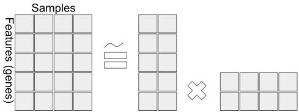
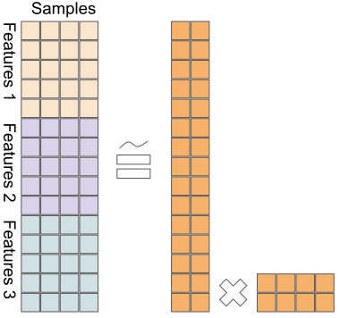
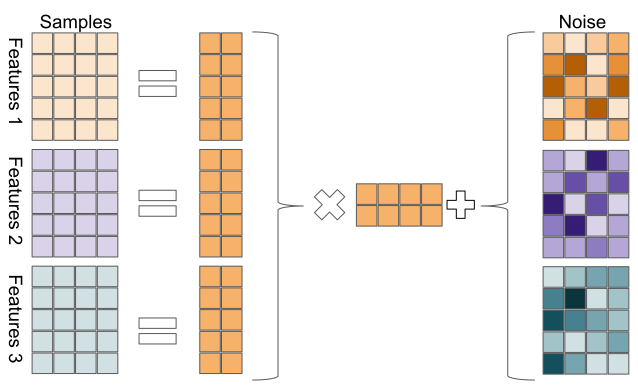

# Multi-omics analysis {#multiomics}

Living cells are a symphony of complex processes. Modern sequencing technology has lead to many comprehensive assays being routinely available to experimenters, giving us different ways to peek at the internal doings of the cells, each experiment revealing a different part of some underlying processes. As an example, most cells have the same DNA, but sequencing the genome of a cell allows us to find mutations and structural alterations that drive tumerogenesis in cancer. If we treat the DNA with bisulfite prior to sequencing, cytosine residues are converted to uracil, but 5-methylcytosine residues are unaffected. This allows us to probe the methylation patterns of the genome, or its methylome. By sequencing the mRNA molecules in a cell, we can calculate the abundance, in different samples, of different mRNA transcripts, or uncover its transcriptome. Performing different experiments on the same samples, for instance RNA-seq, DNA-seq, and BS-seq, results in multi-dimensional omics datasets, which enable the study of relationships between different biological processes, e.g. DNA methylation, mutations, and gene expression, and the leveraging of multiple data types to draw inferences about biological systems. This chapter provides an overview of some of the available methods for such analyses, focusing on matrix factorization approaches. In the examples in this chapter we will demonstrate how these methods are applicable to cancer subtyping, i.e. finding tumors which are driven by the same oncogenic processes.

### Example data

The examples in this chapter will use the following data: a set of 121 tumors from the TCGA [@tcga_pan_cancer] cohorts of Colon and Rectum adenocarcinoma. The tumors have been profiled for gene expression using RNA-seq, mutations using Exome-seq, and copy number variations using genotyping arrays. The subset of tumors used in this chapter belong to two distinct molecular subtypes defined by the Colorectal Cancer Subtyping Consortium [@cmscc], _CMS1_ and _CMS3_.

```{r,loadMultiomicsGE,results='asis'}
csvfile <- system.file("extdata", "multi-omics", "COREAD_CMS13_gex.csv",package="compGenomRData")
x1 <- read.csv(csvfile, row.names=1)
rownames(x1) <- sapply(strsplit(rownames(x1), "\\|"), function(x) x[1])
knitr::kable(head(t(head(x1))), caption="Gene expression data (head)")
```
```{r,loadMultiomicsMUT,results='asis'}
csvfile <- system.file("extdata", "multi-omics", "COREAD_CMS13_muts.csv",package="compGenomRData")
x2 <- read.csv(csvfile, row.names=1)
x2[x2>0]=1
knitr::kable(head(t(head(x2))), caption="Mutation data (head)")
```
```{r,loadMultiomicsCNV,results='asis'}
csvfile <- system.file("extdata", "multi-omics", "COREAD_CMS13_cnv.csv",package="compGenomRData")
x3 <- read.csv(csvfile, row.names=1)
knitr::kable(head(t(head(x3))), caption="Copy number data (head)")
```

Each of the data types (gene expresion, mutations, copy number variation) on its own, provides some signal which allows to somewhat separate the samples into the two different subtypes:

```{r}
csvfile <- system.file("extdata", "multi-omics", "COREAD_CMS13_subtypes.csv",package="compGenomRData")
covariates <- read.csv(csvfile, row.names=1)
rownames(covariates) <- gsub(pattern = '-', replacement = '\\.', rownames(covariates))
covariates <- covariates[colnames(x1),]
anno_col <- data.frame(cms=as.factor(covariates$cms_label))
rownames(anno_col) <- rownames(covariates)
```

```{r}
pheatmap::pheatmap(x1,
                   annotation_col = anno_col,
                   show_colnames = FALSE,
                   show_rownames = FALSE,
                   main="Gene expression data")
```
```{r}
pheatmap::pheatmap(x2,
                   annotation_col = anno_col,
                   show_colnames = FALSE,
                   show_rownames = FALSE,
                   main="Mutation data")
```
```{r}
pheatmap::pheatmap(x3,
                   annotation_col = anno_col,
                   show_colnames = FALSE,
                   show_rownames = FALSE,
                   main="Copy number data")
```

## Latent variable models for multi-omics integration

Unupervised multi-omics integration methods are methods that look for patterns within and across data types, in a label-agnostic fashion, i.e. without knowledge of the identity or label of the analyzed samples (e.g. cell type, tumor/normal). This chapter focuses on latent variable models, a form of dimensionality reduction technique (TODO see chapter..). Latent variable models make an assumption that the high dimensional data we observe (e.g. counts of tens of thousands of mRNA molecules) arrise from a lower dimension description. The variables in that lower dimensional description are termed _Latent Variables_, as they are believed to be latent in the data, but not directly observable through experimentation. Therefore, there is a need for methods to infer the latent variables from the data. For instance, (TODO reference RNA-seq chapter) the relative abundance of different mRNA molecules in a cell is largely determined by the cell type. There are other experiments which may be used to discern the cell type of cells (e.g. looking at them under a microscope), but an RNA-seq experiment does not, directly, reveal whether the analyzed sample was taken from one organ or another. A latent variable model would set the cell type as a latent variable, and the observable abundance of mRNA molecules to be dependent on the value of the latent variable (e.g. if the latent variable is "Regulatory T-cell", we would expect to find high expression of CD4, FOXP3, and CD25).
  
## Matrix factorization methods for unsupervised multi-omics data integration

Matrix factorization techniques attempt to infer a set of latent variables from the data by finding factors of a data matrix. Principal Component Analysis (TODO chapter xyz) is a form of matrix factorization which finds factors based on the covariance structure of the data. Generally, matrix factorization methods may be formulated as
Matrix factorization techniques attempt to infer a set of latent variables from the data by finding factors of a data matrix. Principal Component Analysis (TODO chapter xyz) is a form of matrix factorization which finds factors based on the covariance structure of the data. Generally, matrix factorization methods may be formulated as

$$
X = WH,
$$
where $X$ is the _data matrix_, $[M \times N]$ where $M$ is the number of features (typically genes), and $N$ is the number of samples. $W$ is an $[M \times K]$ _factors_ matrix, and $H$ is the $[K \times N]$ _latent variable coefficient matrix_. Tying this back to PCA, where $X = U \Sigma V^T$, we may formulate the factorization in the same terms by setting $W=U\Sigma$ and $H=V^T$. If $K=rank(X)$, this factorization is lossless, i.e. $X=WH$. However if we choose $K<rank(X)$, the factorization is lossy, i.e. $X \approx WH$. In that case, matrix factorization methods normally opt to minimize the error

$$
min~\|X-WH\|,
$$

which may be further subject to some constraints or regularization terms. As we normally seek a latent variable model with a considerably lower dimensionality than $X$, this is the more common case.

```{r,matrixFactorization,fig.cap="General matrix factorization framework. The data matrix on the left hand side is decomposed into factors on the right hand side. The equality may be an approximation as some matrix factorization methods are lossless (exact), while others are an approximation.",fig.align = 'center',out.width='100%',echo=FALSE}

```

In the figure above, the $5 \times 4$ data matrix $X$ is decomposed to a 2-dimensional latent variable model.

### Multiple Factor Analysis

Multiple factor analysis is a natural starting point for a discussion about matrix factorization methods for intergrating multiple data types. It is a straightforward extension of PCA into the domain of multiple data types. (TODO footnote: when dealing with categorical variables, MFA uses MCA (Multipe Correspondence Analysis). This is less relevant to biological data analysis and will not be discussed here).

Consider the figure below, a naive extension of PCA to a multi-omics context:

```{r,MFA,fig.cap="A naive extension of PCA to multi-omics; data matrices from different platforms are stacked, before applying PCA.",fig.align = 'center',out.width='100%',echo=FALSE}

```


Formally, we have
$$
X = \begin{bmatrix}
           X_{1} \\
           X_{2} \\
           \vdots \\
           X_{L}
         \end{bmatrix} = WH,
$$
a joint decomposition of the different data matrices ($X_i$) into the factor matrix $W$ and the latent variable matrix $H$. This way, we can leverage the ability of PCA to find the highest variance decomposition of the data, when the data consists of different omics types. As a reminder, PCA finds the linear combinations of the features which, when the data is projected onto them, preserve the most variance of any $K$ dimensional space. But because measurements from different experients have different scales, they will also have variance (and co-variance) at different scales. 

Multiple Factor Analysis addresses this issue and achieves balance among the data types by normalizing each of the data types, before stacking them and passing them on to PCA. Formally, MFA is given by

$$
X = \begin{bmatrix}
           X_{1} / \lambda^{(1)}_1 \\
           X_{2} / \lambda^{(2)}_1 \\
           \vdots \\
           X_{L} / \lambda^{(L)}_1
         \end{bmatrix} = WH,
$$
where $\lambda^{(i)}_1$ is the first eigenvalue of the principal component decomposition of $X_i$.

#### Example in R

MFA is available through the CRAN package `FactoMineR`. The code snippet below shows how to run it:
```{r}
r.mfa <- FactoMineR::MFA(t(rbind(x1,x2,x3)), c(dim(x1)[1], dim(x2)[1], dim(x3)[1]), graph=FALSE)
mfa.h <- r.mfa$global.pca$ind$coord
mfa.w <- r.mfa$quanti.var$coord

mfa_df <- as.data.frame(mfa.h)
mfa_df$subtype <- factor(covariates[rownames(mfa_df),]$cms_label)
ggplot2::ggplot(mfa_df, ggplot2::aes(x=Dim.1, y=Dim.2, color=subtype)) + ggplot2::geom_point() + ggplot2::ggtitle("Scatter plot of MFA")
pheatmap::pheatmap(t(mfa.h)[1:2,], annotation_col = anno_col, show_colnames = FALSE,
         main="MFA for multi-omics integration")
```


#### Further Reading

* [The FactoMineR website](http://factominer.free.fr/)
* [The Wikipedia page](https://en.wikipedia.org/wiki/Multiple_factor_analysis)

### Joint Non-negative Matrix Factorization

NMF (Non-negative Matrix Factorization) is an algorithm from 2000 that seeks to find a non-negative additive decomposition for a non-negative data matrix. It takes the familiar form $X \approx WH$, with $X \ge 0$, $W \ge 0$, and $H \ge 0$. The non-negative constraints make a lossless decomposition (i.e. $X=WH$) generally impossible. Hence, NMF attempts to find a solution which minimizes the Frobenius norm of the reconstruction:

$$
min~\|X-WH\|_F \\
W \ge 0, \\
H \ge 0,
$$

where the Frobenius norm $\|\cdot\|_F$ is the matrix equivalent of the Euclidean distance:

$$
\|X\|_F = \sqrt{\sum_i\sum_jx_{ij}^2}.
$$

This is typically solved for $W$ and $H$ using random initializations followed by iterations of a multiplicative update rule:


\begin{align}
    W_{t+1} &= W_t^T \frac{XH_t^T}{XH_tH_t^T} \\
    H_{t+1} &= H_t \frac{W_t^TX}{W^T_tW_tX}.
\end{align}


Since this algorithm is guaranteed only to converge to a local minima, it is typically run several times with random initializations, and the best result is kept.

In the multi-omics context, we will, as in the MFA case, wish to find a decomposition for an integrated data matrix of the form

$$
X = \begin{bmatrix}
    X_{1} \\
    X_{2} \\
    \vdots \\
    X_{L}
\end{bmatrix},
$$

with $X_i$s denoting data from different omics platforms.

As NMF seeks to minimize the reconstruction error $\|X-WH\|_F$, some care needs to be taken with regards to data normalization. Different omics platforms may produce data with different scales (i.e. real-valued gene expression quantification, binary mutation data, etc.), and so will have different baseline Frobenius norms. To address this, when doing Joint NMF, we first feature-normalize each data matrix, and then normalize by the Frobenius norm of the data matrix. Formally, we run NMF on

$$
X = \begin{bmatrix}
    X_{1}^N / \alpha_1 \\
    X_{2}^N / \alpha_2 \\
    \vdots \\
    X_{L}^N / \alpha_L
\end{bmatrix},
$$

where $X_i^N$ is the feature-normalized data matrix $X_i^N = \frac{x^{ij}}{\sum_jx^{ij}}$, and $\alpha_i = \|X_{i}^N\|_F$.

Another consideration with NMF is the non-negativity constraint. Different omics data types may have negative values, for instance, copy-number variations (CNVs) may be positive, indicating gains, or negative, indicating losses. In order to turn such data into a non-negative form, we will split each feature into two features, one new feature holding all the non-negative values of the original feature, and another feature holding the absolute value of the negative ones:

TODO table of CNVs before and after splitting column.

#### Example in R

Many NMF algorithms are available through the CRAN package `NMF`:

```{r echo=FALSE}
# For NMF to be usable on data types which allow negativity, we'll use the trick from TODO,
# where we split each column into two non-negative columns, one for the negative numbers
# and one for the positive numbers. Here's a function that does that:
split_neg_columns <- function(x) {
    new_cols <- list()
    for(i in seq_len(dim(x)[2])) {
        new_cols[[paste0(colnames(x)[i],'+')]] <- sapply(X = x[,i], function(x) max(0,x))
        new_cols[[paste0(colnames(x)[i],'-')]] <- sapply(X = -x[,i], function(x) max(0,x))
    }
    new_cols
    return(do.call(cbind, new_cols))
}

# and here's a test that shows the function above works
test_split_neg_columns <- function() {
    test.input <- as.data.frame(cbind(c(1,2,1),c(0,1,-2)))
    expected.output <- as.data.frame(cbind(c(1,2,1), c(0,0,0), c(0,1,0), c(0,0,2)))
    stopifnot(all(as.matrix(expected.output) == as.matrix(split_neg_columns(test.input))))
}
test_split_neg_columns()

# Here's a function that undoes the previous transformation,
# so it takes each pair of columns and merges them to one, where the values from the first column
# are taken as positives, and the values from the second column as negatives.
merge_neg_columns <- function(x) {
    new_cols <- list()
    for(i in seq_len(dim(x)[2]/2)) {
        pos_col <- x[,2*i-1]
        neg_col <- x[,2*i]
        merged_col <- pos_col
        merged_col[neg_col>0] <- -neg_col[neg_col>0]
        new_cols[[i]] <- merged_col
    }
    return(do.call(cbind, new_cols))
}

# And here's a test for the merging function.
test_merge_neg_columns <- function() {
    input1 <- as.data.frame(cbind(c(1,2,1),c(0,1,-2)))
    input2 <- split_neg_columns(input1)
    output <- merge_neg_columns(input2)
    stopifnot(all(output == input1))
}
test_merge_neg_columns()
```


```{r}
# Feature-normalize the data
x1.featnorm <- x1 / rowSums(x1)
x2.featnorm <- x2 / rowSums(x2)
x3.featnorm <- x3 / rowSums(x3)

# Normalize by each omics type's frobenius norm
x1.featnorm.frobnorm <- x1.featnorm / norm(as.matrix(x1.featnorm), type="F")
x2.featnorm.frobnorm <- x2.featnorm / norm(as.matrix(x2.featnorm), type="F")
x3.featnorm.frobnorm <- x3.featnorm / norm(as.matrix(x3.featnorm), type="F")

# Split the features of the CNV matrix into two non-negative features each
x3.featnorm.frobnorm.nonneg <- t(split_neg_columns(t(x3.featnorm.frobnorm)))

# this hack is here because of an NMF / DelayedArray incompatibility
# https://github.com/renozao/NMF/issues/85
detach("package:Rqc")
detach("package:RUVSeq")
detach("package:EDASeq")
detach("package:ShortRead")
detach("package:GenomicAlignments")
detach("package:DESeq2")
detach("package:SummarizedExperiment")
detach("package:DelayedArray")
# end hack

require(NMF)
r.nmf <- nmf(t(rbind(x1.featnorm.frobnorm, x2.featnorm.frobnorm, x3.featnorm.frobnorm.nonneg)), 2, method='Frobenius')
nmf.h <- NMF::basis(r.nmf)
nmf.w <- NMF::coef(r.nmf)

nmf_df <- as.data.frame(nmf.h)
colnames(nmf_df) <- c("dim1", "dim2")
nmf_df$subtype <- factor(covariates[rownames(nmf_df),]$cms_label)
ggplot2::ggplot(nmf_df, ggplot2::aes(x=dim1, y=dim2, color=subtype)) + ggplot2::geom_point() + ggplot2::ggtitle("Scatterplot of 2-component NMF for multi-omics integration")
pheatmap::pheatmap(t(nmf_df[,1:2]), annotation_col = anno_col, show_colnames=FALSE, main="Heatmap of 2-component NMF")
```


#### Further reading

* Zhang S., Li Q., Liu J., Zhou X. J. (2011). A novel computational framework for simultaneous integration of multiple types of genomic data to identify microRNA-gene regulatory modules. Bioinformatics 27, i401–i409. 10.1093/bioinformatics/btr206 [PMC free article](https://www.ncbi.nlm.nih.gov/pmc/articles/PMC3117336/)
* Zhang S., Liu C.-C., Li W., Shen H., Laird P. W., Zhou X. J. (2012). Discovery of multi-dimensional modules by integrative analysis of cancer genomic data. Nucleic Acids Res. 40, 9379–9391. 10.1093/nar/gks725 [PMC free article](https://www.ncbi.nlm.nih.gov/pmc/articles/PMC3479191/)

### iCluster

iCluster takes a Bayesian approach to the latent variable model. In Bayesian statistics, we infer distributions over model parameters, rather than finding a single maximum-likelihood parameter estimate. In iCluster, we model the data as 

$$
X_{(i)} = W_{(i)}Z + \epsilon_i,
$$

where $X_{(i)}$ is a data matrix from a single omics platform, $W_{(i)}$ are model parameters, $Z$ is a latent variable matrix, and is shared between the different omics platforms, and $\epsilon_i$ is a "noise" random variable, $\epsilon \sim N(0,\Psi)$, with $\Psi = diag(\psi_1,\dots \psi_M)$ is a diagonal covariance matrix.

```{r,iCluster,fig.cap="Sketch of iCluster model. Each omics datatype is decomposed to a coefficient matrix and a shared latent variable matrix, plus noise.",fig.align = 'center',out.width='100%',echo=FALSE}

```


Note that with this construction, the omics measurements $X$ are expected to be the same for samples with the same latent variable representation, up to gaussian noise. Further, we assume a Gaussian prior distribution on the latent variables $Z \sim N(0,I)$, which means we assume $X_{(i)} \sim N \big( 0,W_{(i)} W_{(i)}^T + \Psi_{(i)} \big)$. In order to find suitable values for $W$, $Z$, and $\Psi$, we can write down the multivariate normal log-likelihood function and optimize it. For a multivariate normal distribution with mean $0$ and covariance $\Sigma$, the log-likelihood function is given by

$$
\ell = -\frac{1}{2} \bigg( \ln (|\Sigma|) + X^T \Sigma^{-1} X + k\ln (2 \pi) \bigg)
$$

(this is simply the log of the Probability Density Function of a multivariate gaussian). For the multi-omics iCluster case, we have $X=\big( X_{(1)}, \dots, X_{(L)} \big)^T$, $W = \big( W_{(1)}, \dots, W_{(L)} \big)^T$, where $X$ is a multivariate normal with $0$-mean and $\Sigma = W W^T + \Psi$ covariance. Hence, the log-likelihood function for the iCluster modle is given by:

$$
\ell_{iC}(W,\Sigma) = -\frac{1}{2} \bigg( \sum_{i=1}^L \ln (|\Sigma|) + X^T\Sigma^{-1}X + p_i \ln (2 \pi) \bigg)
$$

where $p_i$ is the number of features in omics data type $i$. Because this model has more parameters than we typically have samples, we need to push the model to use fewer parameters than it has at its disposal, by using regularization. iCluster uses Lasso regularization, which is a direct penalty on the absolute value of the parameters. I.e., instead of optimizing $\ell_{iC}(W,\Sigma)$, we will optimize the regularized log-likelihood:

$$
\ell = \ell_{iC}(W,\Sigma) - \lambda\|W\|_1.
$$

The parameter $\lambda$ acts as a dial to weigh the tradeoff between better model fits (higher log-likelihood) and a sparser model, with more $w_{ij}$s set to $0$, which gives models which generalize better and are more interpretable.

In order to solve this problem, iCluster employs the Expectation Maximization (EM) algorithm. The full details are beyond the scope of this textbook. We will introduce a short sketch instead. The intuition behind the EM algorithm is a more general case of the k-means clustering algorithm (TODO see chapter..).

##### EM algorithm sketch

* Initialize $W$ and $\Psi$
* **Until convergence of $W$, $\Psi$**
    - E-step: calculate the expected value of $Z$ given the current estimates of $W$ and $\Psi$ and the data $X$
    - M-step: calculate maximum likelihood estimates for the parameters $W$ and $\Psi$ based on the current estimate of $Z$ and the data $X$.

#### iCluster+

iCluster+ is an extension of the iCluster framework, which allows for omics types to arrise from other distributions than a gaussian. While normal distributions are a good assumption for log-transformed, centered gene expression data, it is a poor model for binary mutations data, or for copy number variation data, which can typically take the values $(-2, 1, 0, 1, 2)$ for for heterozygous / monozygous deletions or amplifications. iCluster+ allows the different $X$s to have different distributions:

* for binary mutations, $X$ is drawn from a multivariate binomial
* for normal, continuous data, $X$ is drawn from a multivariate gaussian
* for copy number variations, $X$ is drawn from a multinomial
* for count data, $X$ is drawn from a poisson.

In that way, iCluster+ allows us to explicitly model our assumptions about the distributions of our different omics data types, and leverage the strengths of Bayesian inferrence.

Both iCluster and iCluster+ make use of sophisticated Bayesian inference algorithms (EM for iCluster, Metropolis-Hastings MCMC for iCluster+), which means they do not scale up trivially. Therefore, it is recommended to filter down the features to a manageable size before inputing data to the algorithm. The exact size of "manageable" data depends on your hardware, but a rule of thumb is that dimensions in the thousands are ok, but in the tens of thousands might be too slow.

#### Example in R

iCluster+ is available through the BioConductor package `iClusterPlus`:

```{r}
r.icluster <- iClusterPlus::iClusterPlus(t(x1), t(x2), t(x3), type=c("gaussian", "binomial", "multinomial"), K=2, alpha=c(1,1,1), lambda=c(.03,.03,.03))

icluster.z <- r.icluster$meanZ
icluster.ws <- r.icluster$beta
icluster.clusters <- r.icluster$clusters

icp_df <- as.data.frame(icluster.z)
colnames(icp_df) <- c("dim1", "dim2")
rownames(icp_df) <- colnames(x1)
icp_df$subtype <- factor(covariates[rownames(icp_df),]$cms_label)
ggplot2::ggplot(icp_df, ggplot2::aes(x=dim1, y=dim2, color=subtype)) + ggplot2::geom_point() + ggplot2::ggtitle("Scatter plot of iCluster+ factors")
pheatmap::pheatmap(t(icp_df[,1:2]), annotation_col = anno_col, show_colnames = FALSE, main="Heatmap of iCluster+ factors")
```


#### Further reading

* Shen R., Olshen A. B., Ladanyi M. (2009). Integrative clustering of multiple genomic data types using a joint latent variable model with application to breast and lung cancer subtype analysis. Bioinformatics 25, 2906–2912. 10.1093/bioinformatics/btp543 [PMC free article](https://www.ncbi.nlm.nih.gov/pmc/articles/PMC2800366/)
* Shen R., Mo Q., Schultz N., Seshan V. E., Olshen A. B., Huse J., et al. . (2012). Integrative subtype discovery in glioblastoma using iCluster. PLoS ONE 7:e35236. 10.1371/journal.pone.0035236 [PMC free article](https://www.ncbi.nlm.nih.gov/pmc/articles/PMC3335101/)
* [Tibshirani, R. (1996). Regression shrinkage and selection via the lasso. J. Royal. Statist. Soc B., Vol. 58, No. 1, pages 267-288)](http://www-stat.stanford.edu/%7Etibs/lasso/lasso.pdf)
* [Dempster, A. P., et al. “Maximum Likelihood from Incomplete Data via the EM Algorithm.” Journal of the Royal Statistical Society. Series B (Methodological), vol. 39, no. 1, 1977, pp. 1–38. JSTOR, JSTOR](www.jstor.org/stable/2984875)
* [Hastings, W.K. (1970). "Monte Carlo Sampling Methods Using Markov Chains and Their Applications". Biometrika. 57 (1): 97–109. doi:10.1093/biomet/57.1.97](https://www.jstor.org/stable/2334940)

## Clustering using latent factors

A common analysis in biological investigations is clustering. This is often interesting in cancer studies as one hopes to find groups of tumors (clusters) which behave similarly, i.e. have similar risks and/or respond to the same drugs. PCA is a common step in clustering analyses, and so it is easy to see how the latent variable models above may all be a useful pre-processing step before clustering. In the examples below, we will use the latent variables inferred by the algorithms in the previous section on the set of Colorectal cancer tumors from the TCGA.

### One-hot clustering

A specific clustering method for NMF data is to assume each sample is driven by one component, i.e. that the number of clusters $K$ is the same as the number of latent variables in the model and that each sample may be associated to one of those components. We assign each sample a cluster label based on the latent variable which affects it the most. The figure above (Heatmap of 2-component NMF) shows the latent variable values for the two latent variables, for the 72 tumors, obtained by Joint NMF.

The two rows are the two latent variables, and the columns are the 72 tumors. We can observe that most tumors are indeed driven mainly by one of the factors, and not a combination of the two. We can use this to assign each tumor a cluster label based on its dominant factor:

```{r}
nmf.clusters <- max.col(nmf.h)
names(nmf.clusters) <- rownames(nmf.h)
anno_nmf_cl <- data.frame(nmf.cluster=factor(nmf.clusters), cms.subtype=factor(covariates[rownames(nmf.h),]$cms_label))
pheatmap::pheatmap(t(nmf.h[order(nmf.clusters),]), cluster_cols=FALSE, cluster_rows=FALSE,
         annotation_col = anno_nmf_cl,
         show_colnames = FALSE,
         main="Joint NMF factors with clusters and molecular subtypes")
```

We see that using one-hot clustering with Joint NMF, we were able to find two clusters in the data which correspond fairly well with the molecular subtype of the tumors.

The one-hot clustering method does not lend itself very well to the other methods discussed above, i.e. iCluster and MFA. The latent variables produced by those other methods may be negative, and further, in the case of iCluster, are going to assume a multivariate gaussian shape. As such, it is not trivial to pick one "dominant factor" for them. For NMF variants, this is a very common way to assign clusters.

### K-means clustering

K-means clustering was introduced in (TODO chapter x). K-means is a special case of the EM algorithm, and indeed iCluster was originally conceived as an extension of K-means from binary cluster assignments to real-valued latent variables. The iCluster algorithm, as it is so named, calls for application of K-means clustering on its latent variables, after the inference step.

```{r}
rownames(icluster.z) <- rownames(covariates)
icluster.clusters <- kmeans(icluster.z, 2)$cluster
names(icluster.clusters) <- rownames(icluster.z)
anno_icluster_cl <- data.frame(iCluster=factor(icluster.clusters), cms.subtype=factor(covariates$cms_label))
pheatmap::pheatmap(t(icluster.z[order(icluster.clusters),]), cluster_cols=FALSE, cluster_rows=FALSE,
         show_colnames = FALSE,
         annotation_col = anno_icluster_cl,
         main="iCluster factors with clusters and molecular subtypes")
```

This demonstrates the ability of iClusterPlus to find clusters which correspond to molecular subtypes, based on multi-omics data.


## Biological interpretation of latent factors

### Inspection of feature weights in loading vectors

The most straightforward way to go about interpreting the latent factors in a biological context, is to look at the coefficients which are associated with them. The latent variable models introduced above all take the linear form $X \approx WH$, where $W$ is a factor matrix, with coefficients tying each latent variable with each of the features in the $L$ original multi-omics data matrices. By inspecting these coefficients, we can get a sense of which multi-omics features are co-regulated. The figure below shows the coefficients for the Joint NMF analysis above:

```{r}
nmfw <- t(nmf.w)

data_anno <- data.frame(omics=c(rep('expression',dim(x1)[1]), rep('mut',dim(x2)[1]), rep('cnv',dim(x3.featnorm.frobnorm.nonneg)[1])))
rownames(data_anno) <- c(rownames(x1), paste0("mut:", rownames(x2)), rownames(x3.featnorm.frobnorm.nonneg))
rownames(nmfw) <- rownames(data_anno)

pheatmap::pheatmap(nmfw,
                   cluster_cols = FALSE,
                   annotation_row = data_anno,
                   main="NMF coefficients",
                   clustering_distance_rows = "manhattan",
                   fontsize_row = 1)
```

Inspection of the factor coefficients in the heatmap above reveals that Joint NMF has found two nearly orthogonal non-negative factors. One is associated with high expression of the HOXC11, ZIC5, and XIRP1 genes, frequent mutations in the BRAF, PCDHGA6, and DNAH5 genes, as well as losses in the 18q12.2 and gains in 8p21.1 cytobands. The other factor is associated with high expression of the SOX1 gene, more frequent mutations in the APC, KRAS, and TP53 genes, and a weak association with some CNVs.

#### Disentangled representations

The property displayed above, where each feature is predominantly associated with only a single factor, is termed _disentangledness_, i.e., it leads to _disentangled_ latent variable representations, as changing one input feature only affects a single latent variable. This property is very desirable as it greatly simplifies the biological interpretation of modules. Here, we have two modules with a set of co-occurring molecular signatures which merit deeper investigation into the mechanisms by which these different omics features are related. For this reason, NMF is widely used in computational biology today.

### Making sense of factors using enrichment analysis

In order to investigate the oncogenic processes that drive the differences between tumors, we may draw upon biological prior knowledge by looking for overlaps between genes that drive certain tumors, and genes involved in familiar biological processes.

#### Enrichment analysis

The recent decades of genomics have uncovered many of the ways in which genes cooperate to perform biological functions in concert. This work has resulted in rich annotations of genes, groups of genes, and the different functions they carry out. Examples of such annotations include the Gene Ontology Consortium's _GO terms_ [@go_first_paper, @go_latest_paper], the _Reactome pathways database_ [@reactome_latent_paper], and the _Kyoto Encyclopaedia of Genes and Genomes_ [@kegg_latest_paper]. These resources, as well as others, publish lists of so-called _gene sets_, or _pathways_, which are a set of genes which are known to operate together in some biological function, e.g. protein synthesis, DNA mismatch repair, cellular adhesion, and many other functions. Gene set enrichment analysis is a method which looks for overlaps between genes which we have found to be of interest, e.g. by them being implicated in a certain tumor type, and the a-priori gene sets discussed above.

In the context of making sense of latent factors, the question we will be asking is whether the genes which drive the value of a latent factor (the genes with the highest factor coefficients) also belong to any interesting annotated gene sets, and whether the overlap greater than we would expect by chance. If there are $N$ genes in total, $K$ of which belong to a gene set, the probability that $k$ out of the $n$ genes associated with a latent factor are also associated with a gene set is given by the hypergeometric distribution:

$$
P(k) = \frac{{\binom{K}{k}} - \binom{N-K}{n-k}}{\binom{N}{n}}.
$$

the **hypergeometric test** uses the hypergeometric distribution to assess the statistical significance of the presense of genes belonging to a gene set in the latent factor. The null hypothesis is that there is no relationship between genes in a gene set, and genes in a latent factor. When testing for over-representation of gene set genes in a latent factor, the P value from the hypergeometric test is the probability of getting $k$ or more genes from a gene set in a latent factor

$$
p = \sum_{i=k}^K P(k=i).
$$

The hypergeometric enrichment test is also referred to as _Fisher's one-sided exact test_. This way, we can determine if the genes associated with a factor significantly overlap (beyond chance) the genes involved in a biological process. Because we will typically be testing many gene sets, we will also need to apply multiple testing correction, such as Benjamini-Hochberg correction [TODO see chapter].

#### Example in R

In R, we can do this analysis using the `enrichR` package, which gives us access to many gene set libraries. In the example below, we'll find the genes associated with preferentially NMF factor 1 or NMF factor 2, by the contribution of those genes' expression values to the factor. Then, we'll use `enrichR` to query the Gene Ontology terms which might be overlapping. `enrichR` performs 

```{r}
genes.factor.1 <- names(which(nmfw[1:dim(x1)[1],1] > nmfw[1:dim(x1)[1],2]))
genes.factor.2 <- names(which(nmfw[1:dim(x1)[1],1] < nmfw[1:dim(x1)[1],2]))

go.factor.1 <- enrichR::enrichr(genes.factor.1,
                                databases = c("GO_Biological_Process_2018")
                                )$GO_Biological_Process_2018
go.factor.2 <- enrichR::enrichr(genes.factor.2,
                                databases = c("GO_Biological_Process_2018")
                                )$GO_Biological_Process_2018
```

```{r}
ggplot2::ggplot(head(go.factor.1), ggplot2::aes(y=-log10(Adjusted.P.value), x=Term)) + ggplot2::geom_bar(stat='identity') + ggplot2::coord_flip() + ggplot2::ggtitle("Top GO-terms\nassociated with\nNMF factor 1")
```


### Interpretation using additional covariates

Another way to ascribe biological significance to the latent variables is by correlating them with additional covariates we might have about the samples. In our example, the Colorectal cancer tumors have also been characterized for Microsattelite Instability status, using an external test (typically PCR-based). By examining the latent variable values as they relate to a tumor's MSI status, we might discover that we've learned latent factors that are related to it.

```{r}
a <- data.frame(age=covariates$age, gender=as.numeric(covariates$gender), msi=covariates$msi)
b <- nmf.h
colnames(b) <- c('factor1', 'factor2')
cov_factor <- cbind(a,b)
ggplot2::ggplot(cov_factor, ggplot2::aes(x=msi, y=factor1, group=msi)) + ggplot2::geom_boxplot() + ggplot2::ggtitle("NMF factor 1 microsatellite instability")
ggplot2::ggplot(cov_factor, ggplot2::aes(x=msi, y=factor2, group=msi)) + ggplot2::geom_boxplot() + ggplot2::ggtitle("NMF factor 2 and microsatellite instability")
```

The figures above show that NMF factor 1 values are higher both microsattelite instable tumors, while NMF factor 2 is higher for microsatellite stable tumors. This is an example of multi-omics integration methods finding latent variables which are clinically significant.

## Exercises

#### Easy

* Find features associated with iCluster and MFA factors, and visualize the feature weights.

#### Intermediate

* Normalizing the data matrices by their $\lambda_1$'s as in MFA supposes we wish to assign each data type the same importance in the down-stream analysis. This leads to a natural generalizaiton whereby the different data types may be differently weighed. Provide an implementation of weighed-MFA where the different data types may be assigned individual weights.

* In order to use NMF algorithms on data which can be negative, we need to split each feature into two new features, one positive and one negative. Implement the following function, and see that the included test does not fail:

```{r eval=FALSE, echo=TRUE}
split_neg_columns <- function(x) {
    # your code here
}

# a test that shows the function above works
test_split_neg_columns <- function() {
    input <- as.data.frame(cbind(c(1,2,1),c(0,1,-2)))
    output <- as.data.frame(cbind(c(1,2,1), c(0,0,0), c(0,1,0), c(0,0,2)))
    stopifnot(all(output == split_neg_columns(input)))
}
test_split_neg_columns()
```

* The iCluster+ algorithm has some parameters which may be tuned for maximum performance. The `iClusterPlus` package has a method, `iClusterPlus::tune.iClusterPlus`, which does this automatically based on the Bayesian Information Criterion (BIC). Run the example above and find the optimal lambda and alpha values.

* Another covariate in the metadata of these tumors is their _CpG island methylator Phenotype_ (CIMP). This is a phenotype carried by a group of colorectal cancers that display hypermethylation of promoter CpG island sites, resulting in the inactivation of some tumor suppressors. This is also assayed using an external test. Do any of the multi-omics methods surveyed find a latent variable that is associated with the tumor's CIMP phenotype?

```{r echo=FALSE, eval=FALSE}
a <- data.frame(age=covariates$age, gender=as.factor(covariates$gender), msi=covariates$msi, cimp=as.factor(covariates$cimp))
b <- nmf.h
colnames(b) <- c('factor1', 'factor2')
cov_factor <- cbind(a,b)
ggplot2::ggplot(cov_factor, ggplot2::aes(x=cimp, y=factor1, group=cimp)) + ggplot2::geom_boxplot() + ggplot2::ggtitle("NMF factor 1 and CIMP status")
ggplot2::ggplot(cov_factor, ggplot2::aes(x=cimp, y=factor2, group=cimp)) + ggplot2::geom_boxplot() + ggplot2::ggtitle("NMF factor 2 and CIMP status")
```

#### Advanced

* Does MFA give a disentangled representation?
* Does iCluster give disentangled representations? Why do you think that is?